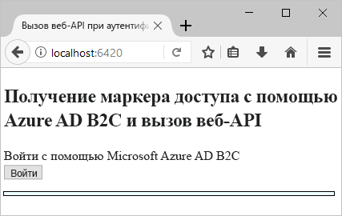
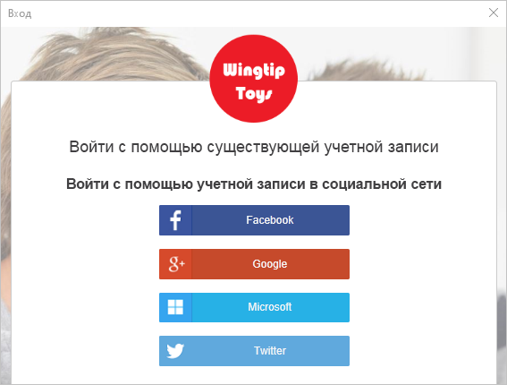
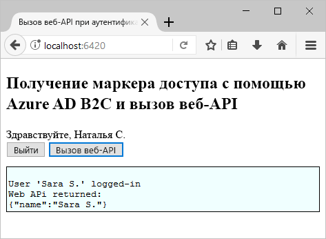

# <a name="quickstart-set-up-sign-in-for-a-single-page-app-using-azure-active-directory-b2c"></a>Краткое руководство. Настройка входа в одностраничное приложение с помощью Azure Active Directory B2C

Azure Active Directory (Azure AD) B2C обеспечивает управление идентификаторами облака для защиты приложения, бизнеса и клиентов. Azure AD B2C позволяет приложениям выполнять проверку подлинности учетных записей социальных сетей и корпоративных учетных записей с помощью протоколов открытого стандарта.

В этом кратком руководстве используется пример одностраничного приложения с включенным приложением Azure AD B2C для выполнения входа с помощью поставщика удостоверений в социальных сетях, а также для вызова защищенного веб-API Azure AD B2C.

[!INCLUDE [quickstarts-free-trial-note](../../includes/quickstarts-free-trial-note.md)]

## <a name="prerequisites"></a>предварительным требованиям

* [Visual Studio 2017](https://www.visualstudio.com/downloads/) с рабочей нагрузкой **ASP.NET и веб-разработка**.
* Установите [Node.js](https://nodejs.org/en/download/)
* Учетная запись социальных сетей Facebook, Google, Microsoft или Twitter.

## <a name="download-the-sample"></a>Скачивание примера приложения

[Загрузите ZIP-файл](https://github.com/Azure-Samples/active-directory-b2c-javascript-msal-singlepageapp/archive/master.zip) или клонируйте пример приложения с GitHub.

```
git clone https://github.com/Azure-Samples/active-directory-b2c-javascript-msal-singlepageapp.git
```

## <a name="run-the-sample-application"></a>Запуск примера приложения

Запустите этот пример из командной строки Node.js: 

```
cd active-directory-b2c-javascript-msal-singlepageapp
npm install && npm update
node server.js
```

Приложение Node.js выводит номер порта, от которого ожидается передача данных в localhost.

```
Listening on port 6420...
```

Откройте URL-адрес приложения `http://localhost:6420` в веб-браузере.



## <a name="create-an-account"></a>Создание учетной записи

Нажмите кнопку **Login** (Вход), чтобы запустить рабочий процесс **регистрации или входа** Azure AD B2C на основе политики Azure AD B2C. 

Образец поддерживает несколько вариантов регистрации, в том числе с использованием поставщика удостоверений в социальных сетях, а также создание локальной учетной записи путем использования адреса электронной почты. В рамках этого краткого руководства используется учетная запись поставщика удостоверений в социальных сетях (Facebook, Google, Microsoft или Twitter). 

### <a name="sign-up-using-a-social-identity-provider"></a>Регистрация с помощью поставщика удостоверений в социальных сетях

В Azure AD B2C в качестве образца веб-приложения представляется пользовательская страница входа для вымышленной торговой марки Wingtip Toys. 

1. Чтобы зарегистрироваться с помощью поставщика удостоверений в социальных сетях, нажмите кнопку поставщика удостоверений, которого нужно использовать.

    

    Выполните проверку подлинности (вход) с помощью данных учетной записи социальных сетей и авторизацию приложения для чтения информации из учетной записи социальных сетей. Предоставляя доступ, приложение может получить сведения о профиле из учетной записи социальных сетей (например, имя и город). 

2. Завершите процесс входа для поставщика удостоверений. Например, если вы выбрали Twitter, введите свои учетные данные Twitter и нажмите кнопку **Sign in** (Войти).

    

    Сведения о профиле новой учетной записи будут заполнены информацией из учетной записи социальных сетей. 

3. Обновите поля "Отображаемое имя", "Должность" и "Город" и щелкните **Продолжить**.  Введенные значения используются для профиля учетной записи пользователя Azure AD B2C.

    Учетная запись пользователя Azure AD B2C, использующая поставщик удостоверений, успешно создана. 

## <a name="access-a-protected-web-api-resource"></a>Получение доступа к защищенному ресурсу веб-API

Нажмите кнопку **Call Web API** (Вызов веб-API), чтобы отображаемое имя возвращалось из вызова веб-интерфейса API в качестве объекта JSON. 



Образец одностраничного приложения включает в себя маркер доступа Azure AD в запросе защищенных ресурсов веб-API для выполнения операции, чтобы вернуть объект JSON.

## <a name="clean-up-resources"></a>Очистка ресурсов

Вы можете использовать свой клиент Azure AD B2C при работе с другими руководствами или краткими пособиями по Azure AD B2C. [Удалите клиент Azure AD B2C](active-directory-b2c-faqs.md#how-do-i-delete-my-azure-ad-b2c-tenant), если он больше не нужен.

## <a name="next-steps"></a>Дополнительная информация

В этом кратком руководстве вы использовали пример приложения ASP.NET с включенным Azure AD B2C, чтобы выполнить вход в систему с помощью пользовательской страницы входа, а также для выполнения входа с помощью поставщика удостоверений в социальных сетях и для создания учетной записи Azure AD B2C и вызова веб-API, защищенного Azure AD B2C. 

Следующим шагом является создание клиента Azure AD B2C и настройка образца для запуска с помощью клиента. 

> [!div class="nextstepaction"]
> [Создание клиента Azure Active Directory B2C на портале Azure](active-directory-b2c-get-started.md)