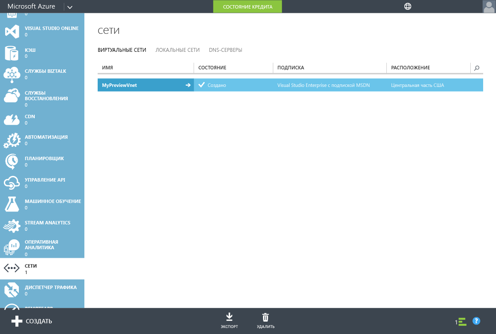
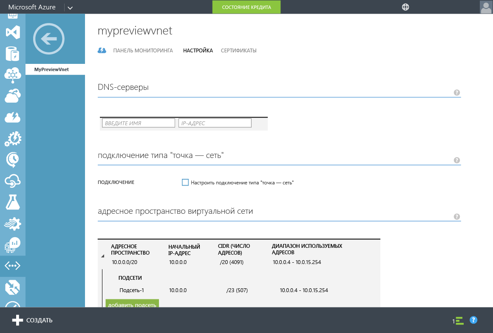
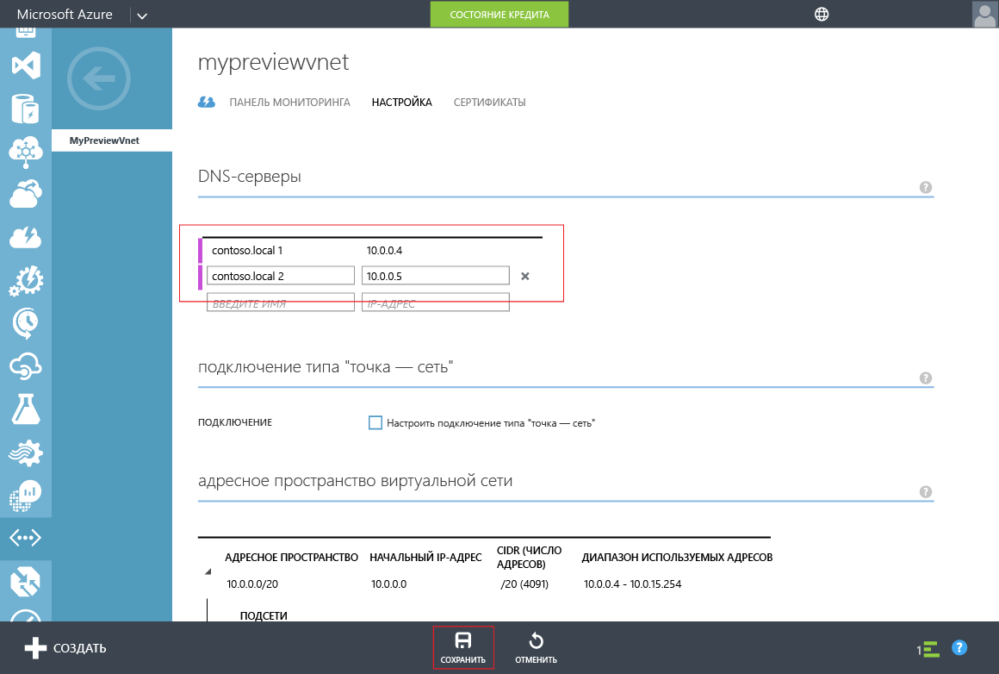

<properties
	pageTitle="Предварительная версия доменных служб Azure Active Directory: приступая к работе | Microsoft Azure"
	description="Приступая к работе с доменными службами Azure Active Directory"
	services="active-directory-ds"
	documentationCenter=""
	authors="mahesh-unnikrishnan"
	manager="stevenpo"
	editor="curtand"/>

<tags
	ms.service="active-directory-ds"
	ms.workload="identity"
	ms.tgt_pltfrm="na"
	ms.devlang="na"
	ms.topic="get-started-article"
	ms.date="04/11/2016"
	ms.author="maheshu"/>

# Доменные службы Azure AD *(Предварительная версия)* — Приступая к работе

## Шаг 4. Обновление настроек DNS для виртуальной сети Azure
Теперь, когда вы успешно включили доменные службы Azure AD для каталога, необходимо сделать так, чтобы компьютеры в виртуальной сети могли подключиться к этим службам и воспользоваться ими. Для этого необходимо обновить параметры DNS-сервера для виртуальной сети, указав IP-адреса, по которым доменные службы AD Azure доступны в виртуальной сети.

> [AZURE.NOTE] После включения доменных служб Azure AD для каталога запишите IP-адреса доменных служб Azure AD, которые отображаются на вкладке **Настройка**.

Выполните следующие этапы настройки, чтобы обновить параметр DNS-сервера для виртуальной сети, в которой были включены доменные службы Azure AD.

1. Перейдите на **портал управления Azure** ([https://manage.windowsazure.com](https://manage.windowsazure.com)).
2. Выберите узел **Сети** на панели слева.

    

3. На вкладке **Виртуальные сети** выберите виртуальную сеть, в которой были включены доменные службы Azure AD, чтобы просмотреть ее свойства.
4. Откройте вкладку **Настройка**.

    

5. В разделе **DNS-серверы** введите IP-адреса доменных служб Azure AD.
6. Убедитесь, что вы ввели оба IP-адреса, которые отображались в разделе **Доменные службы** на вкладке **Настройка** для вашего каталога.
7. Щелкните **Сохранить** на панели задач в нижней части страницы, чтобы сохранить параметры DNS-сервера для этой виртуальной сети.

   

> [AZURE.NOTE] После обновления параметров DNS-сервера для виртуальной сети может потребоваться некоторое время на обновление конфигурации DNS виртуальных машин в сети. Если виртуальная машина не может подключиться к домену, можно очистить кэш DNS на виртуальной машине(например, командой ipconfig /flushdns), чтобы принудительно обновить параметры DNS на виртуальной машине.

---
[**Следующий шаг — включение синхронизации паролей для доменных служб Azure AD.**](active-directory-ds-getting-started-password-sync.md)

<!---HONumber=AcomDC_0420_2016-->