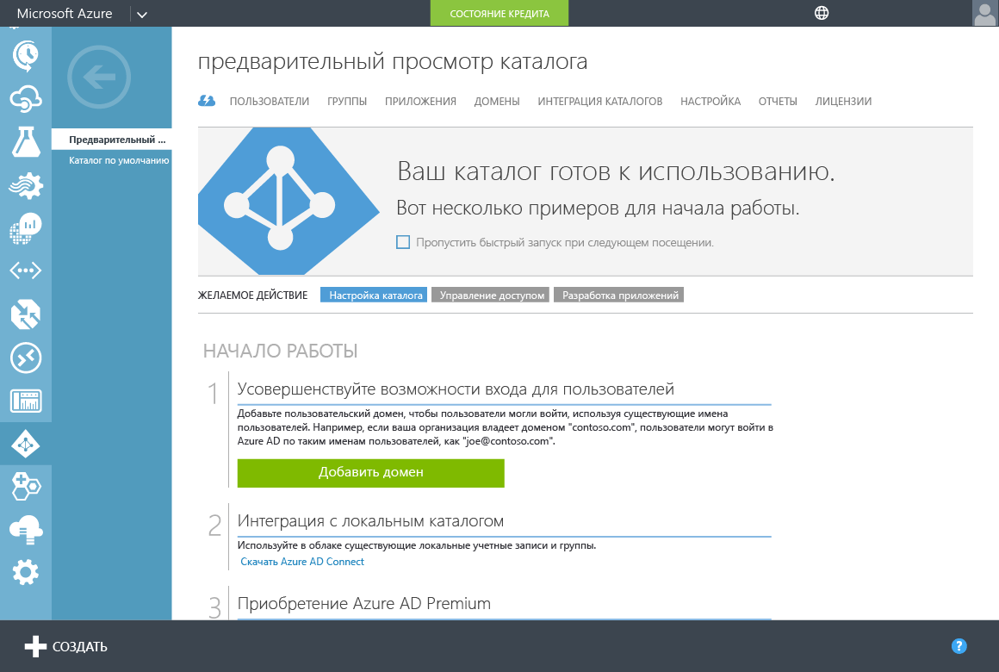
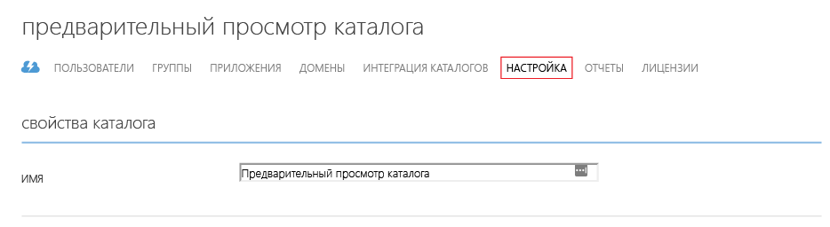
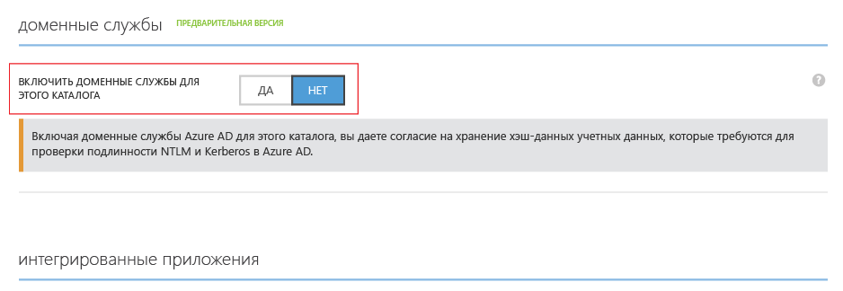
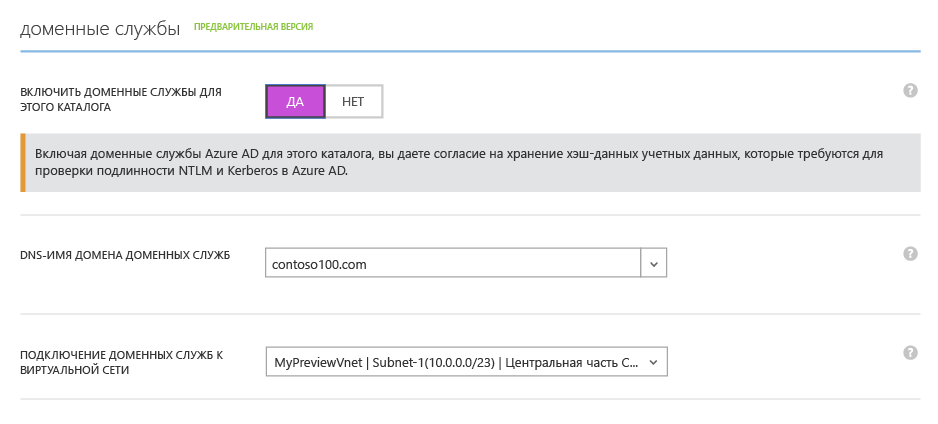
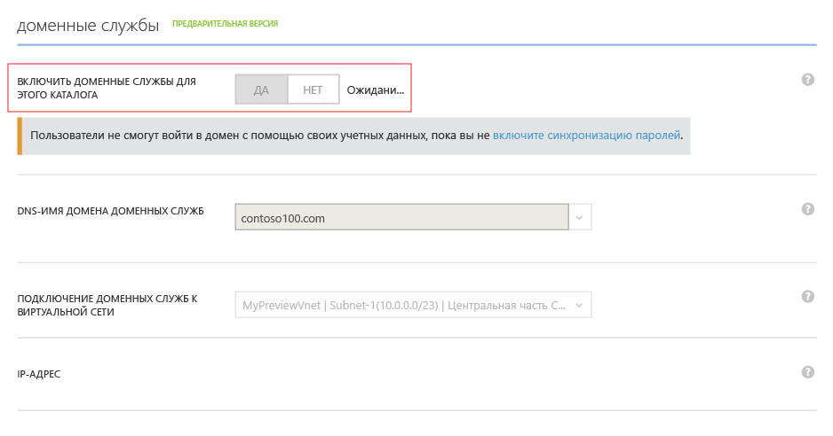
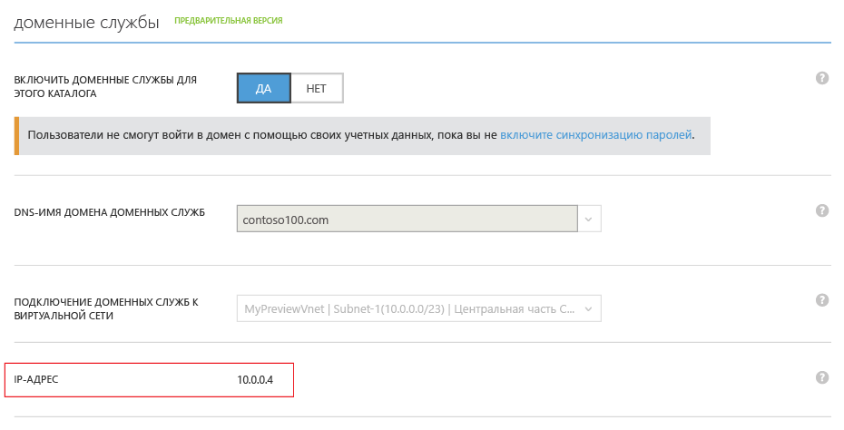
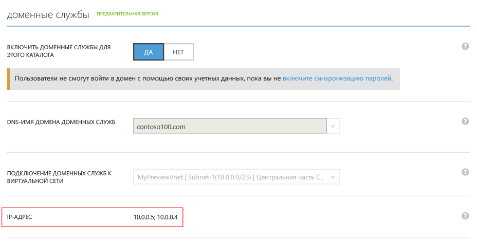

<properties
	pageTitle="Доменные службы Azure AD: включение доменных служб Azure AD | Microsoft Azure"
	description="Приступая к работе с доменными службами Azure Active Directory"
	services="active-directory-ds"
	documentationCenter=""
	authors="mahesh-unnikrishnan"
	manager="stevenpo"
	editor="curtand"/>

<tags
	ms.service="active-directory-ds"
	ms.workload="identity"
	ms.tgt_pltfrm="na"
	ms.devlang="na"
	ms.topic="get-started-article"
	ms.date="09/21/2016"
	ms.author="maheshu"/>

# Включение доменных служб Azure AD

## Задача 3. Включение доменных служб Azure AD
На этом этапе мы включим доменные службы Azure AD для каталога. Чтобы включить доменные службы Azure AD для каталога, выполните следующие этапы настройки.

1. Перейдите на **классический портал Azure** ([https://manage.windowsazure.com](https://manage.windowsazure.com)).

2. На панели слева выберите **Active Directory**.

3. Выберите клиента Azure AD (каталог), для которого требуется включить доменные службы Azure AD.

    

4. Выберите вкладку **Настройка**.

    

5. Прокрутите список до раздела под названием **Доменные службы**.

    

6. Переключите параметр **Включить доменные службы для этого каталога** в значение **ДА**. Вы увидите, что на странице появились несколько дополнительных параметров конфигурации для доменных служб Azure AD.

    

    > [AZURE.NOTE] При включении доменных служб Azure AD для вашего клиента Azure AD создает и сохраняет хэши учетных данных Kerberos и NTLM, необходимые для проверки подлинности пользователей.

7. Укажите **Имя домена DNS для доменных служб**.

   - По умолчанию выбирается доменное имя для каталога (имя домена, заканчивающееся суффиксом домена **.onmicrosoft.com**).

   - В списке перечислены все домены, которые были настроены для вашего каталога Azure AD, включая проверяемые и непроверяемые домены, которые были настроены на вкладке «Домены».

   - Кроме того, в этот список можно добавить пользовательское имя домена, введя его. В этом примере в качестве пользовательского имени домена мы указали contoso100.com.

     > [AZURE.WARNING] Длина указанного префикса доменного имени (например, contoso100 для доменного имени contoso100.com) не должна превышать 15 символов. Если префикс доменного имени превышает 15 символов, создать домен доменных служб Azure AD нельзя.

8. Следующий шаг — выбор виртуальной сети, в которой должны быть доступны доменные службы Azure AD. Выберите созданную виртуальную сеть в раскрывающемся списке **Подключение доменных служб к виртуальной сети**.

   - Убедитесь, что указанная виртуальная сеть принадлежит региону Azure, который поддерживается доменными службами Azure AD.

   - Перейдите на страницу [служб Azure по регионам](https://azure.microsoft.com/regions/#services/), чтобы узнать, в каких регионах Azure доступны доменные службы Azure AD.

   - Если виртуальные сети находятся в регионе, в котором не поддерживаются доменные службы Azure AD, эти сети не будут отображаться в раскрывающемся списке.

   - Точно так же виртуальные сети, созданные с помощью Azure Resource Manager, не отображаются в раскрывающемся списке. Виртуальные сети на базе Resource Manager в настоящее время не поддерживаются доменными службами Azure AD.

9. Убедитесь, что выбранное имя домена DNS для управляемого домена не существует в виртуальной сети. В частности, убедитесь, что:

   - в виртуальной сети уже существует домен с таким же DNS-именем домена;

   - для выбранной виртуальной сети установлено VPN-подключение к локальной сети, а в вашей локальной сети есть домен с таким же DNS-именем домена;

   - в виртуальной сети существует облачная служба с таким же именем.

10. Чтобы включить доменные службы Azure AD, нажмите кнопку **Сохранить** в области задач в нижней части страницы.

11. Во время включения доменных служб AD для вашего каталога на странице отображается состояние "Ожидание".

    

    > [AZURE.NOTE] Доменные службы Azure AD обеспечивают высокий уровень доступности для управляемого домена. После включения доменных служб Azure AD вы заметите, что IP-адреса, по которым доменные службы доступны в виртуальной сети, отображаются один за другим. Второй IP-адрес появляется через некоторое время, когда служба включает высокий уровень доступности для вашего домена. Когда высокий уровень доступности настроен и активен для вашего домена, в разделе **Доменные службы** на вкладке **Настройка** будут отображаться два IP-адреса.

12. Через 20–30 минут вы увидите первый из этих IP-адресов в поле **IP-адрес** на странице **Настройка**.

    

13. Когда активируется высокий уровень доступности для вашего домена, вы увидите на этой странице два IP-адреса. Это IP-адреса, по которым доменные службы Azure AD доступны в выбранной виртуальной сети. Запишите эти IP-адреса, чтобы обновить параметры DNS для виртуальной сети. Этот шаг позволяет виртуальным машинам в виртуальной сети подключиться к домену для таких операций, как присоединение к домену.

    

> [AZURE.NOTE] В зависимости от размера клиента Azure AD (число пользователей, групп и т. д.) на то, чтобы данные клиента стали доступны в доменных службах Azure AD, может потребоваться некоторое время. Этот процесс синхронизации происходит в фоновом режиме. В случае с крупными клиентами с десятками тысяч объектов на то, чтобы все пользователи, группы и учетные данные стали доступны в доменных службах Azure AD, может потребоваться один-два дня.

 

## Задача 4. Обновление настроек DNS для виртуальной сети Azure
Следующая задача — [обновить параметры DNS для виртуальной сети Azure](active-directory-ds-getting-started-dns.md).

<!---HONumber=AcomDC_0928_2016-->