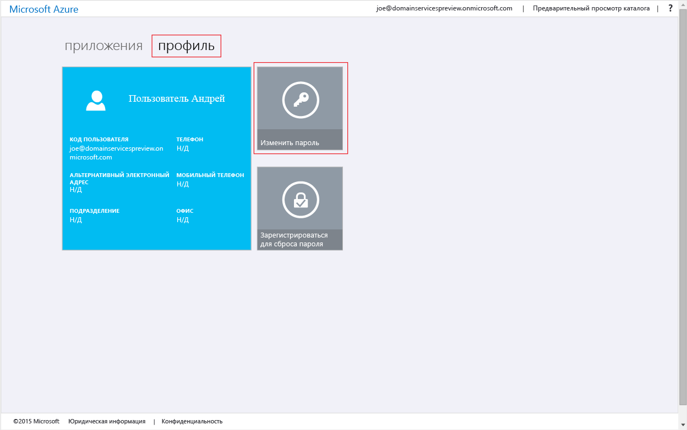
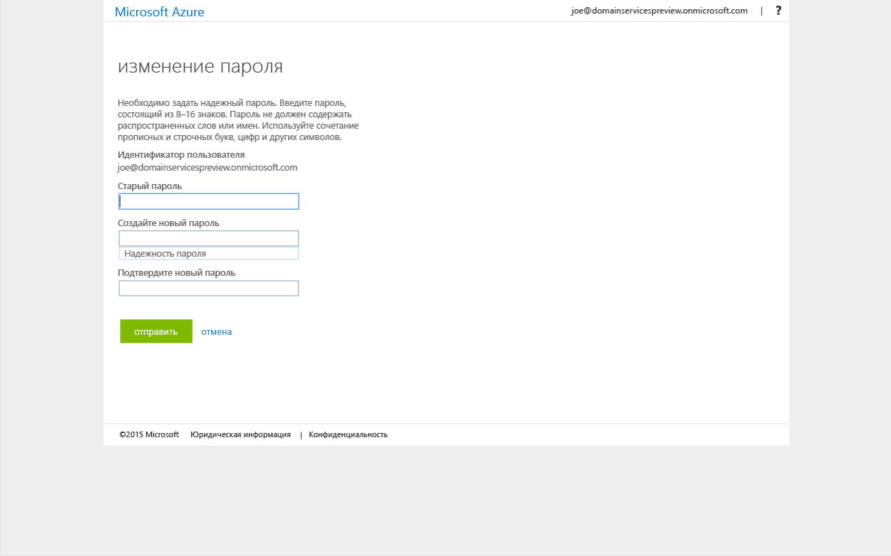

<properties
	pageTitle="Доменные службы Azure AD: включение синхронизации паролей | Microsoft Azure"
	description="Приступая к работе с доменными службами Azure Active Directory"
	services="active-directory-ds"
	documentationCenter=""
	authors="mahesh-unnikrishnan"
	manager="stevenpo"
	editor="curtand"/>

<tags
	ms.service="active-directory-ds"
	ms.workload="identity"
	ms.tgt_pltfrm="na"
	ms.devlang="na"
	ms.topic="get-started-article"
	ms.date="09/20/2016"
	ms.author="maheshu"/>

# Включение синхронизации паролей с доменными службами Azure AD
В предыдущих задачах вы включили доменные службы Azure AD для вашего клиента Azure AD. Следующая задача — включить необходимые хэши учетных данных, чтобы синхронизировать проверку подлинности NTLM и Kerberos с доменными службами Azure AD. Когда синхронизация учетных данных настроена, пользователи могут входить в управляемый домен с помощью учетных данных организации.

Этапы настройки различаются в зависимости от того, является ли ваша организация только облачным клиентом Azure AD или для нее настроена синхронизация локального каталога с помощью Azure AD Connect.

 

> [AZURE.SELECTOR]
- [Исключительно облачный клиент Azure AD](active-directory-ds-getting-started-password-sync.md)
- [Синхронизированный клиент Azure AD](active-directory-ds-getting-started-password-sync-synced-tenant.md)

 

## Задача 5. Включение синхронизации паролей в доменных службах AAD для исключительно облачного каталога Azure AD
Чтобы проверять подлинность пользователей в управляемом домене, доменным службам Azure AD нужны хэши учетных данных в формате, который подходит для проверки подлинности NTLM и Kerberos. Если не включить доменные службы AAD для клиента, служба Azure AD не будет создавать и хранить хэши учетных данных в формате, который нужен для проверки подлинности NTLM или Kerberos. Из очевидных соображений безопасности служба Azure AD не хранит учетные данные в формате открытого текста. Поэтому она не может создавать хэши учетных данных NTLM и Kerberos на основании существующих учетных данных пользователей.

> [AZURE.NOTE] Если у вашей организации есть только облачный клиент Azure AD, пользователи, которые хотят воспользоваться доменными службами Azure AD, должны изменить свои пароли.

Для этого необходимо сформировать в Azure AD хэши учетных данных, необходимые доменным службам Azure AD для проверки подлинности Kerberos и NTLM. Вы можете либо принудительно сделать так, чтобы срок действия паролей для всех пользователей в клиенте доменных служб Azure AD истек, либо отправить пользователям инструкции по изменению паролей.

### Включение создания хэшей учетных данных NTLM и Kerberos для исключительно облачного клиента Azure AD
Инструкции по изменению паролей, которые необходимо отправить пользователям, таковы:

1. Перейдите на страницу панели доступа Azure AD для вашей организации по адресу [http://myapps.microsoft.com](http://myapps.microsoft.com).

2. Выберите вкладку **Профиль** на этой странице.

3. Щелкните плитку **Изменить пароль** на этой странице.

    

    > [AZURE.NOTE] Если плитка **Изменение пароля** не отображается на странице панели доступа, убедитесь, что ваша организация настроила [управление паролями в Azure AD](../active-directory/active-directory-passwords-getting-started.md).

4. На странице **изменения пароля** введите старый пароль, затем введите новый пароль и подтвердите его. Щелкните **Отправить**.

    

Новый пароль становится доступным в доменных службах Azure AD вскоре после изменения. Входить на компьютеры, подключенные к управляемому домену, с помощью нового пароля можно уже через несколько (обычно примерно через 20) минут.

 

## Похожий контент

- [Как изменить свой пароль](../active-directory/active-directory-passwords-update-your-own-password.md)

- [Приступая к работе с компонентами управления паролями](../active-directory/active-directory-passwords-getting-started.md)

- [Доменные службы Azure AD (предварительная версия) — включение синхронизации паролей в доменные службы Azure AD](active-directory-ds-getting-started-password-sync-synced-tenant.md)

- [Administer an Azure AD Domain Services managed domain (Администрирование управляемого домена доменных служб Azure AD)](active-directory-ds-admin-guide-administer-domain.md)

- [Join a Windows virtual machine to an Azure AD Domain Services managed domain (Присоединение виртуальной машины Windows к управляемому домену доменных служб Azure AD)](active-directory-ds-admin-guide-join-windows-vm.md)

- [Join a Red Hat Enterprise Linux virtual machine to an Azure AD Domain Services managed domain (Присоединение виртуальной машины Red Hat Enterprise Linux к управляемому домену доменных служб Azure AD)](active-directory-ds-admin-guide-join-rhel-linux-vm.md)

<!---HONumber=AcomDC_0921_2016--->