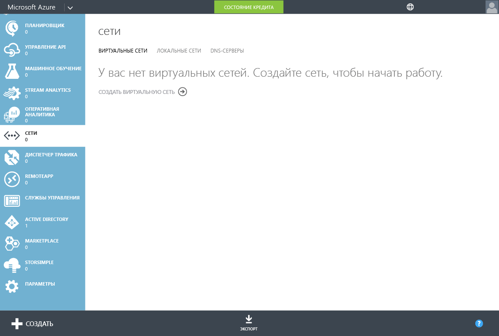
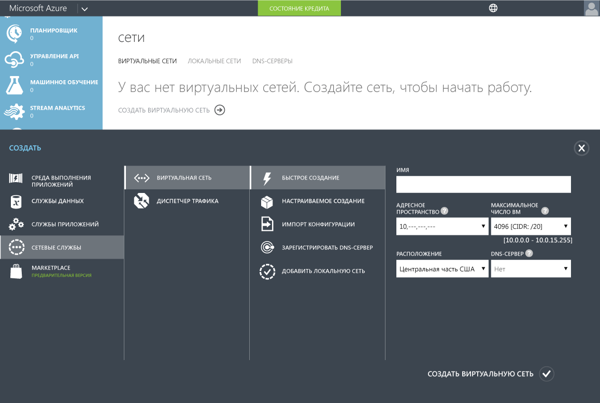
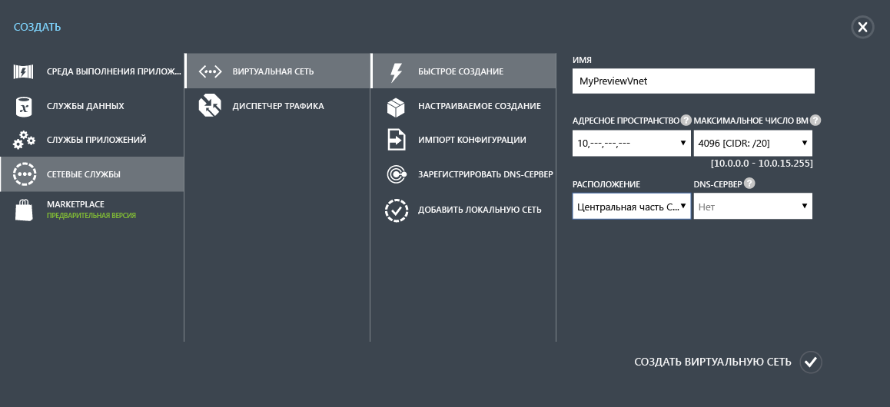

<properties
	pageTitle="Доменные службы Azure AD: создание или выбор виртуальной сети | Microsoft Azure"
	description="Приступая к работе с доменными службами Azure Active Directory"
	services="active-directory-ds"
	documentationCenter=""
	authors="mahesh-unnikrishnan"
	manager="stevenpo"
	editor="curtand"/>

<tags
	ms.service="active-directory-ds"
	ms.workload="identity"
	ms.tgt_pltfrm="na"
	ms.devlang="na"
	ms.topic="get-started-article"
	ms.date="09/20/2016"
	ms.author="maheshu"/>

# Создание или выбор виртуальной сети для доменных служб Azure AD

## Рекомендации по выбору виртуальной сети Azure
> [AZURE.NOTE] **Перед началом работы** ознакомьтесь со статьей [Networking considerations for Azure AD Domain Services](active-directory-ds-networking.md) (Рекомендации по сетям для доменных служб Azure AD).

## Задача 2. Создание виртуальной сети Azure
Следующая задача — создать виртуальную сеть Azure, в которой необходимо включить доменные службы Azure AD. Если у вас есть существующая виртуальная сеть, которую вы хотите использовать, этот шаг можно пропустить.

> [AZURE.NOTE] Убедитесь, что выбранная или создаваемая виртуальная сеть для использования с доменными службами Azure AD принадлежит к региону Azure, поддерживаемому доменными службами Azure AD. На странице [служб Azure по регионам](https://azure.microsoft.com/regions/#services/) можно узнать, в каких регионах Azure доступны доменные службы Azure AD.

Запишите имя виртуальной сети, чтобы выбрать нужную виртуальную сеть при включении доменных служб Azure AD на следующем шаге настройки.

Выполните следующие действия по настройке, чтобы создать виртуальную сеть Azure, для которой необходимо включить доменные службы Azure AD.

1. Перейдите на **классический портал Azure** ([https://manage.windowsazure.com](https://manage.windowsazure.com)).

2. Выберите узел **Сети** на панели слева.

3. Щелкните **СОЗДАТЬ** на панели задач в нижней части страницы.

    

4. В узле **Сетевые службы** выберите **Виртуальная сеть**.

5. Щелкните **Быстрое создание**, чтобы создать виртуальную сеть.

    

6. Введите **Имя** для виртуальной сети. Также можно настроить **Адресное пространство** или указать **Максимальное число виртуальных машин** для этой сети. Параметр "Сервер DNS" пока можно оставить в значении "Не используется". Этот параметр будет обновлен после включения доменных служб Azure AD.

7. Убедитесь, что вы выбрали поддерживаемый регион Azure в раскрывающемся списке **Расположение**. На странице [служб Azure по регионам](https://azure.microsoft.com/regions/#services/) можно узнать, в каких регионах Azure доступны доменные службы Azure AD.

8. Чтобы создать виртуальную сеть, нажмите кнопку **Создать виртуальную сеть**.

    

 

## Задача 3. Включение доменных служб Azure AD
Следующая задача конфигурации — [включить доменные службы Azure AD](active-directory-ds-getting-started-enableaadds.md).

<!---HONumber=AcomDC_0921_2016--->