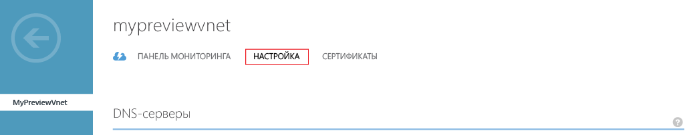
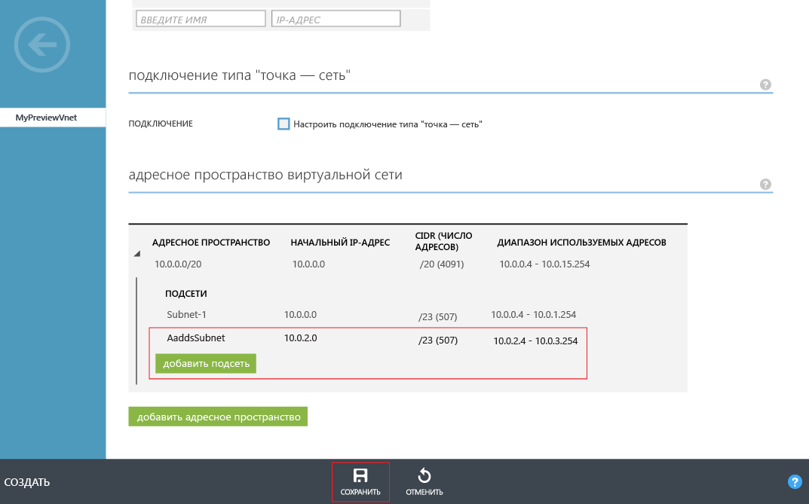

# Создание или выбор виртуальной сети для доменных служб Azure Active Directory
## Перед началом работы
См. статью [Рекомендации по сетям для доменных служб Azure AD](active-directory-ds-networking.md).

## Задача 2. Создание виртуальной сети Azure
Следующая задача по настройке — создать виртуальную сеть Azure c подсетью. Вам потребуется включить доменные службы Azure Active Directory в этой подсети. Если вы хотите использовать существующую виртуальную сеть, этот шаг можно пропустить.

> [!NOTE]
> Убедитесь, что выбранная или создаваемая виртуальная сеть для использования с доменными службами Azure Active Directory принадлежит к региону Azure, поддерживаемому доменными службами Azure Active Directory. Перейдите на страницу [служб Azure по регионам](https://azure.microsoft.com/regions/#services/), чтобы просмотреть список регионов Azure, в которых доступны доменные службы Azure Active Directory.
>
>Запишите имя виртуальной сети, чтобы выбрать нужную виртуальную сеть при включении доменных служб Azure Active Directory на следующем шаге настройки.

Чтобы создать виртуальную сеть Azure, в которой вы хотите включить доменные службы Azure Active Directory, выполните следующие инструкции по настройке.

1. Войдите на [классический портал Azure](https://manage.windowsazure.com).
2. В левой области щелкните **Сети**.

      
    Откроется окно **Виртуальные сети**.
3. В области задач в нижней части окна щелкните **Создать**.

    
4. Щелкните **Сетевые службы**, а затем выберите **Виртуальная сеть**.
    
    
5. Чтобы создать виртуальную сеть, щелкните **Быстрое создание**.
    
6. Укажите **имя** для виртуальной сети. Далее можно сделать следующее: 
    * Вы можете настроить **адресное пространство** или указать **максимальное число виртуальных машин** для этой сети. 
    * Для параметра **DNS-сервер** пока можно оставить значение **Нет**. Этот параметр можно обновить после включения доменных служб Azure Active Directory.
7. В раскрывающемся списке **Расположение** выберите поддерживаемый регион Azure.  
    Перейдите на страницу [служб Azure по регионам](https://azure.microsoft.com/regions/#services/), чтобы просмотреть список регионов Azure, в которых доступны доменные службы Azure Active Directory.
8. Чтобы создать виртуальную сеть, нажмите кнопку **Создать виртуальную сеть**.

    
9. После создания виртуальной сети выберите ее имя и перейдите на вкладку **Настройка**.

    
10. В разделе **Адресное пространство виртуальной сети** щелкните **Добавить подсеть**, а затем укажите подсеть с именем **AaddsSubnet**. 

    

11. Чтобы создать подсеть, щелкните **Сохранить**.

## Дальнейшие действия
Задача 3. [Включение доменных служб Azure Active Directory](active-directory-ds-getting-started-enableaadds.md)

