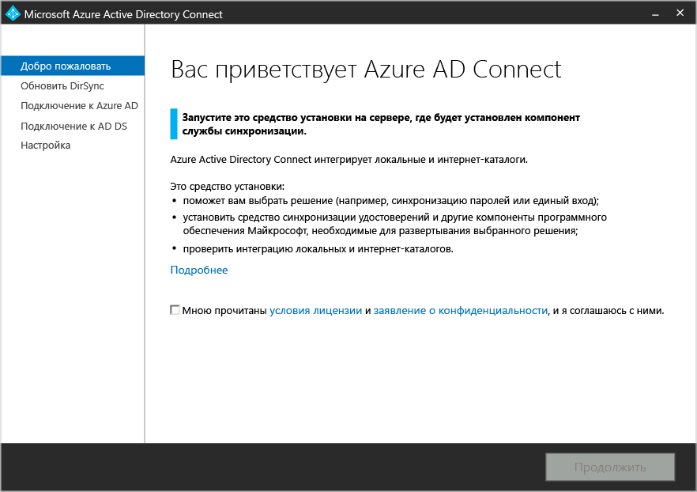
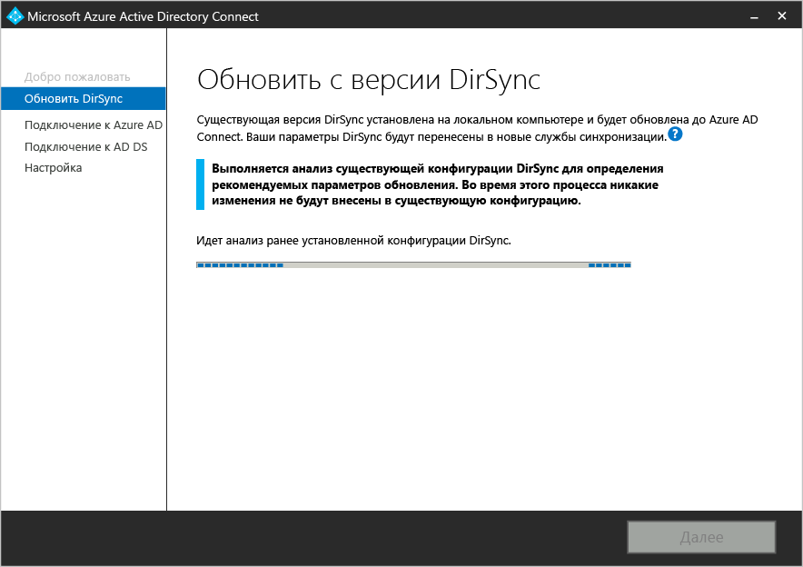
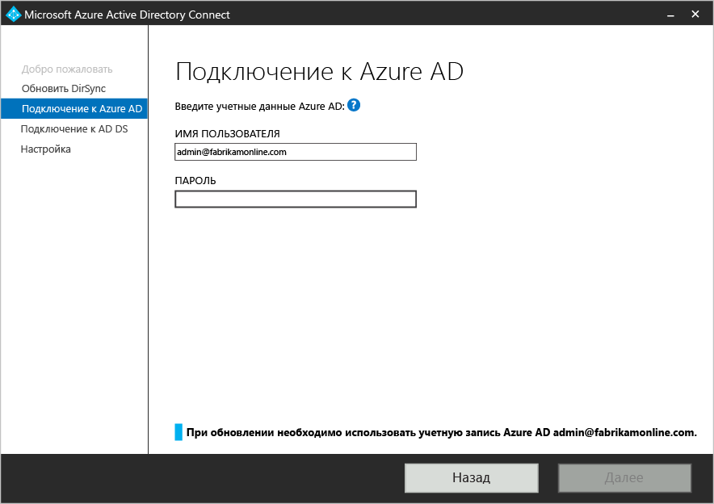
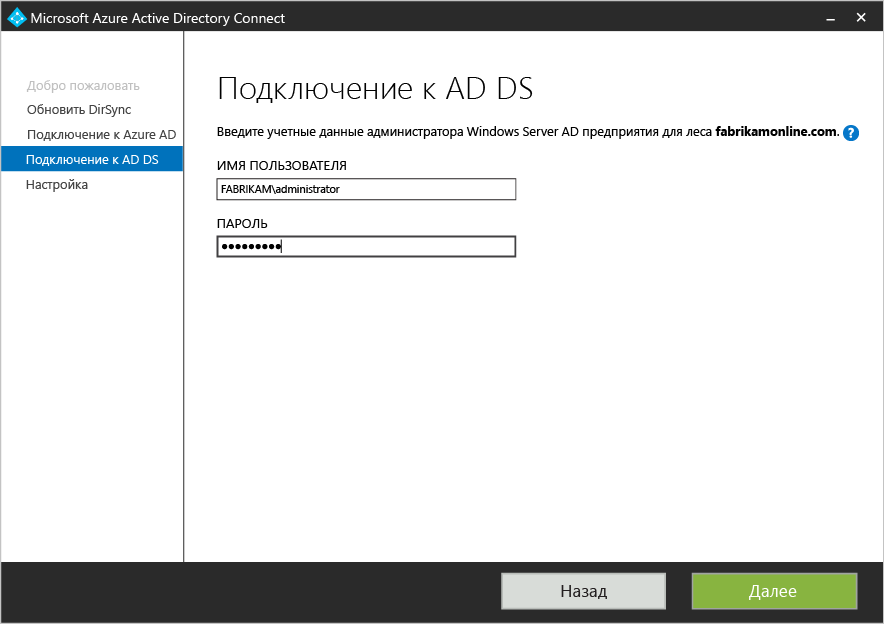
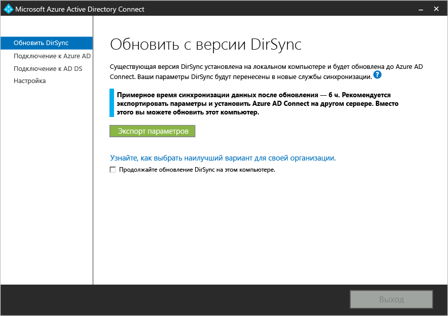
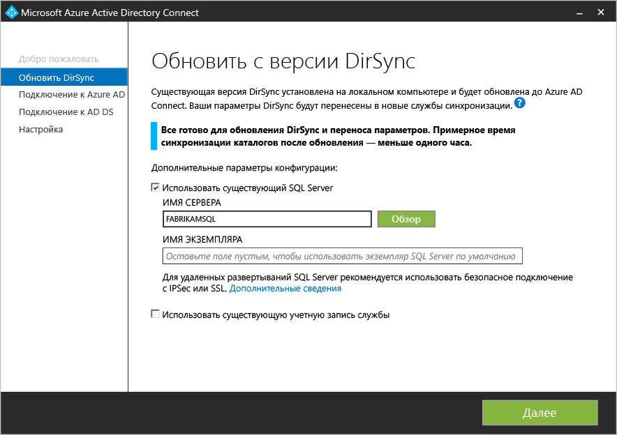
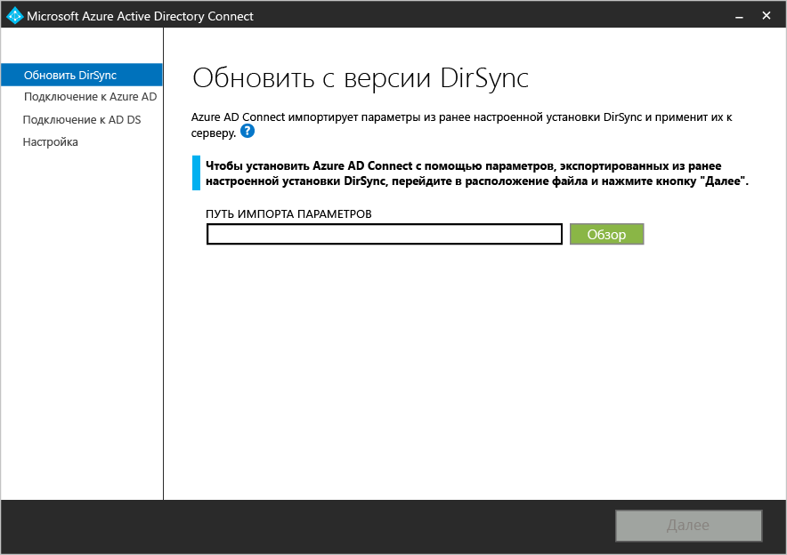
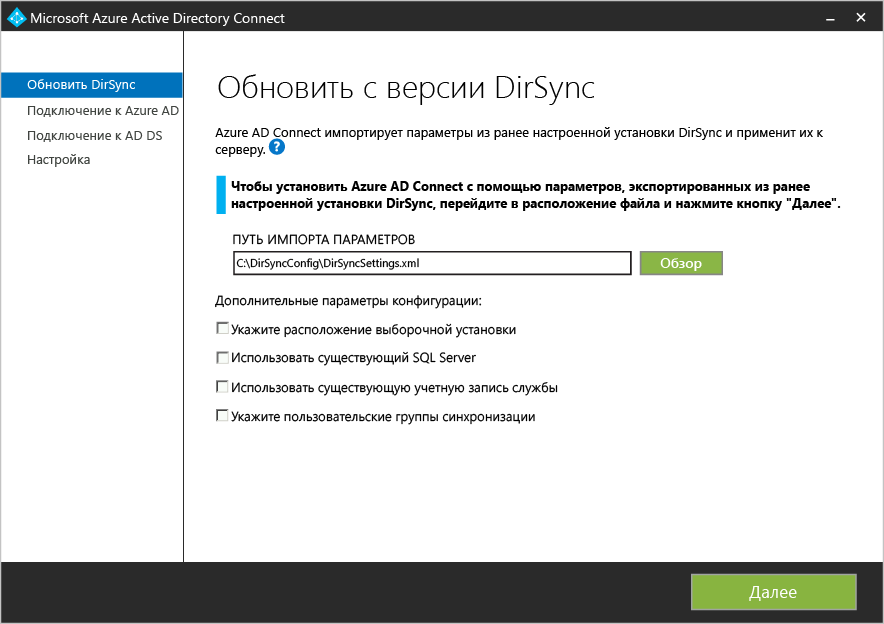
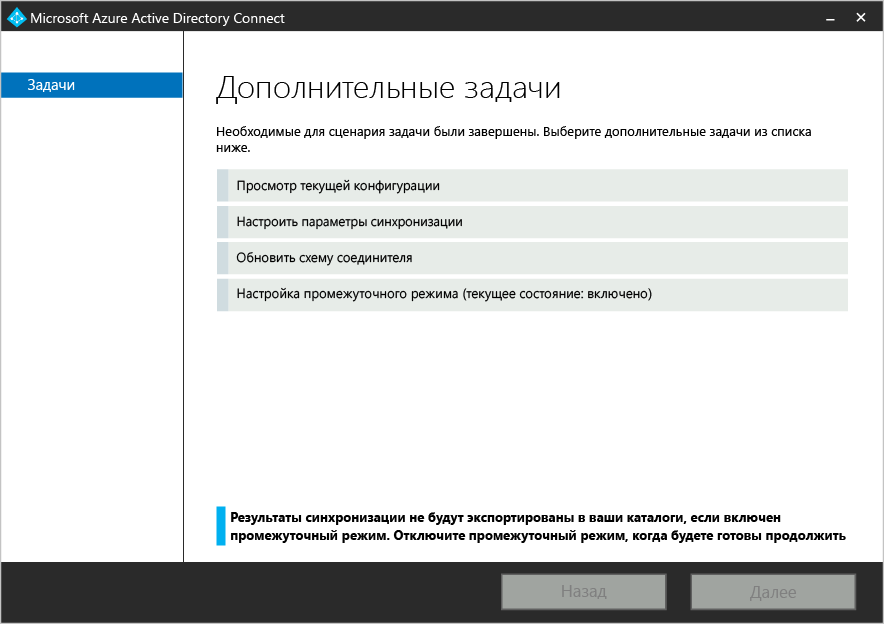
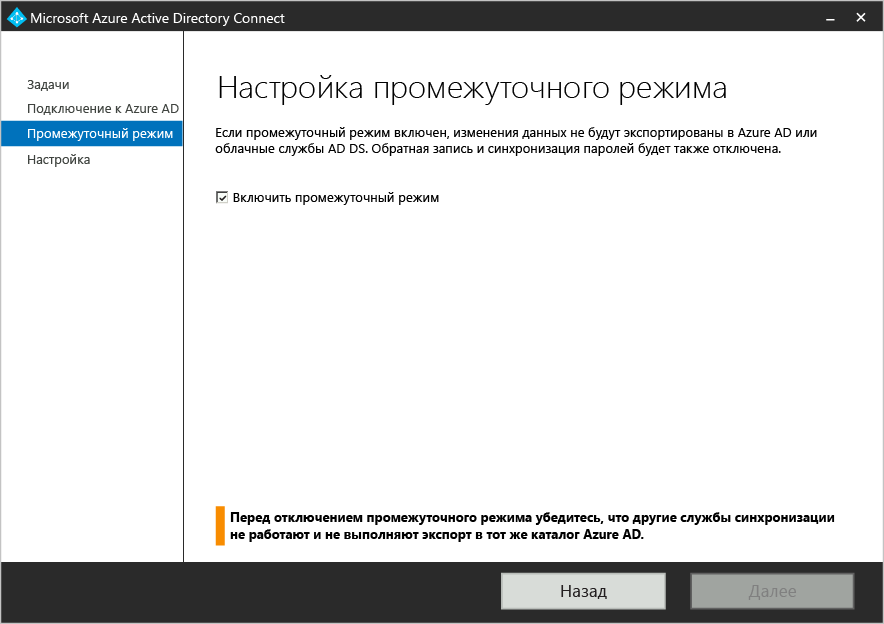

<properties 
   pageTitle="Microsoft Azure AD Connect — обновление средства синхронизации Windows Azure AD (DirSync)" 
   description="Узнайте, как обновить DirSync до Azure AD Connect. В этой статье описывается процедура обновления текущего средства синхронизации Windows Azure AD (DirSync) до Azure AD Connect." 
   services="active-directory" 
   documentationCenter="" 
   authors="shoatman" 
   manager="terrylanfear" 
   editor="billmath"/>

<tags 
   ms.service="active-directory" 
   ms.workload="identity" 
   ms.tgt_pltfrm="na" 
   ms.devlang="na" 
   ms.topic="article" 
   ms.date="05/26/2015" 
   ms.author="shoatman"/>

# Обновление службы синхронизации Azure Active Directory sync (DirSync) до Azure Active Directory Connect

Следующая документация поможет вам обновить существующую установку DirSync до Azure AD Connect

## Загрузка Azure AD Connect

Чтобы приступить к работе с Azure AD Connect, можно скачать последнюю версию [по этой ссылке](http://go.microsoft.com/fwlink/?LinkId=615771).

## Перед установкой Azure AD Connect
Прежде чем установить Azure AD Connect и обновить DirSync, вам потребуется ряд элементов.

- Пароль существующей учетной записи глобального администратора для вашего экземпляра Azure AD (программа установки напомнит вам, что это за учетная запись).
- Учетная запись администратора предприятия для локальной службы Active Directory.
- Необязательно: если вы настроили DirSync, чтобы использовать полную версию SQL Server, вам потребуются сведения для этого экземпляра базы данных.

### Параллельное развертывание

Если в настоящее время вы синхронизируете более 50 000 объектов, вы сможете выполнить параллельное развертывание. Для параллельного развертывания требуется отдельный сервер или набор серверов (если вам необходим отдельный сервер для SQL Server). Преимущества параллельного развертывания состоит в отсутствии простоя во время синхронизации. Программа установки Azure AD Connect попытается оценить ожидаемое время простоя, но если вы обновляли DirSync в прошлом, лучше руководствоваться собственным опытом.

## Установка Azure AD Connect

Скачайте файл установки Azure AD Connect и скопируйте его в существующий сервер DirSync.

1. Перейдите к файлу AzureADConnect.msi и дважды щелкните его.
2. Начните работу с мастером.

Для обновления на месте доступны следующие действия высокого уровня:

1. Приветствие мастера установки Azure AD Connect.
2. Анализ текущей конфигурации DirSync.
3. Получение пароля глобального администратора Azure AD.
4. Получение учетных данных для учетной записи администратора предприятия (используется только во время установки Azure AD Connect).
5. Установка AAD Connect
    * Удаление DirSync
	* Установка AAD Connect
	* Запуск синхронизации при необходимости

Дополнительные действия и сведения необходимы, если:

* в настоящее время вы используете полную версию SQL Server, локальную или удаленную;
* в области синхронизации более 50 000 объектов.

## Обновление на месте — менее 50 000 объектов — SQL Express (пошаговое руководство)

0. Запустите установщик Azure AD Connect (MSI).

1. Просмотрите и примите условия лицензионного соглашения и заявление о конфиденциальности.

2. Нажмите кнопку "Далее" для анализа существующей установки DirSync.

3. После завершения анализа мы предоставим рекомендации по дальнейшим действиям. В этом сценарии (меньше 50 000 объектов в SQL Express) появится следующий экран.

4. Введите пароль для учетной записи, используемой в настоящее время для подключения к Azure AD.

5. Укажите учетную запись администратора предприятия для Active Directory.

6. Теперь все готово для настройки. Нажмите кнопку "Далее", чтобы удалить DirSync, настроить и синхронизировать Azure AD Connect.  

## Обновление на месте — более 50 000 объектов
Если в области синхронизации больше 50 000 объектов, на шаге 3 отображается другое сообщение. Появится экран, показанный ниже.

В этом случае рекомендуется рассмотреть возможность параллельного обновления на отдельном сервере. Это связано с тем, что в зависимости от размера организации обновление на месте может повлиять на соглашения об уровне обслуживания вашей компании в отношении скорости отражения изменений локальной службы Active Directory в Azure AD и Office 365. Мы пытаемся оценить, сколько времени займет первая синхронизация с помощью Azure AD Connect. Как упоминалось выше, скорее всего, ваш собственный опыт исходной установки или обновления DirSync служит лучшим показателем.

Для параллельного развертывания требуется отдельный сервер или набор серверов (если вам необходимо запускать SQL Server на сервере, отдельном от Azure AD Connect). Поэтому вполне логично рассмотреть обновление на месте, если его можно запланировать так, чтобы избежать влияния на вашу организацию.

Для продолжения обновления на месте установите флажок рядом с сообщением: "Продолжить обновление DirSync на этом компьютере".

## Обновление на месте — полная версия SQL Server

Если установка DirSync использует локальную или удаленную полную версию SQL Server, на шаге 3 отображается другое сообщение. Появится экран, показанный ниже.

Отображаются сведения о существующем сервере базы данных SQL, который используется DirSync. При необходимости внесите соответствующие изменения. Чтобы продолжить установку, нажмите кнопку "Далее".

## Параллельное развертывание — более 50 000 объектов

При наличии более 50 000 объектов на шаге 3 программа установки Azure AD Connect рекомендует параллельное развертывание. Сведения о выборе развертывания на месте или параллельного развертывания см. в разделе "Обновление на месте — более 50 000 объектов" выше. Появится экран, показанный ниже.

Если вы хотите продолжить параллельное развертывание, выполните следующие действия.

- Нажмите кнопку "Экспорт параметров". При установке Azure AD Connect на отдельном сервере эти параметры будут импортированы для переноса всех настроек текущей службы DirSync в новую установку AAD Connect.

После успешного экспорта настроек вы можете закрыть мастер Azure AD Connect на сервере DirSync.

### Установка Azure AD Connect на отдельном сервере

При установке Azure AD Connect на новом сервере служба DirSync не будет найдена, и установщик предположит, что вы хотите выполнить чистую установку Azure AD Connect. Для этого необходимо несколько специальных действий.

1. Запустите установщик Azure AD Connect (MSI).
2. Появится экран "Вас приветствует Azure AD Connect". Чтобы выйти из мастера, нажмите кнопку "X" в правом верхнем углу окна.
3. Откройте окно командной строки.
4. Из папки установки Azure AD Connect (по умолчанию: C:\Program Files\Microsoft Azure Active Directory Connect) выполните следующую команду:
    * AzureADConnect.exe /migrate

Появится следующий пользовательский интерфейс Azure AD Connect:

5. Выберите файл параметров, экспортированный из установки DirSync.
6. Настройте любые дополнительные параметры, в том числе:
    * пользовательский путь установки Azure AD Connect;
	* существующий экземпляр SQL Server (по умолчанию: Azure AD Connect устанавливает SQL Server 2012 Express);
	* учетная запись службы, используемая для подключения к SQL Server (если база данных SQL Server удаленная, эта учетная запись должна быть учетной записью службы домена).

Просмотреть эти параметры в следующем пользовательском интерфейсе:

7. Нажмите кнопку Далее. 
8. Не снимайте флажок "Запустить синхронизацию сразу после завершения настройки" на странице "Все готово к настройке".[AZURE.NOTE]Между Windows Server Active Directory и Azure Active Directory начнется синхронизация, однако изменения не будут экспортированы в Azure AD. В каждый момент времени активно экспортировать изменения может только одно средство синхронизации.
9. Нажмите кнопку "Установить".

[AZURE.NOTE]Этот флажок снимается, чтобы служба DirSync, которая по-прежнему установлена и запущена, и Azure AD Connect не пытались записывать данные в AAD одновременно.

### Убедитесь, что Azure AD Connect готова к синхронизации.

Чтобы определить, готова ли служба Azure AD Connect к обновлению DirSync, необходимо открыть диспетчер службы синхронизации Azure AD Connect. Выполните поиск "Синхронизация" в меню "Пуск" Windows, чтобы найти это приложение.

В приложении просмотрите вкладку "Операции". Здесь вы сможете убедиться, что выполнены следующие операции:

- импорт агента управления AD;
- импорт агента управления Azure AD;
- полная синхронизация агента управления AD;
- полная синхронизация агента управления Azure AD.

После завершения этих четырех операций вы можете удалить DirSync и включить синхронизацию Azure AD Connect.

### Удаление DirSync (старый сервер)

- В окне "Установка и удаление программ" найдите "Средство синхронизации Windows Azure Active Directory".
- Удалите "Средство синхронизации Windows Azure Active Directory".

### Открытие Azure AD Connect (новый сервер)
При повторном открытии Azure AD Connect после установки открывается мастер конфигурации. Откройте Azure AD Connect.

Вы увидите следующее:

* Выберите "Настроить промежуточный режим".
    * При обновлении с использованием экспортированных параметров DirSync Azure AD Connect автоматически переходит в промежуточный режим. Промежуточный режим означает, что синхронизация будет выполняться в Azure AD Connect, но изменения не будут экспортированы в Azure AD или AD.
* Отключите промежуточный режим, сняв флажок "Промежуточный режим включен".

* Нажмите кнопку "Установить".

Поздравляем, вы успешно перешли на Azure AD Connect с помощью параллельного развертывания.

## Вспомогательные компоненты Azure AD Connect

Ниже приведен перечень необходимых и вспомогательных компонентов, которые Azure AD Connect установит на сервере, где установлен Azure AD Connect. Этот список предназначен для базовой установки Express. Если вы решили использовать другой выпуск SQL Server на странице установки службы синхронизации, перечисленные ниже компоненты SQL Server 2012 не установлены.

- Соединитель Forefront Identity Manager Azure Active Directory
- Программы командной строки Microsoft SQL Server 2012
- Microsoft SQL Server 2012 Native Client
- Microsoft SQL Server 2012 Express LocalDB
- Модуль Azure Active Directory для Windows PowerShell
- Помощник по входу в Microsoft Online Services для ИТ-специалистов
- Распространяемый пакет Microsoft Visual C++ 2013

**Дополнительные ресурсы**

* [Использование локальной инфраструктуры удостоверений в облаке](active-directory-aadconnect.md)
* [Принципы работы Azure AD Connect](active-directory-aadconnect-how-it-works.md)
* [Что дальше с Azure AD Connect](active-directory-aadconnect-whats-next.md)
* [Подробнее](active-directory-aadconnect-learn-more.md)
* [Azure AD Connect на портале MSDN](https://msdn.microsoft.com/library/azure/dn832695.aspx)
 

<!---HONumber=July15_HO4-->