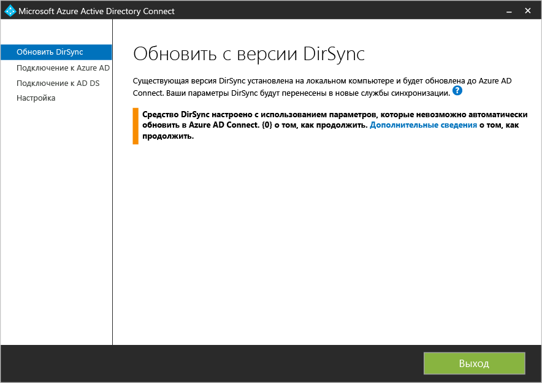
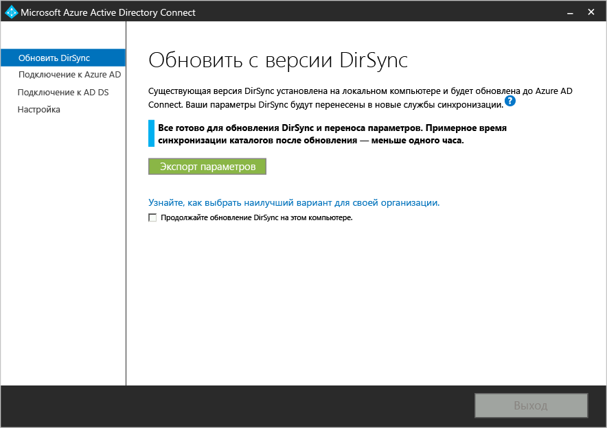
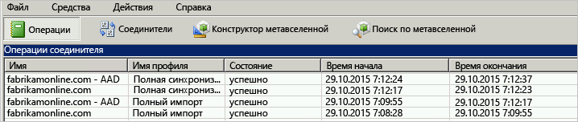

<properties
   pageTitle="Microsoft Azure AD Connect — обновление средства синхронизации Windows Azure AD (DirSync) | Microsoft Azure"
   description="Узнайте, как обновить DirSync до Azure AD Connect. В этой статье описывается процедура обновления текущего средства синхронизации Windows Azure AD (DirSync) до Azure AD Connect."
   services="active-directory"
   documentationCenter=""
   authors="andkjell"
   manager="stevenpo"
   editor=""/>

<tags
   ms.service="active-directory"
   ms.workload="identity"
   ms.tgt_pltfrm="na"
   ms.devlang="na"
   ms.topic="article"
   ms.date="10/26/2015"
   ms.author="shoatman;billmath"/>

# Обновление службы синхронизации Azure Active Directory (DirSync) до Azure Active Directory Connect (Azure AD Connect)

Следующая документация поможет вам обновить существующую установку DirSync до Azure AD Connect.

## Сопутствующая документация
Если вы еще не ознакомились с документацией по [интеграции локальных удостоверений с Azure Active Directory](active-directory-aadconnect.md), в следующей таблице приведены ссылки на соответствующие разделы. Указания двух первых разделов, выделенных полужирным шрифтом, необходимо выполнить перед началом обновления из DirSync.

| Раздел | |
| --------- | --------- |
| **Загрузка Azure AD Connect** | [Загрузка Azure AD Connect](http://go.microsoft.com/fwlink/?LinkId=615771) |
| **Оборудование и необходимые компоненты** | [Azure AD Connect: оборудование и необходимые компоненты](active-directory-aadconnect-prerequisites.md) |
| **Учетные записи, используемые для установки** | [Дополнительная информация об учетных записях и разрешениях Azure AD Connect](active-directory-aadconnect-accounts-permissions.md) |

## Обновление из DirSync
В зависимости от текущего развертывания DirSync, существуют различные параметры для обновления. Если ожидаемое время обновления составляет менее 3 часов, то рекомендуется выполнить «обновление на месте». Если ожидаемое время обновления составляет более 3 часов, рекомендуется реализовать параллельное развертывание на другом сервере. Предполагается, что при наличии более 50 000 объектов для обновления потребуется более 3 часов.

| Сценарий | |
| ---- | ---- |
| [Обновление «на месте»](#in-place-upgrade) | Предпочтительный вариант, если обновление предположительно займет менее 3 часов. |
| [Параллельное развертывание](#parallel-deployment) | Предпочтительный вариант, если обновление предположительно займет более 3 часов. |

>[AZURE.NOTE]При планировании обновления из DirSync до Azure AD Connect не удаляйте DirSync самостоятельно до обновления. Azure AD Connect считает и перенесет конфигурацию из DirSync и удалит его после проверки сервера.

**Обновление «на месте»**

Мастер отобразит ожидаемое время для завершения обновления. Оценка основана на предположении, что для завершения обновления базы данных, содержащей 50 000 объектов (пользователей, контактов и групп), потребуется 3 часа. Azure AD Connect проанализирует текущие параметры DirSync и порекомендует обновление на месте, если количество объектов в базе данных меньше 50 000. Если принято решение продолжить, текущие параметры автоматически применятся во время обновления и сервер автоматически возобновит активную синхронизацию.

Если вы хотите выполнить миграцию конфигурации и реализовать параллельное развертывание, можно переопределить рекомендации по обновлению на месте. Например, можно воспользоваться возможностью обновления оборудования и операционной системы. Дополнительные сведения см. в разделе [Параллельное развертывание](#parallel-deployment).

**Параллельное развертывание**

Параллельное развертывание рекомендуется использовать при наличии более 50 000 объектов. Это позволит избежать задержек в работе пользователей. Программа установки Azure AD Connect попытается оценить ожидаемое время простоя из-за обновления, но если вы уже обновляли DirSync, то лучше руководствоваться собственным опытом.

### Поддерживаемые обновляемые конфигурации DirSync
Следующие изменения в конфигурации поддерживаются в DirSync и будут обновлены.

- Фильтрация домена и подразделения
- Альтернативный идентификатор (UPN)
- Гибридные параметры синхронизации паролей и Exchange
- Параметры вашего леса или домена и Azure AD

Следующие изменения обновить невозможно. Обновление будет заблокировано, если внесены следующие изменения.

В таких случаях рекомендуется установить новый сервер Azure AD Connect в [промежуточном режиме](active-directory-aadconnectsync-operations.md#staging-mode) и проверить старую конфигурацию DirSync и новую конфигурацию Azure AD Connect. Повторно примените изменения с помощью пользовательской конфигурации, как описано в разделе [Пользовательская конфигурация Azure AD Connect Sync](active-directory-aadconnectsync-whatis.md).

- Неподдерживаемые изменения DirSync, например удаленные атрибуты и использование пользовательского расширения DLL
- Фильтрация на основе атрибутов пользователя

Пароли, используемые DirSync для учетных записей служб, невозможно получить и перенести. Эти пароли будут сброшены во время обновления.

### Общие инструкции по обновлению из DirSync до Azure AD Connect

1. Приветствие мастера установки Azure AD Connect.
2. Анализ текущей конфигурации DirSync
3. Получение пароля глобального администратора Azure AD.
4. Получение учетных данных для учетной записи администратора предприятия (используется только во время установки Azure AD Connect).
5. Установка Azure AD Connect
    * Удаление DirSync.
	* Установка Azure AD Connect
	* Запуск синхронизации (при необходимости).

Дополнительные действия необходимы, если:

* в настоящее время вы используете полную версию SQL Server, локальную или удаленную;
* в области синхронизации более 50 000 объектов.

## Обновление «на месте»

1. Запустите установщик Azure AD Connect (MSI).
2. Просмотрите и примите условия лицензионного соглашения и заявления о конфиденциальности. 
3. Нажмите кнопку "Далее" для анализа существующей установки DirSync. 
4. По завершении анализа мы предоставим рекомендации по дальнейшим действиям.  
    - При использовании SQL Server Express и наличии менее 50 000 объектов отображается следующий экран: .
    - При использовании полного продукта SQL Server для DirSync вы увидите эту страницу:   Отображаются сведения о существующей базе данных SQL Server, используемой DirSync. При необходимости внесите соответствующие изменения. Нажмите кнопку **Далее**, чтобы продолжить установку.
    - При наличии менее 50 000 объектов отображается следующий экран:   Для продолжения обновления на месте установите флажок рядом с сообщением **Продолжить обновление DirSync на этом компьютере**. Чтобы вместо этого реализовать [параллельное развертывание](#parallel-deployment), экспортируйте параметры конфигурации DirSync и переместите их на новый сервер.
5. Введите пароль для учетной записи, используемой в настоящее время для подключения к Azure AD. Это должна быть учетная запись, используемая в настоящее время с DirSync. 
6. Укажите учетную запись администратора предприятия для Active Directory. 
7. Теперь все готово для настройки. Нажмите кнопку **Обновить**, чтобы удалить DirSync и начать настройку и синхронизацию Azure AD Connect. 

## Параллельное развертывание

### Экспорт конфигурации DirSync
**Параллельное развертывание — более 50 000 объектов**

При наличии более 50 000 объектов программа установки Azure AD Connect порекомендует параллельное развертывание.

Появится экран, показанный ниже.

Если вы хотите продолжить параллельное развертывание, выполните следующие действия.

- Нажмите кнопку **Экспорт параметров**. Если вы устанавливаете Azure AD Connect на отдельном сервере, эти параметры будут импортированы. Это позволит перенести все настройки текущей службы DirSync в устанавливаемую службу.

После успешного экспорта настроек вы можете закрыть мастер Azure AD Connect на сервере DirSync. Перейдите к следующему шагу — [Установка Azure AD Connect на отдельном сервере](#installation-of-azure-ad-connect-on-separate-server).

**Параллельное развертывание — менее 50 000 объектов**

Если у вас менее 50 000 объектов, но вы хотите реализовать параллельное развертывание, выполните следующие действия.

1. Запустите установщик Azure AD Connect (MSI).
2. При отображении экрана **Вас приветствует Azure AD Connect** выйдите из мастера установки, нажав кнопку c крестиком в правом верхнем углу окна.
3. Откройте окно командной строки.
4. Из папки установки Azure AD Connect (по умолчанию: C:\\Program Files\\Microsoft Azure Active Directory Connect) выполните следующую команду: `AzureADConnect.exe /ForceExport`.
5. Нажмите кнопку **Экспорт параметров**. Если вы устанавливаете Azure AD Connect на отдельном сервере, эти параметры будут импортированы. Это позволит перенести все настройки текущей службы DirSync в устанавливаемую службу.

После успешного экспорта настроек вы можете закрыть мастер Azure AD Connect на сервере DirSync. Перейдите к следующему шагу — [Установка Azure AD Connect на отдельном сервере](#installation-of-azure-ad-connect-on-separate-server).

### Установка Azure AD Connect на отдельном сервере

При установке Azure AD Connect на новом сервере установщик предположит, что вы хотите выполнить чистую установку Azure AD Connect. Поскольку вы собираетесь использовать конфигурацию DirSync, необходимо выполнить некоторые дополнительные действия.

1. Запустите установщик Azure AD Connect (MSI).
2. При отображении экрана **Вас приветствует Azure AD Connect** выйдите из мастера установки, нажав кнопку c крестиком в правом верхнем углу окна.
3. Откройте окно командной строки.
4. Из папки установки Azure AD Connect (по умолчанию: C:\\Program Files\\Microsoft Azure Active Directory Connect) выполните следующую команду: `AzureADConnect.exe /migrate`. Будет запущен мастер установки Azure AD Connect и появится следующий экран: .
5. Выберите файл параметров, экспортированный из установки DirSync.
6. Настройте любые дополнительные параметры, в том числе:
    - пользовательский путь установки Azure AD Connect;
	- существующий экземпляр SQL Server (по умолчанию Azure AD Connect устанавливает SQL Server 2012 Express). Не используйте один и тот же экземпляр базы данных в качестве сервера DirSync.
	- Учетная запись службы, используемая для подключения к SQL Server (если база данных SQL Server удаленная, эта учетная запись должна быть учетной записью службы домена). Следующие параметры можно увидеть на этом экране: .
7. Нажмите кнопку **Далее**.
8. Не снимайте флажок **Запустить синхронизацию сразу после завершения настройки** на странице **Готово к настройке**. Сервер будет находиться в [промежуточном режиме](active-directory-aadconnectsync-operations.md#staging-mode), поэтому в данный момент изменения не будут экспортированы в Azure AD.
9. Щелкните **Install** (Установить).

>[AZURE.NOTE]Между Windows Server Active Directory и Azure Active Directory начнется синхронизация, однако изменения не будут экспортированы в Azure AD. В каждый момент времени активно экспортировать изменения может только одно средство синхронизации. Это называется [промежуточный режим](active-directory-aadconnectsync-operations.md#staging-mode).

### Убедитесь, что служба Azure AD Connect готова к синхронизации.

Чтобы определить, готова ли служба Azure AD Connect наследовать настройки DirSync, необходимо открыть **диспетчер службы синхронизации** в группе **Azure AD Connect** из меню "Пуск".

В приложении откройте вкладку **Операции**. Здесь вы сможете убедиться, что выполнены следующие операции:

- Импорт в соединителе AD
- Импорт в соединителе Azure AD
- Полная синхронизация в соединителе AD
- Полная синхронизация в соединителе Azure AD

Просмотрите результат этих операций и убедитесь, что отсутствуют ошибки.

Если вы хотите просмотреть и проверить, какие изменения должны быть экспортированы в Azure AD, прочитайте, как проверить конфигурацию в [промежуточном режиме](active-directory-aadconnectsync-operations.md#staging-mode). Внесите необходимые изменения конфигурации, пока не увидите что-нибудь непредвиденное.

После того как эти 4 операции завершились, ошибки отсутствуют и вас устраивают все изменения, которые необходимо экспортировать, все готово для удаления DirSync и включения синхронизации Azure AD Connect. Выполните следующие два действия для завершения миграции.

### Удаление DirSync (старый сервер)

- В окне **Программы и компоненты** найдите **Средство синхронизации Windows Azure Active Directory**.
- Удаление **средства синхронизации Windows Azure Active Directory**
- Обратите внимание, что удаление может занимать до 15 минут.

После удаления DirSync нет ни одного активного сервера, экспортируемого в Azure AD. Следующий шаг необходимо завершить, прежде чем продолжать синхронизацию изменений вашей локальной службы Active Directory с Azure AD.

### Включение Azure AD Connect (новый сервер)
При повторном открытии Azure AD Connect после установки вы сможете внести дополнительные изменения в конфигурацию. Запустите **Azure AD Connect** из меню "Пуск" или с помощью ярлыка на рабочем столе. Убедитесь, что не пытаетесь повторно запустить программу установки MSI.

Вы увидите следующее:

- Выберите **Настроить промежуточный режим**.
- Отключите промежуточный режим, сняв флажок **Промежуточный режим включен**.

- Нажмите кнопку **Далее**.
- На странице подтверждения нажмите кнопку **Установить**.

Azure AD Connect теперь является активным сервером.

## Дальнейшие действия
После установки Azure AD Connect можно [проверить установку и назначить лицензии](active-directory-aadconnect-whats-next.md).

Узнайте больше об [интеграции локальных удостоверений с Azure Active Directory](active-directory-aadconnect.md).

<!---HONumber=Nov15_HO2-->