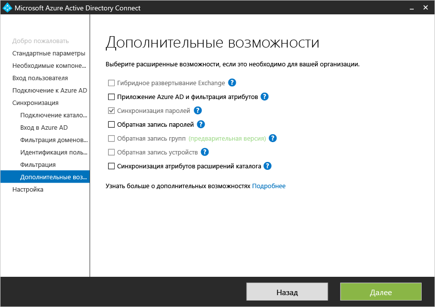
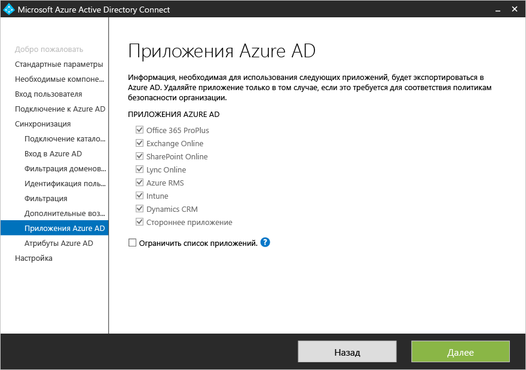
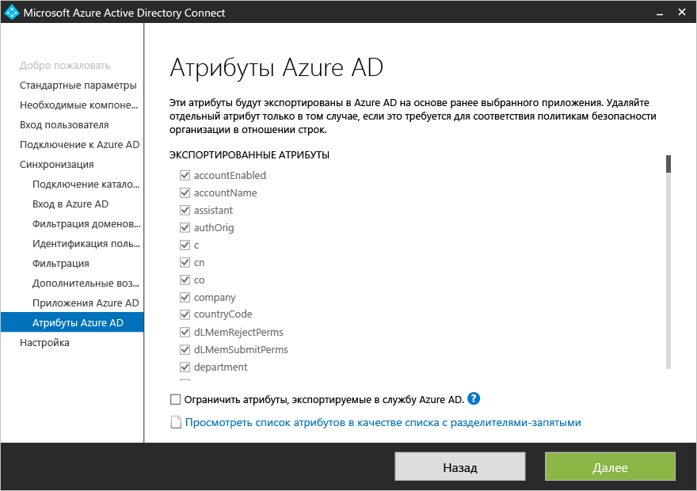

<properties
	pageTitle="Azure AD Connect: выборочная установка | Microsoft Azure"
	description="В этом документе описаны параметры выборочной установки для Azure AD Connect."
	services="active-directory"
	documentationCenter=""
	authors="billmath"
	manager="stevenpo"
	editor="curtand"/>

<tags
	ms.service="active-directory"  
	ms.workload="identity"
	ms.tgt_pltfrm="na"
	ms.devlang="na"
	ms.topic="article"
	ms.date="01/11/2016"
	ms.author="billmath;andkjell"/>

# Выборочная установка Azure AD Connect

Данная документация содержит сведения об использовании выборочной установки для Azure AD Connect. Вы можете использовать этот тип установки, если у вас есть дополнительные параметры конфигурации или вам нужны дополнительные функции, которые не входят в экспресс-установку.

## Дополнительная документация
Если вы еще не ознакомились с документацией по [интеграции локальных удостоверений с Azure Active Directory](active-directory-aadconnect.md), в следующей таблице приведены ссылки на соответствующие разделы. Инструкции трех первых разделов, выделенных полужирным шрифтом, необходимо выполнить перед началом установки.

| Раздел | |
| --------- | --------- |
| **Загрузка Azure AD Connect** | [Загрузка Azure AD Connect](http://go.microsoft.com/fwlink/?LinkId=615771) |
| **Оборудование и необходимые компоненты** | [Azure AD Connect: оборудование и необходимые компоненты](active-directory-aadconnect-prerequisites.md) |
| **Учетные записи, используемые для установки** | [Учетные записи и разрешения Azure AD Connect](active-directory-aadconnect-accounts-permissions.md) |
| Установка с помощью стандартных параметров | [Экспресс-установка Azure AD Connect](active-directory-aadconnect-get-started-express.md) |
| Обновление из DirSync | [Обновление из средства синхронизации Azure AD (DirSync)](active-directory-aadconnect-dirsync-upgrade-get-started.md) |
| Действия после установки | [Проверка установки и назначение лицензий ](active-directory-aadconnect-whats-next.md) |

## Установка необходимых компонентов

При установке служб синхронизации вы можете пропустить дополнительный раздел конфигурации, а Azure AD Connect настроит все автоматически. Так, настраиваются экземпляр SQL Server 2012 Express, создаются соответствующие группы, а им назначаются разрешения. Если вы хотите изменить параметры по умолчанию, можно использовать следующую таблицу, чтобы изучить доступные дополнительные параметры.

| Дополнительная настройка | Описание |
| ------------- | ------------- |
| Использование существующего SQL Server | Позволяет указать имя SQL Server и имя экземпляра. Выберите этот параметр, если у вас уже есть сервер базы данных AD, который вы хотите использовать. Если для вашего SQL Server не разрешен просмотр и необходимо указать номер порта, то в поле **Имя экземпляра** следует ввести имя экземпляра и через запятую номер порта. |
| Использование существующей учетной записи службы | По умолчанию Azure AD Connect создает учетную запись локальной службы для служб синхронизации. Пароль формируется автоматически и неизвестен пользователю, устанавливающему Azure AD Connect. Если используется удаленный экземпляр SQL Server, вам необходима учетная запись службы в домене и требуется знать пароль. В этом случае введите учетную запись службы для использования. Убедитесь, что пользователь, выполняющий установку, использует имя для входа SA в SQL, чтобы создать имя для входа в учетную запись службы. См. раздел [Учетные записи и разрешения Azure AD Connect](active-directory-aadconnect-accounts-permissions.md#custom-settings-installation) |
| Указание пользовательских групп синхронизации | По умолчанию Azure AD Connect создает на сервере четыре локальные группы после установки служб синхронизации. Это группы "Администраторы", "Операторы»", "Обзор", "Сброс пароля". Если вы хотите задать собственные группы, это можно сделать здесь. Группы должны размещаться локально на сервере и могут находиться в домене. |

## Вход пользователя
После установки необходимых компонентов вам будет предложено указать метод единого входа, который будут использовать пользователи. Таблица ниже содержит краткое описание доступных параметров. Полное описание способов входа см. в статье [Параметры входа в Azure AD Connect](active-directory-aadconnect-user-signin.md).

Метод единого входа | Описание
------------- | ------------- |
Синхронизация паролей |Пользователи могут входить в облачные службы Майкрософт, такие как Office 365, Dynamics CRM и Windows InTune, используя тот же пароль, что и для входа в локальную сеть. Пароли пользователей синхронизируются в Azure с помощью хэширования пароля, а проверка подлинности выполняется в облаке. Дополнительные сведения см. в статье [Синхронизация паролей](active-directory-aadconnectsync-implement-password-synchronization.md).
Федерация с AD FS|Пользователи могут входить в облачные службы Майкрософт, такие как Office 365, Dynamics CRM и Windows InTune, используя тот же пароль, что и для входа в локальную сеть. Во время входа пользователи перенаправляются на локальный экземпляр AD FS, и проверка подлинности выполняется локально.
Не настраивать| Ни один компонент не будет установлен и настроен. Выберите этот параметр, если у вас уже есть сервер федерации стороннего производителя или другое локальное решение.

## Подключение к Azure AD
В диалоговом окне "Подключение к Azure AD" введите учетную запись и пароль глобального администратора. Убедитесь, что для этой учетной записи не включена Multi-Factor Authentication. Если эта служба включена, это приведет к сбою проверки подлинности. Эта учетная запись используется только для создания учетной записи службы в Azure AD и не используется после завершения работы мастера.

Если вы получаете сообщение об ошибке и испытываете проблемы с подключением, обратитесь к разделу [Устранение неполадок подключения](active-directory-aadconnect-troubleshoot-connectivity.md).

## Страницы в разделе "Синхронизация"

### Подключение к каталогам
Чтобы подключиться к службе домена Active Directory, Azure AD Connect нужны имя пользователя и пароль учетной записи с достаточными разрешениями. Эта учетная запись может принадлежать обычному пользователю, так как стандартных разрешений для чтения вполне достаточно. Однако для некоторых сценариев могут потребоваться дополнительные разрешения. Дополнительные сведения см. в статье [Учетные записи и разрешения, необходимые для Azure AD Connect](active-directory-aadconnect-accounts-permissions.md#create-the-ad-ds-account).

### Уникальная идентификация пользователей

Функция согласования между лесами позволяет определить, как пользователи из лесов AD DS представлены в Azure AD. Пользователь может быть представлен во всех лесах только один раз или может иметь комбинацию включенных и отключенных учетных записей.

Настройка | Описание
------------- | ------------- |
[Мои пользователи представлены во всех лесах только один раз](active-directory-aadconnect-topologies.md#multiple-forests-separate-topologies) | Все пользователи создаются как отдельные объекты в Azure AD.  Объекты не соединены в метавселенной.
[Атрибут почты](active-directory-aadconnect-topologies.md#multiple-forests-full-mesh-with-optional-galsync) | Этот параметр соединяет пользователей и контакты, если атрибут почты имеет то же значение в разных лесах. Рекомендуется использовать этот параметр, если контакты были созданы с помощью GALSync.
[ObjectSID и msExchangeMasterAccountSID](active-directory-aadconnect-topologies.md#multiple-forests-account-resource-forest)|Этот параметр соединяет включенного пользователя в лесу учетной записи с отключенным пользователем в лесу ресурсов Exchange. Это также называется связанный почтовый ящик Exchange. Этот параметр можно также применять при использовании только Lync и отсутствии Exchange в лесу ресурсов.
sAMAccountName и MailNickName|Это параметр соединяет атрибуты, если предполагается, что можно найти имя пользователя.
Собственный атрибут|Этот параметр позволяет выбрать собственный атрибут. **Ограничение.** Не забудьте выбрать атрибут, который будет существовать в метавселенной. Если выбрать настраиваемый атрибут, мастер не сможет завершить работу.

- **Привязка к источнику** — атрибут sourceAnchor является неизменным в течение всего времени существования объекта пользователя. Это первичный ключ, который связывает локального пользователя с пользователем в Azure AD. Так как атрибут нельзя изменить, внимательно выбирайте атрибут для использования. Хорошим кандидатом является objectGUID. Этот атрибут не изменится, если учетная запись пользователя не будет перемещаться между лесами и доменами. В среде с несколькими лесами, в которой учетные записи перемещаются между лесами, необходимо использовать другой атрибут, например атрибут с employeeID. Не рекомендуется использовать атрибуты, которые меняются, если пользователь выходит замуж (женится) или переходит на другую должность. Нельзя использовать атрибуты со знаком @, поэтому нельзя использовать адрес электронной почты и userPrincipalName. Атрибут также учитывает регистр, поэтому при перемещении объекта между лесами обязательно сохраняйте верхний или нижний регистр. Значение двоичных атрибутов подается в Base64-кодировке, но для других типов атрибутов оно остается в незашифрованном состоянии. В сценариях федерации и некоторых интерфейсах Azure AD этот атрибут также известен как immutableID. Дополнительные сведения о привязке к источнику можно найти в описании [принципов проектирования](active-directory-aadconnect-design-concepts.md#sourceAnchor).

- **UserPrincipalName** — пользователи будут использовать этот атрибут для входа в Azure AD и Office 365. Используемые домены, которые также называются UPN-суффиксами, следует проверить в Azure AD до синхронизации пользователей. Настоятельно рекомендуется сохранить userPrincipalName как атрибут по умолчанию. Если этот атрибут нельзя маршрутизировать и проверить, можно выбрать другой атрибут, например адрес электронной почты, в качестве атрибута, который содержит имя пользователя. Он называется **альтернативным идентификатором**. Значение альтернативного идентификатора должно соответствовать стандарту RFC822. Альтернативный идентификатор может использоваться совместно с паролем единого входа или федеративным единым входом, образуя единое решение для входа.

>[AZURE.WARNING]Использование альтернативного идентификатора совместимо не со всеми рабочими нагрузками Office 365. Дополнительные сведения см. в статье [Настройка альтернативного идентификатора для входа](https://technet.microsoft.com/library/dn659436.aspx).

### Фильтрация синхронизации на основе групп
Фильтрация на основе групп позволяет запустить небольшой пилотный проект, в котором должно быть создано только небольшое подмножество объектов в Azure AD и Office 365. Чтобы использовать эту функцию, создайте группу в Active Directory и добавьте пользователей и группы, которые должны быть синхронизированы с Azure AD как прямые участники. Позднее вы сможете добавлять пользователей в эту группу и удалять их, чтобы сохранить список объектов, которые должны присутствовать в Azure AD. Все объекты, которые вы хотите синхронизировать, должны быть непосредственными членами группы. Это включает пользователей, групп, контакты и компьютеры или устройства. Вложенные группы не будут разрешаться; член группы будет включать только саму группу, а не ее членов.

Чтобы использовать эту функцию, воспользуйтесь следующей страницей в настроенном пути: 

>[AZURE.WARNING]Эта функция предназначена только для поддержки экспериментального развертывания и не должна использоваться в полноценном рабочем развертывании.

В полноценной рабочей среде трудно поддерживать одну группу со всеми объектами для синхронизации. Вместо этого следует использовать один из методов, описанных в разделе [Настройка фильтрации](active-directory-aadconnectsync-configure-filtering.md).

### Дополнительные функции

В этом диалоговом окне вы можете выбрать дополнительные функции для конкретных сценариев. Ниже приводится краткое описание каждого компонента.

> [AZURE.WARNING]Если у вас запущено средство синхронизации DirSync или Azure AD Sync, не активируйте функции обратной записи в Azure AD Connect.

Дополнительные функции | Описание
-------------------    | ------------- |
Гибридное развертывание Exchange |Гибридное развертывание Exchange реализует сосуществование почтовых ящиков Exchange в локальной среде и в Azure за счет синхронизации определенного набора [атрибутов](active-directory-aadconnectsync-attributes-synchronized.md#exchange-hybrid-writeback) из Azure AD с локальным каталогом.
Фильтрации приложений и атрибутов Azure AD|Включив фильтрацию приложений и атрибутов Azure AD, вы сможете адаптировать набор синхронизированных атрибутов к определенному набору на следующей странице мастера. При этом в мастере открываются две дополнительные страницы настроек.  
Синхронизация паролей | Этот параметр можно включить, если вы выбрали федерацию в качестве решения входа. В этом случае синхронизацию паролей можно использовать в качестве резервного варианта. Дополнительные сведения см. в статье [Синхронизация паролей](active-directory-aadconnectsync-implement-password-synchronization.md).
Обратная запись паролей|При включении обратной записи паролей изменения, внесенные в пароли в Azure AD, будут записаны в локальный каталог. Дополнительные сведения см. в статье [Приступая к работе с компонентами управления паролями](active-directory-passwords-getting-started.md).
Обратная запись групп |Если вы работаете с компонентом **групп в Office 365**, эти группы можно использовать в вашей локальной службе Active Directory в качестве групп рассылки. Эта возможность доступна только при наличии Exchange в вашей локальной службе Active Directory. Дополнительные сведения см. в разделе [Обратная запись групп](active-directory-aadconnect-feature-preview.md#group-writeback).
Обратная запись устройств | Позволяет осуществлять обратную запись объектов устройств в вашу локальную службу Active Directory в Azure AD для сценариев условного доступа. Дополнительные сведения см. в статье [Включение обратной записи устройств в службе Azure AD Connect](active-directory-aadconnect-get-started-custom-device-writeback.md).
Синхронизация атрибутов расширения каталога|При включении синхронизации атрибутов расширения каталогов дополнительные заданные атрибуты будут синхронизироваться с Azure AD. Дополнительные сведения см. в разделе [Расширения каталогов](active-directory-aadconnect-feature-preview.md#directory-extensions).

### Фильтрации приложений и атрибутов Azure AD
Если требуется ограничить перечень атрибутов для синхронизации с Azure AD, начните с выбора используемых служб; при настройке этой страницы любую новую службу необходимо выбрать явно посредством повторного запуска мастера установки.

В зависимости от службы, выбранной на предыдущем этапе, отображаются все атрибуты, которые будут синхронизированы. Этот список сочетает в себе все типы объектов, для которых выполняется синхронизация. При наличии отдельных атрибутов, которые не нужно синхронизировать, их можно исключить из выбранного набора. На рисунке ниже выбор атрибута homePhone был отменен, чтобы не синхронизировать его с Azure AD.

### Синхронизация атрибутов расширения каталога (предварительная версия)
С помощью расширений каталогов можно расширить схему в Azure AD с настраиваемыми атрибутами, добавленными в вашей организации, или другими атрибутами в Active Directory. Чтобы использовать эту функцию, выберите "Синхронизация атрибутов расширения каталога" на странице "Дополнительные функции". Отобразится эта страница, на которой вы сможете выбрать дополнительные атрибуты.

Дополнительные сведения см. в разделе [Расширения каталогов](active-directory-aadconnect-feature-preview.md#directory-extensions).

## Настройка федерации с AD FS
Вы можете легко настроить службы федерации Active Directory с Azure AD Connect. Для установки потребуются следующие компоненты.

- Сервер Windows Server 2012 R2 с поддержкой удаленного управления для сервера федерации.
- Сервер Windows Server 2012 R2 с поддержкой удаленного управления для прокси-сервера веб-приложения.
- Сертификат SSL для имени службы федерации, которое предполагается использовать (например, adfs.contoso.com).

### Создание новой фермы AD FS или использование существующей фермы AD FS
Вы можете использовать существующую ферму AD FS или создать новую. Если вы решили создать новую, вам потребуется предоставить SSL-сертификат. Если SSL-сертификат защищен паролем, вам будет предложено ввести пароль.

**Примечание**. Если вы решили использовать существующую ферму AD FS, вы пропустите несколько страниц и перейдете непосредственно в диалоговое окно настройки отношений доверия между AD FS и Azure AD экрана.

### Указание серверов AD FS

Здесь вы укажите конкретные серверы, которые требуется установить на AD FS. Можно добавить один или несколько серверов в зависимости от потребностей запланированной загрузки. Эти серверы должны быть присоединены к домену Active Directory до выполнения этой конфигурации. Рекомендуем установить одиночный сервер AD FS для тестирования и развертывания пилотного проекта и развернуть дополнительные серверы. Для этого откройте Azure AD Connect и разверните AD FS на дополнительных серверах, чтобы обеспечить возможность масштабирования.

> [AZURE.NOTE]Убедитесь, что все серверы присоединены к домену AD перед выполнением этой настройки.

### Указание прокси-серверов веб-приложений
Здесь вы укажите конкретные серверы, которые будут использоваться как прокси-серверы веб-приложения. Прокси-сервер веб-приложения развертывается в промежуточной подсети (экстрасети с выходом) и поддерживает запросы проверки подлинности из внешней сети. Можно добавить один или несколько серверов в зависимости от потребностей запланированной загрузки. Рекомендуем установить одиночный прокси-сервер веб-приложения для тестирования и развертывания пилотного проекта и развернуть дополнительные серверы. Для этого откройте Azure AD Connect и разверните прокси-сервер веб-приложения на дополнительных серверах. Обычно рекомендуется использовать эквивалентное число прокси-серверов для выполнения проверки подлинности из интрасети.

> [AZURE.NOTE]— Если учетная запись, используемая для установки Azure AD Connect, не является локальным администратором на серверах AD FS, вам будет предложено ввести учетные данные для учетной записи с достаточными разрешениями. — Прежде чем выполнять эту инструкцию, убедитесь, что между сервером Azure AD Connect и прокси-сервером веб-приложения установлено HTTP/HTTPS-подключение. — Также убедитесь, что между сервером веб-приложений и сервером AD FS установлено HTTP/HTTPS-подключение, которое будет разрешать сквозные запросы проверки подлинности.

Вам будет предложено ввести учетные данные, чтобы сервер веб-приложений мог установить безопасное подключение к серверу AD FS. Эти учетные данные должны иметь права локального администратора на сервере AD FS.

### Укажите учетную запись службы для службы AD FS
Для службы AD FS требуется учетная запись службы домена для проверки подлинности пользователей и поиска информации о пользователях в Active Directory. Поддерживаются два типа учетных записей.

- **Групповые управляемые учетные записи службы**. Этот тип учетной записи службы представлен в доменной службе Active Directory в Windows Server 2012. Этот тип учетной записи позволяет таким службам, как AD FS, использовать единый вход без обновления пароля учетной записи на регулярной основе. Используйте этот параметр, если у вас уже есть контроллеры домена Windows Server 2012 в домене, которому принадлежат серверы AD FS.
- **Учетная запись пользователя домена**. Для этого типа учетной записи нужно будет указать пароль и регулярно обновлять его в случае изменения. Используйте этот параметр, только если у вас нет контроллеров домена Windows Server 2012 в домене, которому принадлежат серверы AD FS.

Если вы войдете в систему как администратор домена, Azure AD Connect автоматически создаст групповые управляемые учетные записи службы.

### Выбор домена Azure AD, который нужно включить в федерацию
Эта конфигурация используется для установки федеративных отношений между AD FS и Azure AD. Она настраивает службы федерации Active Directory для выдачи маркеров безопасности Azure AD и настраивает Azure AD для доверия маркерам из данного конкретного экземпляра AD FS. Во время первого входа на этой странице можно настроить только один домен. Дополнительные домены можно настроить в любое время. Для этого откройте Azure AD Connect снова и выполните эту задачу.

### Выполнение дополнительных задач по настройке федерации
Для завершения настройки федерации необходимо выполнить следующие дополнительные задачи.

- Настройте записи DNS для имени службы федерации AD FS (например, adfs.contoso.com) для интрасети (внутренний DNS-сервер) и экстрасети (общедоступный DNS вашего регистратора домена). Для записи DNS интрасети обязательно используйте A-записи, а не записи CNAME. Это необходимо для правильной работы проверки подлинности Windows на компьютере, добавленном в домен.
- Если вы развертываете несколько серверов AD FS или прокси-сервер веб-приложения, убедитесь, что вы настроили балансировщик нагрузки и записи DNS для имени службы федерации AD FS (например, adfs.contoso.com) указывают на балансировщик нагрузки.
- Чтобы встроенная проверка подлинности Windows работала с приложениями браузера в вашей интрасети, использующими Internet Explorer, убедитесь, что имя службы федерации AD FS (например, adfs.contoso.com) добавлено в зону интрасети IE. Имя службы можно указать в групповой политике и развернуть на всех компьютерах, присоединенных к домену.

### Дополнительная настройка службы AD FS
Вы можете настроить иллюстрации и эмблемы страниц входа AD FS. Для этого войдите в AD FS и используйте для этих изменений PSH.

	Set-AdfsWebTheme -TargetName default -Logo @{path="c:\Contoso\logo.png"} –Illustration @{path=”c:\Contoso\illustration.png”}

## Страницы настройки и проверки
На этой странице осуществляется настройка конфигурации.

### Промежуточный режим
Промежуточный режим позволяет устанавливать новый сервер синхронизации параллельно с существующим сервером. В этом режиме поддерживается только один сервер синхронизации, подключенный к одному каталогу в облаке. Но если требуется переместить данные с другого сервера, на котором работает, например, DirSync, можно включить Azure Connect AD в промежуточном режиме. Если модуль синхронизации включен, он импортирует и синхронизирует данные в обычном режиме, но он ничего не экспортирует в Azure AD и отключает синхронизацию паролей и обратную запись паролей.

В промежуточном режиме можно вносить необходимые изменения в модуль синхронизации и просматривать данные перед экспортом. Если вы довольны конфигурацией, снова запустите мастер установки и отключите промежуточный режим. Это позволит экспортировать данные в Azure AD. Обязательно отключите другой сервер, чтобы только один сервер активно экспортировал данные.

 Дополнительные сведения см. в разделе [Промежуточный режим](active-directory-aadconnectsync-operations.md#staging-mode).

### Проверьте конфигурации федерации

Если вы нажмете кнопку "Проверить", Azure AD Connect проверит параметры DNS.

Кроме того выполните следующие шаги для проверки.

- Проверьте вход через браузер Internet Explorer с компьютера, интрасети. Для этого подключитесь к https://myapps.microsoft.com и проверьте имя входа с помощью имени пользователя учетной записи, с помощью которой вы вошли в систему.
- Проверьте вход через браузер с любого устройства из экстрасети. Для этого подключитесь к https://myapps.microsoft.com с домашнего компьютера или мобильного устройства и укажите имя пользователя и пароль.
- Проверьте вход клиента с расширенными возможностями. Для этого подключитесь к https://testconnectivity.microsoft.com, выберите вкладку «Office 365» и выберите «Тест единого входа Office 365».

## Дальнейшие действия
После завершения установки выполните выход из Windows и снова войдите, прежде чем начинать использовать диспетчер службы синхронизации или редактор правил синхронизации.

После установки Azure AD Connect вы можете [проверить ее и назначить лицензии](active-directory-aadconnect-whats-next.md).

Ознакомьтесь с дополнительными сведениями об [интеграции локальных удостоверений с Azure Active Directory](active-directory-aadconnect.md).

<!---HONumber=AcomDC_0121_2016-->