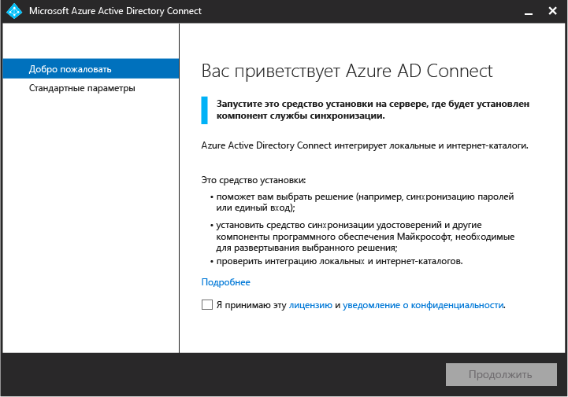
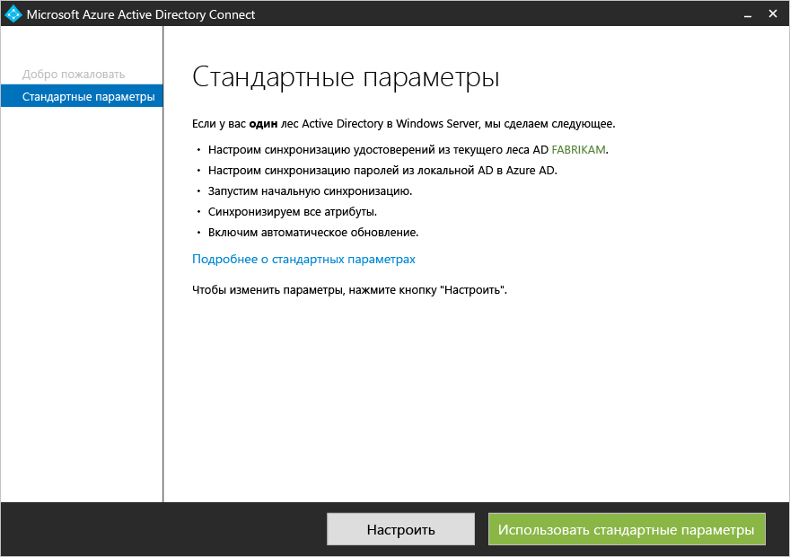
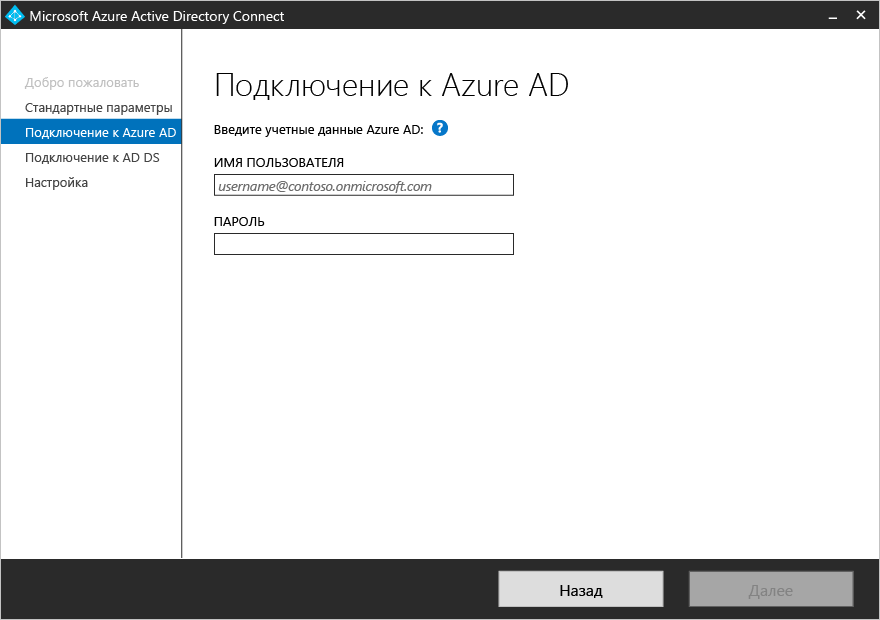
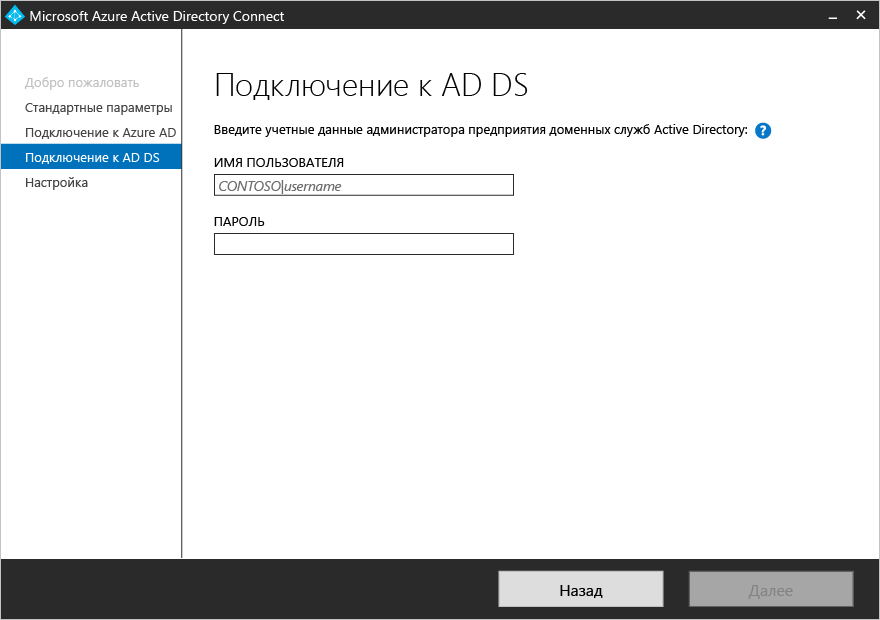
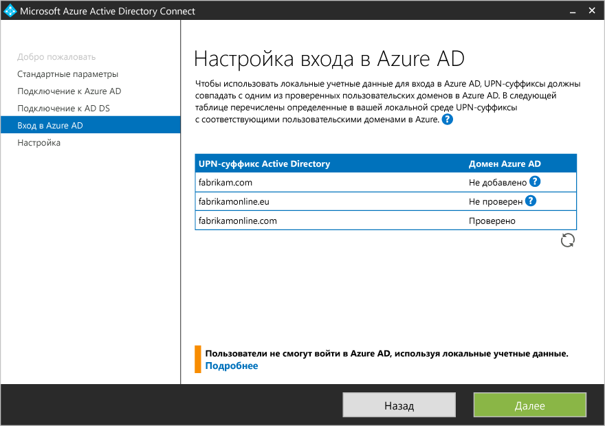
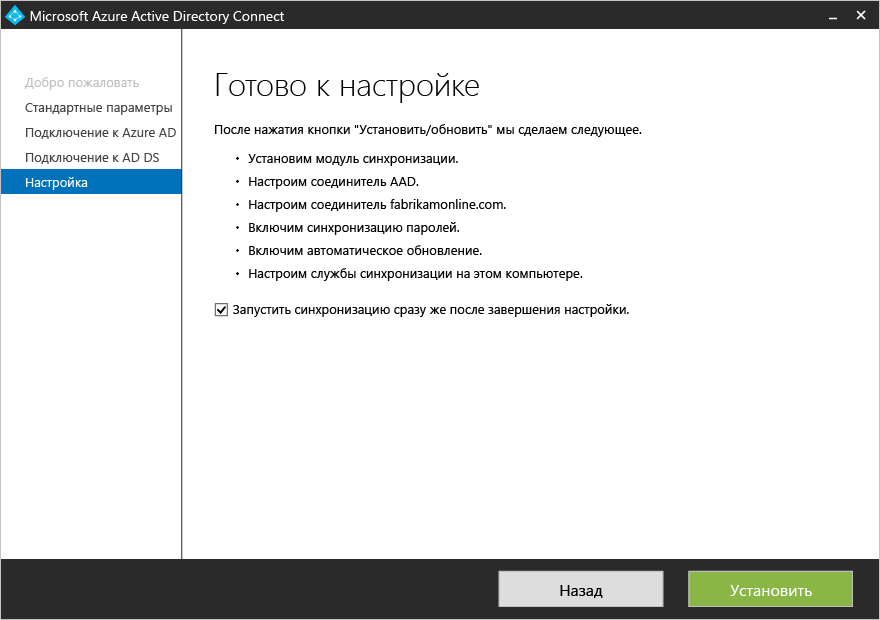

<properties
	pageTitle="Azure AD Connect: начало работы с использованием стандартных параметров | Microsoft Azure"
	description="Узнайте, как скачать, установить и запустить мастер установки Azure AD Connect."
	services="active-directory"
	documentationCenter=""
	authors="billmath"
	manager="stevenpo"
	editor="curtand"/>

<tags
	ms.service="active-directory"
	ms.workload="identity"
	ms.tgt_pltfrm="na"
	ms.devlang="na"
	ms.topic="get-started-article"
	ms.date="05/10/2016"
	ms.author="billmath;andkjell"/>

# Приступая к работе с Azure AD Connect с использованием стандартных параметров
Эта статья поможет вам начать работу с Azure Active Directory Connect. В этом документе рассматривается экспресс-установка Azure AD Connect. Стандартные параметры применяются в топологии с одним лесом с синхронизацией паролей. Выполнив всего несколько простых действий, можно расширить локальный каталог в облако.

## Дополнительная документация
Если вы еще не ознакомились с документацией по [интеграции локальных удостоверений с Azure Active Directory](active-directory-aadconnect.md), в следующей таблице приведены ссылки на соответствующие разделы. Указания двух первых разделов, выделенных полужирным шрифтом, необходимо выполнить перед началом установки.

| Раздел | |
| --------- | --------- |
| **Загрузка Azure AD Connect** | [Загрузка Azure AD Connect](http://go.microsoft.com/fwlink/?LinkId=615771) |
| **Оборудование и необходимые компоненты** | [Azure AD Connect: оборудование и необходимые компоненты](active-directory-aadconnect-prerequisites.md) |
| Установка с помощью настроенных параметров | [Выборочная установка Azure AD Connect](active-directory-aadconnect-get-started-custom.md) |
| Обновление из DirSync | [Обновление из средства синхронизации Azure AD (DirSync)](active-directory-aadconnect-dirsync-upgrade-get-started.md) |
| Действия после установки | [Проверка установки и назначение лицензий](active-directory-aadconnect-whats-next.md) |
| Учетные записи, используемые для установки | [Дополнительная информация об учетных записях и разрешениях Azure AD Connect](active-directory-aadconnect-accounts-permissions.md) |

## Экспресс-установка Azure AD Connect
**Стандартные параметры** — это наиболее распространенный и предлагаемый по умолчанию сценарий развертывания. При использовании стандартных параметров Azure AD Connect развертывает службу синхронизации в топологии с одним лесом. [Синхронизация паролей](active-directory-aadconnectsync-implement-password-synchronization.md) включена, поэтому пользователи могут входить в облако с помощью локального пароля. [Автоматическое обновление](active-directory-aadconnect-feature-automatic-upgrade.md) включено, что облегчает обслуживание. При использовании стандартных параметров по завершении установки запускается автоматическая синхронизация (хотя этот действие можно отключить).

### Установка Azure AD Connect с использованием стандартных параметров

1. Войдите с правами локального администратора на сервер, на котором требуется установить Azure AD Connect. Это должен быть сервер, который нужно сделать сервером синхронизации.
2. Перейдите к файлу **AzureADConnect.msi** и дважды щелкните его.
3. На экране приветствия установите флажок, подтверждающий ваше согласие с условиями лицензионного соглашения, и нажмите кнопку **Продолжить**. 
4. На экране «Стандартные параметры» щелкните **Использовать стандартные параметры**. 
5. На экране "Подключение к Azure AD" введите имя пользователя и пароль глобального администратора Azure AD. Нажмите кнопку **Далее**.  Если вы получаете сообщение об ошибке и испытываете проблемы с подключением, см. статью [Устранение неполадок подключения в Azure AD Connect](active-directory-aadconnect-troubleshoot-connectivity.md).
6. На экране "Подключение к AD DS" введите имя пользователя и пароль учетной записи администратора предприятия. Вы можете ввести часть домена в формате NetBios или полное доменное имя, т. е. FABRIKAM\\administrator или fabrikam.com\\administrator. Нажмите кнопку **Далее**. 
7. Если в вашем локальном каталоге Active Directory есть недобавленные или непроверенные домены с именем в формате UPN, появится эта страница. Если в локальном каталоге AD DS все домены с именем в формате UPN проверены, эта страница не появится.  Если появилась эта страница, просмотрите каждый домен с пометкой **Не добавлено** или **Не проверено**. Убедитесь, что используемые домены проверены в Azure AD. Проверив домены, щелкните значок обновления. Дополнительные сведения см. в статье [Добавление имени личного домена в Azure Active Directory](active-directory-add-domain.md).
8. На экране "Все готово к настройке" нажмите кнопку **Установить**.
	- При необходимости на странице "Готово к настройке" можно снять флажок **Запустить синхронизацию сразу после завершения настройки**. Снимите этот флажок, если собираетесь выполнить дополнительную настройку, например настроить [фильтрацию](active-directory-aadconnectsync-configure-filtering.md). Если отменить выбор этого параметра, мастер настроит синхронизацию, но оставит планировщик отключенным. Он не запустится, пока вы не включите его вручную, повторно запустив мастер установки.
	- Кроме того, при необходимости можно настроить службы синхронизации для **гибридного развертывания Exchange**. Для этого нужно установить соответствующий флажок. Этот флажок нужно установить, если почтовые ящики Exchange будут одновременно использоваться в облаке и локальной среде. 
9. После завершения установки щелкните **Выход**.
10. После завершения установки выполните выход и снова войдите, прежде чем начинать использовать диспетчер службы синхронизации или редактор правил синхронизации.

Рекомендуем посмотреть видео по экспресс-установке:

>[AZURE.VIDEO azure-active-directory-connect-express-settings]

## Дальнейшие действия
После установки Azure AD Connect можно [проверить установку и назначить лицензии](active-directory-aadconnect-whats-next.md).

Узнайте больше об [интеграции локальных удостоверений с Azure Active Directory](active-directory-aadconnect.md).

<!---HONumber=AcomDC_0518_2016-->