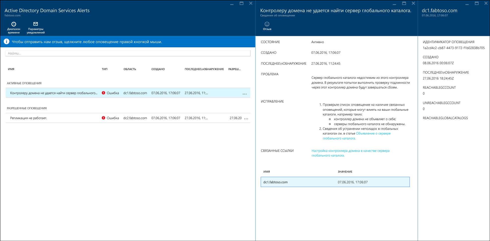
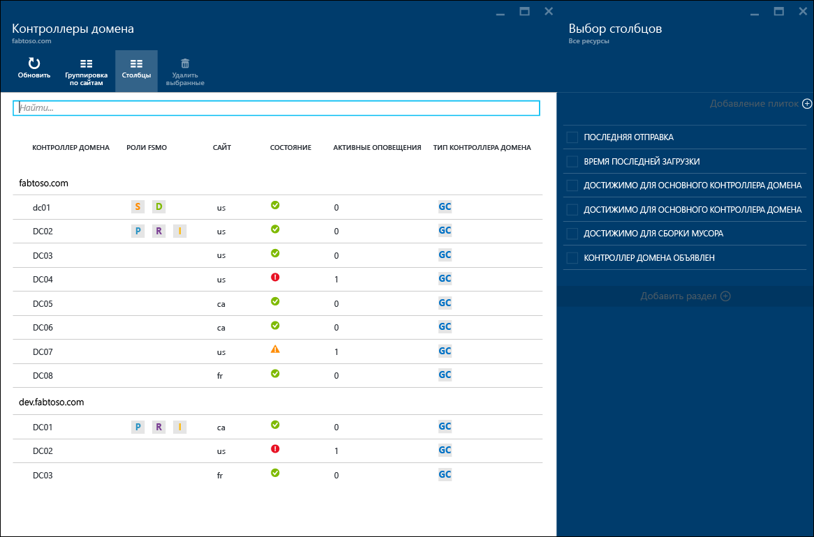
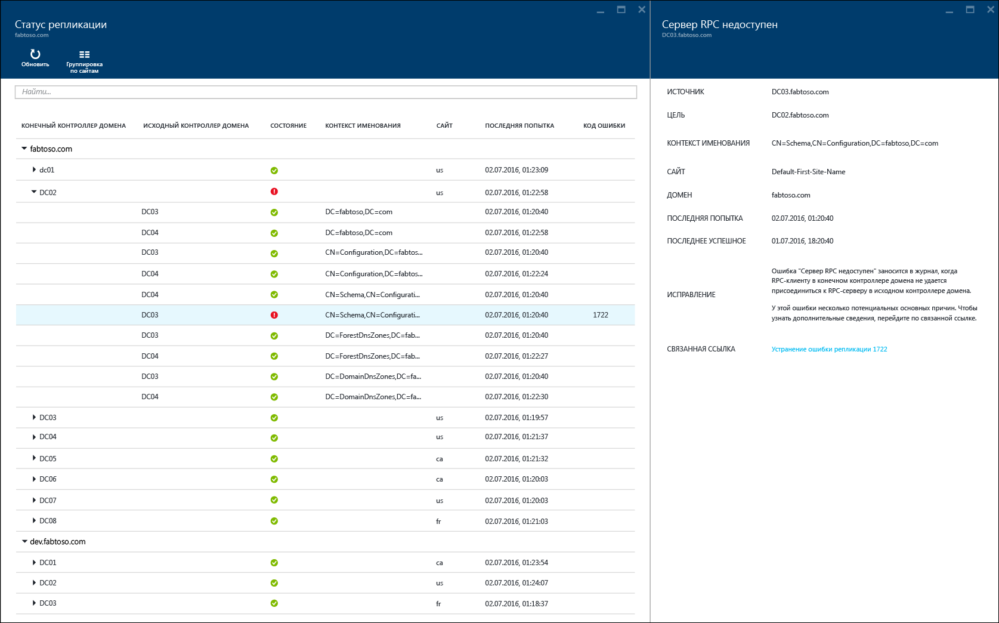
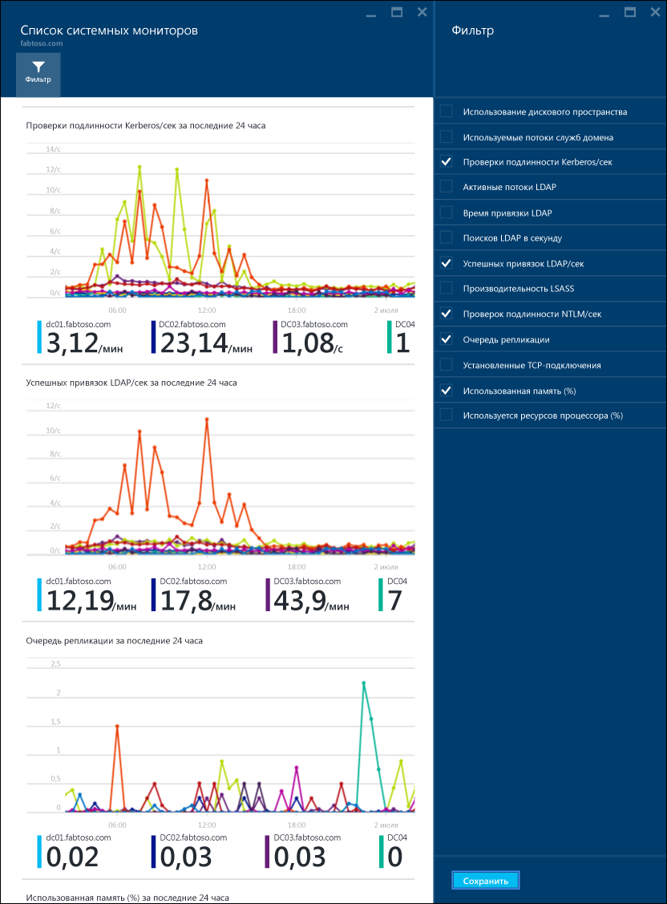

---
title: Использование Azure AD Connect Health с AD DS | Microsoft Docs
description: На этой странице Azure AD Connect Health описывается мониторинг AD DS.
services: active-directory
documentationcenter: ''
author: arluca
manager: samueld
editor: curtand

ms.service: active-directory
ms.workload: identity
ms.tgt_pltfrm: na
ms.devlang: na
ms.topic: get-started-article
ms.date: 09/30/2016
ms.author: arluca

---
# Использование Azure AD Connect Health с AD DS
Приведенная ниже документация относится к мониторингу доменных служб Active Directory с помощью Azure AD Connect Health. Поддерживаемые версии AD DS: Windows Server 2008 R2, Windows Server 2012 и Windows Server 2012 R2.

Дополнительные сведения о мониторинге AD FS с помощью Azure AD Connect Health см. в статье [Использование Azure AD Connect Health с AD FS](active-directory-aadconnect-health-adfs.md). Сведения о мониторинге синхронизации Azure AD Connect с помощью Azure AD Connect Health см. в статье [Использование Azure AD Connect Health для синхронизации](active-directory-aadconnect-health-sync.md).

## Предупреждения Azure AD Connect Health для AD DS
Раздел "Оповещения" в Azure AD Connect Health для AD DS содержит список активных и разрешенных оповещений, связанных с контроллерами домена. Если выбрать активное или разрешенное оповещение, откроется колонка с дополнительной информацией, описанием действий по устранению проблемы и ссылками на справочную документацию. Каждый тип предупреждения может иметь один или несколько экземпляров, которые соответствуют каждому контроллеру домена, связанного с конкретным предупреждением. В нижней части колонки оповещений можно дважды щелкнуть контроллер домена. Откроется новая колонка с дополнительными сведениями о конкретном экземпляре оповещения.

В этой колонке можно включить получение уведомлений по электронной почте о возникновении оповещений и изменить диапазон времени в представлении. Расширив этот диапазон, вы сможете просматривать предыдущие оповещения, в связи с которыми были приняты необходимые меры.

## Панель мониторинга контроллеров домена
На этой панели мониторинга отображается топология среды, ключевые рабочие метрики и состояние работоспособности всех отслеживаемых контроллеров домена. Представленные метрики помогают быстро определить, какой контроллер домена следует проанализировать подробнее. По умолчанию отображается только подмножество столбцов. Чтобы просмотреть полный список доступных столбцов, дважды щелкните команду "Столбцы". Выберите интересующие вас столбцы, и панель мониторинга станет единым удобным представлением для просмотра работоспособности среды AD DS.

Контроллеры домена можно сгруппировать по домену или сайту. Это может понадобиться для понимания топологии среды. Если дважды щелкнуть заголовок колонки, панель мониторинга развернется, заняв всю доступную площадь экрана. Это удобно при отображении большого числа столбцов.

## Панель мониторинга состояния репликации
На этой панели мониторинга можно просмотреть состояние и топологию репликации отслеживаемых контроллеров домена. Здесь отображается состояние последней попытки репликации, а также справочная документация о каждой найденной ошибке. Если дважды щелкнуть значок контроллера домена с ошибкой, откроется новая колонка со следующей информацией: сведения об ошибке, рекомендуемые действия по устранению и ссылки на документацию по устранению неполадок.

## Мониторинг
Эта функция позволяет в графической форме отобразить тенденции разных счетчиков производительности, данные которых постоянно собираются со всех отслеживаемых контроллеров домена. Производительность контроллера домена можно легко сравнить с производительностью всех остальных отслеживаемых контроллеров домена в лесу. Кроме того, вы можете просматривать различные счетчики производительности параллельно. Эти данные могут пригодиться при устранении неполадок в среде.

По умолчанию выделены четыре счетчика производительности. Но вы можете включить другие. Для этого щелкните команду "Фильтр" и выберите нужные счетчики или отмените выбор ненужных. Если дважды щелкнуть график счетчика производительности, откроется новая колонка, содержащая точки данных каждого отслеживаемого контроллера домена.

## Связанные ссылки
* [Azure AD Connect Health](active-directory-aadconnect-health.md)
* [Установка агента Azure AD Connect Health](active-directory-aadconnect-health-agent-install.md)
* [Операции Azure AD Connect Health](active-directory-aadconnect-health-operations.md)
* [Использование Azure AD Connect Health с AD FS](active-directory-aadconnect-health-adfs.md)
* [Использование Azure AD Connect Health для синхронизации](active-directory-aadconnect-health-sync.md)
* [Часто задаваемые вопросы об Azure AD Connect Health](active-directory-aadconnect-health-faq.md)
* [Azure AD Connect Health: история версий](active-directory-aadconnect-health-version-history.md)

<!---HONumber=AcomDC_1005_2016-->