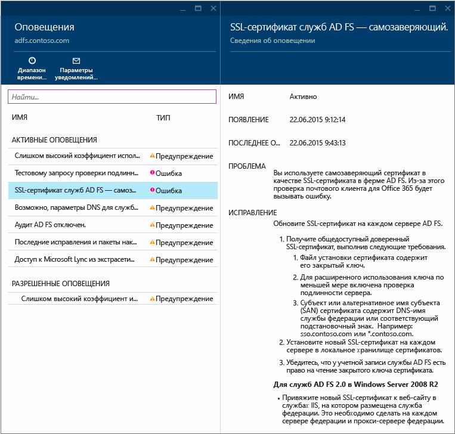
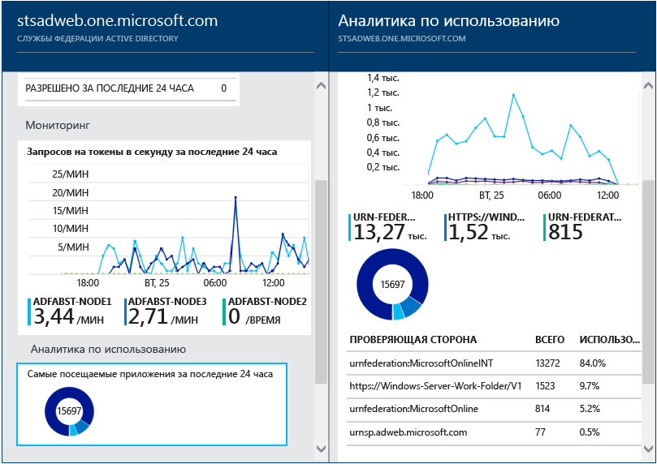
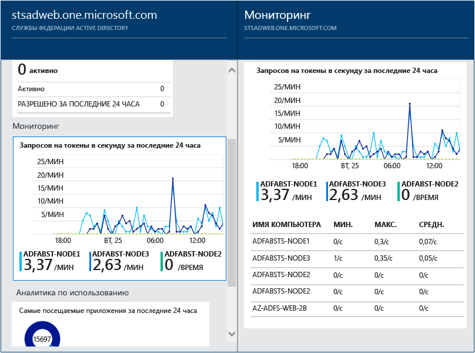
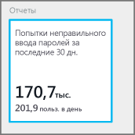

<properties
	pageTitle="Использование Azure AD Connect Health с AD FS | Microsoft Azure"
	description="В этой статье описывается, как Azure AD Connect Health отслеживает локальную инфраструктуру AD FS."
	services="active-directory"
	documentationCenter=""
	authors="karavar"
	manager="femila"
	editor="karavar"/>

<tags
	ms.service="active-directory"
	ms.workload="identity"
	ms.tgt_pltfrm="na"
	ms.devlang="na"
	ms.topic="get-started-article"
	ms.date="07/14/2016"
	ms.author="vakarand"/>

# Использование Azure AD Connect Health с AD FS
Приведенная ниже информация относится к мониторингу инфраструктуры AD FS с помощью Azure AD Connect Health. Сведения о мониторинге синхронизации Azure AD Connect с помощью Azure AD Connect Health см. в статье [Использование Azure AD Connect Health для синхронизации](active-directory-aadconnect-health-sync.md). Сведения о мониторинге доменных служб Active Directory с помощью Azure AD Connect Health см. в статье [Using Azure AD Connect Health with AD DS](active-directory-aadconnect-health-adds.md) (Использование Azure AD Connect Health с AD DS).

## Оповещения AD FS
В разделе оповещений Azure AD Connect Health предоставляется список активных оповещений. Каждое оповещение содержит соответствующую информацию, действия по устранению и ссылки на связанную документацию. Если выбрать активное или разрешенное оповещение, появится новая колонка с дополнительной информацией, действиями, которые можно предпринять для устранения причин оповещения, и ссылками на дополнительную документацию. Можно также просмотреть данные журнала об оповещениях, которые были разрешены в прошлом.

Если выбрать оповещение, отобразится дополнительная информация, действия, которые можно предпринять для устранения причин оповещения, и ссылки на дополнительную документацию.

## Аналитика использования для AD FS
Аналитика по использованию Azure AD Connect Health позволяет анализировать трафик аутентификации серверов федерации. Если выбрать поле аналитики по использованию, откроется колонка аналитики по использованию, на которой показаны метрики и группирования.

>[AZURE.NOTE] Чтобы применять аналитику по использованию для AD FS, необходимо убедиться, что включен аудит AD FS. Дополнительные сведения см. в статье [Включение аудита для AD FS](active-directory-aadconnect-health-agent-install.md#enable-auditing-for-ad-fs).

Чтобы выбрать дополнительные метрики, укажите диапазон времени или измените способ группировки, просто щелкнув правой кнопкой мыши диаграмму аналитики по использованию и выбрав «Изменить диаграмму». Затем можно будет указать диапазон времени, изменить или выбрать метрики и изменить группирование. Вы можете просмотреть распределение трафика аутентификации по различным метрикам и группировать каждую метрику с помощью соответствующего параметра «Сгруппировать по», описанного ниже.

| Метрика | Сгруппировать по | Что означает группирование и почему это удобно? |
| ------ | -------- | -------------------------------------------- |
| «Всего запросов»: общее число запросов, обрабатываемых службой федерации. | Все | Отображает общее количество запросов без группировки. |
| | Приложение | Этот параметр группирует общее количество запросов по целевой проверяющей стороне. Такой способ группировки удобен, чтобы понять, сколько процентов от общего трафика получает каждое приложение. |
| | сервер; | Этот параметр группирует общее количество запросов по серверу, обработавшему запрос. Такой способ группировки позволяет понять, как распределяется нагрузка всего трафика. |
| | Присоединение к рабочей области | Этот параметр группирует общее количество запросов по следующему признаку: поступают ли запросы от устройств, присоединенных к рабочей области (т. е. известных устройств). Такой способ группировки позволяет определить, если доступ к вашим ресурсам осуществляется с помощью устройств, которые неизвестны в инфраструктуре удостоверений. |
| | Authentication Method | Этот параметр группирует общее количество запросов по выбранному методу аутентификации. Такой способ группировки позволяет понять, какой метод аутентификации используется чаще всего. Ниже приведены возможные методы проверки подлинности: <ol> <li>встроенная проверка подлинности Windows (Windows);</li> <li>проверка подлинности на основе форм (формы);</li> <li>единый вход;</li> <li>проверка подлинности на основе сертификата X509 (сертификат).</li>  Обратите внимание, что запрос считается единым входом, если серверы федерации получают запрос с файлом cookie для единого входа. В таких случаях, если файл cookie является допустимым, пользователю не предлагается ввести учетные данные, что обеспечивает прозрачный доступ к приложению. Обычно это используется при наличии нескольких проверяющих сторон, защищенных серверами федерации. |
| | Сетевое расположение | Этот параметр группирует общее количество запросов по сетевому расположению пользователя. Он может быть в интрасети или экстрасети. Такой способ группировки позволяет узнать, какой процент трафика поступает из экстрасети по сравнению с интрасетью. |
| «Общее число невыполненных запросов»: общее количество невыполненных запросов, обработанных службой федерации.   (Эта метрика доступна только в AD FS для Windows Server 2012 R2).| Тип ошибки | Отображает число ошибок для каждого стандартного типа. Этот способ группировки позволяет понять, ошибки каких типов наиболее распространены. <ul><li>«Неправильное имя или пароль»: ошибки из-за неправильного имени пользователя или пароля.</li> <li>«Блокировка экстрасети» — сбои из-за запросов, полученных от пользователя, для которого был заблокирован доступ из экстрасети.</li><li> «Истек срок действия пароля» — сбои из-за пользователей, входящих в систему с помощью пароля с истекшим сроком действия.</li><li> «Отключена учетная запись» — сбои из-за пользователей, входящих с отключенной учетной записью.</li><li> «Проверка подлинности устройства» — сбои из-за пользователей, не прошедших проверку подлинности устройства.</li><li> «Проверка подлинности пользователя на основе сертификата» — сбои из-за пользователей, не прошедших проверку подлинности из-за недопустимого сертификата.</li><li> «Многофакторная проверка подлинности» — сбои из-за пользователей, не прошедших проверку подлинности с помощью многофакторной проверки подлинности.</li><li> «Другие учетные данные: авторизации выдачи» — сбои из-за ошибок авторизации.</li><li> «Делегирование выдачи» — сбои из-за ошибок делегирования выдачи.</li><li> «Прием токена» — сбои из-за того, что AD FS отклоняет токен от стороннего поставщика удостоверений.</li><li> «Протокол» — сбой из-за ошибок протокола.</li><li> «Неизвестно» — все сбои. Другие типы ошибок, не относящиеся к определенным категориям.</li> |
| | сервер; | Группирует ошибки на основании сервера. Это позволяет понять, как ошибки распределяются между серверами. Неравномерное распределение может быть признаком того, что сервер находится в неисправном состоянии. |
| | Сетевое расположение | Группирует ошибки по сетевому расположению запросов (интрасеть и экстрасеть). Это позволяет понять, какого типа запросы завершаются неудачей. |
| | Приложение | Группирует сбои по целевому приложению (проверяющей стороне). Это позволяет понять, какое целевое приложение вызывает большинство ошибок. |
| «Количество пользователей»: среднее число активных уникальных пользователей в системе. | Все | Обеспечивает подсчет среднего числа пользователей, использующих службу федерации на выбранном интервале времени. Пользователи не группируются.  Среднее значение будет зависеть от выбранного интервала времени. |
| | Приложение | Группирует среднее число пользователей по целевому приложению (проверяющей стороне). Это позволяет понять, сколько пользователей использует каждое приложение. |

## Мониторинг производительности AD FS
Мониторинг производительности Azure Active Directory Connect Health предоставляет данные мониторинга метрик. Если выбрать поле «Мониторинг», откроется колонка с подробной информацией о метриках.

Если выбрать параметр «Фильтр» в верхней части колонки, можно отфильтровать информацию по серверу, чтобы просмотреть метрики отдельного сервера. Чтобы изменить метрики, просто щелкните правой кнопкой мыши диаграмму мониторинга под колонкой мониторинга и выберите «Изменить диаграмму». После этого в новой открывшейся колонке можно будет из раскрывающегося списка выбрать дополнительные метрики и указать диапазон времени для просмотра данных производительности.

## Отчеты AD FS
Azure AD Connect Health предоставляет отчеты об активности и производительности AD FS. Эти отчеты помогают администраторам анализировать активность на серверах AD FS.

### 50 пользователей, выполнившие наибольшее количество неудачных попыток входа с указанием неправильного имени пользователя или пароля

Одна из распространенных причин неудачных запросов на проверку подлинности на сервере AD FS заключается в использовании неправильных учетных данных (имени пользователя или пароля). Обычно это происходит из-за сложных или забытых паролей, а также опечаток.

Но существуют и другие причины, которые могут привести к тому, что серверы AD FS начинают обрабатывать неожиданные объемы подобных запросов. К ним относятся работа приложений, которые кэшируют учетные данные пользователя, в то время как срок их действия истек, или злонамеренные действия пользователя, который пытается войти в чужую учетную запись, используя набор хорошо известных паролей.

Azure AD Connect Health для AD FS предоставляет отчет о 50 пользователях, выполнивших наибольшее количество неудачных попыток входа с указанием неправильного имени пользователя или пароля. Отчеты составляются на основе обработки событий аудита, генерируемых всеми серверами AD FS в фермах.

Такие отчеты предоставляют удобный доступ к следующим сведениям:

- Общее количество неудачных запросов с указанием неправильного имени пользователя или пароля за последние 30 дней.
- Среднее ежедневное количество пользователей, которым не удалось выполнить вход из-за ввода неправильного имени пользователя и пароля.

Щелкнув эту область, можно перейти к колонке основного отчета, содержащей дополнительные сведения. Здесь представлен график с актуальной информацией, которая позволяет получить общее представление о запросах с указанием неправильного имени пользователя или пароля, а также список 50 пользователей, выполнивших наибольшее количество неудачных попыток входа.

На графике представлены указанные ниже данные.

- Общее ежедневное количество неудачных попыток входа с указанием неправильного имени пользователя и пароля.
- Общее ежедневное количество уникальных пользователей, выполнивших неудачные попытки входа.

Отчет содержит указанные ниже сведения.

| Элемент отчета | Описание
| ------ | -------- |
|Идентификатор пользователя.| Здесь отображается использовавшийся идентификатор пользователя. Обратите внимание, что это значение, введенное пользователем; в некоторых случаях также отображаются сведения об использовании неправильного идентификатора пользователя.|
|Неудачные попытки|Здесь отображается общее количество неудачных попыток входа для определенного идентификатора пользователя. Данные таблицы отсортированы по количеству неудачных попыток в порядке убывания.|
|Последняя неудачная попытка|В этом поле содержится метка времени для последней неудачной попытки.

>[AZURE.NOTE] Каждые 2 часа в этот отчет автоматически добавляются новые данные, собранные за этот период времени. Следовательно, сведения о входе в систему в рамках последнего 2-часового интервала могут отсутствовать в отчете.

## Связанные ссылки

* [Azure AD Connect Health](active-directory-aadconnect-health.md)
* [Установка агента Azure AD Connect Health](active-directory-aadconnect-health-agent-install.md)
* [Операции Azure AD Connect Health](active-directory-aadconnect-health-operations.md)
* [Использование Azure AD Connect Health для синхронизации](active-directory-aadconnect-health-sync.md)
* [Using Azure AD Connect Health with AD DS (Использование Azure AD Connect Health с AD DS)](active-directory-aadconnect-health-adds.md)
* [Часто задаваемые вопросы об Azure AD Connect Health](active-directory-aadconnect-health-faq.md)
* [Azure AD Connect Health: история версий](active-directory-aadconnect-health-version-history.md)

<!---HONumber=AcomDC_0928_2016-->