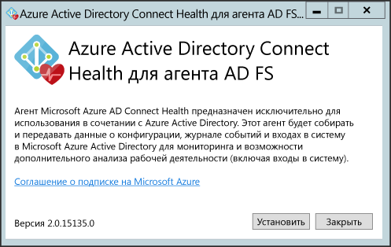
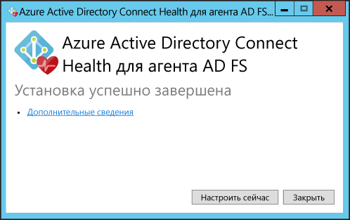
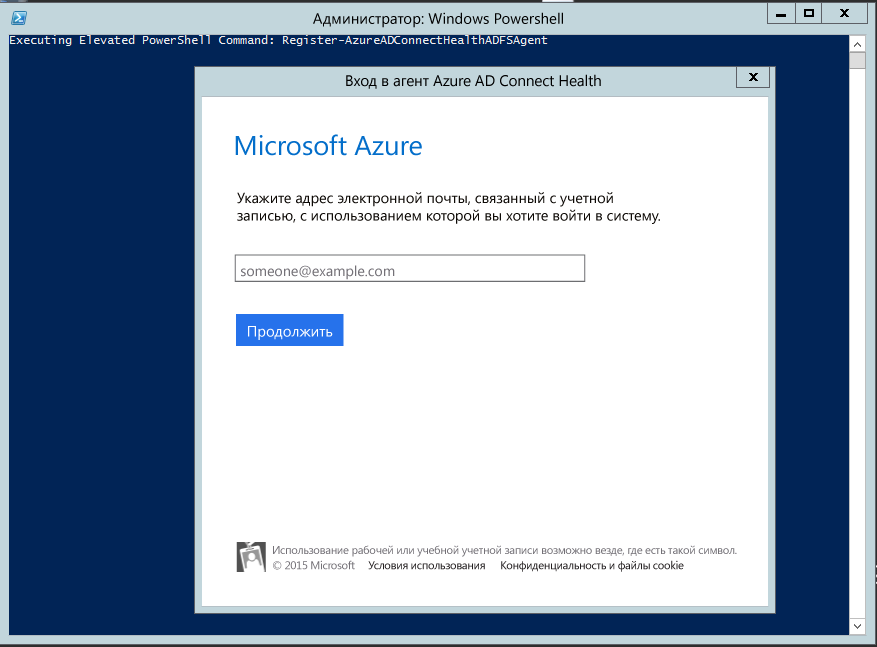
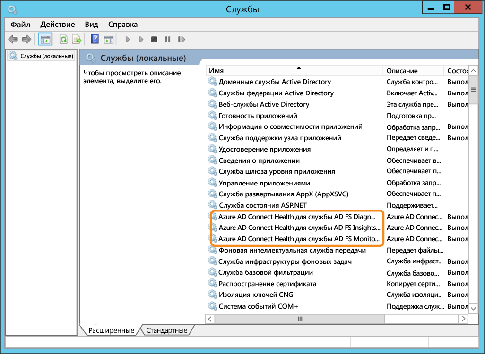
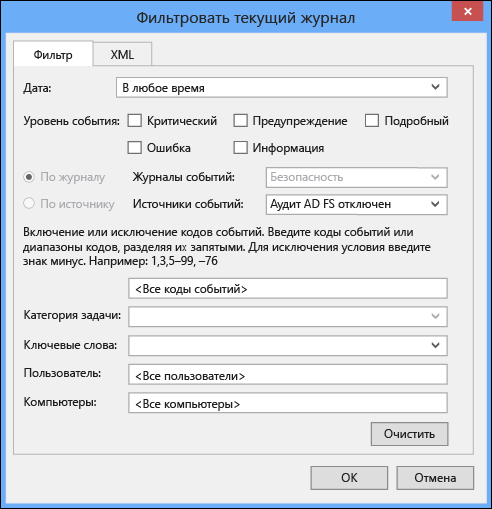
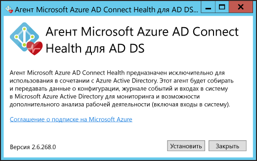
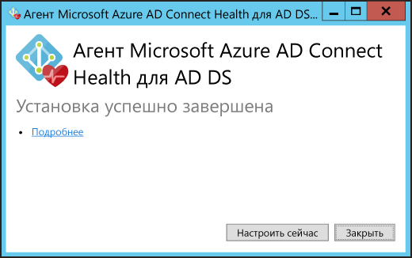
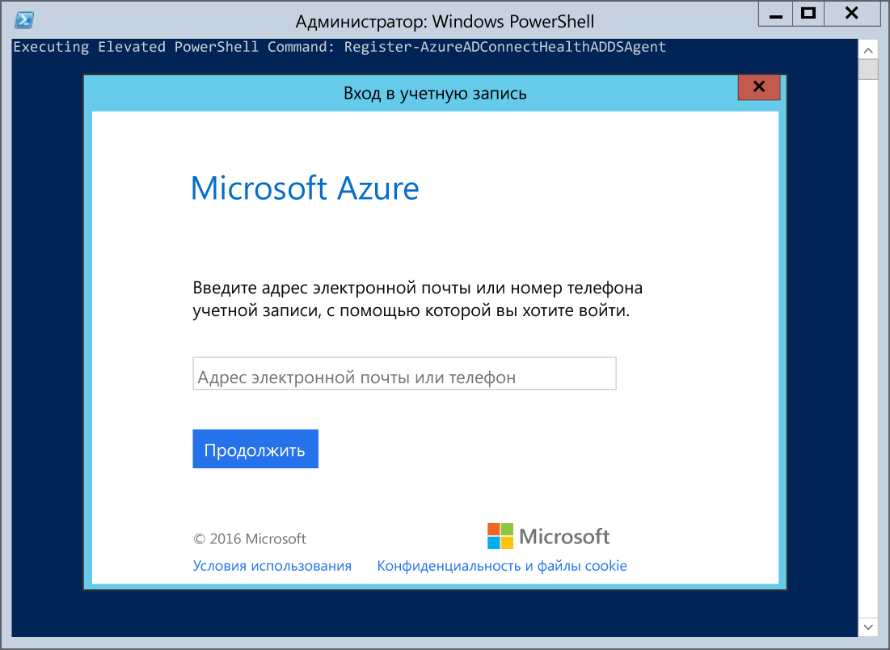
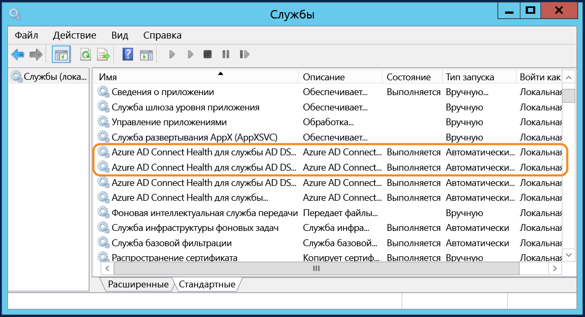

<properties
	pageTitle="Установка агента Azure AD Connect Health | Microsoft Azure"
	description="Это страница Azure AD Connect Health, на которой описана процедура установки агента для AD FS и синхронизации."
	services="active-directory"
	documentationCenter=""
	authors="karavar"
	manager="femila"
	editor="karavar"/>

<tags
	ms.service="active-directory"
	ms.workload="identity"
	ms.tgt_pltfrm="na"
	ms.devlang="na"
	ms.topic="get-started-article"
	ms.date="08/05/2016"
	ms.author="vakarand"/>

# Установка агента Azure AD Connect Health

В этом документе описываются этапы установки и настройки агентов Azure AD Connect Health. Загрузить агенты можно [отсюда](active-directory-aadconnect-health.md#download-and-install-azure-ad-connect-health-agent):

## 	Требования
В таблице ниже приведен список предварительных требований для использования Azure AD Connect Health.

| Требование | Описание|
| ----------- | ---------- |
|Azure AD Premium| Служба Azure AD Connect Health относится к Azure AD Premium и требует наличия выпуска Azure AD Premium.   Дополнительные сведения см. в статье [Приступая к работе с Azure Active Directory Premium](active-directory-get-started-premium.md). Информацию о получении бесплатной 30-дневной пробной версии см. на [соответствующей странице](https://azure.microsoft.com/trial/get-started-active-directory/).|
|Для начала работы с Azure AD Connect Health требуются права глобального администратора Azure AD|По умолчанию только глобальный администратор может установить и настроить агенты работоспособности, чтобы приступить к работе, получить доступ к порталу и начать выполнять любые операции в Azure AD Connect Health. Дополнительную информацию см. в статье [Управление каталогом Azure AD](active-directory-administer.md).    С помощью управления доступом на основе ролей можно разрешить доступ к Azure AD Connect Health другим пользователям в организации. Дополнительные сведения см. в разделе [Управление доступом с помощью контроля доступа на основе ролей](active-directory-aadconnect-health-operations.md#manage-access-with-role-based-access-control).   **Важно.** Учетная запись, используемая во время установки агентов, должна быть учебной или рабочей учетной записью, но не учетной записью Майкрософт. Дополнительные сведения см. в статье [Подписка на Azure для организации](sign-up-organization.md).
|Агент Azure AD Connect Health следует установить на всех целевых серверах| Для предоставления данных, которые можно просматривать на портале, службе Azure AD Connect Health требуется наличие агента на целевых серверах.   Например, для получения данных о локальной инфраструктуре AD FS агент необходимо установить на серверы AD FS, прокси-серверы AD FS и прокси-серверы веб-приложений. Аналогично, для получения данных о локальной инфраструктуре AD DS агент необходимо установить на контроллеры домена.   **Важно.** Учетная запись, используемая во время установки агентов, должна быть учебной или рабочей учетной записью, но не учетной записью Майкрософт. Дополнительные сведения см. в статье [Подписка на Azure в качестве организации](sign-up-organization.md)|
|Исходящие подключения к конечным точкам службы Azure|Во время установки и выполнения агенту требуется подключение к конечным точкам службы Azure AD Connect Health, перечисленным ниже. При блокировке исходящего подключения убедитесь, что в список разрешенных добавлены следующие адреса:   <li>&#42;.blob.core.windows.net </li><li>&#42;.queue.core.windows.net</li><li>adhsprodwus.servicebus.windows.net — порт 5671</li><li>https://management.azure.com</li><li>https://s1.adhybridhealth.azure.com/</li><li>https://policykeyservice.dc.ad.msft.net/</li><li>https://login.windows.net</li><li>https://login.microsoftonline.com</li><li>https://secure.aadcdn.microsoftonline-p.com</li> |
|Порты брандмауэра на сервере с агентом.| Агент требует открытия следующих портов брандмауэра для обмена данными с конечными точками службы Azure AD Health.  <li>Порт TCP или UDP 443</li><li>Порт TCP или UDP 5671</li>
|Внесите следующие веб-сайты в список разрешенных, если включена политика усиленной безопасности IE|Если на сервере, на котором будет установлен агент, включена конфигурация усиленной безопасности Internet Explorer, потребуется открыть доступ для следующих веб-сайтов.  <li>https://login.microsoftonline.com</li><li>https://secure.aadcdn.microsoftonline-p.com</li><li>https://login.windows.net</li><li>Сервер федерации вашей организации должен быть доверенным для Azure Active Directory. Например, https://sts.contoso.com</li>

## Установка агента Azure AD Connect Health для AD FS
Дважды щелкните загруженный EXE-файл, чтобы начать установку агента. На первом экране щелкните «Установить».

После завершения установки нажмите кнопку «Настроить сейчас».

Это приведет к запуску командной строки и оболочки PowerShell, которая выполнит команду Register-AzureADConnectHealthADFSAgent. Вам будет предложено войти в Azure. Выполните вход.

После входа PowerShell продолжит выполнять команду. После завершения можно закрыть PowerShell. Настройка завершена.

На этом этапе службы должны запускаться автоматически, а агент будет выполнять мониторинг и сбор данных. Учтите, что если вы не выполнили всех необходимых предварительных требований, которые были описаны в предыдущих разделах, в окне PowerShell будут отображаться предупреждения. Обязательно выполните [эти](active-directory-aadconnect-health-agent-install.md#requirements) требования, прежде чем устанавливать агент. Пример этих ошибок можно увидеть на следующем снимке экрана.

Чтобы проверить, установлен ли агент, откройте службы и обратите внимание на следующее. Если вы выполнили настройку, эти службы должны работать. В противном случае они не запустятся, пока не будет выполнена настройка.

- Служба диагностики AD FS Azure AD Connect Health
- Служба AD FS получения ценной информации из данных о работоспособности Azure AD Connect
- Служба наблюдения AD FS Azure AD Connect Health

### Установка агента на серверах Windows Server 2008 R2

Для серверов Windows Server 2008 R2 сделайте следующее:

1. Убедитесь, что сервер работает с пакетом обновления 1 или более поздней версии.
1. Отключите IE ESC для установки агента.
1. Установите Windows PowerShell 4.0 на каждом из серверов перед установкой агента AD Health. Чтобы установить Windows PowerShell 4.0, выполните следующие действия.
 - Загрузите автономный установщик по ссылке и установите [Microsoft .NET Framework 4.5](https://www.microsoft.com/download/details.aspx?id=40779).
 - Установите интегрированную среду сценариев PowerShell (из компонентов Windows).
 - Установите [Windows Management Framework 4.0](https://www.microsoft.com/download/details.aspx?id=40855).
 - Установите на сервере Internet Explorer версии 10 или более поздней версии. Это необходимо службе работоспособности для аутентификации пользователя с учетными данными администратора Azure.
1. Дополнительную информацию об установке Windows PowerShell 4.0 на Windows Server 2008 R2 см. в вики-статье [здесь](http://social.technet.microsoft.com/wiki/contents/articles/20623.step-by-step-upgrading-the-powershell-version-4-on-2008-r2.aspx).

### Включение аудита для AD FS

Чтобы функция аналитики по использованию могла осуществлять сбор и анализ данных, агенту Azure AD Connect Health нужна информация из журналов аудита AD FS. По умолчанию эти журналы не включены. Это относится только к серверам федерации AD FS. Вам не нужно включать аудит на прокси-серверах AD FS или прокси-серверах веб-приложений. Используйте следующие процедуры для включения аудита AD FS и поиска журналов аудита AD FS.

#### Включение аудита для AD FS 2.0

1. Щелкните **Пуск**, наведите указатель мыши на пункт **Программы**, а затем — на **Администрирование** и выберите элемент **Локальная политика безопасности**.
2. Перейдите к папке **Параметры безопасности\\Локальные политики\\Управление правами пользователя**, а затем дважды щелкните «Создание аудитов безопасности».
3. Убедитесь, что на вкладке **Параметры локальной безопасности** в списке указана учетная запись службы AD FS 2.0. Если она отсутствует, нажмите кнопку **Добавить пользователя или группу**, добавьте учетную запись в список и нажмите кнопку **ОК**.
4. Откройте командную строку с повышенным уровнем привилегий и выполните следующую команду, чтобы включить аудит: <code>auditpol.exe /set /subcategory:"Создано приложением" /failure:enable /success:enable</code>
5. Закройте окно "Локальная политика безопасности" и откройте оснастку управления. Чтобы открыть оснастку управления, нажмите кнопку **Пуск**, наведите указатель мыши на пункт **Программы**, а затем — на **Администрирование** и выберите пункт "Управление AD FS 2.0".
6. На панели действий щелкните "Изменить свойства службы федерации".
7. В диалоговом окне **Свойства службы федерации** щелкните вкладку **События**.
8. Установите флажки **Успешные события аудита** и **Неудачные события аудита**.
9. Нажмите кнопку **ОК**.

#### Включение аудита для AD FS на Windows Server 2012 R2

1. Из раздела **Диспетчер сервера** на начальном экране или на панели задач откройте диалоговое окно **Локальная политика безопасности**. Затем выберите элемент **Сервис/Локальная политика безопасности**.
2. Перейдите к папке **Параметры безопасности\\Локальные политики\\Предоставление прав пользователям**, а затем дважды щелкните пункт **Создание аудитов безопасности**.
3. Убедитесь, что на вкладке **Параметры локальной безопасности** в списке указана учетная запись службы AD FS. Если она отсутствует, нажмите кнопку **Добавить пользователя или группу**, добавьте учетную запись в список и нажмите кнопку **ОК**.
4. Откройте командную строку с повышенным уровнем привилегий и выполните следующую команду, чтобы включить аудит: <code>auditpol.exe /set /subcategory:"Создано приложением" /failure:enable /success:enable.</code>
5. Закройте окно **Локальная политика безопасности**, а затем откройте оснастку **Управление AD FS** (в разделе "Диспетчер сервера" выберите меню "Инструменты" и щелкните элемент "Управление AD FS").
6. На панели действий выберите действие **Изменить свойства службы федерации**.
7. В диалоговом окне "Свойства службы федерации" откройте вкладку **События**.
8. Установите флажки **Успешные события аудита и Неудачные события аудита** и нажмите кнопку **OK**.

#### Поиск журналов аудита AD FS

1. Откройте **Средство просмотра событий**.
2. Перейдите к разделу "Журналы Windows" и выберите пункт **Безопасность**.
3. Справа щелкните **Фильтровать текущие журналы**.
4. В разделе «Источник события» выберите **Аудит AD FS**.

> [AZURE.WARNING] При наличии групповой политики, которая отключает аудит AD FS, агент Azure AD Connect Health не сможет собирать информацию. Убедитесь, что групповая политика, которая может отключить аудит, отсутствует.

[//]: # "Начало раздела конфигурации прокси-сервера агента"

## Установка агента Azure AD Connect Health для синхронизации
В последней сборке Azure AD Connect агент Azure AD Connect Health для синхронизации устанавливается автоматически. Чтобы использовать Azure AD Connect для синхронизации, загрузите и установите последнюю версию Azure AD Connect. Последнюю версию можно загрузить [здесь](http://www.microsoft.com/download/details.aspx?id=47594).

Чтобы проверить, установлен ли агент, откройте службы и обратите внимание на следующее. Если вы выполнили настройку, эти службы должны работать. В противном случае они не запустятся, пока не будет выполнена настройка.

- Служба Sync Insights Azure AD Connect Health
- Служба Sync Monitoring Azure AD Connect Health

> [AZURE.NOTE] Помните, что для использования службы Azure AD Connect Health требуется Azure AD Premium. Если Azure AD Premium отсутствует, вы не сможете завершить конфигурацию на портале Azure. Дополнительные сведения о требованиях см. [здесь](active-directory-aadconnect-health-agent-install.md#requirements).

## Регистрация агента Azure AD Connect Health для синхронизации вручную
Если после успешной установки Azure AD Connect произойдет сбой регистрации агента Azure AD Connect Health для синхронизации, можно использовать следующую команду PowerShell, чтобы зарегистрировать агент вручную.

>[AZURE.IMPORTANT] Использование этой команды PowerShell необходимо только в том случае, если после установки Azure AD Connect произошел сбой регистрации агента.

Приведенная ниже команда PowerShell требуется, ТОЛЬКО если регистрация агента работоспособности завершается сбоем даже после успешной установки и настройки Azure AD Connect. В таких случаях службы Azure AD Connect Health НЕ запустятся, пока агент не будет успешно зарегистрирован.

Агент Azure AD Connect Health для синхронизации можно зарегистрировать вручную с помощью следующей команды PowerShell:

`Register-AzureADConnectHealthSyncAgent -AttributeFiltering $false -StagingMode $false`

Команда принимает следующие параметры:

- AttributeFiltering. Значение $true (по умолчанию) используется, если служба Azure AD Connect не синхронизирует набор атрибутов по умолчанию и была настроена для использования отфильтрованного набора атрибутов. В противном случае используется значение $false.
- StagingMode. Значение $false (по умолчанию) используется, если сервер Azure AD Connect НЕ находится в промежуточном режиме, $true — если сервер настроен на пребывание в промежуточном режиме.

При появлении запроса на проверку подлинности следует использовать учетную запись глобального администратора (например, admin@domain.onmicrosoft.com), которая использовалась для настройки Azure AD Connect.

## Установка агента Azure AD Connect Health для AD DS
Дважды щелкните загруженный EXE-файл, чтобы начать установку агента. На первом экране щелкните «Установить».

После завершения установки нажмите кнопку «Настроить сейчас».

Это приведет к запуску командной строки и оболочки PowerShell, которая выполнит команду Register-AzureADConnectHealthADDSAgent. Вам будет предложено войти в Azure. Выполните вход.

После входа PowerShell продолжит выполнять команду. После завершения можно закрыть PowerShell. Настройка завершена.

На этом этапе службы должны запускаться автоматически, а агент будет выполнять мониторинг и сбор данных. Пример этих результатов можно увидеть на следующем снимке экрана. Учтите, что если вы не выполнили всех необходимых предварительных требований, которые были описаны в предыдущих разделах, в окне PowerShell будут отображаться предупреждения. Обязательно выполните [эти](active-directory-aadconnect-health-agent-install.md#requirements) требования, прежде чем устанавливать агент.

Чтобы проверить, установлен ли агент, откройте службы и найдите среди них следующие:

- служба AD DS для Azure AD Connect Health;
- служба наблюдения AD DS Azure AD Connect Health.

Эти две службы не запустятся, пока не будет выполнена настройка.

## Установка агента Azure AD Connect Health для AD DS на основные серверные компоненты 
После установки EXE-файла выполните регистрацию, используя следующую команду PowerShell:

`Register-AzureADConnectHealthADDSAgent -Credentials $cred

## Настройка агентов Azure AD Connect Health для использования HTTP-прокси
Вы можете настроить агенты Azure AD Connect Health на работу с HTTP-прокси.

>[AZURE.NOTE]
- Команда "Netsh WinHttp set ProxyServerAddress" не работает, потому что для создания веб-запросов агент применяет System.Net, а не службы Microsoft Windows HTTP.
- Настроенный адрес прокси-сервера HTTP будет использоваться для передачи зашифрованных сообщений HTTPS.
- Прокси-серверы с проверкой подлинности (с помощью HTTPBasic) не поддерживаются.

### Изменение конфигурации прокси-сервера агента работоспособности
Доступны следующие варианты настройки агента Azure AD Connect Health для использования HTTP-прокси.

>[AZURE.NOTE] Необходимо перезапустить все службы агента Azure AD Connect Health, чтобы обновить параметры прокси-сервера. Выполните следующую команду:  Restart-Service AdHealth*

#### Импорт имеющихся параметров прокси-сервера

##### Импорт из Internet Explorer
Вы можете импортировать параметры прокси-сервера HTTP из Internet Explorer и использовать их для агентов Azure AD Connect Health, выполнив следующую команду PowerShell на каждом сервере, где запущен агент работоспособности.

	Set-AzureAdConnectHealthProxySettings -ImportFromInternetSettings

##### Импорт из WinHTTP
Вы можете импортировать параметры прокси-сервера WinHTTP, выполнив следующую команду PowerShell на каждом сервере, где запущен агент работоспособности.

	Set-AzureAdConnectHealthProxySettings -ImportFromWinHttp

#### Задание адресов прокси-сервера вручную
Вы можете вручную задать адреса прокси-сервера, выполнив следующую команду PowerShell на каждом сервере, где запущен агент работоспособности.

	Set-AzureAdConnectHealthProxySettings -HttpsProxyAddress address:port

Пример: *Set-AzureAdConnectHealthProxySettings -HttpsProxyAddress myproxyserver:443*

- Значение "address" может быть именем сервера, разрешимым в DNS, или адресом IPv4.
- Значение "port" можно опустить. Если это значение не указано, в качестве порта по умолчанию используется 443.

#### Очистка существующей конфигурации прокси-сервера
Существующую конфигурацию прокси-сервера можно очистить, выполнив следующую команду.

	Set-AzureAdConnectHealthProxySettings -NoProxy

### Считывание текущих параметров прокси-сервера
Вы можете считать текущие параметры прокси-сервера с помощью следующей команды.

	Get-AzureAdConnectHealthProxySettings

## Проверка подключения к службе Azure AD Connect Health
Существуют проблемы, при которых агент Azure AD Connect Health может потерять соединение со службой Azure AD Connect Health. К ним относятся проблемы с сетью, с правами доступа и другие причины.

Если агент не может отправить данные службе Azure AD Connect Health более 2 часов, появится предупреждение "Данные службы работоспособности не обновлены". Теперь, если это вдруг произойдет, вы сможете проверить, могут ли агенты Azure AD Connect Health отправлять данные в службу Azure AD Connect Health, выполнив следующую команду PowerShell с компьютера, с агентом которого возникают проблемы.

    Test-AzureADConnectHealthConnectivity -Role Adfs

Параметр role в настоящее время принимает следующие значения:

- Adfs
- Sync
- ADDS

Для просмотра подробных журналов можно использовать флаг -ShowResults в команде. Используйте следующий пример:

    Test-AzureADConnectHealthConnectivity -Role Sync -ShowResult

>[AZURE.NOTE]Чтобы использовать средство подключения, необходимо сначала завершить регистрацию агента. Если зарегистрировать агент не получается, убедитесь, что соблюдены все [требования](active-directory-aadconnect-health-agent-install.md#requirements) для Azure AD Connect Health. Эта проверка подключения выполняется по умолчанию во время регистрации агента.

## Связанные ссылки

* [Azure AD Connect Health](active-directory-aadconnect-health.md)
* [Операции Azure AD Connect Health](active-directory-aadconnect-health-operations.md)
* [Использование Azure AD Connect Health с AD FS](active-directory-aadconnect-health-adfs.md)
* [Использование Azure AD Connect Health для синхронизации](active-directory-aadconnect-health-sync.md)
* [Using Azure AD Connect Health with AD DS (Использование Azure AD Connect Health с AD DS)](active-directory-aadconnect-health-adds.md)
* [Часто задаваемые вопросы об Azure AD Connect Health](active-directory-aadconnect-health-faq.md)
* [Azure AD Connect Health: история версий](active-directory-aadconnect-health-version-history.md)

<!---HONumber=AcomDC_0928_2016-->