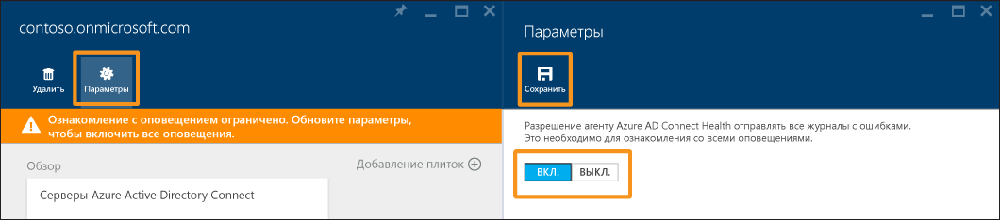

<properties
	pageTitle="Использование Azure AD Connect Health для синхронизации | Microsoft Azure"
	description="На этой странице Azure AD Connect Health описывается отслеживание синхронизации Azure AD Connect."
	services="active-directory"
	documentationCenter=""
	authors="billmath"
	manager="femila"
	editor="curtand"/>

<tags
	ms.service="active-directory"
	ms.workload="identity"
	ms.tgt_pltfrm="na"
	ms.devlang="na"
	ms.topic="get-started-article"
	ms.date="08/08/2016"
	ms.author="billmath"/>

# Использование Azure AD Connect Health для синхронизации
Приведенная ниже документация относится к мониторингу синхронизации Azure AD Connect с помощью Azure AD Connect Health. Сведения о мониторинге AD FS с помощью Azure AD Connect Health см. в статье [Использование Azure AD Connect Health с AD FS](active-directory-aadconnect-health-adfs.md). Сведения о мониторинге доменных служб Active Directory с помощью Azure AD Connect Health см. в статье [Using Azure AD Connect Health with AD DS](active-directory-aadconnect-health-adds.md) (Использование Azure AD Connect Health с AD DS).

## Оповещения Azure AD Connect Health для синхронизации
Раздел оповещений Azure AD Connect Health для синхронизации содержит список активных оповещений. Каждое оповещение содержит соответствующую информацию, действия по устранению и ссылки на связанную документацию. Если выбрать активное или разрешенное оповещение, появится новая колонка с дополнительной информацией, действиями, которые можно предпринять для устранения причин оповещения, и ссылками на дополнительную документацию. Можно также просмотреть данные журнала об оповещениях, которые были разрешены в прошлом.

Если выбрать оповещение, отобразится дополнительная информация, действия, которые можно предпринять для устранения причин оповещения, и ссылки на дополнительную документацию.

### Ограниченное ознакомление с оповещениями
Если Azure AD Connect не использует конфигурацию по умолчанию (например, для фильтрации атрибутов выбрана пользовательская конфигурация), агент Azure AD Connect Health не будет передавать события ошибок, связанные с Azure AD Connect.

Это не позволяет службе в полной мере изучать оповещения. На портале Azure в разделе службы появится соответствующее сообщение.

Чтобы исправить это, в меню "Параметры" разрешите агенту Azure AD Connect Health передавать все журналы ошибок.

## Sync Insight
В последнем выпуске службы Azure AD Connect Health для синхронизации добавлены следующие новые возможности:

- задержка операций синхронизации;
- тренд, отображающий изменения объектов.

### Задержка синхронизации
Этот компонент отвечает за графическое отображение тренда задержек операций синхронизации (импорт, экспорт и т. д.) для соединителей. Он позволяет не только быстро оценить задержки операций (например, при наличии большого количества происходящих изменений), но также определить аномальные задержки, требующие дополнительного изучения.

По умолчанию для соединителя Azure AD отображаются только задержки операции экспорта. Чтобы просмотреть дополнительные операции в этом соединителе или операции в других соединителях, щелкните правой кнопкой мыши на схеме и выберите интересующие вас операцию и соединитель.

### Изменения объектов синхронизации
Этот компонент отвечает за графическое отображение тренда количества изменений, которые вычисляются и экспортируются в Azure AD. Сейчас сбор такой информации из журналов синхронизации затруднен. Схема — это не только простое средство мониторинга количества изменений, происходящих в вашей среде, она также предоставляет визуальные сведения о происходящих сбоях.

## Связанные ссылки

* [Azure AD Connect Health](active-directory-aadconnect-health.md)
* [Установка агента Azure AD Connect Health](active-directory-aadconnect-health-agent-install.md)
* [Операции Azure AD Connect Health](active-directory-aadconnect-health-operations.md)
* [Использование Azure AD Connect Health с AD FS](active-directory-aadconnect-health-adfs.md)
* [Using Azure AD Connect Health with AD DS (Использование Azure AD Connect Health с AD DS)](active-directory-aadconnect-health-adds.md)
* [Часто задаваемые вопросы об Azure AD Connect Health](active-directory-aadconnect-health-faq.md)
* [Azure AD Connect Health: история версий](active-directory-aadconnect-health-version-history.md)

<!---HONumber=AcomDC_0928_2016-->