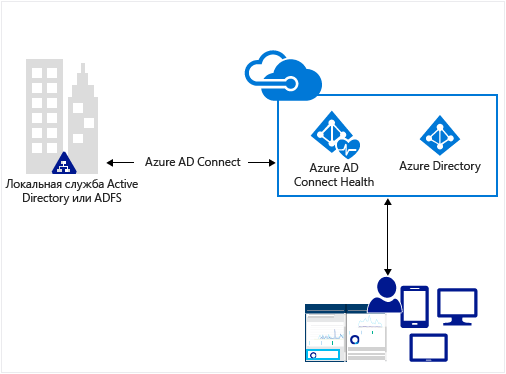
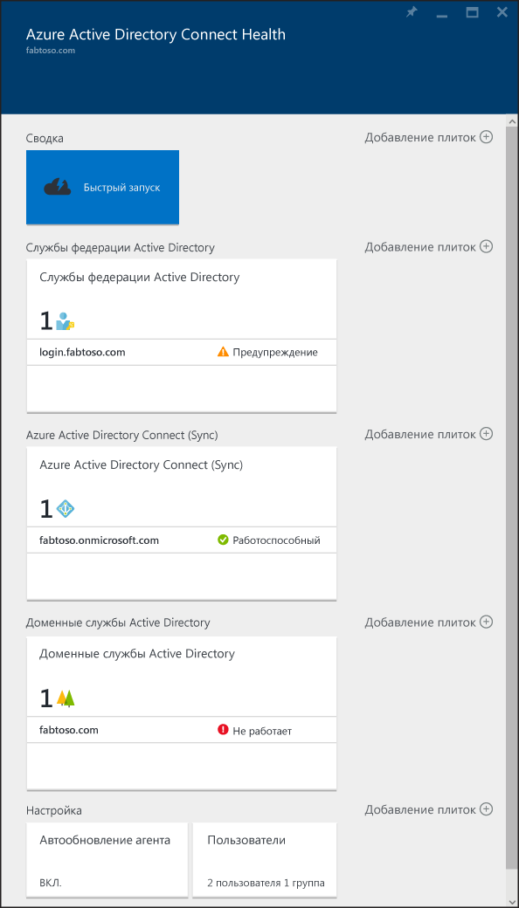

<properties
	pageTitle="Мониторинг локальной инфраструктуры идентификации в облаке."
	description="В этой статье описаны принципы работы и предназначение службы Azure AD Connect Health."
	services="active-directory"
	documentationCenter=""
	authors="karavar"
	manager="femila"
	editor="karavar"/>

<tags
	ms.service="active-directory"
	ms.workload="identity"
	ms.tgt_pltfrm="na"
	ms.devlang="na"
	ms.topic="get-started-article"
	ms.date="07/14/2016"
	ms.author="vakarand"/>

# Мониторинг локальной инфраструктуры идентификации и служб синхронизации в облаке.

Служба Azure AD Connect Health помогает отслеживать локальную инфраструктуру идентификации и службы синхронизации. Она обеспечивает надежное подключение к службам Office 365 и Microsoft Online Services и предоставляет возможности мониторинга ключевых компонентов идентификации, таких как серверов AD FS, серверов Azure AD Connect (также называемых модулями синхронизации), контроллеров домена Active Directory и т. п. С помощью этой службы пользователи могут с легкостью получить доступ к общим сведениям о компонентах, в частности к информации об использовании и другим важным данным.

Эти сведения можно найти на портале [Azure AD Connect Health](https://aka.ms/aadconnecthealth). На портале Azure AD Connect Health можно просматривать предупреждения, отслеживать производительность, аналитику использования и многое другое. Служба Azure AD Connect Health позволяет следить за состоянием работоспособности ключевых компонентов идентификации из одного места.

Будущие обновления Azure AD Connect Health будут включать расширенные возможности мониторинга и предоставление сведения о дополнительных компонентах идентификации. Таким образом, у вас будет одна панель мониторинга для просмотра идентификации, предоставляющая вам еще более надежную, работоспособную и интегрированную среду. Ее могут использовать ваши пользователи для повышения собственной продуктивности.

<!-- 

 -->

## Зачем использовать Azure AD Connect Health

Интеграция локальных каталогов с Azure AD помогает повысить продуктивность ваших пользователей, предоставляя им единую идентификацию для доступа к облачным и локальным ресурсам. Однако такая интеграция требует обеспечения работоспособности среды для надежного доступа пользователей к локальным и облачным ресурсам с любого устройства. Azure AD Connect Health — это простое облачное решение для мониторинга и получения четкого представления о локальной инфраструктуре идентификации, которое используется для доступа к Office 365 и другим приложениям Azure AD. Использовать службу так же просто, как установить агент на локальных серверах удостоверений.

## [Azure AD Connect Health для AD FS](active-directory-aadconnect-health-adfs.md)

Azure AD Connect Health для AD FS поддерживает AD FS 2.0 в Windows Server 2008 R2, AD FS в Windows Server 2012 и AD FS в Windows Server 2012 R2. Поддерживаются также прокси-серверы AD FS и веб-приложений, которые обеспечивают проверку подлинности для доступа к экстрасети. Служба Azure AD Connect Health для AD FS имеет низкую стоимость, и ее можно установить очень быстро. Она предоставляет следующий набор основных возможностей:

- мониторинг и отправка оповещений о проблемах работоспособности AD FS и прокси-серверов AD FS;
- уведомления по электронной почте для критических оповещений;
- анализ тенденций в данных производительности, что удобно для планирования ресурсов AD FS;
- аналитика по входам в систему AD FS с предоставлением разных сводных данных (о приложениях, пользователях, сетевом расположении и т. д.), что позволяет понять, как используется AD FS;
- создание отчетов AD FS, например о 50 пользователях, выполнивших наибольшее количество неудачных попыток входа с указанием неправильного имени пользователя или пароля.

В следующем видео представлен обзор Azure AD Connect Health для AD FS:

> [AZURE.VIDEO azure-ad-connect-health--monitor-you-identity-bridge]

## [Azure AD Connect Health для синхронизации](active-directory-aadconnect-health-sync.md)

Azure AD Connect Health для синхронизации отслеживает и предоставляет сведения о синхронизациях, которые выполняются между вашей локальной службой Active Directory и Azure Active Directory. Azure AD Connect Health для синхронизации предоставляет следующие возможности:

- мониторинг и отправка оповещений о проблемах работоспособности серверов Azure AD Connect (также называемых модулями синхронизации);
- уведомления по электронной почте для критических оповещений;
- оперативная аналитика синхронизации, включая диаграммы по задержке и тенденции операций синхронизации, таких как добавление, обновление и удаление;
- предоставление общей информации о свойствах синхронизации и последнем успешном экспорте в Azure AD.

В следующем видео представлен обзор Azure AD Connect Health для синхронизации:

>[AZURE.VIDEO azure-active-directory-connect-health-monitoring-the-sync-engine]

## [Azure AD Connect Health для AD DS (предварительная версия)](active-directory-aadconnect-health-adds.md)

Azure AD Connect Health для AD DS обеспечивает мониторинг контроллеров домена, установленных в Windows Server 2008 R2, Windows Server 2012 и Windows Server 2012 R2. Простая и недорогая установка агента работоспособности позволит вам отслеживать локальную среду AD DS прямо из облака. Azure AD Connect Health для AD DS предоставляет следующий набор основных возможностей.

- Отслеживание оповещений для обнаружения неработоспособных контроллеров домена, а также уведомления по электронной почте о критических оповещениях.
- Панель мониторинга контроллеров домена, на которой можно быстро просмотреть состояние работоспособности и рабочее состояние контроллеров домена.
- Панель мониторинга состояния репликации с последними сведениями о репликации, а также ссылки на руководства по устранению неполадок при обнаружении ошибок.
- Быстрый доступ из любого расположения к графикам данных производительности популярных счетчиков производительности, необходимые для наблюдения и устранения неполадок.

В следующем видео представлен обзор Azure AD Connect Health для AD DS.

>[AZURE.VIDEO azure-ad-connect-health-monitors-on-premises-ad-domain-services]

## Приступая к работе с Azure AD Connect Health
Начать работу с Azure AD Connect Health очень просто. Для этого сделайте вот что.

1. [Приобретите Azure AD Premium](active-directory-get-started-premium.md) или [получите пробную версию](https://azure.microsoft.com/trial/get-started-active-directory/).

2. [Скачайте и установите агенты Azure AD Connect Health](#download-and-install-azure-ad-connect-health-agent) на серверах удостоверений.

3. Просмотрите панель мониторинга Azure AD Connect Health на странице [https://aka.ms/aadconnecthealth](https://aka.ms/aadconnecthealth).

>[AZURE.NOTE]Помните, чтобы на панели мониторинга Azure AD Connect Health отображались какие-либо данные, потребуется установить агенты Azure AD Connect Health на целевых серверах.

## Скачивание и установка агента Azure AD Connect Health

- Ознакомьтесь с [требованиями](active-directory-aadconnect-health-agent-install.md#Requirements) для Azure AD Connect Health.

- Для начала работы с Azure AD Connect Health для AD FS [скачайте последнюю версию агента для этой службы](http://go.microsoft.com/fwlink/?LinkID=518973). 

- Чтобы начать использовать службу Azure AD Connect Health для синхронизации, скачайте и установите [последнюю версию Azure AD Connect](http://go.microsoft.com/fwlink/?linkid=615771). Агент Azure AD Connect Health будет установлен во время установки Azure AD Connect (версии 1.0.9125.0 или более поздней). Azure AD Connect поддерживает локальное обновление с предыдущих версий.

- Для начала работы с Azure AD Connect Health для AD DS [скачайте последнюю версию агента для этой службы](http://go.microsoft.com/fwlink/?LinkID=820540). 

## Портал Azure AD Connect Health
На портале Azure AD Connect Health можно просматривать оповещения и аналитические данные по использованию, а также отслеживать производительность. Страница https://aka.ms/aadconnecthealth перенаправит вас в главную колонку Azure AD Connect Health. Ее можно считать окном. В главной колонке отображается элемент быстрого запуска, раздел со службами Azure AD Connect Health и дополнительные параметры конфигурации. На снимке экрана ниже приводится краткое описание каждого из них. После развертывания агентов служба работоспособности автоматически определит службы, отслеживаемые в Azure AD Connect Health.

- Если нажать кнопку **Быстрый запуск**, откроется колонка «Быстрый запуск». С ее помощью можно скачать агент Azure AD Connect Health, выбрав "Получить средства", ознакомиться с документацией и отправить отзыв.

- Раздел **Службы федерации Active Directory** представляют все службы AD FS, которые в настоящее время отслеживает служба Azure AD Connect Health. Если выбрать один из экземпляров, откроется колонка сведений об этом экземпляре служб. Сюда входит обзор, свойства, оповещения, мониторинг и аналитика по использованию. Дополнительные сведения о возможностях см. [здесь](active-directory-aadconnect-health-adfs.md).

- В разделе **Azure Active Directory Connect (Sync)** отображаются серверы Azure AD Connect, которые в настоящее время отслеживает служба Azure AD Connect Health. После выбора записи откроется колонка с информацией о серверах Azure AD Connect. Дополнительные сведения о возможностях см. [здесь](active-directory-aadconnect-health-sync.md).
 
- В разделе **Доменные службы Active Directory** представлены все леса AD DS, которые в настоящее время отслеживает служба Azure AD Connect Health. Если выбрать один из лесов, откроется колонка сведений об этом лесе. Эти сведения включают обзор основной информации, панель мониторинга контроллеров домена, панель мониторинга состояния репликации, оповещения и мониторинг. Дополнительные сведения о возможностях см. [здесь](active-directory-aadconnect-health-adds.md).

- В разделе **Настройка** можно включить или отключить следующие функции.

	1. Автоматическое обновление агента Azure AD Connect Health до последней версии — это означает, что агент Azure AD Connect Health будет обновлен до последней версии, когда она станет доступна. Эта функция включена по умолчанию.

	2. Предоставление корпорации Майкрософт доступа к данным работоспособности каталога Azure AD только в целях устранения неполадок — это означает, что если эта функция включена, корпорации Майкрософт будут доступны те же данные, что видите вы. Это может помочь при устранении неполадок и различных проблем. Эта функция отключена по умолчанию.

## Связанные ссылки

* [Установка агента Azure AD Connect Health](active-directory-aadconnect-health-agent-install.md)
* [Операции Azure AD Connect Health](active-directory-aadconnect-health-operations.md)
* [Использование Azure AD Connect Health с AD FS](active-directory-aadconnect-health-adfs.md)
* [Использование Azure AD Connect Health для синхронизации](active-directory-aadconnect-health-sync.md)
* [Using Azure AD Connect Health with AD DS](active-directory-aadconnect-health-adds.md) (Использование Azure AD Connect Health с AD DS)
* [Часто задаваемые вопросы об Azure AD Connect Health](active-directory-aadconnect-health-faq.md)
* [Azure AD Connect Health: история версий](active-directory-aadconnect-health-version-history.md)

<!---HONumber=AcomDC_0928_2016-->