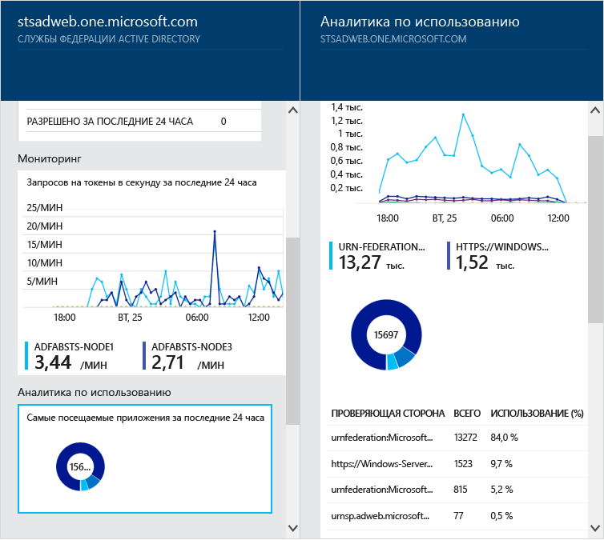
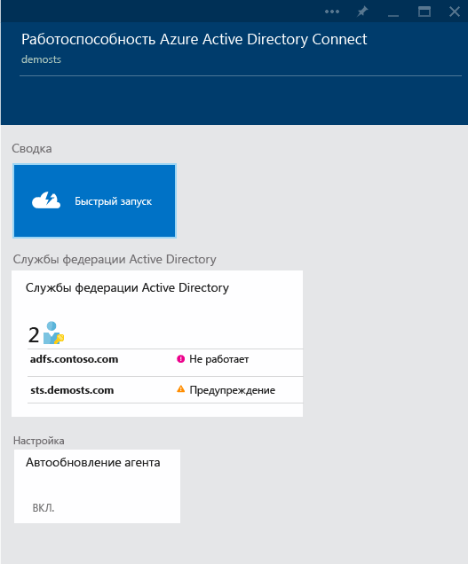

<properties
	pageTitle="Мониторинг локальной инфраструктуры идентификации в облаке."
	description="В этой статье описаны принципы работы и предназначение службы Azure AD Connect Health."
	services="active-directory"
	documentationCenter=""
	authors="billmath"
	manager="stevenpo"
	editor="curtand"/>

<tags
	ms.service="active-directory"
	ms.workload="identity"
	ms.tgt_pltfrm="na"
	ms.devlang="na"
	ms.topic="get-started-article"
	ms.date="10/15/2015"
	ms.author="billmath"/>

# Мониторинг локальной инфраструктуры идентификации и служб синхронизации в облаке.

Служба Azure AD Connect Health помогает отслеживать локальную инфраструктуру идентификации и службы синхронизации, доступные в Azure HD Connect, и разобраться в их особенностях. Служба позволяет просматривать предупреждения, производительность, шаблоны использования, настройки конфигурации, а также поддерживать надежное подключение к Office 365 и др. Все это можно сделать с помощью агента, установленного на целевых серверах.

Эти сведения можно найти на портале Azure AD Connect Health. На портале Azure AD Connect Health можно просматривать предупреждения, отслеживание производительности и аналитику использования. Все эти данные собраны в одном удобном месте, чтобы вы не тратили время на поиск нужной информации.

Будущие обновления Azure AD Connect Health будут включать дополнительные компоненты мониторинга и детальный обзор других компонентов и служб идентификации, в частности Azure AD Connect Sync. Таким образом, у вас будет одна панель мониторинга для просмотра идентификации, предоставляющая вам еще более надежную, работоспособную и интегрированную среду. Ее могут использовать ваши пользователи для повышения собственной продуктивности.

## Зачем использовать Azure AD Connect Health

Интеграция локальных каталогов с Azure AD помогает повысить продуктивность ваших пользователей, предоставляя им единую идентификацию для доступа к облачным и локальным ресурсам. Однако такая интеграция требует обеспечения работоспособности среды для надежного доступа пользователей к локальным и облачным ресурсам с любого устройства. Azure AD Connect Health — это простое облачное решение для мониторинга и получения четкого представления о локальной инфраструктуре идентификации, которое используется для доступа к Office 365 и другим приложениям Azure AD. Использовать службу так же просто, как установить агент на локальных серверах удостоверений.

Azure AD Connect Health для AD FS поддерживает AD FS 2.0 в Windows Server 2008/2008 R2, AD FS в Windows Server 2012/2012R2. Сюда также относятся все прокси-серверы AD FS и веб-приложений, которые предоставляют поддержку проверки подлинности для доступа к экстрасети. Azure AD Connect Health для AD FS предоставляет следующий набор основных возможностей:

- просмотр и реагирование на предупреждения для надежного доступа к защищенным приложениям AD FS, включая Azure AD;
- уведомления по электронной почте для критических оповещений;
- просмотр данных производительности для планирования ресурсов;
- подробный просмотр шаблонов входа AD FS для выявления аномалий или установки базовых показателей для планирования ресурсов.

Следующее видео содержит Azure AD Connect Health:

[AZURE.VIDEO azure-ad-connect-health--monitor-you-identity-bridge]

## Начало работы с порталом Azure
Чтобы приступить к работе с Azure Active Directory Connect Health, выполните следующие действия.

1. Войдите на [портал Microsoft Azure](https://portal.azure.com/).
2. Доступ к Azure Active Directory Connect Health можно получить, перейдя к Marketplace и выполнив поиск Azure Active Directory Connect Health. Также можно выбрать «Marketplace», а затем — «Безопасность+идентификация».
3. На вводной колонке (колонка — это один элемент общего представления, ее можно рассматривать как окно или всплывающий элемент) нажмите кнопку **Создать**. Откроется другая колонка с информацией о каталоге.
4. На колонке каталога нажмите кнопку **Создать**. Если у вас нет лицензии Azure Active Directory Premium, она вам потребуется для использования Azure AD Connect Health. Дополнительную информацию о Azure AD Premium см. в разделе «Приступая к работе с Azure AD Premium».

>[AZURE.NOTE]Помните, что прежде чем вы увидите какие-либо данные в экземпляре Azure AD Connect Health, потребуется установить агент Azure AD Connect Health на целевых серверах. Чтобы скачать агент Azure AD Connect Health, в первой колонке выберите «Быстрый запуск» и «Получить средства». Кроме того, вы может загрузить агент напрямую, используя [ссылку](#download-the-agent) ниже. Чтобы использовать Azure Active Directory Connect Health, выполните следующее:

### Портал и службы Azure AD Connect Health
На портале Azure AD Connect Health можно просматривать оповещения, аналитику по использованию и отслеживать производительности. При первом обращении к Azure AD Connect Health откроется первая колонка. Ее можно считать окном. На первой колонке отображаются элементы «Быстрый запуск», «Службы» и «Настройка». На снимке экрана ниже приводится краткое описание каждого из них. В данном разделе представлены активные службы и экземпляры этих служб, которые отслеживает служба Azure AD Connect Health.

- Если нажать кнопку **Быстрый запуск**, откроется колонка «Быстрый запуск». С ее помощью можно скачать агент Azure AD Connect Health, выбрав «Получить средства», ознакомиться с документацией и отправить отзыв.
- Раздел **Службы федерации Active Directory** представляют все службы AD FS, которые в настоящее время отслеживает служба Azure AD Connect Health. Если выбрать один из экземпляров, откроется колонка сведений об этом экземпляре служб. Сюда входит обзор, свойства, оповещения, мониторинг и аналитика по использованию.
- «Настройка» позволяет включить или отключить следующие функции:
<ol>
1. Автоматическое обновление агента Azure AD Connect Health до последней версии — это означает, что агент Azure AD Connect Health будет обновлен до последней версии, когда она станет доступна. Эта функция включена по умолчанию.
2. Предоставление корпорации Майкрософт доступа к данным работоспособности каталога Azure AD только в целях устранения неполадок — это означает, что если эта функция включена, корпорации Майкрософт будут доступны те же данные, что видите вы. Это может помочь при устранении неполадок и различных проблем. Эта функция отключена по умолчанию.

## Требования
Следующая таблица содержит список требований, которые следует выполнить, прежде чем приступить к работе с Azure AD Connect Health.

| Требование | Описание|
| ----------- | ---------- |
|Azure AD Premium| Служба Azure AD Connect Health относится к Azure AD Premium и требует наличия выпуска Azure AD Premium.   Дополнительные сведения см. в статье [Приступая к работе с Azure AD Premium](active-directory-get-started-premium.md).  Информацию о получении бесплатной 30-дневной пробной версии см. в статье [Начало использования пробной версии](https://azure.microsoft.com/trial/get-started-active-directory/).|.
|Для включения (создания) Azure AD Connect Health вам нужны права глобального администратора Azure AD|По умолчанию только глобальные администраторы могут включать (создавать) Azure AD Connect Health, получать доступ ко всей информации и выполнять все операции в рамках Azure AD Connect Health. Дополнительную информацию см. в разделе [Управление каталогом Azure AD](active-directory-administer.md).   С помощью управления доступом на основе ролей можно разрешить доступ к Azure AD Connect Health другим пользователям в организации. Дополнительные сведения см. в статье [Управление доступом на основе ролей для Azure AD Connect Health](active-directory-aadconnect-health-operations.md#manage-access-with-role-based-access-control).  **Важно.** Учетная запись, используемая при установке агентов, должна быть учетной записью организации или рабочей учетной записью и не может быть учетной записью Майкрософт. Дополнительные сведения см. в статье [Подписка на Azure в качестве организации](sign-up-organization.md)|
|Для аналитики использования должен быть включен аудит AD FS| Чтобы применять аналитику по использованию для AD FS, необходимо убедиться, что включен аудит AD FS.   См. статью [Включение аудита AD FS](active-directory-aadconnect-health-agent-install-adfs.md#enable-auditing-for-ad-fs).
|Соответствие требованиям агента Azure AD Connect Health.|В приведенной ниже таблице приведены требования агента.

Приведенные в списке требования следует выполнить, прежде чем приступить к работе с Azure AD Connect Health.

| Требование | Описание|
| ----------- | ---------- |
|Агент Azure AD Connect Health должен быть установлен на всех целевых серверах| Для предоставления данных, которые можно просматривать на портале, службе Azure AD Connect Health требуется наличие агента на целевых серверах.   Например, для получения данных о локальной инфраструктуре AD FS агент должен устанавливаться на серверы AD FS. Сюда входят прокси-серверы AD FS и прокси-серверы веб-приложений.   Сведения об установке агента см. в статье [Установка агента Azure AD Connect Health](active-directory-aadconnect-health-agent-install.md).  **Важно.** Учетная запись, используемая при установке агентов, должна быть учетной записью организации или рабочей учетной записью и не может быть учетной записью Майкрософт. Дополнительные сведения см. в статье [Подписка на Azure для организации](sign-up-organization.md)|
|Исходящие подключения к конечным точкам службы Azure|Во время установки и выполнения агенту требуется подключение к конечным точкам службы Azure AD Connect Health, перечисленным ниже. При блокировке исходящего подключения убедитесь, что в список разрешенных добавлены следующие адреса:   <li>**new**: &#42;.blob.core.windows.net </li><li>**new**: &#42;.queue.coаre.windows.net</li><li>&#42;.servicebus.windows.net — порт: 5671</li><li>https://&#42;.adhybridhealth.azure.com/</li><li>https://&#42;.table.core.windows.net/</li><li>https://policykeyservice.dc.ad.msft.net/</li><li>https://login.windows.net</li><li>https://login.microsoftonline.com</li><li>https://secure.aadcdn.microsoftonline-p.com</li> |
|Порты брандмауэра на сервере с агентом.| Для взаимодействия агента с конечными точками службы Azure AD Health должны быть открыты следующие порты брандмауэра.  <li>TCP/UDP-порт 80</li><li>TCP/UDP-порт 443</li><li>TCP/UDP-порт 5671</li>
|Внесите следующие веб-сайты в список разрешенных, если включена политика усиленной безопасности IE|Если на сервере, на котором будет установлен агент, включена конфигурация усиленной безопасности Internet Explorer, потребуется открыть доступ для следующих веб-сайтов.  <li>https://login.microsoftonline.com</li><li>https://secure.aadcdn.microsoftonline-p.com</li><li>https://login.windows.net</li><li>Сервер федерации вашей организации должен быть доверенным для Azure Active Directory. Например, https://sts.contoso.com</li>

## Загрузка агента.

Для начала работы со службой Azure AD Connect Health можно загрузить последнюю версию агента по следующей ссылке: [Загрузка агента Azure AD Connect Health](http://go.microsoft.com/fwlink/?LinkID=518973) Перед установкой агентов убедитесь, что вы добавили службу из Marketplace.

## Связанные ссылки

* [Установка агента Azure AD Connect Health для AD FS](active-directory-aadconnect-health-agent-install-adfs.md)
* [Операции Azure AD Connect Health](active-directory-aadconnect-health-operations.md)
* [Использование Azure AD Connect Health с AD FS](active-directory-aadconnect-health-adfs.md)
* [Часто задаваемые вопросы об Azure AD Connect Health](active-directory-aadconnect-health-faq.md)

<!---HONumber=Oct15_HO3-->