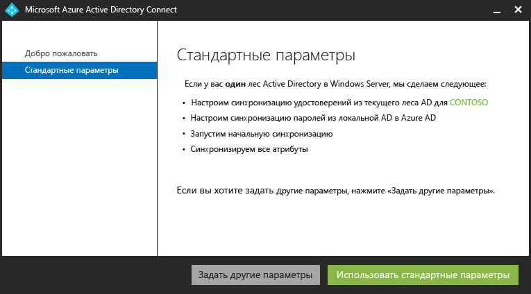
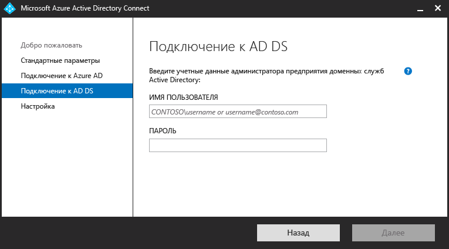
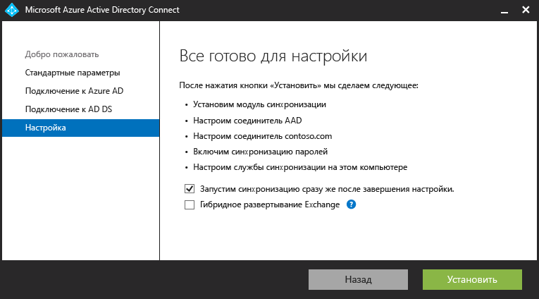
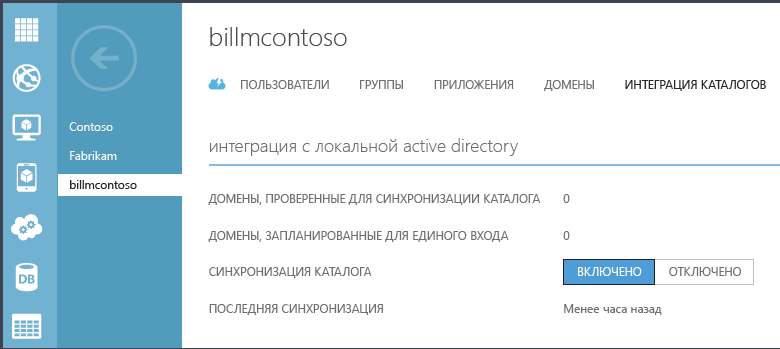
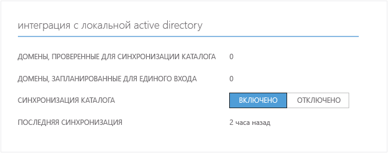
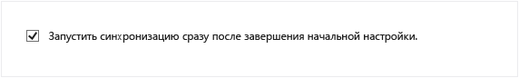
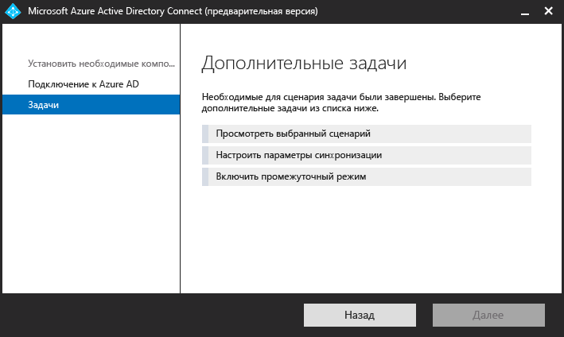

<properties 
	pageTitle="Интеграция локальных удостоверений с Azure Active Directory." 
	description="В этой статье объясняется, что такое служба Azure AD Connect и зачем ее использовать." 
	services="active-directory" 
	documentationCenter="" 
	authors="billmath" 
	manager="swadhwa" 
	editor="curtand"/>

<tags 
	ms.service="active-directory" 
	ms.workload="identity" 
	ms.tgt_pltfrm="na" 
	ms.devlang="na" 
	ms.topic="get-started-article" 
	ms.date="07/13/2015" 
	ms.author="billmath"/>

# Интеграция локальных удостоверений с Azure Active Directory

Сегодня пользователям нужно работать с приложениями в локальной среде и облаке, используя при этом любые устройства, будь то ноутбук, смартфон или планшет. Чтобы это стало возможным, вам и вашей организации требуется обеспечить доступ к этим приложениям для пользователей, однако полное перемещение в облако не всегда возможно.

С появлением Azure Active Directory Connect предоставление такого доступа и переход в облако стали гораздо проще. Преимущества Azure AD Connect:

- Пользователи могут выполнять вход, используя одно и то же удостоверение как для облачной, так и для локальной среды. Им не нужно запоминать несколько паролей или учетных записей, а администраторам не нужно беспокоиться о работе со множеством учетных записей.
- Универсальное средство и руководство по подключению локальных каталогов к Azure Active Directory. Когда вы установите мастер, он выполнит развертывание и настройку всех компонентов, необходимых для отлаженной интеграции каталогов, включая службы синхронизации (в том числе синхронизации паролей) или AD FS, а также таких необходимых компонентов, как модуль Azure AD PowerShell.

## Почему Azure AD Connect? 

Интеграция локальных каталогов с Azure AD помогает повысить продуктивность пользователей, так как используется единая идентификация для доступа к облачным и локальным ресурсам. Благодаря этой интеграции пользователи и организации получат следующие преимущества:
	
* Организации могут предоставлять пользователям общее гибридное удостоверение для локальных и облачных служб, используя Windows Server Active Directory, а затем подключившись к Azure Active Directory. 
* Администраторы могут предоставлять условный доступ на основе ресурсов приложения, удостоверения устройства и пользователя, сетевого расположения и многофакторной проверки подлинности.
* Пользователи могут применять одно и то же удостоверение в различных учетных записях Azure AD, Office 365, Intune, приложениях SaaS и сторонних решениях.  
* Разработчики могут создавать приложения, использующие модель общего удостоверения, интегрируя приложения с локальной службой Active Directory или с Azure для облачных приложений.

Azure AD Connect облегчает интеграцию и упрощает управление инфраструктурой локальных и облачных удостоверений.

----------------------------------------------------------------------------------------------------------
## Загрузка Azure AD Connect

Чтобы приступить к работе с Azure AD Connect, можно скачать последнюю версию [по этой ссылке](http://go.microsoft.com/fwlink/?LinkId=615771).

----------------------------------------------------------------------------------------------------------

## Принципы работы Azure AD Connect

Azure Active Directory Connect состоит из трех основных компонентов. Это службы синхронизации, службы федерации Active Directory (необязательный компонент) и компонент мониторинга, реализованный с помощью [Azure AD Connect Health](https://msdn.microsoft.com/library/azure/dn906722.aspx).

 

- Синхронизация — эта часть состоит из компонентов и функций, ранее выпущенных как Dirsync и служба синхронизации AAD. Эта часть отвечает за создание пользователей и групп. Она также отвечает за согласование сведений о пользователях и группах в локальной среде и в облаке.
- AD FS — это необязательная часть Azure AD Connect, которая может использоваться для настройки гибридной среды с помощью локальной инфраструктуры AD FS. Ее можно использовать при сложном развертывании, в котором используется единый вход с присоединением к домену, принудительное применение политики входа AD и смарт-карты или сторонняя многофакторная проверка подлинности. Дополнительные сведения о настройке единого входа см. в разделе [DirSync с единым входом](https://msdn.microsoft.com/library/azure/dn441213.aspx).
- Мониторинг работоспособности — для сложных развертываний с использованием AD FS компонент Azure AD Connect Health реализует надежный мониторинг серверов федерации и представляет центральное расположение на портале Azure для просмотра связанных действий. Дополнительные сведения см. в разделе [Azure Active Directory Connect Health](https://msdn.microsoft.com/library/azure/dn906722.aspx).

### Вспомогательные компоненты Azure AD Connect

Ниже приведен перечень необходимых и вспомогательных компонентов, которые Azure AD Connect установит на сервере, где установлен Azure AD Connect. Этот список предназначен для базовой установки Express. Если вы решили использовать другой выпуск SQL Server на странице установки службы синхронизации, перечисленные ниже компоненты SQL Server 2012 не установлены.

- Соединитель Azure AD для Azure AD Connect
- Программы командной строки Microsoft SQL Server 2012
- Microsoft SQL Server 2012 Native Client
- Microsoft SQL Server 2012 Express LocalDB
- Модуль Azure Active Directory для Windows PowerShell
- Помощник по входу в Microsoft Online Services для ИТ-специалистов
- Распространяемый пакет Microsoft Visual C++ 2013

## Приступая к работе с Azure AD Connect

Следующая документация поможет вам приступить к работе с Azure Active Directory Connect. В ней рассматривается экспресс-установка Azure AD Connect. Сведения о выборочной установке см. в статье [Выборочная установка Azure AD Connect](active-directory-aadconnect-get-started-custom.md). Сведения об обновлении DirSync до Azure AD Connect см. в статье [Обновление DirSync до Azure Active Directory Connect](active-directory-aadconnect-dirsync-upgrade-get-started.md).

### Перед установкой Azure AD Connect
Для установки Azure AD Connect со стандартными параметрами вам потребуется вот что:

 
- Подписка на Azure или [пробную версию Azure](http://azure.microsoft.com/pricing/free-trial/). Она необходима только для доступа к порталу Azure и не требуется для использования Azure AD Connect. Если вы используете PowerShell или Office 365, то для работы с Azure AD Connect подписка Azure не требуется.
- Учетная запись глобального администратора Azure AD для клиента Azure AD, с которым необходима интеграция.
- Azure AD Connect необходимо установить на сервер под управлением ОС Windows Server, начиная с версии 2008. Это может быть контроллер домена или рядовой сервер.
- Версия схемы и уровень леса AD должны предполагать использование ОС Windows Server, начиная с версии 2003. Контроллеры домена могут работать под управлением любой версии, если выполняются требования к схеме и уровню леса.
- При развертывании служб федерации Active Directory серверы, на которых будут установлены службы AD FS, должны работать под управлением ОС Windows Server, начиная с версии 2012.
- Azure AD Connect требуется база данных SQL Server для хранения учетных данных. По умолчанию устанавливается SQL Server 2012 Express LocalDB (облегченная версия SQL Server Express), а на локальном компьютере создается учетная запись для службы. Размер SQL Server Express может достигать 10 ГБ, позволяя управлять примерно 100 000 объектов.
- Если вам нужно управлять более значительным числом объектов каталога, в процессе установки укажите другую версию SQL Server. Azure AD Connect поддерживает все версии Microsoft SQL Server, начиная с SQL Server 2008 (с пакетом обновлений SP4) и заканчивая SQL Server 2014.
- Учетная запись администратора предприятия для локальной службы Active Directory.
- Если используется исходящий прокси-сервер, для завершения установки необходимо добавить в файл **C:\\Windows\\Microsoft.NET\\Framework64\\v4.0.30319\\Config\\machine.config** следующий код: <code>
		
		<system.net>
    		<defaultProxy>
      		<proxy
        	usesystemdefault="true"
        	proxyaddress=http://<PROXYIP>:80"
        	bypassonlocal="true"
     		 />
    		</defaultProxy>
  		</system.net>
</code> Этот текст необходимо добавить в конец указанного файла. В этом коде &lt;PROXYIP&gt; означает фактический IP-адрес прокси-сервера.

- Необязательно: тестовая учетная запись пользователя для проверки синхронизации.

#### Требования к оборудованию для Azure AD Connect
В следующей таблице содержатся минимальные требования к компьютеру с Azure AD Connect.

| Количество объектов в Active Directory | ЦП | Память | Размер жесткого диска |
| ------------------------------------- | --- | ------ | --------------- |
| Менее 10 000 | 1,6 ГГц | 4 ГБ | 70 ГБ |
| 10 000–50 000 | 1,6 ГГц | 4 ГБ | 70 ГБ |
| 50 000–100 000 | 1,6 ГГц | 16 ГБ | 100 ГБ |
| При наличии 100 000 объектов или более необходима полная версия SQL Server| | | |
| 100 000–300 000 | 1,6 ГГц | 32 ГБ | 300 ГБ |
| 300 000–600 000 | 1,6 ГГц | 32 ГБ | 450 ГБ |
| Более 600 000 | 1,6 ГГц | 32 ГБ | 500 ГБ |

Чтобы настроить другие параметры, например дополнительный лес или федеративный вход в систему, ознакомьтесь с дополнительными требованиями [по этой ссылке](active-directory-aadconnect-get-started-custom.md).

### Экспресс-установка Azure AD Connect
Установка со стандартными параметрами — это наиболее распространенный и предлагаемый по умолчанию вид установки. При его использовании Azure AD Connect развертывает службу синхронизации с включенной синхронизацией хэша пароля. Это возможно только для одного леса и позволяет пользователям применять свой локальный пароль для входа в облако. По завершении экспресс-установки запускается автоматическая синхронизация (вы можете ее отключить). Этот тип установки позволяет интегрировать локальные каталоги с облачными с помощью всего нескольких щелчков мышью.

#### Установка Azure AD Connect с использованием стандартных параметров
--------------------------------------------------------------------------------------------

1. Войдите на сервер, на котором требуется установить Azure AD Connect, как администратор предприятия. Это должен быть сервер, который вы хотите сделать сервером синхронизации.
2. Перейдите к файлу AzureADConnect.msi и дважды щелкните его.
3. На экране приветствия установите флажок, подтверждающий ваше согласие с условиями лицензионного соглашения, и нажмите кнопку **Продолжить**.
4. На экране экспресс-установки щелкните **Использовать стандартные параметры**.

6. На экране "Подключение к Azure AD" введите имя пользователя и пароль учетной записи глобального администратора Azure. Нажмите кнопку **Далее**.
8. На экране "Подключение к AD DS" введите имя пользователя и пароль учетной записи администратора предприятия. Нажмите кнопку **Далее**.

9. На экране "Все готово к настройке" нажмите кнопку **Установить**.
	- При необходимости можно снять флажок "Запустить синхронизацию сразу после завершения настройки" на странице "Все готово к настройке". В этом случае мастер настроит синхронизацию, но задача будет отключена, пока вы не активируете ее вручную в планировщике задач. После активации задачи синхронизация будет выполняться каждые три часа.
	- Также при необходимости вы можете настроить службы синхронизации для **гибридного развертывания Exchange**, установив соответствующий флажок. Если вы не планируете одновременно использовать почту Exchange в облаке и локально, то этот флажок устанавливать не обязательно.

8. После завершения установки нажмите кнопку **Выход**.

Рекомендуем посмотреть видеоролик по экспресс-установке:

[AZURE.VIDEO azure-active-directory-connect-express-settings]

### Проверка установки

После успешной установки Azure AD Connect вы можете убедиться, что синхронизация выполняется. Для этого войдите на портал Azure и проверьте время последней синхронизации.

1.  Войдите на портал Azure.
2.  Выберите "Active Directory" слева.
3.  Дважды щелкните каталог, который вы только что использовали для настройки Azure AD Connect.
4.  Выберите вкладку "Интеграция каталогов" вверху страницы. Найдите время последней синхронизации.

## Управление Azure AD Connect 

Ниже приведены дополнительные сведения, которые помогут вам настроить Azure Active Directory Connect в соответствии с потребностями вашей организации.

### Назначение пользователям лицензий Azure AD Premium и Enterprise Mobility

После синхронизации данных о пользователях с облаком необходимо назначить им лицензии, чтобы они могли приступить к работе с облачными приложениями, такими как Office 365.

#### Назначение лицензии Azure AD Premium или Enterprise Mobility Suite
--------------------------------------------------------------------------------
1. Войдите на портал Azure с учетной записью администратора.
2. Выберите **Active Directory** слева.
3. На странице "Active Directory" дважды щелкните каталог пользователей, которых вы хотите активировать.
4. В верхней части страницы каталога выберите вкладку **Лицензии**.
5. На странице "Лицензии" выберите Active Directory Premium или Enterprise Mobility Suite, а затем нажмите кнопку **Назначить**.
6. В диалоговом окне выберите пользователей, которым требуется назначить лицензии, и щелкните значок галочки, чтобы сохранить изменения.

### Проверка выполнения запланированной задачи синхронизации
Проверить состояние синхронизации можно на портале Azure.

#### Чтобы проверить выполнение запланированной задачи синхронизации:
--------------------------------------------------------------------------------

1. Войдите на портал Azure с учетной записью администратора.
2. Выберите **Active Directory** слева.
3. На странице "Active Directory" дважды щелкните каталог пользователей, которых вы хотите активировать.
4. В верхней части страницы каталога выберите вкладку **Интеграция каталогов**.
5. В разделе "Интеграция с активным локальным каталогом" просмотрите время последней синхронизации.

### Запуск запланированной задачи синхронизации
Чтобы выполнить задачу синхронизации, можно снова запустить мастер Azure AD Connect. Для этого потребуется указать учетные данные Azure AD. В мастере выберите задачу **Настройка параметров синхронизации** и нажмите "Далее" несколько раз. Убедитесь, что на последнем экране установлен флажок **Запустить синхронизацию сразу после завершения настройки**.

### Дополнительные задачи в Azure AD Connect
После установки Azure AD Connect вы можете повторно запускать мастер с начальной страницы Azure AD Connect или используя ярлык на рабочем столе. При повторном запуске мастера будут доступны дополнительные задачи.

Список задач и их краткое описание см. в следующей таблице.

 

Дополнительная задача | Описание 
------------- | ------------- |
Просмотр выбранного сценария |Позволяет просматривать текущее решение Azure AD Connect. Включает общие параметры, синхронизированные каталоги, параметры синхронизации и т. д.
Настройка параметров синхронизации | Позволяет изменить текущую конфигурацию, например добавить в нее дополнительный лес Active Directory или активировать параметры синхронизации, такие как обратная запись для пользователей, групп, устройств или паролей.
Включение промежуточного режима | Позволяет сохранять сведения для последующей синхронизации. При этом никакие данные не экспортируются в Azure AD или Active Directory. Позволяет просмотреть результаты синхронизации до ее выполнения.

 
### Дополнительная документация
Дополнительные сведения о работе с Azure AD Connect см. в следующих статьях:

- [Azure AD Connect Sync: настройка параметров синхронизации](active-directory-aadconnectsync-whatis.md) 
- [Изменение используемой по умолчанию конфигурации Azure AD Connect](active-directory-aadconnect-whats-next-change-default-config.md)
- [Использование редактора правил синхронизации Azure AD Connect](active-directory-aadconnect-whats-next-synch-rules-editor.md)
- [Использование декларативной подготовки](active-directory-aadconnect-whats-next-declarative-prov.md)

Часть документации, разработанной для службы синхронизации Azure AD Sync, актуальна и для Azure AD Connect. Хотя мы прикладываем все усилия, чтобы перенести эту документацию на сайт Azure.com, ее часть по-прежнему находится в библиотеке с областью MSDN. Дополнительную документацию см. в разделе [Azure Connect AD на портале MSDN](https://msdn.microsoft.com/library/azure/dn832695.aspx) и [Служба синхронизации Azure AD Sync на портале MSDN](https://msdn.microsoft.com/library/azure/dn790204.aspx).

**Дополнительные ресурсы**

Презентация по интеграции локальных и облачных каталогов с конференции Ignite 2015.

[AZURE.VIDEO microsoft-ignite-2015-extending-on-premises-directories-to-the-cloud-made-easy-with-azure-active-directory-connect]

[Синхронизации каталогов в нескольких лесах с единым входом](https://msdn.microsoft.com/library/azure/dn510976.aspx) — интегрируйте нескольких каталогов с Azure AD.

[Azure AD Connect Health](active-directory-aadconnect-health.md) — отслеживайте работоспособность локальной инфраструктуры AD FS.

[Часто задаваемые вопросы об Azure Active Directory](active-directory-aadconnect-faq.md) — часто задаваемые вопросы, связанные с Azure AD Connect.

 

<!---HONumber=August15_HO8-->