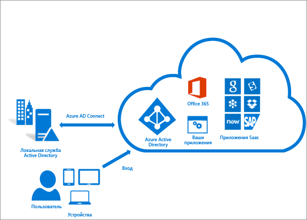
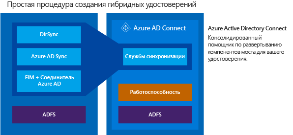

<properties
	pageTitle="Azure AD Connect: интеграция локальных удостоверений с Azure Active Directory | Microsoft Azure"
	description="Azure AD Connect интегрирует локальные каталоги с Azure Active Directory. Таким образом вы сможете предоставить пользователям возможность получать доступ с использованием одного удостоверения для Office 365, Azure и SaaS, интегрированных с Azure AD."
    keywords="Введение в Azure AD Connect, обзор функций Azure AD Connect, что такое Azure AD Connect, установка Аctive Directory."
	services="active-directory"
	documentationCenter=""
	authors="andkjell"
	manager="femila"
	editor=""/>

<tags
	ms.service="active-directory"
	ms.workload="identity"
	ms.tgt_pltfrm="na"
	ms.devlang="na"
	ms.topic="get-started-article"
	ms.date="07/14/2016"
	ms.author="andkjell;billmath"/>

# Интеграция локальных удостоверений с Azure Active Directory
Azure AD Connect интегрирует локальные каталоги с Azure Active Directory. Таким образом вы сможете предоставить пользователям возможность получать доступ с использованием одного удостоверения для приложений Office 365, Azure и программного обеспечения как услуги (SaaS), интегрированных с Azure AD. В этом разделе описаны шаги планирования, развертывания и использования. Здесь представлена коллекция ссылок на статьи, относящиеся к этой области.

<!-- The hardcoded link is a workaround for campaign ids not working in acom links-->

> [AZURE.IMPORTANT] [Azure AD Connect — это лучший способ для подключения локального каталога к Azure AD и Office 365. Если вы пользуетесь Windows Azure Active Directory Sync (DirSync) или Azure AD Sync, настало время перейти на Azure AD Connect, поскольку эти продукты уже устарели, и с 13 апреля 2017 года их поддержка будет прекращена.]( https://azure.microsoft.com/documentation/articles/active-directory-aadconnect-dirsync-deprecated/?WT.mc_id=DirSyncDepACOM)

## Почему Azure AD Connect?
Интеграция локальных каталогов с Azure AD помогает повысить продуктивность пользователей, так как используется единая идентификация для доступа к облачным и локальным ресурсам. Пользователи и организации получат следующие преимущества:

- Пользователи могут использовать единое удостоверение для доступа к локальным приложениям и облачным службам, например Office 365.

- Единое средство, обеспечивающее удобное развертывание для синхронизации и входа в систему.

- Предоставляет новые возможности для ваших сценариев. Azure AD Connect заменяет старые версии средств интеграции удостоверений, такие как DirSync и Azure AD Sync. Дополнительные сведения см. в статье [Сравнение инструментов интеграции каталогов гибридной идентификации](active-directory-hybrid-identity-design-considerations-tools-comparison.md).

### Принципы работы Azure AD Connect
Azure Active Directory Connect состоит из трех основных компонентов: службы синхронизации, необязательного компонента служб федерации Active Directory и компонента для мониторинга, который называется [Azure AD Connect Health](active-directory-aadconnect-health.md).

 

- Синхронизация. Cлужбы синхронизации отвечают за создание пользователей, групп и других объектов. Они также отвечают за согласованность сведений о пользователях и группах в локальной среде и в облаке.
- AD FS. Это необязательная часть Azure AD Connect, которую можно использовать для настройки гибридной среды с помощью локальной инфраструктуры AD FS. Ее можно применять при сложном развертывании, например если нужно обеспечить единый вход с присоединением к домену, принудительное применение политик входа AD и использование смарт-карты или сторонней MFA.
- Мониторинг работоспособности — компонент Azure AD Connect Health реализует надежный мониторинг и предоставляет центральное расположение на портале Azure для просмотра связанных действий. Дополнительные сведения см. в статье [Azure Active Directory Connect Health](active-directory-aadconnect-health.md).

## Установка Azure AD Connect

Вы можете загрузить Azure AD Connect из [Центра загрузки Майкрософт](http://go.microsoft.com/fwlink/?LinkId=615771).

Решение | Сценарий
----- | ----- |
Перед началом работы: [оборудование и предварительные требования](active-directory-aadconnect-prerequisites.md) | <li>Шаги, которые нужно выполнить до установки Azure AD Connect.</li>
[Стандартные параметры](active-directory-aadconnect-get-started-express.md) | <li>Рекомендуемый вариант при наличии AD с одним лесом.</li> <li>Пользователи входят в систему с одним и тем же паролем, используя синхронизацию паролей.</li>
[Настраиваемые параметры](active-directory-aadconnect-get-started-custom.md) | <li>Используется при наличии нескольких лесов. Поддерживает многие локальные [топологии](active-directory-aadconnect-topologies.md).</li> <li>Настройка режима входа, например AD FS для федерации или использования стороннего поставщика удостоверений.</li> <li>Настройка функций синхронизации, таких как фильтрация и обратная запись.</li>
[Обновление из DirSync](active-directory-aadconnect-dirsync-upgrade-get-started.md) | <li>Используется, если есть уже работающий сервер DirSync.</li>
[Переход с Azure AD Sync на Azure AD Connect](active-directory-aadconnect-upgrade-previous-version.md)| <li>Если есть несколько разных способов, зависящих от ваших требований.</li>

[После установки](active-directory-aadconnect-whats-next.md) следует проверить правильность работы системы и назначить пользователям лицензии.

### Следующие шаги по установке Azure AD Connect

Раздел |  
--------- | ---------
Загрузка Azure AD Connect | [Загрузка Azure AD Connect](http://go.microsoft.com/fwlink/?LinkId=615771)
Установка с помощью стандартных параметров | [Экспресс-установка Azure AD Connect](active-directory-aadconnect-get-started-express.md)
Установка с помощью настроенных параметров | [Выборочная установка Azure AD Connect](active-directory-aadconnect-get-started-custom.md)
Обновление из DirSync | [Обновление из средства синхронизации Azure AD (DirSync)](active-directory-aadconnect-dirsync-upgrade-get-started.md)
Действия после установки | [Проверка установки и назначение лицензий ](active-directory-aadconnect-whats-next.md)

### Дополнительные сведения об установке Azure AD Connect

Также требуется подготовиться к [рабочим](active-directory-aadconnectsync-operations.md) вопросам. Может потребоваться наличие резервного сервера, на который можно будет легко перейти в случае [аварии](active-directory-aadconnectsync-operations.md#disaster-recovery). Если планируется часто изменять конфигурацию, следует предусмотреть сервер для [промежуточного режима](active-directory-aadconnectsync-operations.md#staging-mode).

Раздел |  
--------- | ---------
Поддерживаемые топологии | [Топологии Azure AD Connect.](active-directory-aadconnect-topologies.md)
Принципы проектирования | [Принципы проектирования Azure AD Connect](active-directory-aadconnect-design-concepts.md)
Учетные записи, используемые для установки | [Дополнительные сведения об учетных данных и разрешениях Azure AD Connect](active-directory-aadconnect-accounts-permissions.md)
Операционное планирование | [Службы синхронизации Azure AD Connect: рабочие задачи и рекомендации](active-directory-aadconnectsync-operations.md)
Параметры входа пользователя | [Параметры входа в Azure AD Connect](active-directory-aadconnect-user-signin.md)

## Настройка функций синхронизации
Azure AD Connect поставляется с несколькими функциями, которые можно при необходимости включить или они включены по умолчанию. В некоторых сценариях и топологиях может потребоваться дополнительная конфигурация некоторых функций.

[Фильтрация](active-directory-aadconnectsync-configure-filtering.md) используется, если требуется ограничить количество объектов, синхронизируемых с Azure AD. По умолчанию все пользователи, контакты, группы и компьютеры с ОС Windows 10 синхронизируются. Фильтрацию можно изменить в зависимости от доменов, подразделений и атрибутов.

При [синхронизации паролей](active-directory-aadconnectsync-implement-password-synchronization.md) хэш пароля синхронизируется в Active Directory и Azure AD. Пользователи могут использовать один и тот же пароль локально и в облаке, управляя им из одного расположения. Так как при синхронизации паролей в качестве главного источника используется локальная служба Active Directory, вы также можете применить собственную политику паролей.

[Компонент обратной записи паролей](active-directory-passwords-getting-started.md) позволит вашим пользователям изменять и сбрасывать пароли в облаке, а также применять вашу локальную политику паролей.

[Обратная запись устройств](active-directory-aadconnect-feature-device-writeback.md) позволит записать устройство, зарегистрированное в Azure AD, в локальную службу Active Directory, чтобы его можно было использовать для условного доступа.

Функция [предотвращения случайного удаления](active-directory-aadconnectsync-feature-prevent-accidental-deletes.md) включена по умолчанию и защищает облачный каталог от множества одновременных удалений. По умолчанию она позволяет сделать 500 удалений за сеанс. Этот параметр можно изменить в зависимости от размера вашей организации.

[Автоматическое обновление](active-directory-aadconnect-feature-automatic-upgrade.md), которое включено по умолчанию для установок со стандартными параметрами, гарантирует использование последней версии Azure AD Connect.

### Дальнейшие действия по настройке функций синхронизации

Раздел |  
--------- | --------- |
Настройка фильтрации | [Синхронизация Azure AD Connect: настройка фильтрации](active-directory-aadconnectsync-configure-filtering.md)
Синхронизация паролей | [Службы синхронизации Azure AD Connect: реализация синхронизации паролей](active-directory-aadconnectsync-implement-password-synchronization.md)
Обратная запись паролей | [Приступая к работе с компонентами управления паролями](active-directory-passwords-getting-started.md)
Обратная запись устройств | [Включение обратной записи устройств в службе Azure AD Connect](active-directory-aadconnect-feature-device-writeback.md)
Предотвращение случайного удаления | [Синхронизация Azure AD Connect: предотвращение случайного удаления](active-directory-aadconnectsync-feature-prevent-accidental-deletes.md)
Автоматическое обновление | [Azure AD Connect: автоматическое обновление](active-directory-aadconnect-feature-automatic-upgrade.md)

## Настройка синхронизации Azure AD Connect
Синхронизация Azure AD Connect поставляется с конфигурацией по умолчанию, ориентированной на работу с большинством заказчиков и топологий. Тем не менее, возникают ситуации, когда конфигурация по умолчанию не будет работать и ее необходимо скорректировать. Поддерживается внесение изменений, документированных в этом разделе и связанных статьях.

Если вы не работали ранее с топологией синхронизации, вам необходимо ознакомиться с основными сведениями и используемыми терминами, описанными в [технических концепциях](active-directory-aadconnectsync-technical-concepts.md). Azure AD Connect является следующим этапом развития MIIS2003, ILM2007 и FIM2010. Даже если некоторые элементы идентичны, многое также изменилось.

[Конфигурация, используемая по умолчанию](active-directory-aadconnectsync-understanding-default-configuration.md), может включать несколько лесов. В таких топологиях объект пользователя может быть представлен как контакт в другом лесу. У пользователя также может быть связанный почтовый ящик в другом лесу ресурсов. Поведение конфигурации по умолчанию описано в разделе [пользователей и контактов](active-directory-aadconnectsync-understanding-users-and-contacts.md).

Модель конфигурации в синхронизации называется [декларативной подготовкой](active-directory-aadconnectsync-understanding-declarative-provisioning-expressions.md). Потоки дополнительных атрибутов используют [функции](active-directory-aadconnectsync-functions-reference.md) для выражения преобразований атрибутов. Всю конфигурацию можно просмотреть и изучить с помощью средств, поставляемых вместе с Azure AD Connect. Если в конфигурацию необходимо внести изменения, убедитесь, что вы придерживаетесь [рекомендаций](active-directory-aadconnectsync-best-practices-changing-default-configuration.md), упрощающих переход на новые выпуски.

### Следующие действия по настройке синхронизации Azure AD Connect

Раздел |  
--------- | ---------
Все статьи о синхронизации Azure AD Connect | [Службы синхронизации Azure AD Connect](active-directory-aadconnectsync-whatis.md)
Технические концепции | [Синхронизация Azure AD Connect: технические концепции](active-directory-aadconnectsync-technical-concepts.md)
Общие сведения о конфигурации по умолчанию | [Службы синхронизации Azure AD Connect: общие сведения о конфигурации по умолчанию](active-directory-aadconnectsync-understanding-default-configuration.md)
Общее представление о пользователях и контактах | [Синхронизация Azure AD Connect: общее представление о пользователях и контактах](active-directory-aadconnectsync-understanding-users-and-contacts.md)
Декларативная подготовка | [Azure AD Connect Sync: общие сведения о выражениях декларативной подготовки](active-directory-aadconnectsync-understanding-declarative-provisioning-expressions.md)
Изменение конфигурации по умолчанию | [Рекомендации по изменению конфигурации по умолчанию](active-directory-aadconnectsync-best-practices-changing-default-configuration.md)

## Настройка функций федерации
В AD FS можно настроить поддержку [нескольких доменов](active-directory-aadconnect-multiple-domains.md). Например, у вас может быть несколько доменов верхнего уровня, которые необходимо использовать для федерации.

Если на сервере AD FS не настроено автоматическое обновление сертификатов из Azure AD или используется решение, отличное от AD FS, при необходимости [обновления сертификатов](active-directory-aadconnect-o365-certs.md) появится соответствующее уведомление.

### Дальнейшие действия по настройке функций федерации

Раздел |  
--------- | ---------
Все статьи, посвященные AD FS | [Azure AD Connect и федерация](active-directory-aadconnectfed-whatis.md)
Настройка служб AD FS с поддоменами | [Поддержка нескольких доменов для федерации с Azure AD](active-directory-aadconnect-multiple-domains.md)
Управление фермой AD FS | [AD FS management and customizaton with Azure AD Connect](active-directory-aadconnect-federation-management.md) (Управление службой AD FS и ее настройка с помощью Azure AD Connect)
Обновление сертификатов федерации вручную | [Обновление сертификатов федерации для Office 365 и Azure AD](active-directory-aadconnect-o365-certs.md)

## Дополнительные сведения и ссылки

Раздел |  
--------- | --------- |
Журнал версий | [Журнал версий](active-directory-aadconnect-version-history.md)
Сравнение DirSync, Azure ADSync и Azure AD Connect | [Сравнение инструментов интеграции каталогов](active-directory-hybrid-identity-design-considerations-tools-comparison.md)
Список совместимости решений, отличных от AD FS, для Azure AD | [Список совместимости с федерацией Azure AD](active-directory-aadconnect-federation-compatibility.md)
Синхронизированные атрибуты | [Синхронизированные атрибуты](active-directory-aadconnectsync-attributes-synchronized.md)
Мониторинг с помощью Azure AD Connect Health | [Azure AD Connect Health](active-directory-aadconnect-health.md)
Часто задаваемые вопросы | [Azure AD Connect: вопросы и ответы](active-directory-aadconnect-faq.md)

**Дополнительные ресурсы**

Презентация по интеграции локальных и облачных каталогов с конференции Ignite 2015.

>[AZURE.VIDEO microsoft-ignite-2015-extending-on-premises-directories-to-the-cloud-made-easy-with-azure-active-directory-connect]

<!---HONumber=AcomDC_0928_2016-->