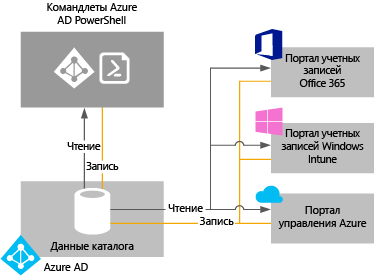

# Управление каталогом Azure AD

## Что такое клиент Azure AD?
В Azure Active Directory (Azure AD) клиент — это выделенный экземпляр Azure AD, который ваша организация получает после регистрации в облачной службе Майкрософт, например Azure или Office 365. Каждый каталог Azure AD отделен от других каталогов Azure AD. Как и офисное здание представляет безопасный актив только для вашей организации, каталог Azure AD также может безопасно использоваться только вашей организацией. Архитектура Azure AD изолирует данные клиента и сведения об идентификации, чтобы пользователи и администраторы одного каталога Azure AD не могли случайно или злонамеренно получить доступ к данным в другом каталоге.

## Как получить каталог Azure AD?
Azure AD предоставляет основные возможности управления каталогами и удостоверениями для большей части облачных служб Майкрософт, таких как:

* Таблицы Azure
* Microsoft Office 365
* Microsoft Dynamics CRM Online
* Microsoft Intune

При регистрации в любой из этих облачных служб Майкрософт вы получите каталог Azure AD. При необходимости вы можете создавать дополнительные каталоги. Например, первый каталог можно сделать рабочим, а затем создать другой каталог для тестирования или промежуточного размещения.

### Использование каталога Azure AD, который поставляется с новой подпиской Azure

Рекомендуется использовать учетную запись администратора, которую вы применяли для первой службы после регистрации в других службах Майкрософт. Сведения, которые вы указываете при первой регистрации в службе Майкрософт, используются для создания нового экземпляра каталога Azure AD для вашей организации. Если этот каталог используется для проверки подлинности при попытках входа в систему, после регистрации в других службах Майкрософт эти службы могут использовать существующие учетные записи пользователей, политики, параметры или интеграцию локального каталога, настроенные в каталоге по умолчанию.

Например, если вы зарегистрировались для подписки на Microsoft Intune, а затем синхронизируете локальный каталог Active Directory с каталогом Azure AD, вы можете зарегистрироваться в другой службе Майкрософт, например Office 365, и использовать те же преимущества интеграции, что и в Microsoft Intune.

Дополнительные сведения об интеграции локального каталога с Azure AD см. в статье [Интеграция локальных каталогов с Azure Active Directory](active-directory-aadconnect.md).

### Привязка существующего каталога Azure AD к новой подписке Azure
Новую подписку Azure можно связать с тем же каталогом, который выполняет проверку подлинности входа для существующей подписки Office 365 или Microsoft Intune. Дополнительные сведения об этом сценарии см. в статье [Передача прав владения подпиской Azure другой учетной записи](../billing/billing-subscription-transfer.md).

### Создание каталога Azure AD при подписке на облачную службу Майкрософт в качестве организации
Если у вас еще нет подписки на облачную службу Майкрософт, используйте одну из приведенных ниже ссылок для регистрации. При регистрации в первой службе каталог Azure AD создается автоматически.

* [Microsoft Azure](https://account.azure.com/organization)
* [Office 365](http://products.office.com/business/compare-office-365-for-business-plans/)
* [Microsoft Intune](https://portal.office.com/Signup/Signup.aspx?OfferId=40BE278A-DFD1-470a-9EF7-9F2596EA7FF9&dl=INTUNE_A&ali=1#0%20)

### Как изменить для подписки каталог по умолчанию

1. Войдите в [Центр управления учетной записью Azure](https://account.azure.com/Subscriptions) с помощью данных администратора учетной записи, чтобы передать права на владение подпиской.
2. Убедитесь, что пользователь, которому вы хотите передать права на владение, находится в целевом каталоге.
3. Щелкните **Перенос подписки**.
4. Укажите получателя. Получателю автоматически приходит сообщение электронной почты со ссылкой, по которой он может принять подписку.
5. Получатель переходит по ссылке и следует инструкциям, в том числе вводит свои данные для оплаты. Подписка передается после успешного выполнения всех действий получателем. 
6. Если передача прав владения прошла успешно, каталог по умолчанию для подписки изменится на каталог, в котором находится пользователь.

Дополнительные сведения см. в статье [Передача прав владения подпиской Azure другой учетной записи](../billing/billing-subscription-transfer.md).

### Управление каталогом по умолчанию в Azure
Когда вы регистрируетесь в Azure, с вашей подпиской связывается каталог Azure AD по умолчанию. Вам не нужно платить за использование Azure AD и каталогов. Есть платные службы Azure AD, которые лицензируются отдельно и предоставляют дополнительные функциональные возможности, например интерфейс входа с фирменной символикой и самостоятельный сброс пароля. Вы также можете создать личный домен, используя собственное DNS-имя вместо стандартного домена *.onmicrosoft.com.

## Управление данными каталога
Чтобы управлять одной или несколькими подписками на облачные службы Майкрософт, используйте для управления данными каталога организации [Центр администрирования Azure AD](https://aad.portal.azure.com), портал учетных записей Microsoft Intune или [Центр администрирования Office 365](https://portal.office.com/). Вы также можете использовать [командлеты PowerShell Azure Active Directory](https://docs.microsoft.com/powershell/azure/active-directory) для управления данными, хранящимися в Azure AD.

С помощью любого из этих порталов (или командлетов) можно:

* создавать учетные записи пользователей и групп и управлять ими;
* управлять связанными облачными службами, на которые подписана ваша организация;
* настраивать локальную интеграцию со службами идентификации и проверки подлинности Azure AD.

Центр администрирования Azure AD, Центр администрирования Office 365, портал учетных записей Microsoft Intune и командлеты Azure AD считывают и записывают данные в одном общем экземпляре Azure AD, связанном с каталогом вашей организации. Каждый из этих инструментов представляет собой внешний интерфейс, который запрашивает или изменяет данные каталога.
Если вы измените данные организации с помощью любого портала или командлета после выполнения входа в одну из этих служб, изменения также отобразятся при следующем входе на другие порталы. Эти данные совместно используются в облачных службах Майкрософт, на которые вы подписаны.

Например, если вы заблокировали вход пользователя с помощью Центра администрирования Office 365, вход в любую другую службу, на которую подписана ваша организация, также будет заблокирован для этого пользователя. Если вы просмотрите учетную запись этого пользователя на портале учетных записей Microsoft Intune, вы также увидите, что она заблокирована.

## Как добавить несколько каталогов и управлять ими?
Вы можете [добавить каталог Azure AD на портал Azure](https://portal.azure.com/#create/Microsoft.AzureActiveDirectory). Введите нужные сведения и нажмите кнопку **Создать**.

Вы можете управлять каждым каталогом как полностью независимым ресурсом: каждый каталог полнофункционален и логически независим от других каталогов, которыми вы управляете. При этом между ними нет связей типа "родительский элемент — дочерний элемент". Такая независимость каталогов подразумевает и независимость ресурсов, административную независимость и независимость синхронизации.

* **Независимость ресурсов**. Если создать или удалить ресурс в одном каталоге, это не повлияет ни на один ресурс в другом каталоге. Для внешних пользователей возможны исключения из этого правила. Если вы используете настраиваемый домен contoso.com с одним каталогом, его невозможно использовать с любым другим каталогом.
* **Административная независимость**.  Если пользователь без прав администратора каталога Contoso создает тестовый каталог Test, тогда:
  
  * У администраторов каталога Contoso нет прямых прав администратора для каталога Test, пока администратор Test явно не предоставит им эти привилегии. Администраторы Contoso могут контролировать доступ к каталогу Test, управляя учетной записью пользователя, создавшего каталог Test.
    
  * Если добавить или удалить роль администратора для пользователя в одном каталоге, это изменение не повлияет на другие роли администратора, которые назначены пользователю в другом каталоге.
* **Независимость синхронизации**. Вы можете настроить каждый клиент Azure AD независимо, чтобы синхронизировать данные с одним экземпляром инструмента синхронизации каталогов Azure AD Connect.

В отличие от других ресурсов Azure каталоги не являются дочерними ресурсами подписки Azure. Поэтому если отменить подписку Azure или дождаться истечения срока ее действия, вы по-прежнему сможете получить доступ к данным каталога с помощью Azure AD PowerShell, Azure Graph API или других интерфейсов, например Центра администрирования Office 365. Можно также связать другую подписку с каталогом.

## Как подготовить каталог Azure AD к удалению
Глобальный администратор может удалить каталог Azure AD с портала. При удалении каталога удаляются и все содержащиеся в нем ресурсы. Прежде чем удалять каталог, убедитесь, что он вам не нужен.

> [!NOTE]
> Если пользователь вошел в рабочую или учебную учетную запись, он не должен пытаться удалить свой домашний каталог. Например, если пользователь входит как joe@contoso.onmicrosoft.com, он не может удалить каталог с доменом по умолчанию contoso.onmicrosoft.com.

Для удаления каталога в Azure AD необходимо выполнение определенных условий. Это уменьшает риск того, что удаление негативно повлияет на работу пользователей или приложения, в частности на возможность пользователей входить в Office 365 или получать доступ к ресурсам в Azure. Например, если каталог для подписки случайно удален, пользователи не смогут получить доступ к ресурсам Azure для этой подписки.

Проверяются следующие условия.

* Только глобальный администратор каталога имеет право удалять каталог. Всех других пользователей следует удалить перед удалением каталога. Если данные пользователей синхронизируются из локальной среды, синхронизацию необходимо отключить, а пользователей нужно удалить из облачного каталога с помощью портала Azure или командлетов Azure PowerShell. Необязательно удалять группы или контакты, такие как контакты, добавленные из Центра администрирования Office 365.
* В каталоге не должно быть ни одного приложения. Все приложения должны быть удалены перед удалением каталога.
* С каталогом не могут быть связаны поставщики многофакторной идентификации.
* С каталогом не должны быть связаны подписки на любые службы Microsoft Online Services, такие как Microsoft Azure, Office 365 или Azure AD Premium. Например, если каталог по умолчанию создан в Azure, его невозможно удалить, если ваша подписка Azure по-прежнему использует его для проверки подлинности. Точно так же нельзя удалить каталог, если у другого пользователя есть связанная с ним подписка. 

## Дополнительная информация
* [Форум Azure AD](https://social.msdn.microsoft.com/forums/azure/en-US/home?forum=windowsazuread)
* [Форум Многофакторной идентификации Azure](https://social.msdn.microsoft.com/Forums/azure/en-US/home?forum=windowsazureactiveauthentication)
* [Вопросы об Azure на сайте StackOverflow](https://stackoverflow.com/questions/tagged/azure-active-directory)
* [PowerShell для Azure Active Directory](https://docs.microsoft.com/powershell/azure/active-directory)
* [Назначение ролей администратора в Azure AD](active-directory-assign-admin-roles-azure-portal.md)
