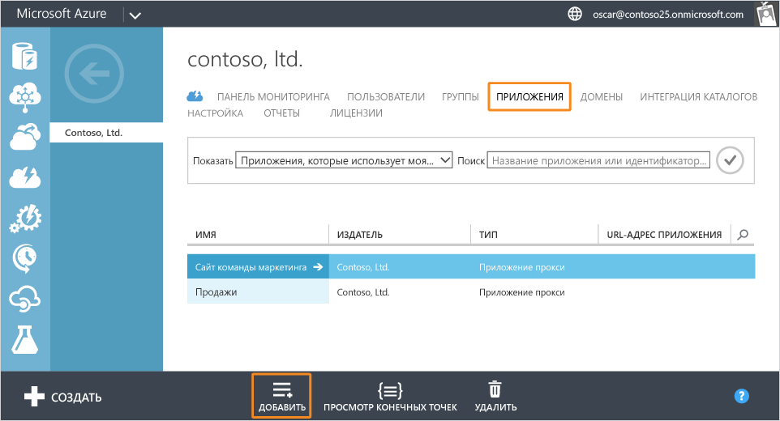
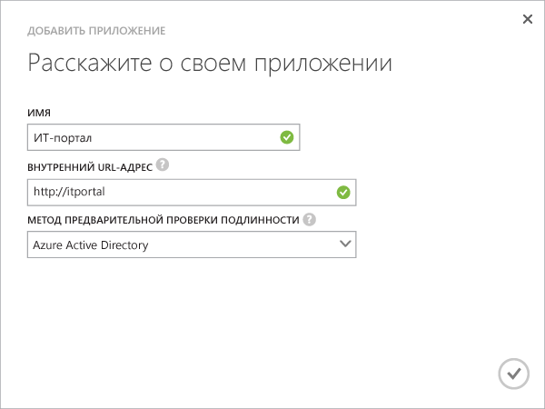
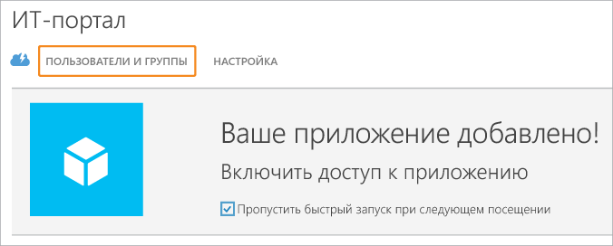
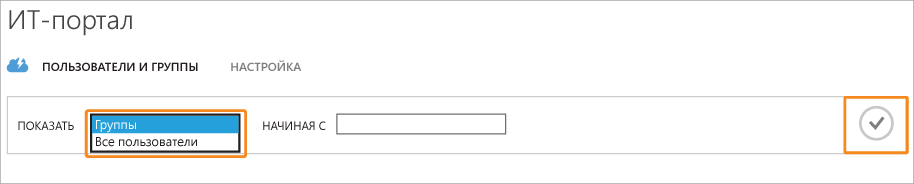
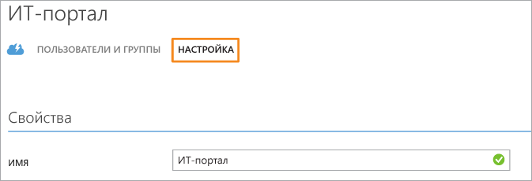

# Публикация приложений с помощью прокси приложения Azure AD

> [!div class="op_single_selector"]
> * [портале Azure](application-proxy-publish-azure-portal.md)
> * [Классический портал Azure](active-directory-application-proxy-publish.md)

Прокси приложения Azure AD обеспечивает поддержку удаленных рабочих ролей. Для этого необходимо опубликовать локальные приложения, чтобы к ним можно было получать доступ через Интернет. На этом этапе у вас уже должен быть [включен прокси приложения на классическом портале Azure](active-directory-application-proxy-enable.md). В этой статье описаны действия, которые необходимо выполнить для публикации приложений, которые работают в локальной сети, и предоставления к ним безопасного удаленного доступа из внешней сети. Ознакомившись с этой статьей, вы сможете указать для приложения личные сведения и настроить необходимые параметры безопасности.

> [!NOTE]
> Прокси приложения — это функция, которая доступна только после обновления до выпуска Premium или Basic службы Azure Active Directory. Дополнительные сведения см. в разделе [Выпуски Azure Active Directory](active-directory-editions.md). Если вы хотите использовать прокси приложения, ознакомьтесь со статьей о [публикации приложений на портале Azure](application-proxy-publish-azure-portal.md).

## Публикация приложения с помощью мастера
1. Войдите на [классический портал Azure](https://manage.windowsazure.com/)как администратор.
2. Перейдите к Active Directory и выберите каталог, в котором включен прокси приложения.
   
    
3. Откройте вкладку **Приложения**, а затем нажмите кнопку **Добавить**, расположенную в нижней части окна.
   
    
4. Выберите **Публикация приложения, которое будет доступно за пределами вашей сети**.
   
    
5. Укажите следующие сведения о приложении:
   
   * **Имя**— понятное имя для вашего приложения. Оно должно быть уникальным в рамках вашего каталога.
   * **Внутренний URL-адрес**— это адрес, используемый соединителем прокси приложения для доступа к приложению вне частной сети. Для публикации можно указать только конкретный адрес на внутреннем сервере; при этом другие адреса сервера не публикуются. Таким образом можно публиковать разные сайты на одном сервере, назначая каждому из них отдельное имя и правила доступа.
     
     > [!TIP]
     > Если вы публикуете путь, он должен включать в себя все необходимые изображения, скрипты и таблицы стилей для вашего приложения. Например, если приложение расположено по адресу https://yourapp/app и использует образы, расположенные по адресу https://yourapp/media, следует опубликовать путь https://yourapp/.
     > 
     > 
   * **Метод предварительной проверки подлинности**— способ, с помощью которого прокси приложения проверяет пользователей, прежде чем предоставить им доступ к приложению. Выберите один из вариантов в раскрывающемся меню.
     
     * Azure Active Directory — прокси приложения перенаправляет пользователей на страницу входа в Azure AD, где будет выполняться проверка подлинности их разрешений для каталога и приложения.
     * Транзитная проверка подлинности — пользователям не нужно выполнять проверку подлинности для доступа к приложению.
     
       
6. Чтобы завершить работу мастера, установите флажок в нижней части экрана. Теперь приложение определено в Azure AD.

## Назначение пользователей и групп для приложения
Чтобы предоставить пользователям доступ к опубликованному приложению, необходимо назначить их по отдельности или в группах. (Не забудьте предоставить доступ и себе.) Каждый назначаемый пользователь должен иметь лицензию на поддержку Azure Basic или более высокого уровня. Дополнительные сведения см. в статье [Azure AD и приложения: назначение пользователей для приложения](active-directory-applications-guiding-developers-assigning-users.md). 

Для приложений, требующих предварительной проверки подлинности, присвоение пользователя предоставляет разрешение для использования приложения. Для приложений, которые не требуют предварительной проверки подлинности, присвоение пользователя означает, что у пользователя есть доступ к приложению через панель доступа.

1. После завершения работы мастера добавления приложений отобразится страница быстрого запуска для приложения. Чтобы управлять тем, кто имеет доступ к приложению, щелкните **Пользователи и группы**.
   
    
2. Выполните поиск конкретных групп в каталоге или выберите вывод списка всех пользователей. Щелкните значок галочки, чтобы увидеть результаты поиска.
   
      
3. Выберите пользователей или группы, которым необходимо назначить это приложение, и щелкните **Назначить**. Вам будет предложено подтвердить действие.

> [!NOTE]
> Для приложений со встроенной проверкой подлинности Windows можно назначить только пользователей и группы, которые синхронизированы в локальной службе Active Directory. Для приложений, опубликованных с помощью прокси приложения Azure Active Directory, нельзя назначить пользователей, использующих для входа учетную запись Майкрософт, а также гостей. Убедитесь, что назначаемые пользователи входят в систему с помощью учетных данных, содержащихся в том же домене, что и публикуемое приложение.
> 
> 

## Тестирование опубликованного приложения
После публикации приложения можно проверить его работу, перейдя по опубликованному URL-адресу. Удостоверьтесь в том, что оно доступно, правильно отображается и что все работает надлежащим образом. Если возникнут проблемы или появится сообщение об ошибке, см. сведения в [руководстве по устранению неполадок](active-directory-application-proxy-troubleshoot.md).

## Настройка приложения
Вы можете изменить опубликованные приложения или настроить дополнительные параметры на странице "Настройка". На этой странице можно изменить имя и загрузить логотип для приложения. Можно также управлять правилами доступа, например, настроить метод предварительной проверки подлинности или многофакторную идентификацию.

После публикации приложений с помощью прокси приложения Azure Active Directory они отображаются в списке приложений в Azure AD, и вы можете управлять ими.

Если отключить службы прокси приложения после публикации приложений, к приложениям нельзя будет получить доступ из-за пределов частной сети. Пользователи по-прежнему могут получать доступ к локальным приложениям.

Чтобы просмотреть приложение и убедиться, что оно доступно, дважды щелкните имя приложения. Если служба прокси приложения отключена и приложение недоступно, в верхней части экрана появится предупреждающее сообщение.

Чтобы удалить приложение, выберите его из списка и щелкните **Удалить**.

## Дальнейшие действия
* [Публикация приложений с помощью доменного имени](active-directory-application-proxy-custom-domains.md)
* [Включение единого входа](active-directory-application-proxy-sso-using-kcd.md)
* [Включение условного доступа](application-proxy-enable-remote-access-sharepoint.md)
* [Работа с приложениями, поддерживающими утверждения](active-directory-application-proxy-claims-aware-apps.md)

Последние новости и обновления см. в [блоге, посвященном прокси приложения](http://blogs.technet.com/b/applicationproxyblog/).

