<properties
   pageTitle="Подробное пошаговое руководство по использованию предварительной версии службы совместной работы Azure Active Directory (Azure AD) B2B | Microsoft Azure"
   description="Служба Azure Active Directory B2B поддерживает взаимодействие между компаниями, позволяя предоставлять бизнес-партнерам выборочный доступ к вашим корпоративным приложениям."
   services="active-directory"
   authors="viv-liu"
   manager="cliffdi"
   editor=""
   tags=""/>

<tags
   ms.service="active-directory"
   ms.devlang="NA"
   ms.topic="article"
   ms.tgt_pltfrm="NA"
   ms.workload="identity"
   ms.date="02/03/2016"
   ms.author="viviali"/>

# Подробное пошаговое руководство по использованию предварительной версии службы совместной работы Azure Active Directory (Azure AD) B2B

В этом пошаговом руководстве описывается использование службы совместной работы Azure AD B2B. Предположим, что вы являетесь ИТ-администратором Contoso и хотите обеспечить совместное использование приложений сотрудниками трех компаний-партнеров. Ни одной компании-партнеру не обязательно иметь Azure AD.

- Алиса из Simple Partner Org.
- Бобу из Medium Partner Org нужен доступ к ряду приложений.
- Кэрол из Complex Partner Org нужен доступ к ряду приложений, а также членство в группах Contoso.

После отправки приглашений пользователям компаний-партнеров можно настроить их в Azure AD и предоставить им доступ к приложениям и членство в группах через портал Azure. Сначала добавим Алису.

## Добавление Алисы в каталог Contoso
1. Создайте CSV-файл с указанными ниже заголовками, заполнив для Алисы значения только в столбцах **Email**, **DisplayName** и **InviteContactUsUrl**. **DisplayName** — это имя, которое будет отображаться в приглашении и каталоге Azure AD компании Contoso. **InviteContactUsUrl** — это ссылка, по которой Алиса может связаться с компанией Contoso. В следующем примере для этого используется профиль компании Contoso в LinkedIn. Важно, чтобы заголовки в первой строке CSV-файла шли в том же порядке и были написаны точно так же, как показано в примере. См. раздел "Формат CSV" ниже. 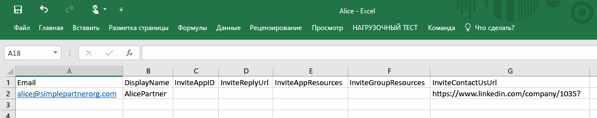

2. На портале Azure добавьте пользователя в каталоге Contoso (Active Directory > Contoso > Пользователи > Добавить пользователя). В раскрывающемся списке "Тип пользователя" выберите "Пользователи в компаниях-партнерах". Передайте CSV-файл. Перед передачей убедитесь в том, что CSV-файл закрыт. 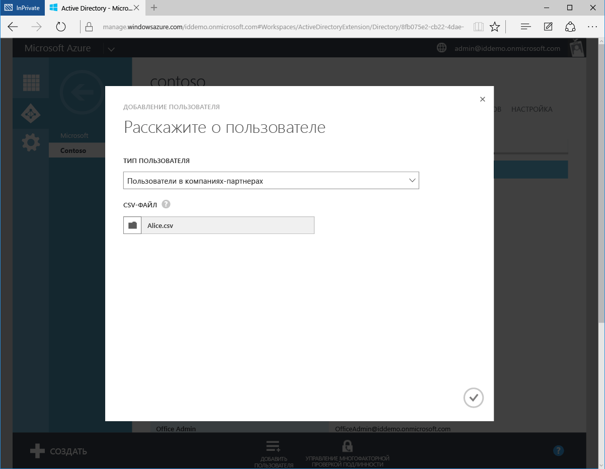

3. Теперь Алиса является внешним пользователем в каталоге Azure AD компании Contoso. 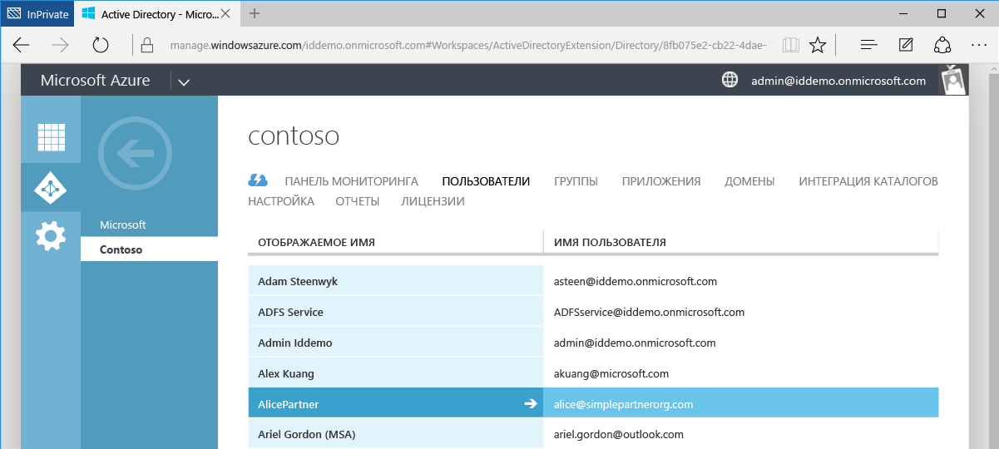

4. Алиса получит следующее письмо по электронной почте. 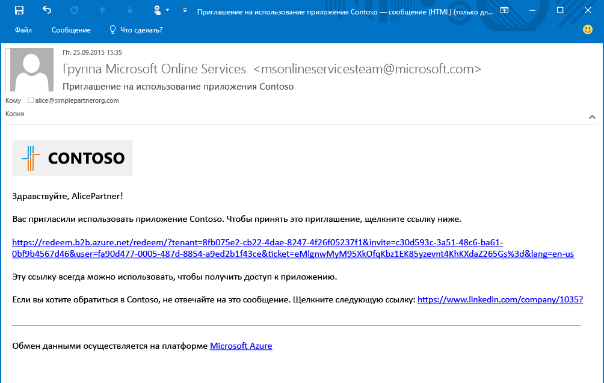

5. Алиса щелкает ссылку, и ей предложено принять приглашение и войти в систему со своими рабочими учетными данными. Если Алиса отсутствует в каталоге Azure AD, ей будет предложено зарегистрироваться. 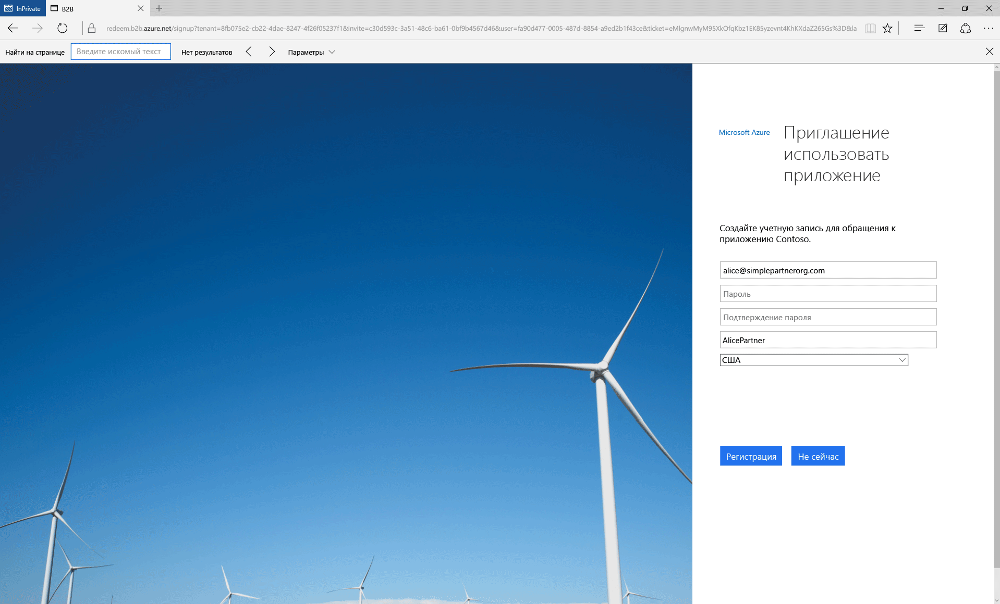

6. Алиса будет перенаправлена в панель доступа к приложениям, которая остается пустой, пока ей не будет предоставлен доступ к приложениям. 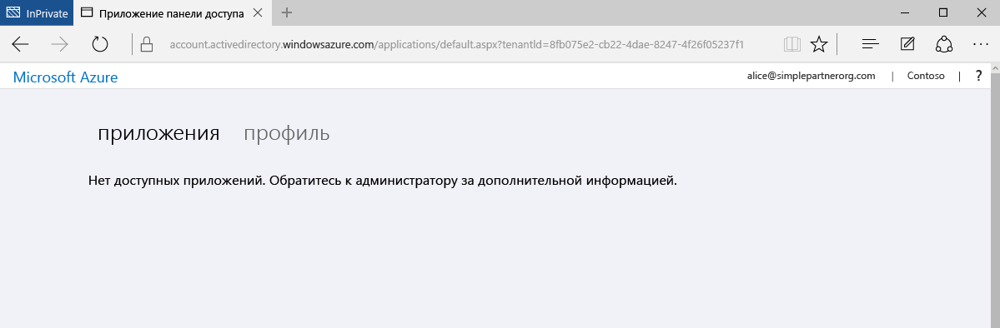

Это самая простая форма совместной работы B2B. Будучи пользователем в каталоге Azure AD компании Contoso, Алиса может получить доступ к приложениям и группам через портал Azure. Теперь давайте добавим Боба, которому нужен доступ к приложениям Moodle и Salesforce.

## Добавление Боба в каталог Contoso и предоставление доступа к приложениям
1. Чтобы узнать идентификаторы приложений Moodle и Salesforce, воспользуйтесь Windows PowerShell с установленным модулем Azure AD. Получить идентификаторы можно с помощью командлета: `Get-MsolServicePrincipal | fl DisplayName, AppPrincipalId`. Он выводит список всех доступных приложений в Contoso и их идентификаторы AppPrincialId. 

2. Создайте CSV-файл, указав для Боба параметры Email, DisplayName, **InviteAppID**, **InviteAppResources** и InviteContactUsUrl. В столбце **InviteAppResources** через пробелы указываются идентификаторы AppPrincipalId приложений Moodle и Salesforce, полученные в PowerShell. Здесь идентификаторы, соответствующие идентификаторам на снимке экрана PowerShell выше, подчеркнуты зеленой и синей полосой. В столбце **InviteAppId** указывается тот же идентификатор AppPrincipalId для приложения Moodle, который обеспечивает фирменную настройку электронной почты и страниц входа. 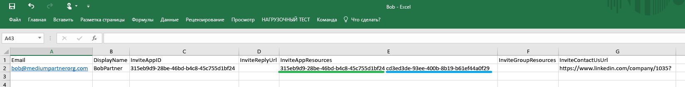

3. Передайте CSV-файл на портал Azure, как и для Алисы. Теперь Боб является внешним пользователем в каталоге Azure AD компании Contoso.

4. Боб получит следующее письмо по электронной почте. 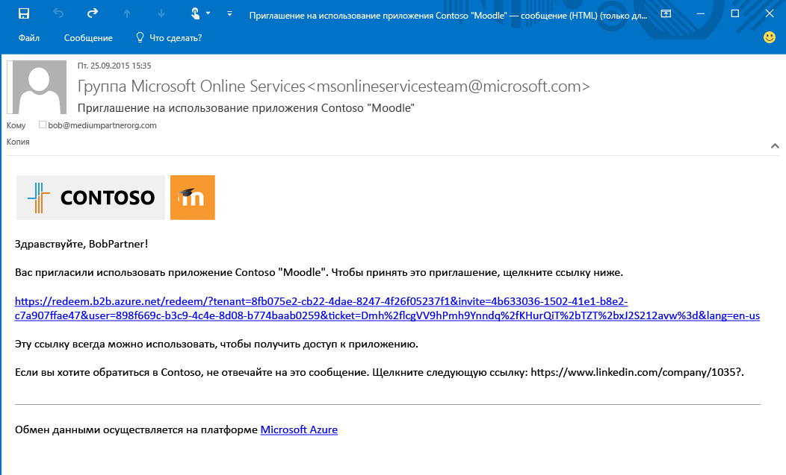

5. Боб щелкнет ссылку, и ему будет предложено принять приглашение. После входа в систему он направляется к панели доступа, где для него уже доступны приложения Moodle и Salesforce. 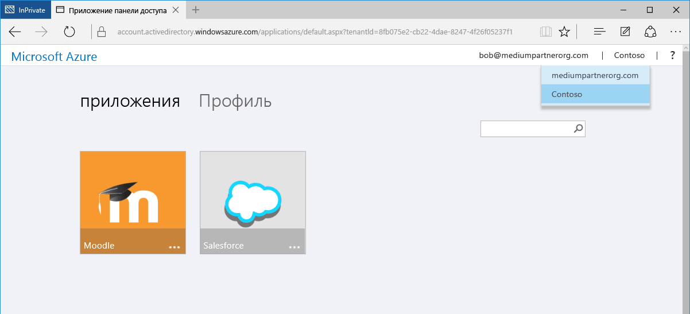

Далее мы добавим Кэрол, которой нужен доступ к приложениям, а также членство в группах каталога Contoso.

## Добавление Кэрол в каталог Contoso, предоставление доступа к приложениям и предоставление членства в группах

1. Чтобы узнать идентификаторы приложений и групп в каталоге Contoso, воспользуйтесь Windows PowerShell с установленным модулем Azure AD.
 - Получите идентификатор AppPrincipalId с помощью командлета `Get-MsolServicePrincipal | fl DisplayName, AppPrincipalId`, как для Боба.
 - Получите идентификатор ObjectId для групп с помощью командлета `Get-MsolGroup | fl DisplayName, ObjectId`. Он выводит список всех групп в Contoso и их идентификаторы ObjectId. Идентификаторы групп также отображаются как идентификаторы объекта на вкладке свойств группы на портале Azure. 

2. Создайте CSV-файл, указав для Кэрол параметры Email, DisplayName, InviteAppID, InviteAppResources, **InviteGroupResources** и InviteContactUsUrl. В столбце **InviteGroupResources** через пробел указываются идентификаторы ObjectId для групп MyGroup1 и Externals. 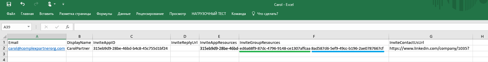

3. Передайте CSV-файл на портал Azure.

4. Кэрол теперь является пользователем в каталоге Contoso, а также членом групп MyGroup1 и Externals, как видно на портале Azure. 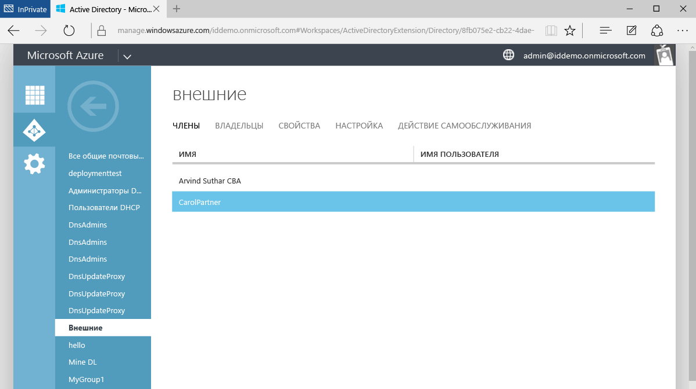

5. Кэрол получит письмо по электронной почте со ссылкой для принятия приглашения. После входа в систему она будет перенаправлена на панель доступа к приложениям, где ей будут доступны Moodle и Salesforce.

Так добавляют пользователей из компаний-партнеров в службу совместной работы Azure AD B2B. В этом пошаговом руководстве показано добавление Алисы, Боба и Кэрол в трех отдельных CSV-файлах, однако для простоты их можно добавить вместе в одном CSV-файле. 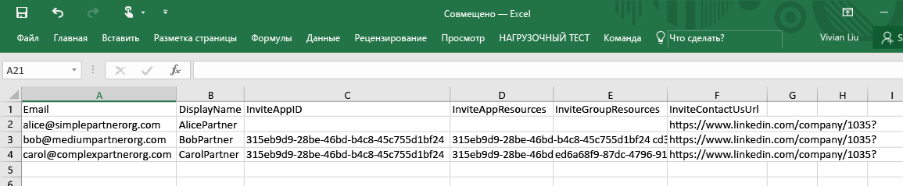

## Связанные статьи
Другие статьи о службе совместной работы Azure AD B2B:

- [Что такое служба совместной работы Azure AD B2B?](active-directory-b2b-what-is-azure-ad-b2b.md)
- [Принцип работы](active-directory-b2b-how-it-works.md)
- [Справка по формату CSV-файла](active-directory-b2b-references-csv-file-format.md)
- [Формат токена внешнего пользователя](active-directory-b2b-references-external-user-token-format.md)
- [Изменение атрибутов объекта внешнего пользователя](active-directory-b2b-references-external-user-object-attribute-changes.md)
- [Текущие ограничения предварительной версии](active-directory-b2b-current-preview-limitations.md)

<!---HONumber=AcomDC_0204_2016-->