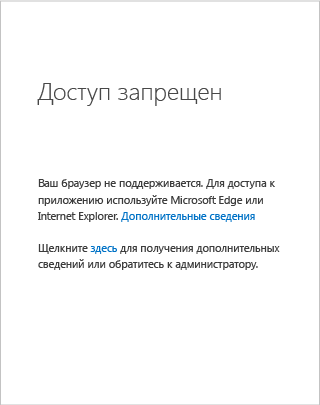
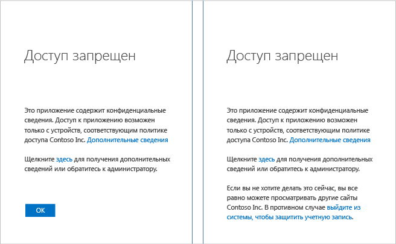

# Неполадки с доступом на устройстве Windows

Например, при попытке получить доступ к интрасети SharePoint Online вашей организации может отобразиться страница с сообщением *об отказе в доступе*. Так происходит, потому что ваш администратор настроил политику условного доступа, которая запрещает доступ к ресурсам организации при определенных условиях. Зачастую для устранения проблемы необходимо обратиться в службу технической поддержки или к администратору, однако существует несколько способов, которые могут помочь справиться с проблемой самостоятельно.

Если вы используете устройство с **Windows**, необходимо проверить следующее:

- Используется ли поддерживаемый браузер?

- Поддерживает ли ваше устройство версию Windows?

- Соответствует ли устройство требованиям?

## Поддерживаемый браузер

Если администратор настроил политику условного доступа, вы можете получить доступ к ресурсам организации с помощью поддерживаемого браузера. Устройства с Windows поддерживают только **Internet Explorer** и **Edge**.

В разделе со сведениями на странице ошибки можно легко определить, используется ли неподдерживаемый браузер для получения доступа к ресурсам:

В этом случае для получения доступа к приложению нужно использовать браузер, поддерживаемый платформой устройства. Полный список поддерживаемых браузеров см. [здесь](active-directory-conditional-access-supported-apps.md).  

## Поддерживаемые версии Windows

Для устройств под управлением операционной системы Windows должны выполняться следующие условия: 

- Используйте Windows 7 или более позднюю версию для настольных устройств под управлением Windows.
- Используйте Windows 2008 R2 или более позднюю версию для устройств под управлением операционной системы Windows. 

## Устройства, соответствующие требованиям

Ваш администратор может настроить политику условного доступа, которая разрешает доступ к ресурсам организации только при использовании устройств, соответствующих требованиям. В соответствии с требованиями устройство нужно присоединить к локальной службе Active Directory или к Azure Active Directory.

В разделе со сведениями на странице ошибки можно легко определить, используется ли несоответствующее устройство для получения доступа к ресурсам:
 

### Присоединено ли устройство к локальной службе Active Directory?

**Если устройство присоединено к локальной службе Active Directory организации, сделайте следующее:**

1. Войдите в Windows, используя рабочую учетную запись (учетную запись Active Directory).
2. Подключитесь к корпоративной сети через виртуальную частную сеть (VPN) или DirectAccess.
3. После подключения заблокируйте сеанс Windows, нажав клавиши Windows+L.
4. Разблокируйте сеанс Windows, указав учетные данные рабочей учетной записи.
5. Подождите минуту и попробуйте получить доступ к приложению или службе еще раз.
6. Если отобразится та же страница, щелкните ссылку **Дополнительные сведения**, а затем свяжитесь с администратором и предоставьте ему соответствующие сведения.

### Устройство не присоединено к локальной службе Active Directory?

Если устройство не присоединено к локальной службе Active Directory и работает под управлением Windows 10, у вас есть два варианта доступа:

* Выполнить присоединение к Azure AD.
* Добавить свою рабочую или учебную учетную запись в Windows.

Дополнительные сведения о различиях между этими вариантами см. в статье [Устройства под управлением Windows 10 в вашей рабочей области](active-directory-azureadjoin-windows10-devices.md).  
Если ваше устройство:

- принадлежит вашей организации, выполните присоединение к Azure AD;
- является личным или Windows Phone, добавьте свою рабочую или учебную учетную запись в Windows. 

#### Присоединение к Azure AD в Windows 10

Процедура подключения устройства к Azure AD зависит от запущенной версии Windows 10. Чтобы определить версию операционной системы Windows 10, выполните команду **winver**: 

**Юбилейное обновление Windows 10 (версия 1607):**

1. Откройте приложение **Параметры** .
2. Щелкните **Учетные записи** > **Доступ к учетной записи места работы или учебного заведения**.
3. Щелкните **Подключить**.
4. Щелкните **Присоединить это устройство к Azure Active Directory**.
5. Пройдите проверку подлинности в организации, при появлении соответствующего запроса предоставьте подтверждение многофакторной проверки подлинности и выполните описанные действия.
6. Выйдите из системы и войдите, используя рабочую учетную запись.
7. Попробуйте получить доступ к приложению еще раз.

**Обновление Windows 10 от ноября 2015 г. (версия 1511):**

1. Откройте приложение **Параметры** .
2. Щелкните **Система** > **Сведения**.
3. Щелкните **Присоединиться к Azure AD**.
4. Пройдите проверку подлинности в организации, при появлении соответствующего запроса предоставьте подтверждение многофакторной проверки подлинности и выполните описанные действия.
5. Выйдите из системы и войдите, используя рабочую учетную запись (Azure AD).
6. Попробуйте получить доступ к приложению еще раз.

#### Присоединение к рабочей области в Windows 8.1

Если устройство не присоединено к домену и работает под управлением Windows 8.1, чтобы подключиться к рабочему месту и зарегистрироваться в Microsoft Intune, сделайте следующее:

1. Откройте раздел **Параметры ПК**.
2. Щелкните **Сеть** > **Рабочее место**.
3. Щелкните **Соединить**.
4. Пройдите проверку подлинности в организации, при появлении соответствующего запроса предоставьте подтверждение многофакторной проверки подлинности и выполните описанные действия.
5. Щелкните **Включить**.
6. Попробуйте получить доступ к приложению еще раз.

#### Добавить свою рабочую или учебную учетную запись в Windows. 

**Юбилейное обновление Windows 10 (версия 1607):**

1. Откройте приложение **Параметры** .
2. Щелкните **Учетные записи** > **Доступ к учетной записи места работы или учебного заведения**.
3. Щелкните **Подключить**.
4. Пройдите проверку подлинности в организации, при появлении соответствующего запроса предоставьте подтверждение многофакторной проверки подлинности и выполните описанные действия.
5. Попробуйте получить доступ к приложению еще раз.

**Обновление Windows 10 от ноября 2015 г. (версия 1511):**

1. Откройте приложение **Параметры** .
2. Щелкните **Учетные записи** > **Ваши учетные записи**.
3. Щелкните **Добавить рабочую или учебную учетную запись**.
4. Пройдите проверку подлинности в организации, при появлении соответствующего запроса предоставьте подтверждение многофакторной проверки подлинности и выполните описанные действия.
5. Попробуйте получить доступ к приложению еще раз.

## Дополнительная информация
[Условный доступ в Azure Active Directory](active-directory-conditional-access-azure-portal.md)

