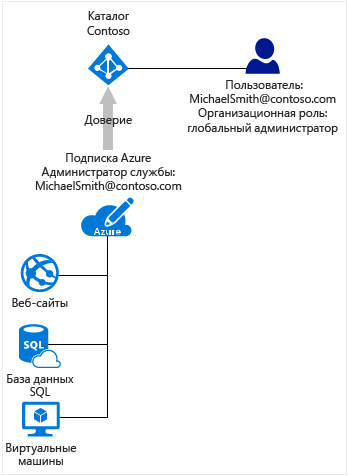

# Связь между подписками Azure и службой Azure Active Directory
В этой статье приведены сведения о связи между подпиской Azure и службой Azure Active Directory (Azure AD).

## Связь между подпиской Azure и Azure AD
Подписка Azure связана с Azure AD отношением доверия. Это означает, что подписка доверяет каталогу проверку подлинности пользователей, служб и устройств. Несколько подписок могут доверять одному и тому же каталогу, но одна конкретная подписка доверяет только одному каталогу. 

Это отношение доверия между подпиской и каталогом отличается от связи подписки с другими ресурсами в Azure (веб-сайтами, базами данных и т. д.). Если срок действия подписки истекает, доступ к другим ресурсам, связанным с этой подпиской, также прекращается. Но каталог остается в Azure, и вы можете связать другую подписку с этим каталогом и продолжать управлять пользователями каталога.

Принцип работы Azure AD отличается от принципа работы других служб в подписке Azure. Другие службы Azure подчиняются подписке Azure. Но каталоги, которые вы видите в Azure AD, не зависят от подписки. Доступ к каталогам зависит от пользователя, выполнившего вход.

Все пользователи относятся к единому домашнему каталогу, который проверяет их подлинность. Они также могут быть гостями в других каталогах. В Azure AD вы увидите только каталоги, членом которых является ваша учетная запись пользователя. Каталог также можно синхронизировать с локальным каталогом Active Directory.

## Azure AD и подписки на облачные службы
Azure AD предоставляет основные возможности управления каталогами и удостоверениями для большей части облачных служб Майкрософт, таких как:

* Таблицы Azure
* Microsoft Office 365
* Microsoft Dynamics CRM Online
* Microsoft Intune

При регистрации в любой из этих облачных служб Майкрософт вы бесплатно получите службу Azure AD. Чтобы добавить другие подписки Azure в каталог Azure AD, войдите в учетную запись Майкрософт. Например, если вы зарегистрировались в Azure с помощью учетной записи Майкрософт, а также зарегистрировались в другой облачной службе Майкрософт с помощью рабочей или учебной учетной записи, у вас есть два экземпляра Azure AD:
1. Каталог по умолчанию для подписки Azure. Вы можете добавить другую подписку Azure в этот или другие созданные вами каталоги, если войдете в систему с помощью учетной записи Майкрософт, так как для нее можно выполнить проверку подлинности Azure.
2. Домашний каталог для рабочей или учебной учетной записи. Если вы вошли в Azure с помощью рабочей или учебной учетной записи, вы не можете добавить подписку Azure в существующий каталог, так как рабочая или учебная учетная запись не может пройти проверку подлинности непосредственно в Azure. 
 
Дополнительные сведения об изменении администратора подписки Azure см. в статье [Передача прав владения подпиской Azure другой учетной записи](../billing/billing-subscription-transfer.md).

## Рекомендации для управления подпиской и каталогом
Управление ресурсами, привязанными к подписке Azure, осуществляется с помощью административных ролей для подписки Azure. В этом разделе описаны различия между ролью администратора подписки Azure и ролью администратора каталога Azure AD. Сведения о ролях администраторов и рекомендации по управлению подпиской см. в статье [Назначение ролей администратора в Azure Active Directory](active-directory-assign-admin-roles.md).

По умолчанию при регистрации вам назначается роль администратора службы. Если другим пользователям нужно войти в систему и получить доступ к службам с помощью той же подписки, их можно добавить как соадминистраторов. 

Для управления функциями, связанными с каталогом и идентификацией, в Azure AD имеется другой набор ролей администратора. Например, глобальный администратор каталога может добавлять пользователей и группы в каталог либо требовать выполнения многофакторной проверки подлинности для пользователей. Пользователю, который создает каталог, назначается роль глобального администратора. Такие пользователи могут назначать роли администраторов другим пользователям. Роли администраторов Azure AD также используются другими службами, например Office 365 и Microsoft Intune. 

Администраторы подписки Azure и администраторы каталога Azure AD — это две разные роли. 
* Администраторы подписки Azure могут управлять ресурсами в Azure, а также использовать Azure AD на портале Azure (так как портал Azure представляет собой ресурс Azure). 
* Администраторы каталога могут управлять свойствами только в каталоге Azure AD.

Пользователю можно назначить обе эти роли, но это не обязательно. Пользователю может быть назначена роль глобального администратора каталога. Но его нельзя назначить в качестве администратора службы или соадминистратора подписки Azure. Если пользователь не является администратором подписки, он может войти на портал Azure, но не может управлять каталогами этой подписки на портале. Этот пользователь может управлять каталогами с помощью других средств, например Azure AD PowerShell или Центра администрирования Office 365.

## Дальнейшие действия
* Дополнительные сведения об изменении администратора подписки Azure см. в статье [Передача прав владения подпиской Azure другой учетной записи](../billing/billing-subscription-transfer.md).
* Дополнительные сведения о том, как осуществляется доступ к ресурсам в Microsoft Azure, см. в статье [Основные сведения о доступе к ресурсам в Azure](active-directory-understanding-resource-access.md).
* Дополнительные сведения о назначении ролей в Azure AD см. в статье [Назначение ролей администратора в Azure Active Directory](active-directory-assign-admin-roles-azure-portal.md).

<!--Image references-->
[1]: ./media/active-directory-how-subscriptions-associated-directory/WAAD_PassThruAuth.png
[2]: ./media/active-directory-how-subscriptions-associated-directory/WAAD_OrgAccountSubscription.png
[3]: ./media/active-directory-how-subscriptions-associated-directory/WAAD_SignInDisambiguation.PNG

