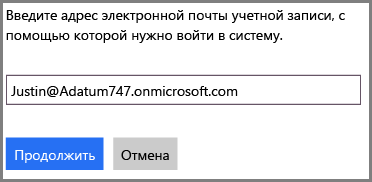
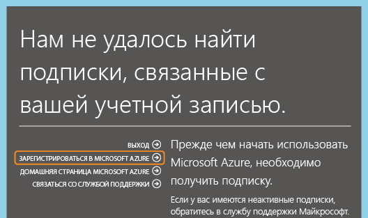
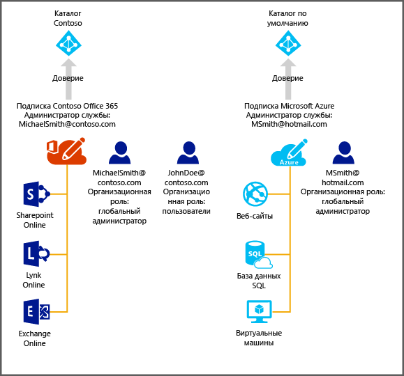

<properties
   pageTitle="Управление каталогом для подписки Office 365 в Azure | Microsoft Azure"
   description="Управление каталогом учетной записи подписки Office 365 с помощью Azure Active Directory и классического портала Azure."
   services="active-directory"
   documentationCenter=""
   authors="curtand"
   manager="stevenpo"
   editor=""/>

<tags
   ms.service="active-directory"
   ms.devlang="na"
   ms.topic="article"
   ms.tgt_pltfrm="na"
   ms.workload="identity"
   ms.date="12/01/2015"
   ms.author="curtand"/>

#Управление каталогом для подписки Office 365 в Azure

В этой статье описывается управление каталогом, созданным для подписки Office 365, на классическом портале Azure. Выполнение представленных ниже действий зависит от того, имеется ли уже подписка на Azure. Для входа на классический портал Azure вы должны быть администратором служб или соадминистратором подписки Azure.

Если вы еще не оформили подписку Azure, вам нужно просто зарегистрироваться в Azure с помощью той же рабочей учетной записи, которую вы используете для входа в Office 365.

Найти соответствующую подписку Azure не удастся, однако можно щелкнуть **Зарегистрироваться в Azure**, после чего в форму регистрации будет подставлена нужная информация из учетной записи Office 365. По умолчанию этой же учетной записи будет назначена роль администратора служб.

По заверении оформления подписки Azure можно войти на классический портал Azure и приступить к работе со службами Azure. Щелкните расширение Active Directory для управления тем же каталогом, который проверяет подлинность ваших пользователей Office 365.

Если у вас уже есть подписка Azure, то организовать управление дополнительным каталогом также не составит никакого труда. На схеме ниже демонстрируется этот процесс.

В этом примере у пользователя Michael Smith есть подписка Office 365 для Contoso.com. У него есть подписка Azure, которую он оформил с помощью учетной записи Майкрософт (msmith@hotmail.com). В этом случае он управляет двумя каталогами.

| Подписка | Office 365 | Таблицы Azure |
|  -------------- | ------------- | ------------------------------- |
| Отображаемое имя | Contoso | Каталог по умолчанию |
| Доменное имя | contoso.com | msmithhotmail.onmicrosoft.com |

Для управления удостоверениями пользователей он желает использовать каталог Contoso, тогда как в Azure он вошел с использованием учетной записи Майкрософт, поэтому он может включить функции Azure AD, такие как многофакторная проверка подлинности.

В этом случае два каталога не зависят друг от друга.

##Управление двумя независимыми каталогами
Чтобы пользователь Michael Smith получил возможность управлять обоими каталогами, оставаясь при этом в Azure в качестве msmith@hotmail.com, ему необходимо выполнить указанные ниже действия.

> [AZURE.NOTE]Эти действия можно выполнить только в том случае, если пользователь вошел систему с помощью учетной записи Майкрософт. Если пользователь вошел в систему с помощью рабочей учетной записи, вариант **Использовать существующий каталог** будет недоступен, так как проверку подлинности рабочей учетной записи может выполнять только его домашний каталог (то есть каталог, где хранится рабочая учетная запись и которым владеет организация).

1.	Войдите на классический портал Azure в качестве msmith@hotmail.com.
2.	Щелкните **Создать** > **Службы приложений** > **Active Directory** > **Каталог** > **Настраиваемое создание**.
3.	Щелкните "Использовать существующий каталог" и установите флажок **Я готов к выходу из системы**.
4.	Войдите на классический портал Azure в качестве глобального администратора Contoso.onmicrosoft.com (например, msmith@contoso.com)).
5.	При появлении запроса **Использовать каталог Contoso с Azure?** нажмите **Продолжить**.
6.	Щелкните **Выйти сейчас**.
7.	Войдите на классический портал Azure в качестве msmith@hotmail.com. Каталог Contoso и каталог по умолчанию отобразятся в расширении Active Directory.

После выполнения этих действий пользователь msmith@hotmail.com будет являться глобальным администратором каталога Contoso.

##Администрирование ресурсов в качестве глобального администратора
Теперь предположим, что пользователю John Doe необходимо войти на классический портал Azure и приступить к администрированию веб-сайтов и ресурсов базы данных, которые связаны с подпиской Azure пользователя msmith@hotmail.com. Для этого пользователю Michael Smith необходимо дополнительно выполнить указанные ниже действия.

1.	Войдите на классический портал Azure, используя учетную запись администратора служб подписки Azure (в данном примере — msmith@hotmail.com)).
2.	Перенесите подписку в каталог Contoso: щелкните **Параметры** > **Подписки** > выберите подписку > **Изменить каталог** и выберите **Contoso (Contoso.com)**. В процессе переноса любые рабочие учетные записи соадминистраторов подписки будут удалены.
3.	Добавьте пользователя John Doe в качестве соадминистратора подписки: щелкните **Параметры** > **Администраторы** > выберите подписку > **Добавить** и введите ****JohnDoe@Contoso.com**.

##Дальнейшие действия
Дополнительные сведения о связях между подписками и каталогами см. в разделе [Как подписки Azure связаны с Azure AD](active-directory-how-subscriptions-associated-directory.md).

<!---HONumber=AcomDC_1203_2015-->