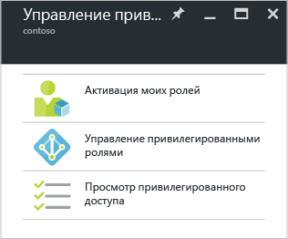

<properties
   pageTitle="Приступая к работе с управлением привилегированными пользователями Azure AD | Microsoft Azure"
   description="Сведения о том, как управлять привилегированными удостоверениями с помощью приложения для управления привилегированными пользователями Azure Active Directory на портале Azure."
   services="active-directory"
   documentationCenter=""
   authors="kgremban"
   manager="femila"
   editor=""/>

<tags
   ms.service="active-directory"
   ms.devlang="na"
   ms.topic="get-started-article"
   ms.tgt_pltfrm="na"
   ms.workload="identity"
   ms.date="09/16/2016"
   ms.author="kgremban"/>

# Приступая к работе с управлением привилегированными пользователями Azure AD

С помощью управления привилегированными пользователями в Azure Active Directory (AD) можно администрировать, контролировать и отслеживать доступ в пределах организации, в том числе доступ к ресурсам в Azure AD и остальным веб-службам Microsoft, таким как Office 365 или Microsoft Intune.

В этой статье рассказывается, как добавить приложение Azure AD PIM на панель мониторинга портала Azure.

## Добавление приложения для управления привилегированными пользователями

Прежде чем вы сможете работать с приложением для управления привилегированными пользователями Azure AD, его необходимо добавить на панель мониторинга портала Azure.

1. Войдите на [портал Azure](https://portal.azure.com/) как глобальный администратор нужного каталога.
2. Если в организации имеется несколько каталогов, выберите свое имя пользователя в правом верхнем углу на портале Azure. Выберите каталог, где будет использоваться PIM.
3. Выберите **Другие службы** и введите **Azure AD Privileged Identity Management** в текстовом поле "Фильтр".
4. Установите флажок **Закрепить на панели мониторинга** и нажмите кнопку **Создать**. Откроется приложение Privileged Identity Management.

Если вы первый пользователь, использующий управление привилегированными пользователями Azure AD в каталоге, запустится [мастер защиты](active-directory-privileged-identity-management-security-wizard.md), который поможет вам выполнить первое назначение. После этого вы автоматически станете первым **администратором безопасности** и **администратором привилегированных ролей** каталога. Доступ к этому приложению для управления правами доступа других администраторов есть только у администратора привилегированных ролей.

## Переход к задачам

После настройки приложения Azure AD Privileged Identity Management при каждом его запуске будет отображаться колонка навигации. Ее можно использовать для выполнения задач по управлению пользователями.

- Задача **Активация моих ролей** открывает список назначенных вам ролей. С ее помощью можно активировать любую назначенную вам роль.

- Панель мониторинга для администраторов привилегированных ролей **Управление привилегированными ролями** позволяет управлять назначениями ролей, изменять параметры активации роли, выполнять проверки доступа и многое другое. Параметры на этой панели мониторинга отключены для всех, кто не является администратором привилегированных ролей.

- **Просмотр привилегированного доступа** перенаправляет вас к незавершенным проверкам доступа (для себя или для кого-то другого), которые нужно завершить.

<!--Every topic should have next steps and links to the next logical set of content to keep the customer engaged-->
## Дальнейшие действия

В разделе, посвященном [обзору управления привилегированными пользователями Azure AD](active-directory-privileged-identity-management-configure.md), содержатся дополнительные сведения об управлении административным доступом в организации.

[AZURE.INCLUDE [active-directory-privileged-identity-management-toc](../../includes/active-directory-privileged-identity-management-toc.md)]

<!--Image references-->

[1]: ./media/active-directory-privileged-identity-management-configure/PIM_EnablePim.png

<!---HONumber=AcomDC_0921_2016--->