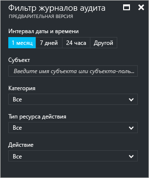
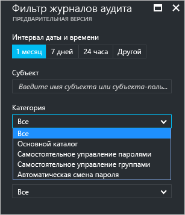
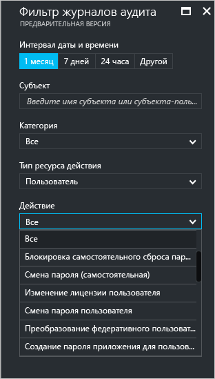
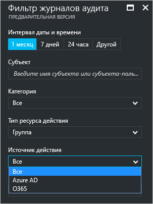

# Отчеты о действиях аудита на портале Azure Active Directory (предварительная версия)

Функция отчетов в [предварительной версии](active-directory-preview-explainer.md) Azure Active Directory позволяет получать всю необходимую информацию, чтобы определить, как работает среда.

Архитектура создания отчетов в Azure Active Directory состоит из следующих компонентов.

- **Действие** 
    - **Действия входа** — информация об использовании управляемых приложений и действиях входа.
    - **Журналы аудита** — данные системных операций об управлении пользователями и группами, об управляемых приложениях и действиях с каталогами.
- **Безопасность** 
    - **Входы, представляющие риск**. Вход, представляющий риск, означает, что в систему пытался войти пользователь, который не является законным владельцем учетной записи. Дополнительные сведения см. в разделе "Вход, представляющий риск".
    - **Пользователи, находящиеся в группе риска**. Такая пометка означает, что конфиденциальность учетной записи пользователя, возможно, нарушена. Дополнительные сведения см. в разделе "Пользователи, помеченные для события риска".

В этом разделе содержатся общие сведения о действиях аудита.
 
## Журналы аудита

Журналы аудита в Azure Active Directory содержат записи о действиях системы (необходимые для соответствия требованиям).

Есть три основные категории, в рамках которых выполняется аудит действий на портале Azure:

- Пользователи и группы   

- приложениям

- Каталог   

Полный список событий отчета аудита см. в разделе [Список событий отчета аудита](active-directory-reporting-audit-events.md#list-of-audit-report-events).

Знакомство с данными аудита следует начать с **журналов аудита** в разделе **Действие** службы **Azure Active Directory**.

В журнале аудита доступно представление списка, в котором отображаются субъекты (*кто*), действия (*что*) и целевые объекты.

Щелкнув элемент в представлении списка, вы получите дополнительные сведения о нем.

## Журналы аудита пользователей и групп

Отчеты аудита, касающиеся пользователей и групп, дают возможность ответить на такие вопросы:

- Обновления каких типов были применены к пользователям?

- Сколько пользователей было изменено?

- Сколько паролей было изменено?

- Что делал администратор в каталоге?

- Какие группы были добавлены?

- В каких группах произошли изменения членства?

- Изменены ли владельцы групп?

- Какие лицензии были назначены пользователю или группе?

Если нужно только просмотреть данные аудита, связанные с пользователями и группами, отфильтрованное представление вы можете найти, щелкнув элемент **Журналы аудита** в разделе **Действие** колонки **Пользователи и группы**.

## Журналы аудита приложений
Отчеты аудита, касающиеся приложений, дают возможность ответить на такие вопросы:

* Какие приложения были добавлены или обновлены?
* Какие приложения были удалены?
* Изменился ли участник-служба для приложения?
* Изменены ли имена приложений?
* Кто дал согласие на использование приложения?

Если нужно только просмотреть данные аудита, связанные с приложениями, отфильтрованное представление вы можете найти, щелкнув элемент **Журналы аудита** в разделе **Действие** колонки **Корпоративные приложения**.

## Фильтрация журналов аудита
Чтобы ограничить отображаемые данные, вы можете отфильтровать сведения о входах с помощью следующих полей:

- Дата и время

- имя участника-пользователя cубъекта;

- Категория

- Тип ресурса действия

- Действие

Фильтр **Категория** позволяет сузить область, охватываемую отчетом аудита, с помощью следующих категорий:

- "Core Directory" (Основной каталог);

- "Self-service Password Management" (Самостоятельное управление паролями);

- "Self-service Group Management" (Самостоятельное управление группами);

- "Automated Password Rollover" (Автоматическая смена пароля) 

Содержимое списка **Activity resource type** (Тип ресурса действия) связано с точкой входа в эту колонку.  
Если точка входа — Azure Active Directory, этот список содержит все типы возможных действий:

- Каталог

- Пользователь

- Группа 

- Приложение 

- Политика

- Устройство

Будут перечислены действия только выбранного типа.
Например, если выбрать **тип действия** **Пользователь**, то список **Действие** будет содержать только действия, связанные с пользователем.   

Если указать для параметра **Тип ресурса действия** значение **Группа**, станет доступным дополнительный параметр фильтра, который позволяет фильтровать данные по приведенным ниже **источникам действий**.

- Azure AD

- O365

Другой способ фильтрации — поиск определенных записей журнала аудита.

## Дальнейшие действия
См. статью [Руководство по отчетам Azure Active Directory](active-directory-reporting-guide.md).

