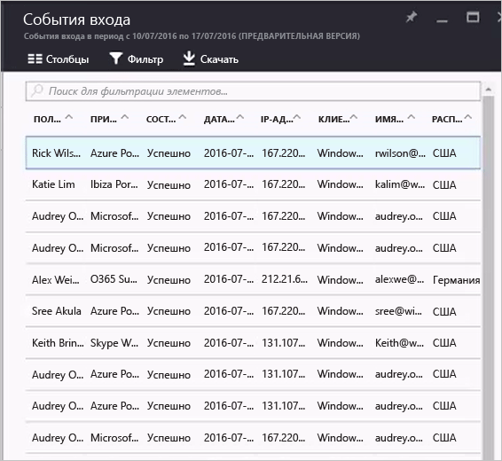

# Отчеты о действиях входа на портале Azure Active Directory

Функция отчетов в Azure Active Directory (Azure AD) [на портале Azure](https://portal.azure.com) позволяет получать всю необходимую информацию, чтобы определить, как работает среда.

Архитектура создания отчетов в Azure Active Directory состоит из следующих компонентов.

- **Действие** 
    - **Действия входа** — информация об использовании управляемых приложений и действиях входа.
    - **Журналы аудита** — данные системных операций об управлении пользователями и группами, об управляемых приложениях и действиях с каталогами.
- **Безопасность** 
    - **Входы, представляющие риск**. Вход, представляющий риск, означает, что в систему пытался войти пользователь, который не является законным владельцем учетной записи. Дополнительные сведения см. в разделе "Вход, представляющий риск".
    - **Пользователи, находящиеся в группе риска**. Такая пометка означает, что конфиденциальность учетной записи пользователя, возможно, нарушена. Дополнительные сведения см. в разделе "Пользователи, помеченные для события риска".

В этом разделе содержатся общие сведения о действиях входа.

## предварительным требованиям

### Кто может получить доступ к данным?
* Пользователи с ролью администратора безопасности, читателя безопасности или читателя отчетов
* Глобальные администраторы
* Любой пользователь (не администратор) может получить доступ к своим данным о действиях входа. 

### Какие лицензии Azure AD требуются для доступа к действию входа?
* Для просмотра отчета о всех действиях входа с клиентом должна быть связана лицензия Azure AD Premium.

## Действия входа

Информация, доступная в отчете о входе пользователя, поможет вам ответить на такие вопросы:

* Что такое шаблон входа пользователя?
* Сколько пользователей входили в течение недели?
* Каков статус их входа?

Знакомство с данными о действиях входа следует начать с раздела **События входа** в разделе "Действие" службы **Azure Active**.

Журнал событий входа содержит представление списка по умолчанию, в котором отображаются:

- дата входа;
- пользователь;
- приложение, в которое вошел пользователь;
- состояние входа;
- состояние обнаружения риска;
- состояние требования многофакторной проверки подлинности (MFA). 

Представление списка можно настроить, щелкнув **Столбцы** на панели инструментов.

Здесь вы можете добавить или удалить отображаемые поля.

Щелкнув элемент в представлении списка, вы получите дополнительные сведения о нем в горизонтальном представлении.

## Фильтрация действий входа

Для сужения результатов до нужного уровня вы можете отфильтровать данные о входах, используя следующие поля по умолчанию:

- Пользователь
- Приложение
- состояние входа.
- состояние обнаружения риска;
- Дата

Фильтр по **пользователю** позволяет указать интересующее вас имя пользователя или имя участника-пользователя (UPN). 

Фильтр по **приложению** позволяет указать имя интересующего вас приложения.  

В фильтре по **состоянию входа** можно выбрать:

- Все 
- Успешно
- Сбой

В фильтре по **обнаружению риска** можно выбрать:

- Все
- Yes
- Нет  

Фильтр **дат** позволяет определить интервал времени для возвращаемых данных.  
Возможные значения:

- 1 месяц
- 7 дней
- 24 часа
- Настраиваемый интервал

При выборе пользовательского интервала времени можно настроить время начала и окончания.

Если вы добавите дополнительные поля в представление входа, они автоматически добавляются в список фильтров. Например, добавив в свой список поле **клиентское приложение**, вы также получите еще один параметр фильтра, который позволит вам установить следующие фильтры:

- "Обзор"      
- Exchange ActiveSync (поддерживается)               
- Exchange ActiveSync (не поддерживается)
- Другие клиенты               
    - IMAP
    - MAPI
    - Старые клиенты Office
    - POP
    - SMTP

> [!TIP] 
> Помимо фильтров по умолчанию, все дополнительные поля, добавляемые в представление входа, становятся полями фильтра.

## Скачивание данных о действиях входа

Данные о действиях входа можно скачать, если вам нужно работать с ними за пределами портала Azure. На портале Azure можно скачать данные нажатием кнопки, а также создать скрипт для загрузки данных.  

После нажатия кнопки **Скачать** создается CSV-файл с последними 5 тыс. записей. Если вам нужны дополнительные возможности, используйте скрипт. После нажатия кнопки **Скрипт** создается скрипт, который содержит все настроенные вами фильтры. На число записей, которые можно скачать, влияют особенности технической реализации, а также [политики хранения отчетов Azure Active Directory](active-directory-reporting-retention.md).  

## Ярлыки для действий входа

Помимо Azure Active Directory, портал Azure предоставляет две дополнительные точки входа для данных о действиях входа:

- Обзор защиты удостоверения безопасности
- Пользователи
- Группы
- корпоративные приложения.

### Действия входа для пользователей

Информация, доступная в отчете о входе пользователя, поможет вам ответить на такие вопросы:

- Что такое шаблон входа пользователя?
- Сколько пользователей входили в течение недели?
- Каков статус их входа?

Знакомство с этими данными нужно начать с графика входов пользователей на странице обзора **защиты удостоверения безопасности**. На графике входа еженедельно отображается количество входов всех пользователей за определенный промежуток времени, который по умолчанию составляет 30 дней.

Щелкнув день на графике входов, вы увидите обзор действий входа за этот день.

Каждая строка в списке действий входа содержит такие сведения:

* Кто выполнил вход?
* Какое приложение было целью входа?
* Каково состояние входа в систему?
* Каково состояние MFA входа в систему?

Щелкнув элемент, вы получите более подробную информацию об операции входа:

- Идентификатор пользователя.
- Пользователь
- Имя пользователя
- Идентификатор приложения
- Приложение
- Клиент
- Расположение
- IP-адрес
- Дата
- Требуется многофакторная идентификация
- состояние входа.

 
На странице **Пользователи** можно получить полный обзор всех входов пользователей, щелкнув **Вход в систему** в разделе **Действия**.

## Использование управляемых приложений

Представление данных входа, ориентированное на приложения, позволяет ответить на такие вопросы:

* Кто использует мои приложения?
* Какие три приложения являются самыми популярными в моей организации?
* Как обстоят дела с приложением, которое было недавно создано и развернуто?

Знакомство с этими данными нужно начать с *трех приложений, которые в отчете за последние 30 дней* являются самыми популярными (раздел **Обзор**, который можно выбрать на странице **Корпоративные приложения**).

В графике ниже (график использования приложений) отображены еженедельные входы в три самых популярных приложения за определенный промежуток времени, который по умолчанию составляет 30 дней.

Если нужно, вы можете переместить фокус на определенное приложение.

Щелкнув день на графике использования приложений, вы увидите подробный список действий входа.

С помощью параметра **Входов** можно полностью отобразить все события входа в ваши приложения.

## Дополнительная информация

Дополнительные сведения о кодах ошибок входа в систему см. в статье [Коды ошибок отчета об активности входа на портале Azure Active Directory](active-directory-reporting-activity-sign-ins-errors.md).

