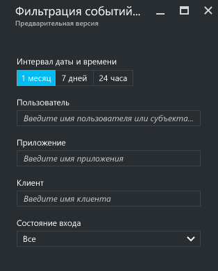
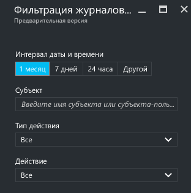
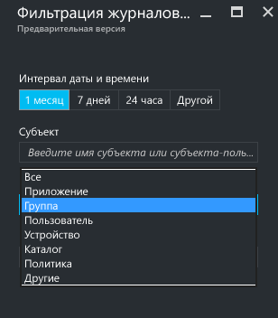
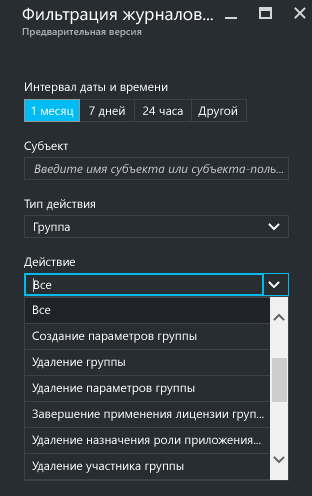

---

title: "Отчеты Azure Active Directory | Документация Майкрософт"
description: "В этой статье описаны различные отчеты, доступные в Azure Active Directory."
services: active-directory
documentationcenter: 
author: MarkusVi
manager: femila
editor: 
ms.assetid: 6141a333-38db-478a-927e-526f1e7614f4
ms.service: active-directory
ms.devlang: na
ms.topic: get-started-article
ms.tgt_pltfrm: na
ms.workload: identity
ms.date: 04/06/2017
ms.author: markvi
ms.translationtype: Human Translation
ms.sourcegitcommit: 2db2ba16c06f49fd851581a1088df21f5a87a911
ms.openlocfilehash: c7fe995f097c72ab5275249538fe2bb65efac256
ms.contentlocale: ru-ru
ms.lasthandoff: 05/09/2017

---
# Отчеты Azure Active Directory

*Данная документация является частью [руководства по отчетам Azure Active Directory](active-directory-reporting-guide.md).*

Функция отчетов в Azure Active Directory (Azure AD) позволяет получать всю необходимую информацию, с помощью которой можно определить, как работает среда.

Есть две основные области отчетов:

* **Действия входа** — информация об использовании управляемых приложений и действиях входа.
* **Журналы аудита** — информация системных операций об управлении пользователями и группами, об управляемых приложениях и действиях каталогов.

В зависимости от области нужных данных вы можете получить доступ к этим отчетам, щелкнув **Пользователи и группы** или **Корпоративные приложения** в списке служб на [портале Azure](https://portal.azure.com).

## Действия входа
### Действия входа пользователя
Информация, доступная в отчете о входе пользователя, поможет вам ответить на такие вопросы:

* Что такое шаблон входа пользователя?
* Сколько пользователей входили в течение недели?
* Каков статус их входа?

Знакомство с этими данными нужно начать с графика входов пользователей в разделе **Обзор**, который можно выбрать в колонке **Пользователи и группы**.

 

На графике входа еженедельно отображается количество входов всех пользователей за определенный промежуток времени, который по умолчанию составляет 30 дней.

Щелкнув день на графике входов, вы увидите подробный список действий входа.

Каждая строка в списке действий входа содержит подробную информацию о выбранном входе и отвечает на такие вопросы:

* Кто выполнил вход?
* Какое связанное имя участника-пользователя фигурировало?
* Какое приложение было целью входа?
* С какого IP-адреса выполнен вход?
* Каким был статус входа?

### Использование управляемых приложений
Представление данных входа, ориентированное на приложения, позволяет ответить на такие вопросы:

* Кто использует мои приложения?
* Какие три приложения являются самыми популярными в моей организации?
* Как обстоят дела с приложением, которое было недавно создано и развернуто?

Знакомство с этими данными нужно начать с трех приложений, которые в отчете за последние 30 дней являются самыми популярными (раздел **Обзор**, который можно выбрать в колонке **Корпоративные приложения**).

 

В графике ниже (график использования приложений) отображены еженедельные входы в три самых популярных приложения за определенный промежуток времени, который по умолчанию составляет 30 дней.

Если нужно, вы можете переместить фокус на определенное приложение.

Щелкнув день на графике использования приложений, вы увидите подробный список действий входа.

С помощью параметра **Входов** можно полностью отобразить все события входа в ваши приложения.

С помощью средства выбора столбца вы можете выбрать поля данных, которые нужно отобразить.

### Фильтрация входов
Чтобы ограничить отображаемые данные, вы можете отфильтровать сведения о входах с помощью следующих полей:

* Дата и время 
* имя участника-пользователя пользователя;
* имя приложения;
* имя клиента;
* состояние входа.

Другой способ фильтрации записей о действиях входа — поиск определенных записей.
Вы можете искать действия входа по определенным **пользователям**, **группам** или **приложениям**.

## Журналы аудита
Журналы аудита в Azure Active Directory содержат записи о действиях системы (необходимые для соответствия требованиям).

Есть три основные категории, в рамках которых выполняется аудит действий на портале Azure:

* Пользователи и группы   
* приложениям
* Каталог   

Полный список событий отчета аудита см. в разделе [Список событий отчета аудита](active-directory-reporting-audit-events.md#list-of-audit-report-events).

Знакомство с данными аудита следует начать с **журналов аудита** в разделе **Действие** службы **Azure Active Directory**.

В журнале аудита доступно представление списка, в котором отображаются субъекты ("кто"), действия ("что") и целевые объекты.

Щелкнув элемент в представлении списка, вы получите дополнительные сведения о нем.

### Журналы аудита пользователей и групп
Отчеты аудита, касающиеся пользователей и групп, дают возможность ответить на такие вопросы:

* Обновления каких типов были применены к пользователям?
* Сколько пользователей было изменено?
* Сколько паролей было изменено?
* Что делал администратор в каталоге?
* Какие группы были добавлены?
* В каких группах произошли изменения членства?
* Изменены ли владельцы групп?
* Какие лицензии были назначены пользователю или группе?

Если нужно только просмотреть данные аудита, связанные с пользователями и группами, отфильтрованное представление вы можете найти, щелкнув элемент **Журналы аудита** в разделе **Действие** колонки **Пользователи и группы**.

### Журналы аудита приложений
Отчеты аудита, касающиеся приложений, дают возможность ответить на такие вопросы:

* Какие приложения были добавлены или обновлены?
* Какие приложения были удалены?
* Изменился ли участник-служба для приложения?
* Изменены ли имена приложений?
* Кто дал согласие на использование приложения?

Если нужно только просмотреть данные аудита, связанные с приложениями, отфильтрованное представление вы можете найти, щелкнув элемент **Журналы аудита** в разделе **Действие** колонки **Корпоративные приложения**.

### Фильтрация журналов аудита
Чтобы ограничить отображаемые данные, вы можете отфильтровать сведения о входах с помощью следующих полей:

* Дата и время
* имя участника-пользователя cубъекта;
* тип действия;
* Действие

Содержимое списка **Типа действия** связано с точкой входа в эту колонку.  
Если точка входа — Azure Active Directory, этот список содержит все типы возможных действий:

* Приложение 
* Группа 
* Пользователь
* Устройство
* Каталог
* Политика
* Другие

Будут перечислены действия только выбранного типа.
Например, если в качестве **типа действия** выбрана **группа**, список **Действие** будет содержать только действия, связанные с группой.   

Другой способ фильтрации — поиск определенных записей журнала аудита.

## Дальнейшие действия
См. статью [Руководство по отчетам Azure Active Directory](active-directory-reporting-guide.md).

