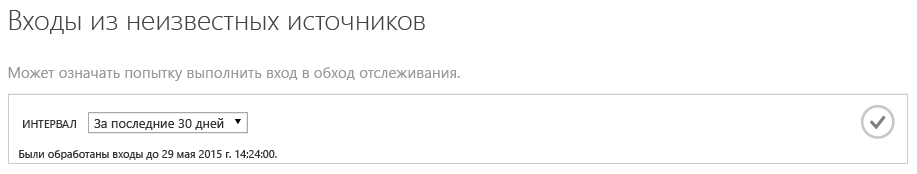
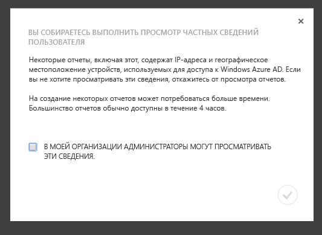
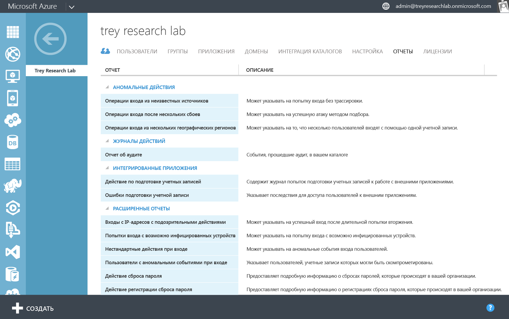
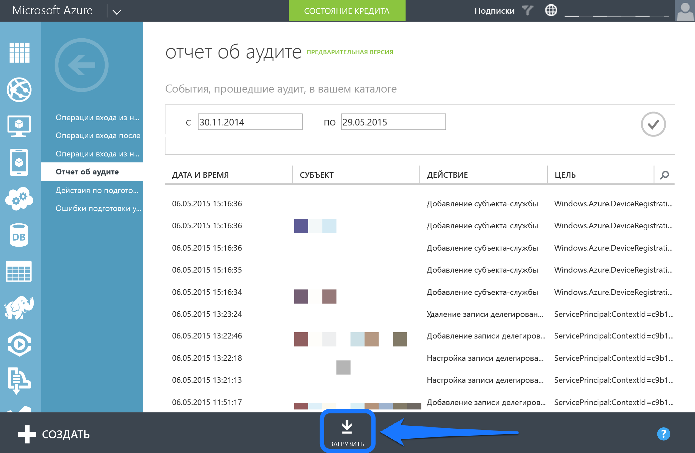
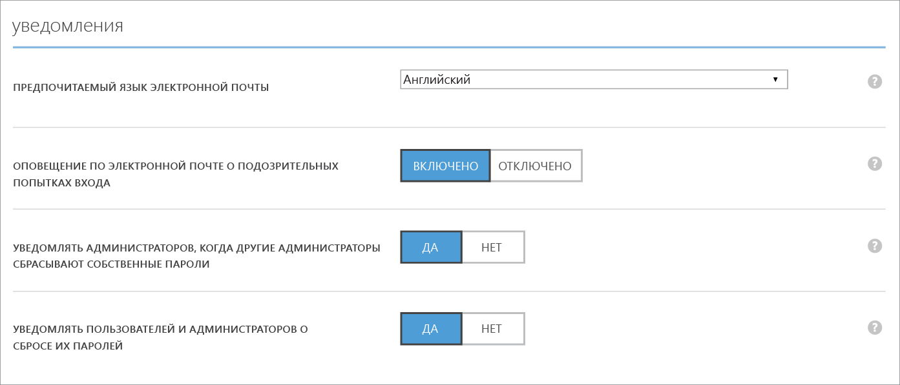
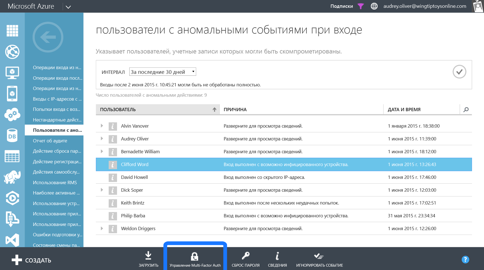

<properties
   pageTitle="Отчетность Azure Active Directory: начало работы | Microsoft Azure"
   description="Перечислены различные отчеты, доступные в Azure Active Directory Reporting."
   services="active-directory"
   documentationCenter=""
   authors="dhanyahk"
   manager="femila"
   editor=""/>

<tags
   ms.service="active-directory"
   ms.devlang="na"
   ms.topic="get-started-article"
   ms.tgt_pltfrm="na"
   ms.workload="identity"
   ms.date="03/07/2016"
   ms.author="dhanyahk"/>

# Приступая к работе со средством создания отчетов Azure Active Directory

## Что это

Azure Active Directory (Azure AD) формирует отчеты о безопасности, активности и аудите каталога. Ниже приведен список включенных отчетов.

### Отчеты о безопасности

- Попытки входа из неизвестных источников
- "Операции входа после нескольких неудачных попыток";
- "Операции входа из нескольких географических регионов".
- Попытки входа с IP-адресов с подозрительными действиями
- Нестандартные действия при входе
- Попытки входа с возможно инфицированных устройств
- Пользователи с аномальными событиями при входе

### Отчеты об активности

- Использование приложения: сводка
- Использование приложения: подробности
- Панель мониторинга приложений
- Ошибки подготовки учетной записи
- Устройства отдельного пользователя
- Активность отдельного пользователя
- Отчет о действиях групп
- Отчет о событиях регистрации для сброса пароля
- Действие сброса пароля

### Отчеты об аудите

- Отчет об аудите каталога

> [AZURE.TIP] Дополнительную документацию по Azure AD Reporting см. в статье [Просмотр отчетов о доступе и использовании](active-directory-view-access-usage-reports.md).

## Принцип работы

### Конвейер отчетов

Конвейер отчетов состоит из трех основных этапов. Каждый раз при входе пользователя в систему или при проверке подлинности, происходит следующее.

- Во-первых, пользователь проходит проверку подлинности (успешно или неуспешно) и результат сохраняется в базах данных службы Azure Active Directory.
- Все недавние попытки пользователей войти в систему регулярно обрабатываются с определенными интервалами. На этом этапе наши алгоритмы безопасности и поиска аномальных событий проверяют все недавние входы в систему на предмет подозрительных действий.
- После обработки отчеты записываются, сохраняются в кэше и становятся доступны на классическом портале Azure.

### Время создания отчета

Из-за большого объема проверок подлинности и входов, обрабатываемых платформой Azure AD, новые данные о входе пользователей в систему поступают в среднем с задержкой в один час. В редких случаях обработка последней попытки входа может занимать до 8 часов.

Изучив текст справки в верхней части каждого отчета, можно найти самый последний обработанный отчет о входе в систему.

> [AZURE.TIP] Дополнительную документацию по Azure AD Reporting см. в статье [Просмотр отчетов о доступе и использовании](active-directory-view-access-usage-reports.md).

## Приступая к работе

### Перейдите на классический портал Azure.

Сначала необходимо войти на [классической портал Azure](https://manage.windowsazure.com) с правами глобального администратора или администратора соответствия требованиям. Кроме того, вы должны иметь права администратора или соадминистратора службы подписки Azure или использовать подписку "Доступ к Azure AD".

### Переход к отчетам

Для просмотра отчетов перейдите на вкладку «Отчеты» в верхней части вашего каталога.

Если вы впервые просматриваете отчеты, необходимо принять условия в диалоговом окне, прежде чем начать просмотр. Этим вы подтверждаете, что администраторы вашей организации имеют право на просмотр данной информации, которая в некоторых странах может считаться конфиденциальной.

### Изучение каждого отчета

Просмотрите каждый отчет, чтобы понять механизм сбора данных и обработки сведений о входе в систему. Список всех отчетов вы можете найти[ здесь](active-directory-reporting-guide.md).

### Загрузка отчетов в формате CSV

Каждый отчет можно загрузить как CSV-файл (с разделителями-запятыми). Вы можете использовать эти файлы в Excel, PowerBI или сторонних программах для дальнейшего анализа данных.

Чтобы загрузить любой отчет в виде CSV-файла, перейдите к отчету и нажмите кнопку «Загрузить» в нижней части страницы.

> [AZURE.TIP] Дополнительную документацию по Azure AD Reporting см. в статье [Просмотр отчетов о доступе и использовании](active-directory-view-access-usage-reports.md).

## Дальнейшие действия

### Настройка оповещений в случае аномальных действий при входе в систему

Перейдите на вкладку «Настройка» каталога.

Прокрутите страницу вниз до раздела «Уведомления».

Включите или отключите параметр "Уведомления по электронной почте при аномальных попытках входа".

### Интеграция с API службы Azure AD Reporting

См. статью [Приступая к работе с Reporting API](active-directory-reporting-api-getting-started.md).

### Включение службы Multi-Factor Authentication для пользователей

Выберите пользователя в отчете.

Нажмите кнопку «Включить MFA» в нижней части экрана.

> [AZURE.TIP] Дополнительную документацию по Azure AD Reporting см. в статье [Просмотр отчетов о доступе и использовании](active-directory-view-access-usage-reports.md).

## Подробнее

### Аудит событий

Узнайте о том, какие события аудита учитываются в каталоге[События аудита Azure Active Directory Reporting](active-directory-reporting-audit-events.md).

### Интеграция API

См. раздел [Приступая к работе с Reporting API](active-directory-reporting-api-getting-started.md) и [Справочная документация по API](https://msdn.microsoft.com/library/azure/mt126081.aspx).

### Будьте на связи

Чтобы отправить отзыв, получить справку или задать вопросы, напишите электронное письмо по адресу [aadreportinghelp@microsoft.com](mailto:aadreportinghelp@microsoft.com).

> [AZURE.TIP] Дополнительную документацию по Azure AD Reporting см. в статье [Просмотр отчетов о доступе и использовании](active-directory-view-access-usage-reports.md).

<!---HONumber=AcomDC_0928_2016-->