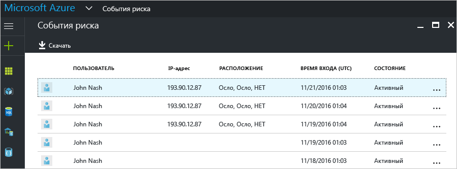
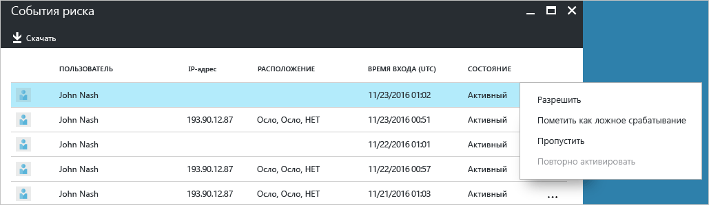
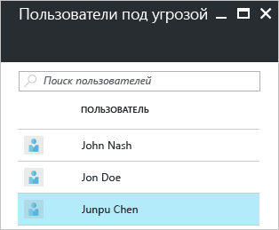
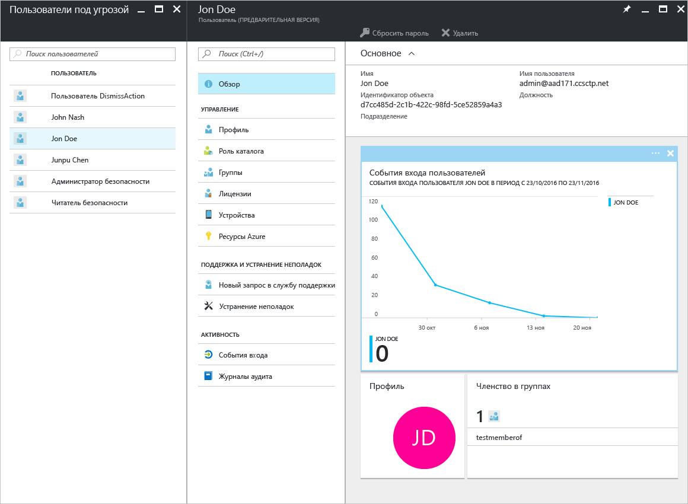

# Отчеты о безопасности в бесплатном и базовом выпусках Azure Active Directory (предварительная версия)

С помощью отчетов о безопасности в [предварительной версии](active-directory-preview-explainer.md) Azure Active Directory можно получить ценную информацию о наличии скомпрометированных учетных записей пользователей в вашей среде. 

Azure Active Directory обнаруживает подозрительные действия, связанные с учетными записями пользователей. Для каждого обнаруженного действия создается запись, которая называется *событием риска*. Дополнительные сведения см. в статье о [событиях риска в Azure Active Directory](active-directory-identity-protection-risk-events.md). 

Обнаруженные события риска используются для вычисления следующих параметров.

- **Входы, представляющие риск**. Вход, представляющий риск, означает, что в систему пытался войти пользователь, который не является законным владельцем учетной записи. Дополнительные сведения см. в [этом разделе](active-directory-identityprotection.md#risky-sign-ins). 

- **Пользователи, находящиеся в группе риска**. Такая пометка означает, что конфиденциальность учетной записи пользователя, возможно, нарушена. Дополнительные сведения см. в разделе о [пользователях, находящихся в группе риска](active-directory-identityprotection.md#users-flagged-for-risk).  

## Отчет о входах, представляющих риск

В бесплатном и базовом выпусках Azure Active Directory вы можете просмотреть информацию об обнаруженных входах, представляющих риск, которые связаны с вашими пользователями. Отчет о событиях риска содержит следующие сведения.

- **Пользователь** — имя пользователя, которое использовалось во время операции входа.
- **IP-адрес** — IP-адрес устройства, которое использовалось для подключения к Azure Active Directory.
- **Расположение** — расположение, которое использовалось для подключения к Azure Active Directory.
- **Время входа** — время выполнения входа.
- **Состояние** — состояние входа.

Данные из этого отчета можно скачать.

Ознакомившись со сведениями о входе, представляющем риск, вы можете отправить отзыв в Azure Active Directory в виде одной из следующих команд.

- Разрешить
- Пометить как ложное срабатывание
- Игнорировать
- Повторно активировать

Дополнительные сведения см. в разделе [Закрытие событий риска вручную](active-directory-identityprotection.md#closing-risk-events-manually).

## Отчет "Пользователи под угрозой"

В бесплатном выпуске Azure Active Directory доступен список учетных записей пользователей, конфиденциальность которых могла быть нарушена. 

Щелкните пользователя в списке, чтобы открыть колонку его данных.
Просмотрите журнал входов пользователя под угрозой и сбросьте пароль при необходимости.

## Дальнейшие действия

- Дополнительные сведения об отчетах Azure Active Directory см. в статье [Руководство по отчетам Azure Active Directory](active-directory-reporting-guide.md).
- Дополнительные сведения о защите идентификации Azure см. в статье [Защита идентификации Azure Active Directory](active-directory-identityprotection.md).

<!--HONumber=Jan17_HO3-->

