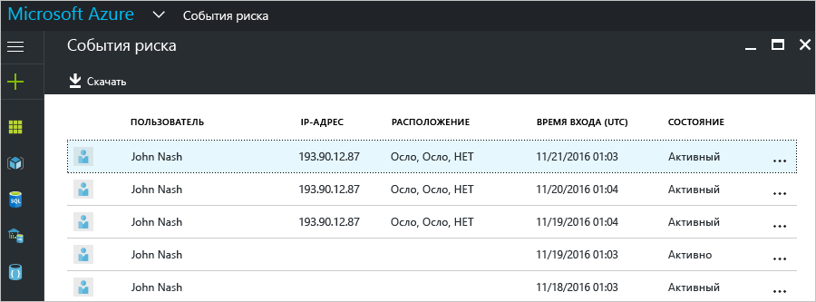
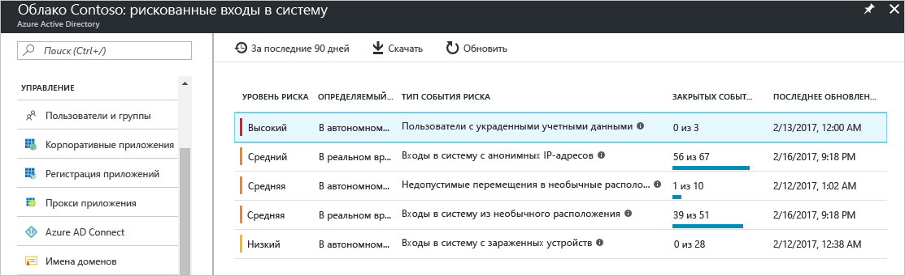
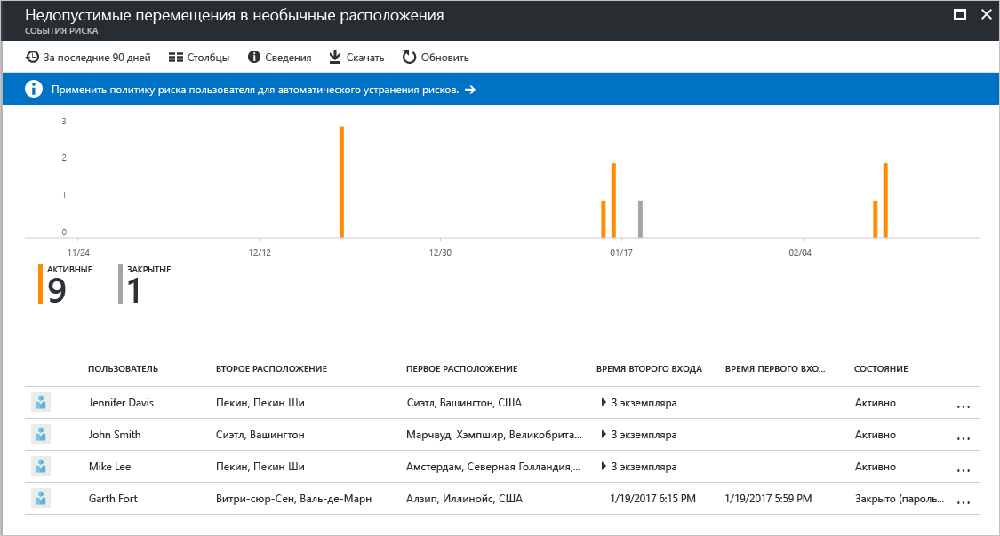
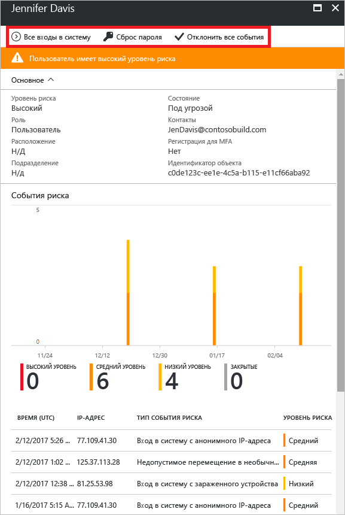

# Отчет о событиях входа, представляющих риск, на портале Azure Active Directory

С помощью отчетов о безопасности в Azure Active Directory (Azure AD) можно получить ценную информацию о наличии скомпрометированных учетных записей пользователей в вашей среде. 

Azure AD обнаруживает подозрительные действия, связанные с учетными записями пользователей. Для каждого обнаруженного действия создается запись, которая называется *событием риска*. Дополнительные сведения см. в статье о [событиях риска в Azure Active Directory](active-directory-identity-protection-risk-events.md). 

Обнаруженные события риска используются для вычисления следующих параметров.

- **Входы, представляющие риск**. Вход, представляющий риск, означает, что в систему пытался войти пользователь, который не является законным владельцем учетной записи. Дополнительные сведения см. в [этом разделе](active-directory-identityprotection.md#risky-sign-ins). 

- **Пользователи, находящиеся в группе риска**. Такая пометка означает, что конфиденциальность учетной записи пользователя, возможно, нарушена. Дополнительные сведения см. в разделе о [пользователях, находящихся в группе риска](active-directory-identityprotection.md#users-flagged-for-risk).  

На [портале Azure](https://portal.azure.com) отчеты о безопасности можно найти в колонке **Azure Active Directory** в разделе **Безопасность**. 

## Какая лицензия Azure AD требуется для доступа к отчету безопасности?  

Все выпуски Azure Active Directory предоставляют отчеты о событиях входа, представляющих риск.  
Однако уровень детализации отчета может для выпусков отличаться. 

- В **бесплатном и базовом выпусках Azure Active Directory** у вас будет список событий входа, представляющих риск. 

- Выпуск **Azure Active Directory Premium 1** расширяет эту модель, также позволяя вам изучать некоторые базовые события риска, обнаруженные для каждого отчета. 

- Выпуск **Azure Active Directory Premium 2** предоставляет наиболее полные сведения о базовых событиях риска, а также позволяет настроить политики безопасности, автоматически реагирующие на настроенные уровни риска.

## Выпуски "Бесплатный" и "Базовый" Azure Active Directory

В выпусках "Бесплатный" и "Базовый" Azure Active Directory вы можете просмотреть информацию об обнаруженных входах, представляющих риск, которые связаны с вашими пользователями. В этом отчете указаны:

- **Пользователь** — имя пользователя, которое использовалось во время операции входа.
- **IP-адрес** — IP-адрес устройства, которое использовалось для подключения к Azure Active Directory.
- **Расположение** — расположение, которое использовалось для подключения к Azure Active Directory.
- **Время входа** — время выполнения входа.
- **Состояние** — состояние входа.

Ознакомившись со сведениями о входе, представляющем риск, вы можете отправить отзыв в Azure Active Directory в виде одной из следующих команд.

- Разрешить
- Пометить как ложное срабатывание
- Игнорировать
- Повторно активировать

Дополнительные сведения см. в разделе [Закрытие событий риска вручную](active-directory-identityprotection.md#closing-risk-events-manually).

Этот отчет предоставляет следующие возможности:

- Поиск ресурсов
- загрузка данных отчета.

## Выпуски Azure Active Directory Premium

Отчет о событиях входа, представляющих риск, в выпусках Azure Active Directory Premium предоставляет следующее.

- Сводная информация о [типах обнаруженных событий риска](active-directory-identity-protection-risk-events.md).

- Возможность скачать отчет.

При выборе события риска отображается подробное представление отчета об этом событии, предоставляющее перечисленные ниже возможности.

- Настройка [политики устранения рисков пользователей](active-directory-identityprotection.md#user-risk-security-policy).  

- Просмотр временной шкалы обнаружения для события риска.  

- Просмотр списка пользователей, для которых было обнаружено это событие риска.

- [Ручное закрытие события риска](active-directory-identityprotection.md#closing-risk-events-manually) или повторная активация события риска, закрытого вручную. 

При выборе пользователя отображается подробное представление отчета об этом пользователе, предоставляющее перечисленные ниже возможности.

- Отображение представления всех событий входа.

- Сброс пароля пользователя

- Отклонение всех событий.

- Изучение обнаруженных событий риска для пользователя. 

Чтобы изучить событие риска, выберите его из списка.  
Откроется колонка **Сведения** для этого события риска. В колонке **Сведения** вы можете либо [вручную закрыть событие риска](active-directory-identityprotection.md#closing-risk-events-manually), либо повторно активировать событие риска, закрытое вручную. 

## Дополнительная информация

- Дополнительные сведения о защите идентификации Azure см. в статье [Защита идентификации Azure Active Directory](active-directory-identityprotection.md).

