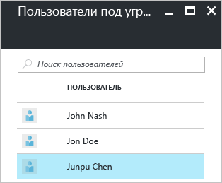
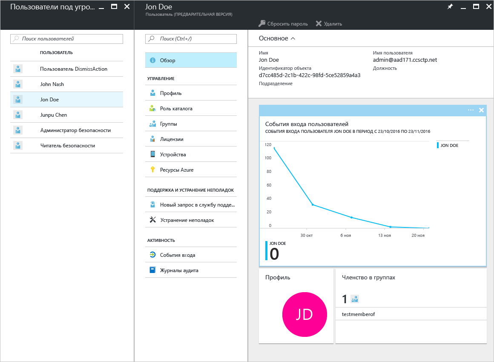
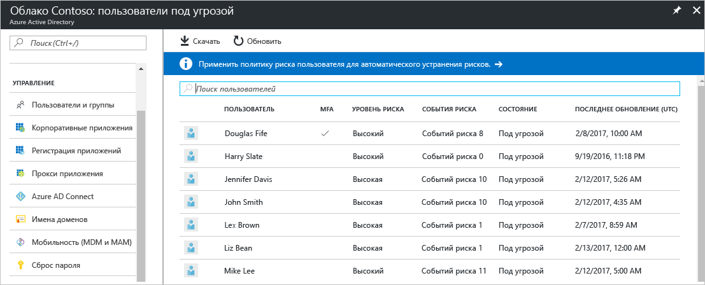
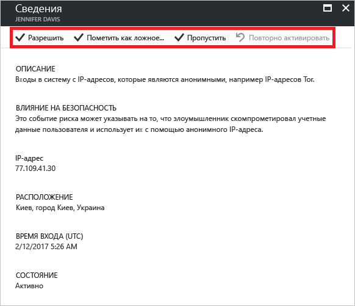

# Описание отчета системы безопасности о пользователях под угрозой на портале Azure Active Directory

С помощью отчетов о безопасности в Azure Active Directory (Azure AD) можно получить ценную информацию о наличии скомпрометированных учетных записей пользователей в вашей среде. 

Azure Active Directory обнаруживает подозрительные действия, связанные с учетными записями пользователей. Для каждого обнаруженного действия создается запись, которая называется *событием риска*. Дополнительные сведения см. в статье [События риска Azure Active Directory](active-directory-identity-protection-risk-events.md). 

Обнаруженные события риска используются для вычисления следующих параметров.

- **Входы, представляющие риск**. Вход, представляющий риск, означает, что в систему пытался войти пользователь, который не является законным владельцем учетной записи. Дополнительные сведения см. в разделе [Вход, представляющий риск](active-directory-identityprotection.md#risky-sign-ins). 

- **Пользователи, находящиеся в группе риска**. Такая пометка означает, что конфиденциальность учетной записи пользователя, возможно, нарушена. Дополнительные сведения см. в разделе [Пользователи, помеченные для события риска](active-directory-identityprotection.md#users-flagged-for-risk).  

На портале Azure отчеты о безопасности можно найти в колонке **Azure Active Directory** в разделе **Безопасность**.  

## Какая лицензия Azure AD требуется для доступа к отчету безопасности?  

Все выпуски Azure Active Directory предоставляют отчеты о пользователях, находящихся в группе риска.  
Однако уровень детализации отчета может для выпусков отличаться. 

- В **бесплатном и базовом выпусках Azure Active Directory** у вас будет список пользователей, находящихся в группе риска. 

- Выпуск **Azure Active Directory Premium 1** расширяет эту модель, также позволяя вам изучать некоторые базовые события риска, обнаруженные для каждого отчета. 

- Выпуск **Azure Active Directory Premium 2** предоставляет наиболее полные сведения о базовых событиях риска, а также позволяет настроить политики безопасности, автоматически реагирующие на настроенные уровни риска.

## Выпуски "Бесплатный" и "Базовый" Azure Active Directory

В выпусках "Бесплатный" и "Базовый" Azure Active Directory доступен список учетных записей пользователей, конфиденциальность которых могла быть нарушена. 

Если выбрать пользователя, откроется колонка его данных.
Вы можете просмотреть журнал входов пользователя под угрозой и сбросить пароль, если это необходимо.

Это диалоговое окно предоставляет следующие возможности:

- Загрузка отчета

- Поиск пользователей

## Выпуски Azure Active Directory Premium

Отчет о пользователях под угрозой в выпусках Azure Active Directory Premium предоставляет следующее:

- [Список учетных записей пользователей](active-directory-identityprotection.md#users-flagged-for-risk), которые, возможно, были скомпрометированы. 

- Сводная информация о [типах обнаруженных событий риска](active-directory-identity-protection-risk-events.md).

- Возможность скачать отчет.

- Настройка [политики устранения рисков пользователей](active-directory-identityprotection.md#user-risk-security-policy).  

При выборе пользователя отображается подробное представление отчета об этом пользователе, предоставляющее перечисленные ниже возможности.

- Отображение представления всех событий входа.

- Сброс пароля пользователя

- Отклонение всех событий.

- Изучение обнаруженных событий риска для пользователя. 

Чтобы изучить событие риска, выберите его из списка. Откроется колонка **Сведения** для этого события риска. В колонке **Сведения** вы можете либо [вручную закрыть событие риска](active-directory-identityprotection.md#closing-risk-events-manually), либо повторно активировать событие риска, закрытое вручную. 

## Дополнительная информация

- Дополнительные сведения о защите идентификации Azure см. в статье [Защита идентификации Azure Active Directory](active-directory-identityprotection.md).

