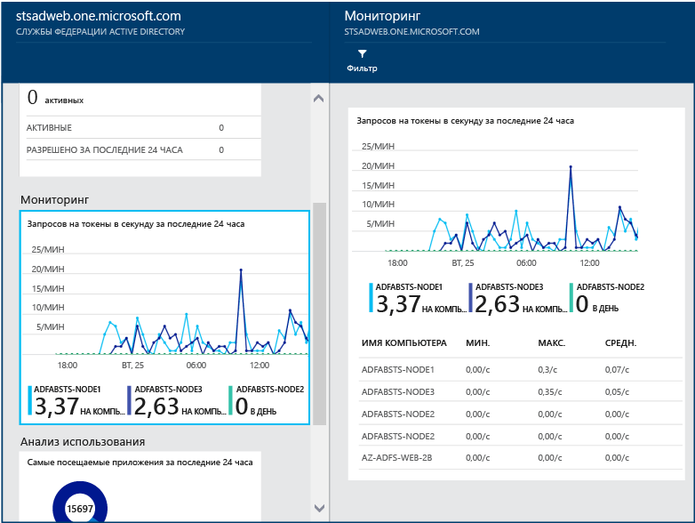

# Мониторинг AD FS с помощью Azure AD Connect Health
Приведенная ниже информация относится к мониторингу инфраструктуры AD FS с помощью Azure AD Connect Health. Сведения о мониторинге синхронизации Azure AD Connect с помощью Azure AD Connect Health см. в статье [Использование Azure AD Connect Health для синхронизации](active-directory-aadconnect-health-sync.md). Кроме того, сведения о мониторинге доменных служб Active Directory с помощью Azure AD Connect Health см. в статье [Использование Azure AD Connect Health с AD DS](active-directory-aadconnect-health-adds.md).

## Оповещения AD FS
В разделе оповещений Azure AD Connect Health предоставляется список активных оповещений. Каждое оповещение содержит соответствующую информацию, действия по устранению и ссылки на связанную документацию.

Если дважды щелкнуть активное или разрешенное оповещение, появится новая колонка с дополнительной информацией, действиями, которые можно предпринять для устранения причин оповещения, и ссылками на соответствующую документацию. Можно также просмотреть данные журнала об оповещениях, которые были разрешены в прошлом.

## Аналитика использования для AD FS
Аналитика по использованию Azure AD Connect Health позволяет анализировать трафик аутентификации серверов федерации. Если дважды щелкнуть поле аналитики по использованию, откроется колонка аналитики по использованию, на которой показано несколько метрик и группирований.

> [!NOTE]
> Чтобы применять аналитику по использованию для AD FS, необходимо убедиться, что включен аудит AD FS. Дополнительные сведения см. в разделе [Включение аудита для AD FS](active-directory-aadconnect-health-agent-install.md#enable-auditing-for-ad-fs).
>
>

Чтобы выбрать дополнительные метрики, укажите диапазон времени или измените способ группировки, щелкнув правой кнопкой мыши диаграмму аналитики по использованию и выбрав "Изменить диаграмму". Затем можно будет указать диапазон времени, выбрать другую метрику и изменить группирование. Вы можете просмотреть распределение трафика аутентификации по различным метрикам и группировать каждую метрику с помощью соответствующего параметра "Группировать по", описанного в следующем разделе.

**Метрика "Всего запросов"**: общее число запросов, обработанных серверами AD FS.

|Сгруппировать по | Что означает группирование и почему это удобно? |
| --- | --- |
| Все | Показывает общее число запросов, обработанных всеми серверами AD FS.|
| Приложение | Группирует общее количество запросов по целевой проверяющей стороне. Такой способ группировки удобен, чтобы понять, сколько процентов от общего трафика получает каждое приложение. |
|  сервер; |Группирует общее количество запросов по серверу, обработавшему запрос. Такой способ группировки позволяет понять, как распределяется нагрузка всего трафика.
| Присоединение к рабочей области |Группирует общее количество запросов по следующему признаку: поступают ли запросы от устройств, присоединенных к рабочей области (т. е. известных устройств). Такой способ группировки позволяет определить, если доступ к вашим ресурсам осуществляется с помощью устройств, которые неизвестны в инфраструктуре удостоверений. |
|  Метод проверки подлинности | Группирует общее количество запросов по выбранному методу аутентификации. Такой способ группировки позволяет понять, какой метод аутентификации используется чаще всего. Ниже приведены возможные методы проверки подлинности:  <ol> <li>встроенная проверка подлинности Windows (Windows);</li> <li>аутентификация на основе форм (формы);</li> <li>единый вход (единый вход);</li> <li>проверка сертификата X509 (сертификат).</li>  Если серверы федерации получают запрос с файлом cookie для единого входа, запрос считается единым входом. В таких случаях, если файл cookie является допустимым, пользователю не предлагается ввести учетные данные, что обеспечивает прозрачный доступ к приложению. Обычно это используется при наличии нескольких проверяющих сторон, защищенных серверами федерации. |
| Сетевое расположение | Группирует общее количество запросов по сетевому расположению пользователя. Он может быть в интрасети или экстрасети. Такой способ группировки позволяет узнать, какой процент трафика поступает из экстрасети по сравнению с интрасетью. |

**Метрика "Общее число невыполненных запросов"**: общее количество невыполненных запросов, обработанных службой федерации. (Эта метрика доступна только в AD FS для Windows Server 2012 R2).

|Сгруппировать по | Что означает группирование и почему это удобно? |
| --- | --- |
| Тип ошибки | Отображает число ошибок для каждого стандартного типа. Этот способ группировки позволяет понять, ошибки каких типов наиболее распространены. <ul><li>"Неправильное имя или пароль" — ошибки из-за неправильного имени пользователя или пароля.</li> <li>"Блокировка экстрасети" — сбои из-за запросов, полученных от пользователя, для которого заблокирован доступ из экстрасети. </li><li> "Истек срок действия пароля" — сбои происходят из-за того, что пользователи входят в систему, используя пароль с истекшим сроком действия.</li><li>"Отключенная учетная запись" — сбои происходят из-за того, что пользователи входят в систему, используя отключенную учетную запись.</li><li>"Проверка подлинности устройства" — сбои происходят из-за того, что пользователям не удается выполнить проверку подлинности устройства.</li><li>"Проверка подлинности сертификата пользователя" — сбои происходят, так как пользователям не удается пройти проверку подлинности из-за недопустимого сертификата.</li><li>"Многофакторная идентификация" — сбои происходят из-за того, что пользователям не удается выполнить многофакторную проверку подлинности.</li><li>"Другие учетные данные", "Авторизация выдачи" — сбои из-за ошибок проверки подлинности.</li><li>"Делегирование выдачи" — сбои из-за ошибок делегирования выдачи.</li><li>"Принятие маркера" — сбои из-за отклонения службой федерации Active Directory маркера от стороннего поставщика удостоверений.</li><li>"Протокол" — сбой из-за ошибок протокола.</li><li>«Неизвестно» — все сбои. Другие типы ошибок, не относящиеся к определенным категориям.</li> |
| сервер; | Группирует ошибки на основании сервера. Это группирование позволяет понять, как ошибки распределяются между серверами. Неравномерное распределение может быть признаком того, что сервер находится в неисправном состоянии. |
| Сетевое расположение | Группирует ошибки по сетевому расположению запросов (интрасеть и экстрасеть). Это группирование позволяет понять, какого типа запросы завершаются неудачей. |
|  Приложение | Группирует сбои по целевому приложению (проверяющей стороне). Это группирование позволяет понять, какое целевое приложение вызывает большинство ошибок. |

**Метрика "Число пользователей"**: среднее число уникальных пользователей, активно проходящих аутентификацию с помощью AD FS.

|Сгруппировать по | Что означает группирование и почему это удобно? |
| --- | --- |
|Все |Эта метрика обеспечивает подсчет среднего числа пользователей, использующих службу федерации в рамках выбранного интервала времени. Пользователи не группируются.  Среднее значение зависит от выбранного интервала времени. |
| Приложение |Группирует среднее число пользователей по целевому приложению (проверяющей стороне). Это группирование позволяет понять, сколько пользователей использует каждое приложение. |

## Мониторинг производительности AD FS
Мониторинг производительности Azure Active Directory Connect Health предоставляет данные мониторинга метрик. Если выбрать поле "Мониторинг", откроется новая колонка с подробной информацией о метриках.

Если выбрать параметр «Фильтр» в верхней части колонки, можно отфильтровать информацию по серверу, чтобы просмотреть метрики отдельного сервера. Чтобы изменить метрику, щелкните правой кнопкой мыши диаграмму мониторинга под колонкой мониторинга и выберите "Изменить диаграмму" (или нажмите кнопку "Изменить диаграмму"). В новой открывшейся колонке можно будет из раскрывающегося списка выбрать дополнительные метрики и указать диапазон времени для просмотра данных производительности.

## 50 пользователей, выполнившие наибольшее количество неудачных попыток входа с указанием неправильного имени пользователя или пароля
Одна из распространенных причин неудачных запросов на проверку подлинности на сервере AD FS заключается в использовании неправильных учетных данных (имени пользователя или пароля). Обычно это происходит, если пользователи используют сложный пароль, забыли свой пароль или ввели его с ошибками.

Есть и другие причины, которые могут привести к неожиданному числу запросов, обрабатываемых серверами AD FS. К ним относятся работа приложений, которые кэшируют учетные данные пользователя, в то время как срок их действия истек, или злонамеренные действия пользователя, который пытается войти в чужую учетную запись, используя набор хорошо известных паролей. Это важные причины, которые могут привести к всплеску запросов.

Azure AD Connect Health для AD FS предоставляет отчет о 50 пользователях, выполнивших наибольшее количество неудачных попыток входа с указанием неправильного имени пользователя или пароля. Этот отчет составляется на основе обработки событий аудита, генерируемых всеми серверами AD FS в фермах.

Такие отчеты предоставляют удобный доступ к следующим сведениям:

* Общее количество неудачных запросов с указанием неправильного имени пользователя или пароля за последние 30 дней.
* Среднее ежедневное количество пользователей, которым не удалось выполнить вход из-за ввода неправильного имени пользователя и пароля.

Щелкнув эту область, можно перейти к колонке основного отчета, содержащей дополнительные сведения. В ней представлен график с актуальной информацией, которая позволяет получить общее представление о запросах с указанием неправильного имени пользователя или пароля, а также список 50 пользователей, выполнивших наибольшее количество неудачных попыток входа за последнюю неделю. Обратите внимание, что данные о 50 пользователях с прошлой недели могут помочь выявить пики ввода неправильных паролей.  

На графике представлены указанные ниже данные.

* Общее ежедневное количество неудачных попыток входа с указанием неправильного имени пользователя и пароля.
* Общее ежедневное количество уникальных пользователей, выполнивших неудачные попытки входа.
* IP-адрес клиента для последнего запроса

В отчете представлены следующие данные.

| Элемент отчета | ОПИСАНИЕ |
| --- | --- |
| Идентификатор пользователя. |Здесь отображается использовавшийся идентификатор пользователя. Это значение, введенное пользователем. В некоторых случаях отображаются сведения об использовании неправильного идентификатора пользователя. |
| Неудачные попытки |Здесь отображается общее количество неудачных попыток входа для определенного идентификатора пользователя. Данные таблицы отсортированы по количеству неудачных попыток в порядке убывания. |
| Последняя неудачная попытка |В этом поле содержится метка времени последней неудачной попытки. |
| IP-адрес последнего сбоя |Отображается IP-адрес клиента из последнего недопустимого запроса. Если для этого значения доступно несколько IP-адресов, оно может включать IP-адрес клиента вместе с IP-адресом последней пользовательской попытки запроса.  |

> [!NOTE]
> Каждые 12 часов в этот отчет автоматически добавляются новые данные, собранные за этот период времени. Следовательно, сведения о входе в систему в рамках последнего 12-часового интервала могут отсутствовать в отчете.
>
>

## Отчет о ненадежном IP-адресе 
Клиенты AD FS могут предоставлять конечные точки проверки пароля в Интернете, чтобы предоставлять службы проверки подлинности пользователям для получения доступа к приложениям SaaS, таким как Office 365. В этом случае вредоносный субъект может попытаться выполнить вход в систему AD FS, чтобы угадать пароль пользователя и получить доступ к ресурсам приложения. AD FS предоставляют функцию блокировки учетной записи экстрасети для предотвращения этих типов атак, начиная с AD FS в Windows Server 2012 R2. Если используется более ранняя версия, настоятельно рекомендуется обновить систему AD FS до Windows Server 2016.  
Кроме того, с одного IP-адреса возможно предпринять несколько попыток входа к нескольким пользователям. В этих случаях количество попыток на пользователя может быть ниже порогового значения для защитной блокировки учетной записи в AD FS. Azure Active Directory Connect Health теперь предоставляет "Отчет о ненадежном IP-адресе", который определяет это условие и уведомляет администраторов, когда это происходит. Ниже приведены ключевые преимущества этого отчета: 
- обнаружение IP-адресов, превышающих порог неудачных попыток входа на основе пароля;
- поддержка неудачных попыток входа из-за неправильного пароля или состояния блокировки экстрасети;
- уведомление по электронной почте для предупреждения администраторов о таком событии с помощью настраиваемых параметров электронной почты;
- настраиваемые параметры порога, которые соответствуют политике безопасности организации;
- скачиваемые отчеты для автономного анализа и интеграции с другими системами через автоматизацию.

> [!NOTE]
> Чтобы применять этот отчет, необходимо убедиться, что включен аудит AD FS. Дополнительные сведения см. в разделе [Включение аудита для AD FS](active-directory-aadconnect-health-agent-install.md#enable-auditing-for-ad-fs).  
> Для доступа к предварительной версии требуются разрешения глобального администратора или [читателя безопасности](https://docs.microsoft.com/azure/role-based-access-control/built-in-roles#security-reader).  
> 

### Что есть в этом отчете
Каждый элемент в отчете о ненадежном IP-адресе показывает статистические данные о неудачных действиях входа AD FS, превышающих указанный порог. Предоставляются следующие сведения: .

| Элемент отчета | ОПИСАНИЕ |
| ------- | ----------- |
| Метка времени | Показывает метку времени на основе локального времени портала Azure во время запуска окна времени обнаружения.  Все ежедневные события создаются до полуночи в формате UTC.  У почасовых событий есть метка времени, округленная до начала часа. Время начала первого действия можно найти в firstAuditTimestamp в экспортированном файле. |
| Тип триггера | Показывает тип окна времени обнаружения. Есть почасовые и ежедневные типы триггеров агрегации. Это может быть полезно для обнаружения быстрых атак методом подбора и медленных атак, в которых число попыток распределяется на весь день. |
| IP-адрес | Один ненадежный IP-адрес, по которому выполнено одно из таких действий входа: неправильный пароль или блокировка экстрасети. Это может быть IPv4- или IPv6-адрес. |
| Число ошибок с неправильным вводом пароля | Число ошибок с неправильным вводом пароля по IP-адресу в течение временного окна обнаружения. Ошибки с неправильным вводом пароля могут возникать несколько раз для определенных пользователей. Обратите внимание, что сюда не входят неудачные попытки из-за истечения срока действия паролей. |
| Число ошибок с блокировкой экстрасети | Число ошибок с блокировкой экстрасети по IP-адресу в течение временного окна обнаружения. Ошибки блокировки экстрасети могут происходить несколько раз для определенных пользователей. Они обнаруживаются, только если блокировка экстрасети настроена в AD FS (версии 2012 R2 или более поздние). <b>Примечание.</b> Настоятельно рекомендуется включить эту возможность, если вы разрешаете вход в экстрасеть с использованием паролей. |
| Попытки уникальных пользователей | Число попыток использования учетных записей уникальных пользователей по IP-адресу в течение временного окна обнаружения. При этом предоставляется механизм для различения шаблона атаки одного пользователя и нескольких пользователей.  |

Например, из элемента отчета ниже видно, что в часовом окне 18:00–19:00 28.02.2018 по IP-адресу <i>104.2XX.2XX.9</i> не было ошибок с неправильным вводом пароля и было 284 ошибки блокировки экстрасети. В критерии были включены 14 уникальных пользователей. Событие действия превысило установленное почасовое пороговое значение. 

> [!NOTE]
> - В списке отчетов будут отображаться только действия, превышающие указанный порог. 
> - Этот отчет может отслеживаться до 30 дней.
> - В этом отчете об оповещениях не показываются IP-адреса Exchange или частные IP-адреса. Они по-прежнему включаются в список экспорта. 
>

### Скачивание отчета о ненадежном IP-адресе
С помощью функции **Загрузить** весь список ненадежных IP-адресов за прошедшие 30 дней можно экспортировать с портала Connect Health. Результат будет включать все завершившиеся со сбоем действия входа AD FS в каждом временном окне обнаружения, чтобы вы могли настроить фильтрацию после экспорта. Помимо выделенных агрегаций на портале в результатах экспорта также показаны дополнительные сведения о действиях входа, завершившихся со сбоем, по IP-адресам:

|  Элемент отчета  |  ОПИСАНИЕ  | 
| ------- | ----------- | 
| firstAuditTimestamp | Показывает первую метку времени, когда завершившиеся со сбоем действия запускались во время окна времени обнаружения.  | 
| lastAuditTimestamp | Показывает последнюю метку времени, когда завершившиеся со сбоем действия завершились в окне времени обнаружения.  | 
| attemptCountThresholdIsExceeded | Флаг, определяющий превышение текущего порога предупреждения для текущих действий.  | 
| isWhitelistedIpAddress | Флаг, определяющий, что IP-адрес отфильтрован из оповещения и отчета. Частные IP-адреса (<i>10.x.x.x, 172.x.x.x & 192.168.x.x</i>) и IP-адреса Exchange отфильтровываются и помечаются как True. Если вы видите диапазоны частных IP-адресов, очень вероятно, что внешняя подсистема балансировки нагрузки не отправляет IP-адрес клиента при передаче запроса прокси-серверу веб-приложения.  | 

### Настройка параметров уведомления
Контакты администратора отчета можно обновить с использованием **параметров уведомлений**. По умолчанию уведомление по электронной почте о ненадежном IP-адресе выключено. Его можно включить, переключив кнопку в разделе "Получать по электронной почте уведомления о превышении пороговых значений для неудавшихся действий на IP-адресах". Как и обычные параметры уведомлений об оповещении в Connect Health, с его помощью можно настроить выделенный список получателей уведомлений об отчете о ненадежных IP-адресах. Кроме того, можно уведомлять всех глобальных администраторов во время внесения изменений. 

### Настройка параметров пороговых значений
Порог оповещений можно обновить с помощью параметров порогового значения. Для начала в системе есть пороговое значение, установленное по умолчанию. В параметрах порогового значения отчета о ненадежных IP-адресах есть четыре категории:

| Элемент порогового значения | ОПИСАНИЕ |
| --- | --- |
| (Неверное имя или пароль + блокировка экстрасети) / день  | Параметр порогового значения, позволяющий сообщить о действии и активировать уведомление об оповещении, когда число неправильных паролей и блокировок экстрасети превышает его значение за **день**. |
| (Неверное имя или пароль + блокировка экстрасети) / час | Параметр порогового значения, позволяющий сообщить о действии и активировать уведомление об оповещении, когда число неправильных паролей и блокировок экстрасети превышает его значение за **час**. |
| Блокировка экстрасети / день | Параметр порогового значения, позволяющий сообщить о действии и активировать уведомление об оповещении, когда число блокировок экстрасети превышает его значение за **день**. |
| Блокировка экстрасети / час| Параметр порогового значения, позволяющий сообщить о действии и активировать уведомление об оповещении, когда число блокировок экстрасети превышает его значение за **час**. |

> [!NOTE]
> - Изменение порогового значения в отчете произойдет через час после изменения параметра. 
> - Имеющиеся элементы отчета не будут затронуты изменением порогового значения. 
> - Рекомендуем проанализировать количество событий, наблюдаемых в вашей среде, и соответствующим образом настроить пороговые значения. 
>
>

### Часто задаваемые вопросы
1. Почему в отчете есть диапазоны частных IP-адресов?   
Частные IP-адреса (<i>10.x.x.x, 172.x.x.x & 192.168.x.x</i>) и IP-адреса Exchange отфильтровываются и помечаются как True в списке разрешенных IP-адресов. Если вы видите диапазоны частных IP-адресов, очень вероятно, что внешняя подсистема балансировки нагрузки не отправляет IP-адрес клиента при передаче запроса прокси-серверу веб-приложения.

2. Почему я вижу в отчете IP-адреса подсистемы балансировки нагрузки?   
Если вы видите IP-адреса подсистемы балансировки нагрузки, очень вероятно, что внешняя подсистема балансировки нагрузки не отправляет IP-адрес клиента при передаче запроса прокси-серверу веб-приложения. Для отправки IP-адреса клиента необходимо правильно настроить подсистему балансировки нагрузки. 

3. Как блокировать IP-адреса?   
Следует добавить идентифицированный вредоносный IP-адрес в брандмауэр или заблокировать в Exchange.    
В AD FS 2016 + 1803.C+ QFE можно блокировать IP-адреса напрямую в AD FS. 

4. Почему в этом отчете ничего нет?  
   - Ошибки при действиях входа не превышают параметры пороговых значений. 
   - Убедитесь, что в списке серверов AD FS нет активного оповещения "Служба работоспособности не обновлена".  Дополнительные сведения см. в [этой статье](active-directory-aadconnect-health-data-freshness.md).
   - На фермах AD FS отключен аудит.

## Связанные ссылки
* [Azure AD Connect Health](active-directory-aadconnect-health.md)
* [Установка агента Azure AD Connect Health](active-directory-aadconnect-health-agent-install.md)
* [Операции Azure AD Connect Health](active-directory-aadconnect-health-operations.md)
* [Использование Azure AD Connect Health для синхронизации](active-directory-aadconnect-health-sync.md)
* [Using Azure AD Connect Health with AD DS (Использование Azure AD Connect Health с AD DS)](active-directory-aadconnect-health-adds.md)
* [Часто задаваемые вопросы об Azure AD Connect Health](active-directory-aadconnect-health-faq.md)
* [Azure AD Connect Health: история версий](active-directory-aadconnect-health-version-history.md)
