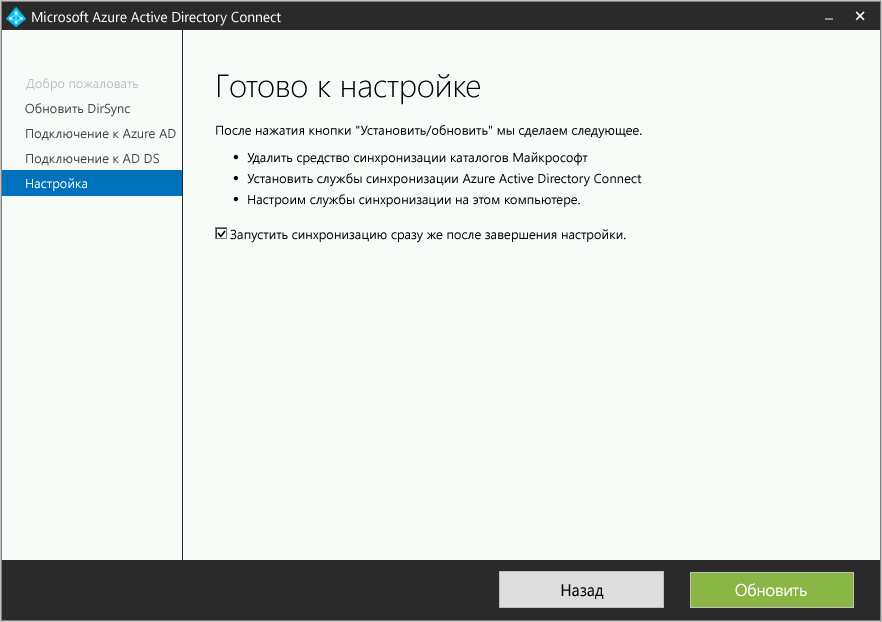

# Azure AD Connect: обновление DirSync
Azure AD Connect является преемником Microsoft Azure Active Directory Sync Tool (DirSync). В этой статье описано, как можно обновить DirSync. Следующие действия не подходят для обновления другого выпуска Azure AD Connect или Azure AD Sync.

Перед установкой Azure AD Connect, [скачайте Azure AD Connect](http://go.microsoft.com/fwlink/?LinkId=615771) и выполните предварительные шаги, перечисленные в статье [Необходимые условия для Azure AD Connect](active-directory-aadconnect-prerequisites.md). В частности, ознакомьтесь со сведениями об указанных ниже областях, отличных от DirSync:

* Требуемая версия .NET и PowerShell. На сервере должны быть установлены более новые версии, чем требуется для DirSync.
* Конфигурация прокси-сервера. Если для доступа в Интернет используется прокси-сервер, перед обновлением этот параметр необходимо настроить. В DirSync всегда используется прокси-сервер, настроенный для пользователя, выполняющего установку, но в Azure AD Connect вместо этого используются параметры компьютера.
* URL-адреса, которые должны быть открыты на прокси-сервере. Для основных сценариев, которые также поддерживаются DirSync, применяются одинаковые требования. Если вы хотите использовать одну из новых функций Azure AD Connect, следует открыть некоторые новые URL-адреса.

> [!NOTE]
> Если вы уже используете новый сервер Azure AD Connect для запуска синхронизации изменений в Azure AD, то откат к использованию DirSync или Azure AD Sync уже невозможен. Обратный переход с Azure AD Connect к устаревшим клиентам, включая DirSync и Azure AD Sync, не поддерживается и может привести к таким проблемам, как потеря данных в Azure AD.

Если вам не нужно обновлять DirSync, см. другие сценарии в [документации](#related-documentation).

## Обновление из DirSync
В зависимости от текущего развертывания DirSync, существуют различные параметры для обновления. Если ожидаемое время обновления составляет менее трех часов, рекомендуем выполнить обновление на месте. Если ожидаемое время обновления составляет более трех часов, рекомендуем реализовать параллельное развертывание на другом сервере. Предполагается, что при наличии более 50 000 объектов для обновления потребуется более трех часов.

| Сценарий |
| --- | --- |
| [Обновление «на месте»](#in-place-upgrade) |
| [Параллельное развертывание](#parallel-deployment) |

> [!NOTE]
> При планировании обновления из DirSync до Azure AD Connect не удаляйте DirSync самостоятельно до обновления. Azure AD Connect считает и перенесет конфигурацию из DirSync и удалит его после проверки сервера.

**Обновление «на месте»**  
Мастер отобразит ожидаемое время для завершения обновления. Оценка основана на предположении, что для завершения обновления базы данных, содержащей 50 000 объектов (пользователей, контактов и групп), потребуется три часа. Если число объектов в базе данных меньше 50 000, Azure AD Connect порекомендует обновление на месте. Если вы приняли решение продолжить, текущие параметры будут автоматически применены во время обновления и сервер автоматически возобновит активную синхронизацию.

Если вы хотите перенести конфигурацию и выполнить параллельное развертывание, можно проигнорировать рекомендации по обновлению на месте. Например, можно воспользоваться возможностью обновления оборудования и операционной системы. Дополнительные сведения см. в разделе [Параллельное развертывание](#parallel-deployment).

**Параллельное развертывание**  
Параллельное развертывание рекомендуется использовать при наличии более 50 000 объектов. Это развертывание позволит избежать задержек в работе пользователей. Программа установки Azure AD Connect попытается оценить ожидаемое время простоя из-за обновления, но если вы уже обновляли службу DirSync, то лучше руководствоваться собственным опытом.

### Поддерживаемые обновляемые конфигурации DirSync
Следующие изменения в конфигурации поддерживаются в обновленной версии DirSync.

* Фильтрация домена и подразделения
* Альтернативный идентификатор (UPN)
* Гибридные параметры синхронизации паролей и Exchange
* Параметры вашего леса или домена и Azure AD
* Фильтрация на основе атрибутов пользователя

Обновить следующее изменение невозможно. Обновление будет заблокировано при следующих условиях:

* Неподдерживаемые изменения DirSync, например удаленные атрибуты и использование пользовательского расширения DLL.

В таких случаях рекомендуется установить новый сервер Azure AD Connect в [промежуточном режиме](active-directory-aadconnectsync-operations.md#staging-mode), а также проверить старую конфигурацию DirSync и новую конфигурацию Azure AD Connect. Повторно примените изменения с помощью пользовательской конфигурации, как описано в разделе [Пользовательская конфигурация службы синхронизации Azure AD Connect](active-directory-aadconnectsync-whatis.md).

Пароли, используемые DirSync для учетных записей служб, невозможно получить и перенести. Эти пароли будут сбрасываются во время обновления.

### Общие инструкции по обновлению из DirSync до Azure AD Connect
1. Приветствие мастера установки Azure AD Connect.
2. Анализ текущей конфигурации DirSync
3. Получение пароля глобального администратора Azure AD.
4. Получение учетных данных для учетной записи администратора предприятия (используется только во время установки Azure AD Connect).
5. Установка Azure AD Connect
   * Удаление (или временное отключение) DirSync
   * Установка Azure AD Connect
   * Запуск синхронизации (при необходимости).

Дополнительные действия необходимы, если:

* в настоящее время вы используете полную версию SQL Server, локальную или удаленную;
* в области синхронизации более 50 000 объектов.

## Обновление «на месте»
1. Запустите установщик Azure AD Connect (MSI).
2. Просмотрите и примите условия лицензионного соглашения и заявления о конфиденциальности.  
   
3. Нажмите кнопку "Далее" для анализа существующей установки DirSync.  
   
4. По завершении анализа вы получите рекомендации по дальнейшим действиям.  
   * При использовании SQL Server Express и наличии менее 50 000 объектов отображается следующий экран:   
     
   * При использовании полной версии SQL Server для DirSync вы увидите такую страницу:  
       
     Здесь отображаются сведения о существующей базе данных SQL Server, используемой DirSync. При необходимости внесите соответствующие изменения. Нажмите кнопку **Далее** , чтобы продолжить установку.
   * При наличии более 50 000 объектов отобразится следующий экран:  
       
     Чтобы продолжить обновление на месте, установите флажок рядом с сообщением **Продолжить обновление DirSync на этом компьютере.**
     Чтобы вместо этого реализовать [parallel deployment](#parallel-deployment) , экспортируйте параметры конфигурации DirSync и перенесите конфигурацию на новый сервер.
5. Введите пароль для учетной записи, используемой в настоящее время для подключения к Azure AD. Это должна быть учетная запись, используемая в настоящее время с DirSync.  
     
   Если вы получаете сообщение об ошибке и испытываете проблемы с подключением, см. статью [Устранение неполадок подключения в Azure AD Connect](active-directory-aadconnect-troubleshoot-connectivity.md).
6. Укажите учетную запись администратора предприятия для Active Directory.  
   
7. Теперь все готово для настройки. Нажмите кнопку **Обновить**, чтобы удалить DirSync и начать настройку и синхронизацию Azure AD Connect.  
   
8. После завершения установки выполните выход из Windows и снова войдите, прежде чем использовать диспетчер службы синхронизации или редактор правил синхронизации либо вносить в конфигурацию какие-либо другие изменения.

## Параллельное развертывание
### Экспорт конфигурации DirSync
**Параллельное развертывание — более 50 000 объектов**

При наличии более 50 000 объектов программа установки Azure AD Connect порекомендует параллельное развертывание.

Появится экран, аналогичный показанному ниже.  

Если вы хотите продолжить параллельное развертывание, сделайте следующее.

* Нажмите кнопку **Экспорт параметров** . Если вы устанавливаете Azure AD Connect на отдельном сервере, эти параметры будут перенесены из текущей службы DirSync в устанавливаемую службу Azure AD Connect.

После успешного экспорта настроек вы можете закрыть мастер Azure AD Connect на сервере DirSync. Перейдите к следующему шагу [Установка Azure AD Connect на отдельном сервере](#installation-of-azure-ad-connect-on-separate-server)

**Параллельное развертывание — менее 50 000 объектов**

Если у вас менее 50 000 объектов, но вы хотите реализовать параллельное развертывание, выполните следующие действия.

1. Запустите установщик Azure AD Connect (MSI).
2. При отображении экрана **Вас приветствует Azure AD Connect** выйдите из мастера установки, нажав кнопку c крестиком в правом верхнем углу окна.
3. Откройте окно командной строки.
4. Из папки установки Azure AD Connect (по умолчанию: C:\Program Files\Microsoft Azure Active Directory Connect) выполните следующую команду: `AzureADConnect.exe /ForceExport`.
5. Нажмите кнопку **Экспорт параметров** . Если вы устанавливаете Azure AD Connect на отдельном сервере, эти параметры будут перенесены из текущей службы DirSync в устанавливаемую службу Azure AD Connect.

После успешного экспорта настроек вы можете закрыть мастер Azure AD Connect на сервере DirSync. Перейдите к следующему шагу, чтобы [установить Azure AD Connect на отдельном сервере](#installation-of-azure-ad-connect-on-separate-server).

### Установка Azure AD Connect на отдельном сервере
При установке Azure AD Connect на новом сервере предполагается, что вы хотите выполнить чистую установку Azure AD Connect. Так как вы собираетесь использовать конфигурацию DirSync, необходимо выполнить некоторые дополнительные действия.

1. Запустите установщик Azure AD Connect (MSI).
2. При отображении экрана **Вас приветствует Azure AD Connect** выйдите из мастера установки, нажав кнопку c крестиком в правом верхнем углу окна.
3. Откройте окно командной строки.
4. Из папки установки Azure AD Connect (по умолчанию: C:\Program Files\Microsoft Azure Active Directory Connect) выполните следующую команду: `AzureADConnect.exe /migrate`.
   Будет запущен мастер установки Azure AD Connect, и появится следующий экран:  
   
5. Выберите файл параметров, экспортированный из установки DirSync.
6. Настройте любые дополнительные параметры, в том числе:
   * пользовательский путь установки Azure AD Connect;
   * существующий экземпляр SQL Server (по умолчанию Azure AD Connect устанавливает SQL Server 2012 Express). Не используйте один и тот же экземпляр базы данных в качестве сервера DirSync.
   * Учетная запись службы, используемая для подключения к SQL Server (если база данных SQL Server удаленная, эта учетная запись должна быть учетной записью службы домена).
     Следующие параметры можно увидеть на этом экране:   
     
7. Нажмите кнопку **Далее**.
8. Не снимайте флажок **Запустить синхронизацию сразу после завершения настройки** на странице **Готово к настройке**. Теперь сервер находится в [промежуточном режиме](active-directory-aadconnectsync-operations.md#staging-mode), поэтому изменения не экспортируются в Azure AD.
9. Щелкните **Install**(Установить).
10. После завершения установки выполните выход из Windows и снова войдите, прежде чем использовать диспетчер службы синхронизации или редактор правил синхронизации либо вносить в конфигурацию какие-либо другие изменения.

> [!NOTE]
> Между Windows Server Active Directory и Azure Active Directory начнется синхронизация, но изменения не будут экспортированы в Azure AD. В каждый момент времени активно экспортировать изменения может только одно средство синхронизации. Это состояние называется [промежуточным режимом](active-directory-aadconnectsync-operations.md#staging-mode).

### Убедитесь, что служба Azure AD Connect готова к синхронизации.
Чтобы определить, готова ли служба Azure AD Connect наследовать настройки DirSync, необходимо открыть **Synchronization Service Manager** в группе **Azure AD Connect** из меню "Пуск".

В приложении перейдите на вкладку **Операции** . Здесь вы сможете проверить выполнение следующих операций:

* Импорт в соединителе AD
* Импорт в соединителе Azure AD
* Полная синхронизация в соединителе AD
* Полная синхронизация в соединителе Azure AD

Просмотрите результат этих операций и убедитесь, что отсутствуют ошибки.

Если вы хотите просмотреть, какие изменения будут экспортированы в Azure AD, прочитайте, как проверить конфигурацию в [промежуточном режиме](active-directory-aadconnectsync-operations.md#staging-mode). Внесите необходимые изменения конфигурации, пока не увидите что-нибудь непредвиденное.

Если эти действия выполнены и вы довольны результатами, можно переходить от DirSync к Azure AD.

### Удаление DirSync (старый сервер)
* В разделе **Программы и компоненты** найдите **Microsoft Azure Active Directory Sync Tool**.
* Удалите **Microsoft Azure Active Directory Sync Tool**
* Удаление может занять до 15 минут.

Если вы хотите удалить DirSync позже, можно также временно завершить работу сервера или отключить службу. Если что-то пойдет не так, этот метод позволяет снова включить ее. Но следующий шаг вряд ли завершится ошибкой, поэтому в этом не должно возникнуть необходимости.

После удаления или отключения DirSync нет ни одного активного сервера, экспортируемого в Azure AD. Следующий шаг — включение Azure AD Connect — необходимо завершить, прежде чем продолжать синхронизацию изменений локальной службы Active Directory с Azure AD.

### Включение Azure AD Connect (новый сервер)
При повторном открытии Azure AD Connect после установки вы сможете внести дополнительные изменения в конфигурацию. Запустите **Azure AD Connect** из меню "Пуск" или с помощью ярлыка на рабочем столе. Убедитесь, что не пытаетесь повторно запустить программу установки MSI.

Вы увидите следующее:  

* Выберите **Настроить промежуточный режим**.
* Отключите промежуточный режим, сняв флажок **Промежуточный режим включен** .

* Нажмите кнопку **Далее** .
* На странице подтверждения нажмите кнопку **Установить** .

Azure AD Connect теперь является вашим активным сервером. Вам не следует переключаться обратно на существующий сервер DirSync.

## Дополнительная информация
После установки Azure AD Connect можно [проверить установку и назначить лицензии](active-directory-aadconnect-whats-next.md).

Подробные сведения о новых функциях, включенных при установке, см. в следующих статьях: [Azure AD Connect: автоматическое обновление](active-directory-aadconnect-feature-automatic-upgrade.md), [Синхронизация Azure AD Connect: предотвращение случайного удаления](active-directory-aadconnectsync-feature-prevent-accidental-deletes.md) и [Использование Azure AD Connect Health для синхронизации](../connect-health/active-directory-aadconnect-health-sync.md).

Дополнительные сведения см. в статье [Синхронизация Azure AD Connect: планировщик](active-directory-aadconnectsync-feature-scheduler.md).

Узнайте больше об [интеграции локальных удостоверений с Azure Active Directory](active-directory-aadconnect.md).
