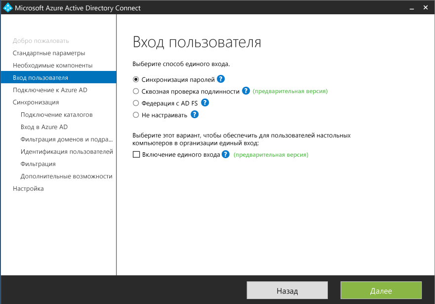
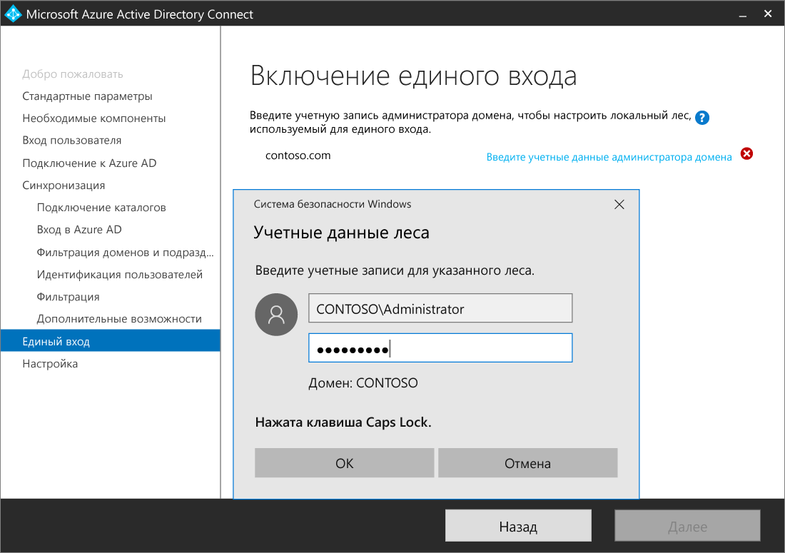
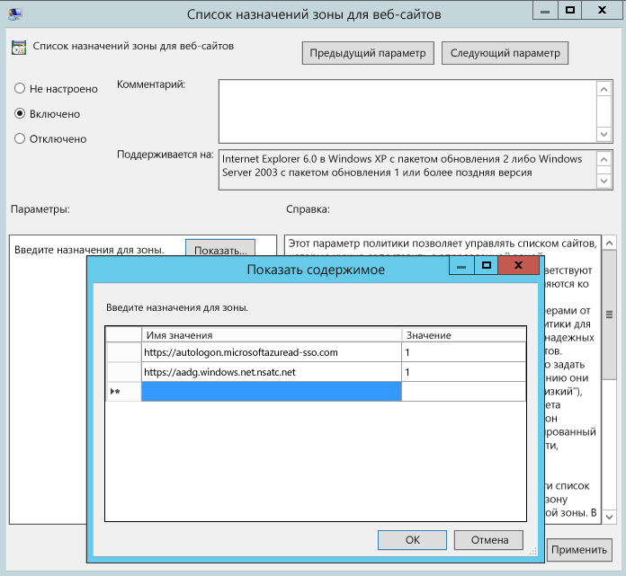

# Выборочная установка Azure AD Connect

**Настраиваемые параметры** в Azure AD Connect используются, когда для установки необходимо указать больше параметров. В частности, если есть несколько лесов или требуется настроить дополнительные компоненты, которые не входят в экспресс-установку. Они также используются в тех случаях, когда [**экспресс-установка**](active-directory-aadconnect-get-started-express.md) не соответствует требованиям развертывания или топологии.

Перед установкой Azure AD Connect, [скачайте Azure AD Connect](http://go.microsoft.com/fwlink/?LinkId=615771) и выполните предварительные шаги, перечисленные в статье [Необходимые условия для Azure AD Connect](active-directory-aadconnect-prerequisites.md). Кроме того, убедитесь в наличии учетных записей, описанных в статье [Azure AD Connect: учетные записи и разрешения](active-directory-aadconnect-accounts-permissions.md).

Если настраиваемые параметры не соответствуют топологии, например для обновления DirSync, сведения о других сценариях см. в разделе [Дополнительная документация](#related-documentation).

## Выборочная установка Azure AD Connect с настраиваемыми параметрами

### Стандартные параметры

На этой странице щелкните **Настроить** , чтобы запустить установку с настраиваемыми параметрами.

### Установка необходимых компонентов

При установке служб синхронизации вы можете пропустить раздел с дополнительными настройками, чтобы служба Azure AD Connect настроила все автоматически. Будет настроен экземпляр SQL Server 2012 Express LocalDB, а также созданы соответствующие группы, которым будут назначены разрешения. Если вы хотите изменить параметры по умолчанию, изучите доступные дополнительные параметры в таблице ниже.

| Дополнительная настройка | Описание |
| --- | --- |
| Использование существующего SQL Server |Позволяет указать имя SQL Server и имя экземпляра. Выберите этот параметр, если у вас уже есть сервер базы данных AD, который вы хотите использовать. Если для SQL Server не разрешен просмотр, в поле **Имя экземпляра** следует ввести имя экземпляра и через запятую номер порта. |
| Использование существующей учетной записи службы |По умолчанию Azure AD Connect использует учетную запись виртуальной службы для служб синхронизации. Если вы используете удаленный экземпляр SQL Server или требующий аутентификации прокси-сервер, вам необходима **управляемая учетная запись службы** или учетная запись службы в домене и пароль. В этом случае укажите учетную запись для использования. Убедитесь, что пользователь, выполняющий установку, использует имя для входа SA в SQL, чтобы создать имя для входа в учетную запись службы. См. статью [Azure AD Connect: учетные записи и разрешения](active-directory-aadconnect-accounts-permissions.md#azure-ad-connect-sync-service-account). |
| Указание пользовательских групп синхронизации |По умолчанию при установке служб синхронизации Azure AD Connect создает на сервере четыре локальные группы. Это группы "Администраторы", "Операторы", "Обзор", "Сброс пароля". Здесь также можно указать собственные группы. Группы должны размещаться локально на сервере и могут находиться в домене. |

### Вход пользователя

После установки необходимых компонентов вам будет предложено выбрать метод единого входа для пользователей. В таблице ниже содержится краткое описание доступных параметров. Полное описание способов входа см. в статье [Параметры входа в Azure AD Connect](active-directory-aadconnect-user-signin.md).

| Метод единого входа | Описание |
| --- | --- |
| Синхронизация паролей |Пользователи могут войти в облачные службы (Майкрософт), например Office 365, используя тот же пароль, что и в локальной сети. Пароли пользователей синхронизируются в Azure путем хэширования, а аутентификация выполняется в облаке. Дополнительные сведения см. в статье о [синхронизации паролей](active-directory-aadconnectsync-implement-password-synchronization.md). |
|Сквозная проверка подлинности (предварительная версия)|Пользователи могут войти в облачные службы (Майкрософт), например Office 365, используя тот же пароль, что и в локальной сети.  Пароль пользователя передается локальному контроллеру Active Directory для проверки.
| Федерация с AD FS |Пользователи могут войти в облачные службы (Майкрософт), например Office 365, используя тот же пароль, что и в локальной сети.  Во время входа пользователи перенаправляются в локальный экземпляр AD FS, так как аутентификация выполняется локально. |
| Не настраивать |Ни один компонент не устанавливается и не настраивается. Выберите этот параметр, если у вас уже есть сервер федерации стороннего производителя или другое локальное решение. |
|Включение единого входа|Этот параметр доступен для синхронизации паролей и сквозной проверки подлинности. С его помощью пользователи настольных компьютеров могут воспользоваться единым входом в корпоративной сети.  Дополнительные сведения см. в статье о [едином входе](active-directory-aadconnect-sso.md).  Примечание для пользователей служб федерации Active Directory. Этот параметр недоступен, так как службы федерации Active Directory обеспечивают те же возможности единого входа. (если одновременно не будет выпущен PTA).
|Единый вход|Этот параметр доступен для клиентов, установивших синхронизацию паролей. С его помощью пользователи настольных компьютеров могут воспользоваться единым входом в корпоративной сети.   Дополнительные сведения см. в статье о [едином входе](active-directory-aadconnect-sso.md).  Примечание для пользователей служб федерации Active Directory. Этот параметр недоступен, так как службы федерации Active Directory обеспечивают те же возможности единого входа.

### Подключение к Azure AD

В диалоговом окне "Подключение к Azure AD" введите учетную запись и пароль глобального администратора. Если на предыдущей странице вы выбрали параметр **Федерация с AD FS** , не используйте для входа учетную запись домена, который планируется включить в федерацию. Мы рекомендуем использовать учетную запись в домене по умолчанию ( **onmicrosoft.com** ), которая предоставляется вместе с каталогом Azure AD.

Эта учетная запись используется только для создания учетной записи службы в Azure AD и не используется после завершения работы мастера.  

Если для учетной записи глобального администратора включена MFA, необходимо еще раз ввести пароль во всплывающем окне на странице входа и завершить запрос MFA. Возможно, для запроса понадобится предоставить код проверки или выполнить телефонный звонок.  

Для учетной записи глобального администратора также может быть включено [управление привилегированными пользователями](../active-directory-privileged-identity-management-getting-started.md).

Если вы получаете сообщение об ошибке и испытываете проблемы с подключением, см. сведения в статье [Устранение неполадок подключения в Azure AD Connect](active-directory-aadconnect-troubleshoot-connectivity.md).

## Страницы в разделе "Синхронизация"

### Подключение к каталогам

Чтобы подключиться к службе домена Active Directory, Azure AD Connect необходимо имя леса и учетные данные учетной записи с достаточными разрешениями.

После входа в лес щелкните **Добавить каталог**. Появится всплывающее диалоговое окно со следующими параметрами:

| Параметр | Описание |
| --- | --- |
| Использовать существующую учетную запись | Выберите этот параметр, если вы хотите предоставить имеющуюся учетную запись AD DS, которая будет использоваться Azure AD Connect для подключения к лесу AD во время синхронизации каталогов. Вы можете указать имя домена в формате NetBios либо ввести полное доменное имя, т. е. FABRIKAM\syncuser или fabrikam.com\syncuser. Эта учетная запись может принадлежать обычному пользователю, так как стандартных разрешений для чтения вполне достаточно. Однако для некоторых сценариев могут потребоваться дополнительные разрешения. Дополнительные сведения см. в разделе [Создание учетной записи AD DS](active-directory-aadconnect-accounts-permissions.md#create-the-ad-ds-account). |
| Создать учетную запись | Выберите этот параметр, если вы хотите, чтобы мастер Azure AD Connect создал учетную запись AD DS, необходимую для Azure AD Connect для подключения к лесу AD во время синхронизации каталогов. Выбрав его, введите имя пользователя и пароль для учетной записи администратора предприятия. Указанная учетная запись администратора предприятия будет использоваться мастером Azure AD Connect для создания необходимой учетной записи AD DS. Вы можете указать имя домена в формате NetBios, либо ввести полное доменное имя, т. е. FABRIKAM\administrator или fabrikam.com\administrator. |

### Конфигурация входа в Azure AD

На этой странице представлены сведения о доменах UPN, входящих в локальные доменные службы Active Directory и проверенных в Azure AD. Кроме того, здесь можно настроить атрибут для параметра userPrincipalName.

  
Просмотрите каждый домен с отметкой **Не добавлено** и **Не проверено**. Убедитесь, что используемые домены прошли проверку в Azure AD. Проверив домены, щелкните значок обновления. Дополнительные сведения см. в статье о [добавлении и проверке домена](../active-directory-add-domain.md).

Атрибут **UserPrincipalName** используется для входа в Azure AD и Office 365. Используемые домены, которые также называются UPN-суффиксами, следует проверить в Azure AD до синхронизации пользователей. Мы рекомендуем оставить userPrincipalName как атрибут по умолчанию. Если этот атрибут не поддерживает маршрутизацию и его нельзя проверить, можно выбрать другой атрибут. Например, можно выбрать адрес электронной почты в качестве атрибута, содержащего идентификатор входа. Отличный от userPrincipalName атрибут называется **альтернативным идентификатором**. Значение альтернативного идентификатора должно соответствовать стандарту RFC822. Этот идентификатор можно использовать при синхронизации паролей и в федерации.

>[!NOTE]
> При включении сквозной проверки подлинности для продолжения работы с мастером у вас должен быть по крайней мере один проверенный домен.

> [!WARNING]
> Использование альтернативного идентификатора совместимо не со всеми рабочими нагрузками Office 365. Дополнительные сведения см. в статье [Настройка альтернативного идентификатора входа](https://technet.microsoft.com/library/dn659436.aspx).
>
>

### Фильтрация домена и подразделения

По умолчанию все домены и подразделения синхронизируются. Если вы не планируете синхронизировать с Azure AD некоторые домены или подразделения, их можно исключить.  
  
На этой странице мастера настраивается фильтрация по доменам и подразделениям. Если вы планируете внести изменения, сначала ознакомьтесь с [фильтрацией по домену](active-directory-aadconnectsync-configure-filtering.md#domain-based-filtering) и [фильтрацией по подразделению](active-directory-aadconnectsync-configure-filtering.md#organizational-unitbased-filtering). Некоторые подразделения важны для функциональных возможностей, и их выбор не следует отменять.

При использовании фильтрации по подразделениям с помощью Azure AD Connect версии 1.1.524.0 или более ранней новые подразделения, добавляемые позже, синхронизируются по умолчанию. Если требуется, чтобы новые подразделения не синхронизировались, такое поведение можно настроить после того, как мастер завершит работу с [фильтрацией по подразделениям](active-directory-aadconnectsync-configure-filtering.md#organizational-unitbased-filtering). В Azure AD Connect версии  1.1.524.0 и более поздних вы можете указать, следует ли синхронизировать новые подразделения.

Если вы планируете использовать [фильтрацию по группам](#sync-filtering-based-on-groups), убедитесь, что подразделение с группой включено и не фильтруется с использованием фильтрации по подразделениям. Фильтрация по подразделениям выполняется до фильтрации по группам.

Некоторые домены могут быть недоступными из-за ограничений брандмауэра. Такие домены исключены по умолчанию, и для них будет отображаться предупреждение.  
  
Если вы видите такое предупреждение, убедитесь, что эти домены действительно недоступны и это предупреждение не является ошибкой.

### Уникальная идентификация пользователей

#### Выбор способа идентификации пользователей в локальных каталогах

Функция согласования между лесами позволяет определить, как пользователи из лесов AD DS представлены в Azure AD. Пользователь может быть представлен во всех лесах только один раз или может иметь комбинацию включенных и отключенных учетных записей. В некоторых лесах пользователь также может быть представлен как контакт.

| Настройка | Описание |
| --- | --- |
| [Пользователи представлены во всех лесах только один раз](active-directory-aadconnect-topologies.md#multiple-forests-single-azure-ad-tenant) |В Azure AD все пользователи создаются как отдельные объекты. Объекты не соединены в метавселенной. |
| [Атрибут почты](active-directory-aadconnect-topologies.md#multiple-forests-single-azure-ad-tenant) |Этот параметр соединяет пользователей и контакты, если атрибут почты имеет то же значение в разных лесах. Используйте этот параметр, если контакты созданы с помощью GALSync. |
| [ObjectSID и msExchangeMasterAccountSID/ msRTCSIP-OriginatorSid](active-directory-aadconnect-topologies.md#multiple-forests-single-azure-ad-tenant) |Этот параметр соединяет включенного пользователя в лесу учетной записи с отключенным пользователем в лесу ресурсов. В Exchange такая конфигурация называется связанным почтовым ящиком. Этот параметр можно также применять при использовании только Lync и отсутствии Exchange в лесу ресурсов. |
| sAMAccountName и MailNickName |Это параметр соединяет атрибуты, в которых может быть указан идентификатор пользователя для входа. |
| Определенный атрибут |Этот параметр позволяет выбрать собственный атрибут. **Ограничение.** Нужно выбрать атрибут, который уже находится в метавселенной. Если выбрать настраиваемый атрибут (не в метавселенной), мастер не сможет завершить работу. |

#### Выбор способа идентификации пользователей в Azure AD: привязка к источнику

Атрибут sourceAnchor остается неизменным в течение всего времени существования объекта-пользователя. Это первичный ключ, который связывает локального пользователя с пользователем в Azure AD.

| Настройка | Описание |
| --- | --- |
| Параметр "Azure управляет привязкой к источнику" | Выберите этот параметр, если вы хотите, чтобы среда Azure AD выбирала этот атрибут автоматически. Если вы выберете этот параметр, то мастер Azure AD Connect применит логику выбора атрибута sourceAnchor, описанную в статье [Azure AD Connect: принципы проектирования](active-directory-aadconnect-design-concepts.md#using-msds-consistencyguid-as-sourceanchor). Мастер сообщит, какой атрибут был выбран в качестве атрибута привязки к источнику после завершения выборочной установки. |
| Определенный атрибут | Выберите этот параметр, если вы хотите указать имеющийся атрибут AD в качестве атрибута sourceAnchor. |

Так как атрибут нельзя изменить, внимательно выбирайте атрибут для использования. Хорошим кандидатом является objectGUID. Этот атрибут не меняется, если учетная запись пользователя не перемещается между лесами и доменами. В среде с несколькими лесами, в которой учетные записи перемещаются между лесами, необходимо использовать другой атрибут, например атрибут с employeeID. Не рекомендуется использовать атрибуты, которые меняются, когда пользователь меняет семейный статус или переходит на другую должность. Нельзя использовать атрибуты со знаком @-sign, поэтому адрес электронной почты и атрибут userPrincipalName также не должны использоваться. В атрибуте также учитывается регистр, поэтому при перемещении объекта между лесами обязательно сохраняйте верхний и нижний регистр. Двоичные атрибуты находятся в кодировке base64, но другие типы атрибутов остаются в некодированном виде. В сценариях федерации и некоторых интерфейсах Azure AD этот атрибут также известен как immutableID. Дополнительные сведения о привязке к источнику можно найти в описании [принципов проектирования](active-directory-aadconnect-design-concepts.md#sourceanchor).

### Фильтрация синхронизации на основе групп

Функция фильтрации на основе групп позволяет синхронизировать только небольшое подмножество объектов для пилотного развертывания. Чтобы использовать эту функцию, создайте группу в локальной службе Active Directory. Затем добавьте пользователей и группы, которые должны синхронизироваться с Azure AD как прямые участники. Позднее вы сможете добавлять пользователей в эту группу и удалять их, чтобы сохранить список объектов, которые должны присутствовать в Azure AD. Все объекты, которые вы хотите синхронизировать, должны быть непосредственными членами группы. Пользователи, группы, контакты и компьютеры или устройства должны быть прямыми участниками. Членство во вложенных группах не разрешено. При добавлении группы в качестве участника она добавляется без участников.

> [!WARNING]
> Эта функция предназначена только для использования в пилотном развертывании. Не используйте ее для полноценного рабочего развертывания.
>
>

В полноценной рабочей среде трудно поддерживать одну группу со всеми объектами для синхронизации. Вместо этого следует использовать один из методов, описанных в статье о [настройке фильтрации](active-directory-aadconnectsync-configure-filtering.md).

### Дополнительные функции

В этом диалоговом окне вы можете выбрать дополнительные функции для конкретных сценариев.

> [!WARNING]
> Если у вас запущено средство синхронизации DirSync или Azure AD Sync, не активируйте функции обратной записи в Azure AD Connect.
>
>

| Дополнительные функции | Описание |
| --- | --- |
| Гибридное развертывание Exchange |Функция гибридного развертывания Exchange обеспечивает сосуществование почтовых ящиков Exchange в локальной среде и в службе Office 365. Azure AD Connect синхронизирует определенный набор [атрибутов](active-directory-aadconnectsync-attributes-synchronized.md#exchange-hybrid-writeback) из Azure AD с локальным каталогом. |
| Общедоступные папки почты Exchange | Функция общедоступных папок почты Exchange позволяет вам синхронизировать общедоступную папку с поддержкой электронной почты из вашего локального Active Directory с Azure AD. |
| Фильтрации приложений и атрибутов Azure AD |Включив фильтрацию приложений и атрибутов Azure AD, можно адаптировать набор синхронизированных атрибутов. При установке этого параметра в мастер добавляется две дополнительные страницы конфигурации. Дополнительные сведения см. в разделе [Фильтрации приложений и атрибутов Azure AD](#azure-ad-app-and-attribute-filtering). |
| Синхронизация паролей |Этот параметр можно включить, если вы выбрали федерацию в качестве решения входа. В этом случае синхронизацию паролей можно использовать в качестве резервного варианта. Дополнительные сведения см. в статье о [синхронизации паролей](active-directory-aadconnectsync-implement-password-synchronization.md).   При выборе сквозной проверки подлинности этот параметр включен по умолчанию, чтобы обеспечить поддержку старых клиентов. Кроме того, этот параметр можно использовать для архивации. Дополнительные сведения см. в статье о [синхронизации паролей](active-directory-aadconnectsync-implement-password-synchronization.md).|
| Обратная запись паролей |При включении компонента обратной записи паролей изменения, внесенные в пароли в Azure AD, записываются в локальный каталог. Дополнительные сведения см. в статье [Приступая к работе с компонентами управления паролями](../active-directory-passwords-getting-started.md). |
| Обратная запись групп |Если вы используете функцию **Группы Office 365**, эти группы могут быть доступны в вашей локальной службе Active Directory. Эта возможность доступна только при наличии Exchange в вашей локальной службе Active Directory. Дополнительные сведения см. в разделе [Обратная запись групп](active-directory-aadconnect-feature-preview.md#group-writeback). |
| Обратная запись устройств |Позволяет осуществлять обратную запись объектов устройств в вашу локальную службу Active Directory в Azure AD для сценариев условного доступа. Дополнительные сведения см. в статье [Azure AD Connect: включение обратной записи устройств](active-directory-aadconnect-feature-device-writeback.md). |
| Синхронизация атрибутов расширения каталога |При включении синхронизации атрибутов расширения каталогов заданные атрибуты синхронизируются с Azure AD. Дополнительные сведения см. в статье о [расширениях каталогов](active-directory-aadconnectsync-feature-directory-extensions.md). |

### Фильтрации приложений и атрибутов Azure AD

Если вы хотите ограничить перечень атрибутов, синхронизируемых с Azure AD, начните с выбора используемых служб. При изменении настроек на этой странице новую службу необходимо выбрать явно путем повторного запуска мастера установки.

С учетом службы, выбранной на предыдущем этапе, отображаются все атрибуты, которые будут синхронизированы. Этот список сочетает в себе все типы объектов, для которых выполняется синхронизация. Если какие-либо атрибуты не нужно синхронизировать, их можно исключить из выбранного набора.

> [!WARNING]
> Удаление атрибутов может повлиять на функциональность. Рекомендации см. в разделе об [атрибутах для синхронизации](active-directory-aadconnectsync-attributes-synchronized.md#attributes-to-synchronize).
>
>

### Синхронизация атрибутов расширения каталога

Вы можете расширить схему в Azure AD, используя настраиваемые атрибуты, добавленные в вашей организации, или другие атрибуты в Active Directory. Чтобы использовать эту функцию, на странице **Дополнительные возможности** щелкните **Directory Extension attribute sync** (Синхронизация атрибутов расширений каталога). На этой странице можно выбрать дополнительные атрибуты для синхронизации.

Дополнительные сведения см. в статье о [расширениях каталогов](active-directory-aadconnectsync-feature-directory-extensions.md).

### Включение единого входа (SSO)

Настройка единого входа для использования с синхронизацией паролей или сквозной проверкой подлинности — простой процесс, который необходимо выполнить один раз для каждого леса, синхронизируемого с Azure AD. Конфигурация состоит из двух этапов:

1.  Создание необходимой учетной записи компьютера в локальном каталоге Active Directory.
2.  Настройка зоны интрасети клиентских компьютеров для поддержки единого входа.

#### Создание учетной записи компьютера в Active Directory

Для каждого леса, добавленного с помощью Azure AD Connect, необходимо указать учетные данные администратора домена. Таким образом в каждом из них будет создана учетная запись компьютера. Учетные данные используются только для создания учетной записи и не хранятся, а также не используются для выполнения любой другой операции. Просто добавьте учетные данные на странице **Enable Single sign on** (Включение единого входа) мастера Azure AD Connect, как показано ниже:

>[!NOTE]
>Вы можете пропустить конкретный лес, если не хотите использовать единый вход для него.

#### Настройка зоны интрасети для клиентских компьютеров

Чтобы убедиться, что клиент автоматически подключается к зоне интрасети, проверьте, входят ли в нее URL-адреса. Таким образом при подключении к корпоративной сети присоединенный к домену компьютер автоматически отправляет билет Kerberos в Azure AD.
На компьютере с инструментами управления групповой политикой сделайте следующее:

1.  Откройте средства управления групповыми политиками.
2.  Измените групповую политику, которая будет применяться ко всем пользователям. Например, политику домена по умолчанию.
3.  Перейдите в раздел **Конфигурация пользователя\Административные шаблоны\Компоненты Windows\Internet Explorer\Панель управления браузером\Вкладка безопасности** и выберите **Список назначений зоны для веб-сайтов**, как на рисунке ниже.
4.  Включите политику и введите следующие два элемента в диалоговом окне.

        Value: `https://autologon.microsoftazuread-sso.com`  
        Data: 1  
        Value: `https://aadg.windows.net.nsatc.net`  
        Data: 1

5.  Это должно выглядеть следующим образом:  

6.  Нажмите кнопку **ОК** дважды.

## Настройка федерации с AD FS

Вы можете легко настроить службы федерации Active Directory с Azure AD Connect. Ниже приведены компоненты, требуемые для настройки.

* Сервер Windows Server 2012 R2 с поддержкой удаленного управления для сервера федерации.
* Сервер Windows Server 2012 R2 с поддержкой удаленного управления для прокси-сервера веб-приложения.
* Сертификат SSL для имени службы федерации, которое предполагается использовать (например, sts.contoso.com).

### Предварительные требования для настройки AD FS

Чтобы настроить ферму AD FS с помощью Azure AD Connect, обязательно включите WinRM на удаленных серверах. Кроме того, ознакомьтесь с требованиями к портам, перечисленным в разделе [Таблица 3. Azure AD Connect и серверы федерации и WAP](active-directory-aadconnect-ports.md#table-3---azure-ad-connect-and-ad-fs-federation-serverswap).

### Создание новой фермы AD FS или использование существующей фермы AD FS

Вы можете использовать существующую ферму AD FS или создать новую. Если вы решили создать новую, необходимо предоставить SSL-сертификат. Если SSL-сертификат защищен паролем, появится запрос на ввод пароля.

Если будет использоваться существующая ферма AD FS, вы сразу перейдете к диалоговому окну настройки отношений доверия между AD FS и Azure AD.

### Указание серверов AD FS

Укажите серверы, на которых требуется установить AD FS. Можно добавить один или несколько серверов в зависимости от потребностей запланированной загрузки. Прежде чем выполнить эту настройку, присоедините все серверы к Active Directory. Мы рекомендуем установить одиночный сервер AD FS для тестовых и пилотных развертываний. Добавьте и разверните дополнительные серверы в соответствии с потребностями масштабирования, повторно запустив Azure AD Connect после начальной настройки.

> [!NOTE]
> Прежде чем выполнить эту настройку, убедитесь, что все серверы присоединены к домену AD.
>
>

### Указание прокси-серверов веб-приложений

Укажите серверы, которые будут использоваться как прокси-серверы веб-приложений. Прокси-сервер веб-приложения развертывается в промежуточной подсети (экстрасети с выходом) и поддерживает запросы проверки подлинности из внешней сети. Можно добавить один или несколько серверов в зависимости от потребностей запланированной загрузки. Мы рекомендуем установить одиночный прокси-сервер веб-приложений для тестовых и пилотных развертываний. Добавьте и разверните дополнительные серверы в соответствии с потребностями масштабирования, повторно запустив Azure AD Connect после начальной настройки. Для аутентификации из интрасети рекомендуется использовать эквивалентное число прокси-серверов.

> [!NOTE]
> <li> Если используемая учетная запись не имеет прав локального администратора на серверах AD FS, вам будет предложено ввести учетные данные администратора.</li>
> <li> Перед этим этапом убедитесь в наличии HTTP/HTTPS-подключения между сервером Azure AD Connect и прокси-сервером веб-приложений.</li>
> <li> Убедитесь в наличии HTTP/HTTPS-подключения между сервером веб-приложений и сервером AD FS, иначе аутентификация работать не будет.</li>
>

Вам будет предложено ввести учетные данные, чтобы сервер веб-приложений мог установить безопасное подключение к серверу AD FS. Эти учетные данные должны иметь права локального администратора на сервере AD FS.

### Укажите учетную запись службы для службы AD FS

Для службы AD FS требуется учетная запись службы домена для проверки подлинности пользователей и поиска информации о пользователях в Active Directory. Поддерживаются два типа учетных записей службы.

* **Групповая управляемая учетная запись службы**. Этот тип учетной записи представлен в доменных службах Active Directory в Windows Server 2012. Этот тип учетной записи позволяет таким службам, как AD FS, использовать единый вход без постоянного обновления пароля учетной записи. Используйте этот параметр, если у вас уже есть контроллеры домена Windows Server 2012 в домене, к которому принадлежат серверы AD FS.
* **Учетная запись пользователя домена**. Для этого типа учетной записи необходимо указать пароль, который нужно регулярно обновлять в случае изменения или истечения срока действия. Используйте этот тип, только если у вас нет контроллеров домена Windows Server 2012 в домене, к которому принадлежат серверы AD FS.

Если вы выбрали групповую управляемую учетную запись службы, а эта учетная запись никогда не использовалась в Active Directory, вам также будет предложено ввести учетные данные администратора предприятия. Эти учетные данные необходимы, чтобы инициировать хранилище ключей и включить эту учетную запись в Active Directory.

### Выбор домена Azure AD, который нужно включить в федерацию

Эта конфигурация используется для установки федеративных отношений между AD FS и Azure AD. Она настраивает службы федерации Active Directory для выдачи маркеров безопасности Azure AD и настраивает Azure AD для доверия маркерам из данного конкретного экземпляра AD FS. Во время первой установки на этой странице можно настроить только один домен. Позже можно настроить дополнительные домены, запустив Azure AD Connect еще раз.

### Проверка домена Azure AD, выбранного для включения в федерацию

При выборе домена, который необходимо включить в федерацию, Azure AD Connect предоставляет необходимые сведения для проверки непроверенного домена. Сведения о том, как использовать эти данные, см. в статье о [добавлении и проверке домена](../active-directory-add-domain.md).

> [!NOTE]
> AD Connect пытается проверить домен на этапе настройки. Если вы продолжите настройку, не добавив необходимые записи DNS, мастер не сможет завершить настройку.
>
>

## Страницы настройки и проверки

Настройка выполняется на этой странице.

> [!NOTE]
> Прежде чем продолжить установку (при настроенной федерации), необходимо настроить [разрешение имен для серверов федерации](active-directory-aadconnect-prerequisites.md#name-resolution-for-federation-servers).
>
>

### Промежуточный режим

Новый сервер синхронизации можно установить при промежуточном режиме. В этом режиме поддерживается только один сервер синхронизации, подключенный для экспорта к одному каталогу в облаке. Но если требуется переместить данные с другого сервера, на котором работает, например, DirSync, можно включить Azure Connect AD в промежуточном режиме. Если это средство включено, модуль синхронизации импортирует и синхронизирует данные в обычном режиме, но ничего не экспортирует в Azure AD или AD. В промежуточном режиме синхронизация паролей и компонент обратной записи паролей отключены.

В промежуточном режиме можно вносить необходимые изменения в модуль синхронизации и просматривать данные перед экспортом. Если вы довольны конфигурацией, снова запустите мастер установки и отключите промежуточный режим. Теперь данные экспортируются с этого сервера в Azure AD. Обязательно отключите другой сервер, чтобы только один сервер активно экспортировал данные.

Дополнительные сведения см. в разделе [Промежуточный режим](active-directory-aadconnectsync-operations.md#staging-mode).

### Проверьте конфигурации федерации

Если нажать кнопку "Проверить", Azure AD Connect проверит параметры DNS.

Кроме того выполните следующие шаги для проверки.

* Проверьте возможность входа с помощью браузера, запущенного на подключенном к домену компьютере в интрасети. Для этого перейдите по адресу https://myapps.microsoft.com и попробуйте войти в систему, используя учетные данные, с которыми вы уже вошли. Встроенная учетная запись администратора в AD DS не синхронизируется и не может использоваться для проверки.
* Проверьте возможность входа с устройства из экстрасети. На домашнем компьютере или мобильном устройстве перейдите по адресу https://myapps.microsoft.com и укажите свои учетные данные.
* Проверьте возможность входа клиента с расширенными возможностями. Перейдите по адресу https://testconnectivity.microsoft.com, выберите вкладку **Office 365** и щелкните **Тест единого входа в Office 365**.

## Дальнейшие действия

После завершения установки выполните выход из Windows и снова войдите, прежде чем начинать использовать диспетчер службы синхронизации или редактор правил синхронизации.

После установки Azure AD Connect можно [проверить установку и назначить лицензии](active-directory-aadconnect-whats-next.md).

Дополнительные сведения об этих функциях, включенных при установке, см. в следующих статьях: [Синхронизация Azure AD Connect: предотвращение случайного удаления](active-directory-aadconnectsync-feature-prevent-accidental-deletes.md) и [Использование Azure AD Connect Health для синхронизации](../connect-health/active-directory-aadconnect-health-sync.md).

Дополнительные сведения см. в статье [Синхронизация Azure AD Connect: планировщик](active-directory-aadconnectsync-feature-scheduler.md).

Узнайте больше об [интеграции локальных удостоверений с Azure Active Directory](active-directory-aadconnect.md).

