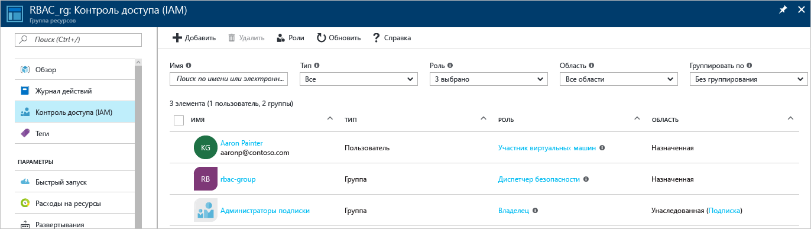
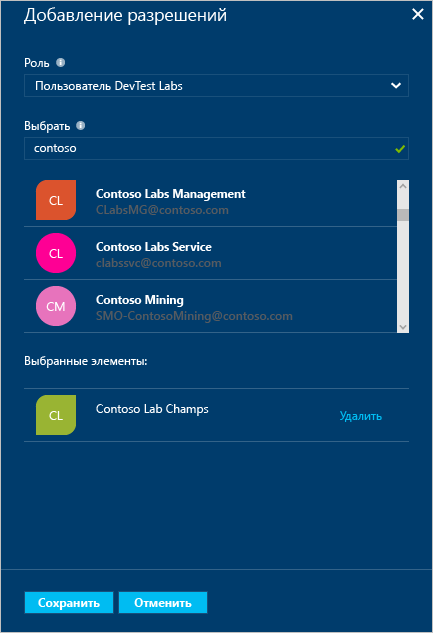
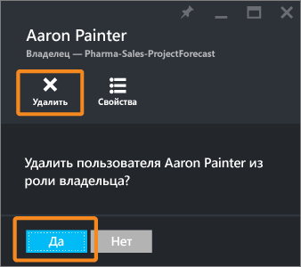
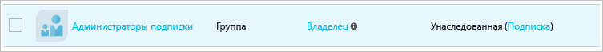

# Использование назначений ролей для управления доступом к ресурсам в подписке Azure
> [!div class="op_single_selector"]
> * [Управление доступом по пользователям или группам](role-based-access-control-manage-assignments.md)
> * [Управление доступом по ресурсам](role-based-access-control-configure.md)
> 
> 

Контроль доступа на основе ролей (RBAC) Azure обеспечивает точное управление доступом для Azure. С помощью RBAC можно предоставлять пользователям доступ, необходимый только для выполнения поставленных перед ними задач. Эта статья поможет вам приступить к работе с RBAC на портале Azure. Дополнительные сведения о том, как RBAC помогает управлять доступом, см. в статье [Начало работы с управлением доступом на портале Azure](role-based-access-control-what-is.md).

## Просмотр прав доступа
Вы можете увидеть, у кого есть доступ к ресурсу, группе ресурсов или подписке, в основной колонке на [портале Azure](https://portal.azure.com). Например, мы хотим узнать, кто имеет доступ к одной из наших групп ресурсов.

1. Щелкните значок **Группы ресурсов** на панели навигации слева.  
    
2. В колонке **Группы ресурсов** выберите имя группы ресурсов.
3. В меню слева выберите **Управление доступом (IAM)**.  
4. В колонке "Контроль доступа" содержится список всех пользователей, групп и приложений, которым предоставлен доступ к группе ресурсов.  
   
    

Обратите внимание, что некоторым пользователям доступ был **назначен**, тогда как другие **унаследовали** его. Доступ специально назначается группе ресурсов или наследуется в результате назначения родительской подписке.

> [!NOTE]
> Классические администраторы и соадминистраторы подписки считаются владельцами подписки в новой модели RBAC.
> 
> 

## Добавление доступа
Вы можете предоставить доступ в рамках ресурса, группы ресурсов или подписки, которые входят в область назначения роли.

1. В колонке "Контроль доступа" выберите **Добавить**.  
2. Выберите роль, которую следует назначить, в колонке **Выбор роли** .
3. В каталоге выберите пользователя, группу или приложение, которым нужно предоставить доступ. Поиск в каталоге можно выполнить по отображаемым именам, адресам электронной почты и идентификаторам объектов.  
   
    
4. Щелкните **ОК** , чтобы создать назначение. Во всплывающем окне **Добавление пользователя** будет отображаться ход операции.  
    

Назначенная роль отобразится в колонке **Пользователи** .

## Запрет доступа
1. В колонке "Контроль доступа" выберите назначение роли.
2. Выберите **Удалить** в колонке сведений о назначении.  
3. Выберите **Да** , чтобы подтвердить удаление.  
    

Унаследованные назначения нельзя удалить. Обратите внимание: на рисунке ниже кнопка "Удалить" неактивна (серая). В таком случае откройте раздел **Где назначено** . Перейдите к ресурсу, который указан в этом разделе, чтобы удалить назначение роли.

## Другие средства управления доступом
Вы можете назначать роли и управлять доступом с помощью модели RBAC Azure не только на портале Azure, но и с помощью других средств.  Ниже представлены ссылки на ресурсы с дополнительными сведениями о предварительных требованиях и начале работы с командами RBAC Azure.

* [Azure PowerShell](role-based-access-control-manage-access-powershell.md)
* [Интерфейс командной строки Azure](role-based-access-control-manage-access-azure-cli.md)
* [ИНТЕРФЕЙС REST API](role-based-access-control-manage-access-rest.md)

## Дальнейшие действия
* [Создание отчета по журналу изменений доступа](role-based-access-control-access-change-history-report.md)
* Ознакомьтесь со статьей [RBAC: встроенные роли](role-based-access-built-in-roles.md)
* Определите собственные [пользовательские роли в RBAC Azure](role-based-access-control-custom-roles.md)

<!--HONumber=Oct16_HO2-->

