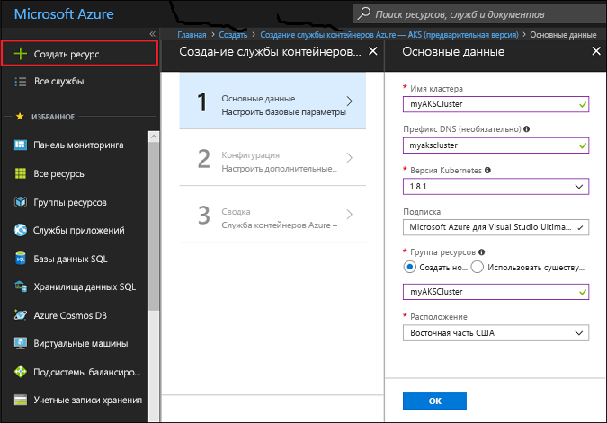

# <a name="quickstart-deploy-an-azure-container-service-aks-cluster"></a>Краткое руководство. Развертывание кластера Службы контейнеров Azure (AKS)

В этом кратком руководстве вы развернете кластер AKS с помощью портала Azure. Затем в кластере будет запущено многоконтейнерное приложение, состоящее из веб-интерфейса и экземпляра Redis. По завершении приложение будет доступно через Интернет.


В этом руководстве предполагается, что у вас есть некоторое представление о функциях Kubernetes. Дополнительные сведения см. в [документации по Kubernetes][kubernetes-documentation].

## <a name="sign-in-to-azure"></a>Вход в Azure

Войдите на портал Azure по адресу http://portal.azure.com.

## <a name="create-service-principal"></a>Создание субъекта-службы

Прежде чем создавать кластер AKS на портале Azure, нужно создать субъект-службу. Azure использует субъект-службу для управления инфраструктурой, связанной с кластером AKS.

Последовательно выберите элементы **Azure Active Directory** > **Регистрация приложений** > **Регистрация нового приложения**.

Введите произвольное имя приложения. Выберите в качестве типа приложения **Веб-приложение или API**. Введите произвольное значение для параметра **URL-адрес входа**. Нужно соблюдать формат URL-адреса, но не обязательно использовать реальную конечную точку.

По завершении нажмите кнопку **Создать**.


Выберите зарегистрированное приложение и сохраните его идентификатор. Это значение понадобится при создании кластера AKS.


Теперь создайте пароль для субъекта-службы. Выберите **Все параметры** > **Ключи** и введите произвольное значение в качестве описания ключа. Выберите срок, в течение которого действует этот субъект-служба.

Щелкните **Сохранить** и запишите значение пароля. Этот пароль потребуется при создании кластера AKS.


## <a name="create-aks-cluster"></a>Создание кластера AKS

Выберите **Создать ресурс** > **Контейнеры** > **Azure Container Service - AKS (preview)** (Служба контейнеров Azure — AKS (предварительная версия)).

Укажите данные для кластера: имя, префикс DNS, имя группы ресурсов, расположение и версию Kubernetes. Запишите имя кластера и имя группы ресурсов. Они понадобятся вам при подключении к кластеру.

Когда все будет готово, нажмите кнопку **ОК**.



Введите следующие параметры в форме конфигурации:

- Имя пользователя, присвоенное административной учетной записи на узлах кластера.
- Открытый ключ SSH, связанный с ключом, который будет использоваться для доступа к узлам кластера.
- Идентификатор клиента субъекта-службы, который вы создали ранее при работе с этим документом.
- Секрет клиента субъекта-службы, то есть пароль субъекта-службы, который вы создали ранее при работе с этим документом.
- Число узлов AKS, которое требуется создать.
- Размер узла виртуальной машины для этих узлов AKS.
- Размер диска операционной системы для этих узлов AKS.

Когда все будет готово, выберите **ОК**, а после завершения проверки — еще раз щелкните **ОК**.


После короткого ожидания кластер ASK будет развернут и готов к использованию.

## <a name="connect-to-the-cluster"></a>Подключение к кластеру

Управлять кластером Kubernetes можно при помощи [kubectl][kubectl], клиента командной строки Kubernetes. Клиент kubectl предварительно установлен в Azure Cloud Shell.

Откройте Cloud Shell с помощью кнопки в правом верхнем углу портала Azure.


Укажите подписку (если она не указана)
```azurecli-interactive
az account set -s SUBSCRIPTION_NAME
```

Выполните команду [az acs kubernetes get-credentials][az-aks-get-credentials], чтобы настроить подключение kubectl к кластеру Kubernetes.

Скопируйте следующий код и вставьте его в Cloud Shell. Если нужно, измените в нем имя группы ресурсов и имя кластера.

```azurecli-interactive
az aks get-credentials --resource-group myAKSCluster --name myAKSCluster
```

Проверьте подключение к кластеру, выполнив команду [kubectl get][kubectl-get], чтобы просмотреть список узлов кластера.

```azurecli-interactive
kubectl get nodes
```

Выходные данные:

```
NAME                       STATUS    ROLES     AGE       VERSION
aks-agentpool-14693408-0   Ready     agent     6m        v1.8.1
aks-agentpool-14693408-1   Ready     agent     6m        v1.8.1
aks-agentpool-14693408-2   Ready     agent     7m        v1.8.1
```

## <a name="run-the-application"></a>Выполнение приложения

Файл манифеста Kubernetes определяет требуемое состояние кластера, в том числе выполняемые в нем образы контейнеров. В нашем примере манифест создает все объекты, необходимые для запуска приложения Azure для голосования.

Создайте файл с именем `azure-vote.yaml` и скопируйте в него следующий код YAML. Если вы работаете в Azure Cloud Shell, создайте этот файл с помощью Vi или Nano, как в обычной виртуальной или физической системе.

```yaml
apiVersion: apps/v1beta1
kind: Deployment
metadata:
  name: azure-vote-back
spec:
  replicas: 1
  template:
    metadata:
      labels:
        app: azure-vote-back
    spec:
      containers:
      - name: azure-vote-back
        image: redis
        ports:
        - containerPort: 6379
          name: redis
---
apiVersion: v1
kind: Service
metadata:
  name: azure-vote-back
spec:
  ports:
  - port: 6379
  selector:
    app: azure-vote-back
---
apiVersion: apps/v1beta1
kind: Deployment
metadata:
  name: azure-vote-front
spec:
  replicas: 1
  template:
    metadata:
      labels:
        app: azure-vote-front
    spec:
      containers:
      - name: azure-vote-front
        image: microsoft/azure-vote-front:v1
        ports:
        - containerPort: 80
        env:
        - name: REDIS
          value: "azure-vote-back"
---
apiVersion: v1
kind: Service
metadata:
  name: azure-vote-front
spec:
  type: LoadBalancer
  ports:
  - port: 80
  selector:
    app: azure-vote-front
```

Используйте команду [kubectl create][kubectl-create], чтобы запустить приложение.

```azurecli-interactive
kubectl create -f azure-vote.yaml
```

Выходные данные:

```
deployment "azure-vote-back" created
service "azure-vote-back" created
deployment "azure-vote-front" created
service "azure-vote-front" created
```

## <a name="test-the-application"></a>Тестирование приложения

При запуске приложения создается [служба Kubernetes][kubernetes-service], которая предоставляет внешний интерфейс приложения в Интернете. Процесс создания может занять несколько минут.

Чтобы отслеживать ход выполнения, используйте команду [kubectl get service][kubectl-get] с аргументом `--watch`.

```azurecli-interactive
kubectl get service azure-vote-front --watch
```

Изначально для параметра *EXTERNAL-IP* службы *azure-vote-front* отображается значение *pending* (ожидание).

```
NAME               TYPE           CLUSTER-IP   EXTERNAL-IP   PORT(S)        AGE
azure-vote-front   LoadBalancer   10.0.37.27   <pending>     80:30572/TCP   6s
```

Как только *ВНЕШНИЙ IP-АДРЕС* изменится с состояния *ожидания* на *IP-адрес*, используйте команду `CTRL-C`, чтобы остановить процесс отслеживания kubectl.

```
azure-vote-front   LoadBalancer   10.0.37.27   52.179.23.131   80:30572/TCP   2m
```

Теперь перейдите по внешнему IP-адресу в приложение Azure для голосования.


## <a name="delete-cluster"></a>Удаление кластера

Если кластер больше не нужен, просто удалите его группу ресурсов. После этого будут удалены все связанные ресурсы. Для этого выделите группу ресурсов на портале Azure и нажмите кнопку "Удалить". Также можно применить команду [az group delete][az-group-delete] в Cloud Shell.

```azurecli-interactive
az group delete --name myAKSCluster --no-wait
```

## <a name="get-the-code"></a>Получение кода

В этом кратком руководстве для развертывания Kubernetes используются предварительно созданные образы контейнеров. Связанный с приложением код, файл Dockerfile и файл манифеста Kubernetes доступны на сайте GitHub.

[https://github.com/Azure-Samples/azure-voting-app-redis][azure-vote-app]

## <a name="next-steps"></a>Дополнительная информация

В этом кратком руководстве мы развернули кластер Kubernetes, а затем развернули в нем многоконтейнерное приложение.

Дополнительные сведения о AKS и инструкции по созданию полного кода для примера развертывания см. в руководстве по кластерам Kubernetes.

> [!div class="nextstepaction"]
> [Руководство по AKS][aks-tutorial]

<!-- LINKS - external -->
[azure-vote-app]: https://github.com/Azure-Samples/azure-voting-app-redis.git
[kubectl]: https://kubernetes.io/docs/user-guide/kubectl/
[kubectl-create]: https://kubernetes.io/docs/reference/generated/kubectl/kubectl-commands#create
[kubectl-get]: https://kubernetes.io/docs/reference/generated/kubectl/kubectl-commands#get
[kubernetes-documentation]: https://kubernetes.io/docs/home/
[kubernetes-service]: https://kubernetes.io/docs/concepts/services-networking/service/

<!-- LINKS - internal -->
[az-aks-get-credentials]: /cli/azure/aks?view=azure-cli-latest#az_aks_get_credentials
[az-group-delete]: /cli/azure/group#delete
[aks-tutorial]: ./tutorial-kubernetes-prepare-app.md


