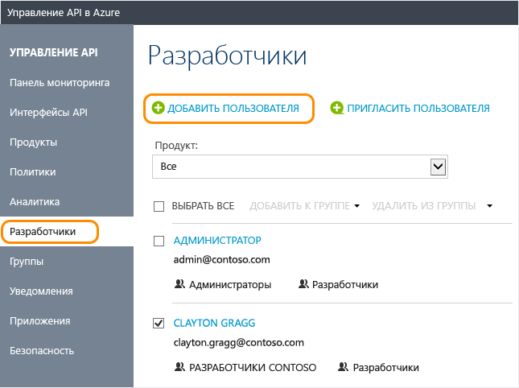

# Управление учетными записями пользователей в службе управления API Azure
В службе управления API разработчики – это пользователи интерфейсов API, которые вы предоставляете с помощью службы управления API. В этом руководстве показано, как создавать и приглашать разработчиков использовать интерфейсы API и продукты, которые вы делаете доступными для них с помощью своего экземпляра API Management. Сведения о программном управлении учетными записями пользователей см. в документации по [сущностям пользователя](https://msdn.microsoft.com/library/azure/dn776330.aspx) [в справочнике по REST управления API](https://msdn.microsoft.com/library/azure/dn776326.aspx).

## предварительным требованиям

Выполните задачи из статьи [Создание экземпляра службы управления API Azure](get-started-create-service-instance.md).

[!INCLUDE [api-management-navigate-to-instance.md](../../includes/api-management-navigate-to-instance.md)]

## Создание нового разработчика

Чтобы добавить нового пользователя, выполните инструкции в этом разделе:

1. В левой части экрана выберите вкладку **Пользователи**.
2. Нажмите кнопку **+ Добавить**.
3. Введите соответствующую информацию для пользователя.
4. Нажмите кнопку **Добавить**.

    

По умолчанию недавно созданные учетные записи разработчика являются **активными** и связаны с группой **Разработчики**. Учетные записи разработчика, которые находятся в **активном** состоянии, можно использовать для доступа ко всем интерфейсам API, на которые у них есть подписки. Процедуру связывания недавно созданного разработчика с дополнительными группами см. в разделе [Связывание групп с разработчиками][How to associate groups with developers].

## Приглашение разработчика
Чтобы отправить приглашение разработчику, выполните инструкции в этом разделе:

1. В левой части экрана выберите вкладку **Пользователи**.
2. Нажмите клавишу **+Пригласить**.

Вы увидите сообщение-подтверждение, но недавно приглашенный разработчик не появится в списке, пока не примет приглашение. 

После приглашения разработчика ему отправляется сообщение электронной почты. Это сообщение создается с помощью шаблона и может настраиваться. Дополнительные сведения см. в разделе [Настройка почтовых шаблонов][Configure email templates].

После принятия приглашения учетная запись становится активной.

##  Деактивация или повторная активация учетной записи разработчика

По умолчанию недавно созданные или приглашенные учетные записи разработчика являются **активными**. Для деактивации учетной записи разработчика щелкните **Блокировать**. Для повторной активации блокированной учетной записи разработчика щелкните **Активировать**. Для блокированной учетной записи разработчика запрещен доступ к порталу разработчика и вызов любых интерфейсов API. Чтобы удалить учетную запись пользователя, щелкните **Удалить**.

Чтобы заблокировать доступ для пользователя, выполните приведенные ниже инструкции.

1. В левой части экрана выберите вкладку **Пользователи**.
2. Выберите пользователя, доступ для которого нужно заблокировать.
3. Нажмите кнопку **Заблокировать**.

## Сброс пароля пользователя

Сведения о программной работе с учетными записями пользователей см. в документации по [сущностям пользователя](https://msdn.microsoft.com/library/azure/dn776330.aspx) в [справочнике по REST управления API](https://msdn.microsoft.com/library/azure/dn776326.aspx). Чтобы сбросить пароль учетной записи пользователя до определенного значения, можно использовать операцию [обновления пользователя](https://msdn.microsoft.com/library/azure/dn776330.aspx#UpdateUser) и указать нужный пароль.

## Дальнейшие действия
После создания учетной записи разработчика ее можно связать с ролями и подписать ее на продукты и интерфейсы API. Дополнительные сведения см. в статье [Как создавать и использовать группы для управления учетными записями разработчика в службе управления Azure API][How to create and use groups].

[api-management-management-console]: ./media/api-management-howto-create-or-invite-developers/api-management-management-console.png
[api-management-add-new-user]: ./media/api-management-howto-create-or-invite-developers/api-management-add-new-user.png
[api-management-create-developer]: ./media/api-management-howto-create-or-invite-developers/api-management-create-developer.png
[api-management-invite-developer]: ./media/api-management-howto-create-or-invite-developers/api-management-invite-developer.png
[api-management-new-developer]: ./media/api-management-howto-create-or-invite-developers/api-management-new-developer.png
[api-management-invite-developer-window]: ./media/api-management-howto-create-or-invite-developers/api-management-invite-developer-window.png
[api-management-invite-developer-confirmation]: ./media/api-management-howto-create-or-invite-developers/api-management-invite-developer-confirmation.png
[api-management-pending-verification]: ./media/api-management-howto-create-or-invite-developers/api-management-pending-verification.png
[api-management-view-developer]: ./media/api-management-howto-create-or-invite-developers/api-management-view-developer.png
[api-management-reset-password]: ./media/api-management-howto-create-or-invite-developers/api-management-reset-password.png

[Create a new developer]: #create-developer
[Invite a developer]: #invite-developer
[Deactivate or reactivate a developer account]: #block-developer
[Next steps]: #next-steps
[How to create and use groups]: api-management-howto-create-groups.md
[How to associate groups with developers]: api-management-howto-create-groups.md#associate-group-developer

[Get started with Azure API Management]: get-started-create-service-instance.md
[Create an API Management service instance]: get-started-create-service-instance.md
[Configure email templates]: api-management-howto-configure-notifications.md#email-templates
