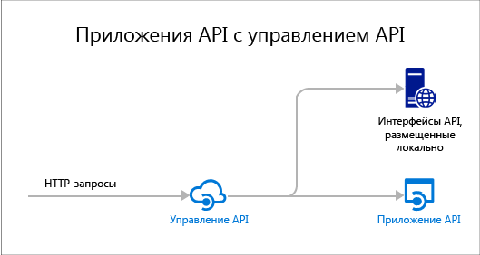

.<properties 
	pageTitle="Общие сведения об API приложений | Microsoft Azure" 
	description="Узнайте, как служба приложений Azure помогает разрабатывать, размещать и использовать интерфейсы RESTful API." 
	services="app-service\api" 
	documentationCenter=".net" 
	authors="tdykstra" 
	manager="wpickett" 
	editor=""/>

<tags 
	ms.service="app-service-api" 
	ms.workload="web" 
	ms.tgt_pltfrm="na" 
	ms.devlang="na" 
	ms.topic="get-started-article" 
	ms.date="08/23/2016" 
	ms.author="rachelap"/>

# Обзор приложений API

Приложения API в службе приложений Azure предоставляют возможности, которые упрощают разработку, размещение и использование интерфейсов API в облачной и локальной среде. Приложения API обеспечивают преимущества безопасности корпоративного класса, простого контроля доступа, возможности гибридного подключения, автоматического создания пакетов SDK и непрерывной интеграции с [приложениями логики](../app-service-logic/app-service-logic-what-are-logic-apps.md).

[Служба приложений Azure](../app-service/app-service-value-prop-what-is.md) — это полностью управляемая платформа для сценариев веб- и мобильных приложений, а также интеграции. Приложения API являются одним из четырех типов приложений, предлагаемых [службой приложений Azure](../app-service/app-service-value-prop-what-is.md).

## Возможности приложений API

Вот несколько ключевых функций приложений API.

- **Использование существующего API "как есть"**. Вам не нужно изменять код в существующих интерфейсах API, чтобы воспользоваться преимуществами приложений API. Просто разверните свой код в приложении API. API может использовать любой язык или платформу, поддерживаемые службой приложений, включая ASP.NET и C#, Java, PHP, Node.js и Python.

- **Простое использование.** Интегрированная поддержка [метаданных API Swagger](http://swagger.io/) упрощает использование ваших API множеством разных клиентов. Автоматически создавайте код клиента для API на разных языках, включая C#, Java и Javascript. Легко настраивайте [CORS](app-service-api-cors-consume-javascript.md) без изменения кода. Дополнительные сведения см. в разделах [Метаданные приложений API службы приложений для обнаружения API и создания кода](app-service-api-metadata.md) и [Использование приложения API из JavaScript с помощью CORS](app-service-api-cors-consume-javascript.md).

- **Простой контроль доступа.** Защитите приложение API от доступа без проверки подлинности, не внося изменений в код. Службы встроенной проверки подлинности защищают API для доступа других служб и клиентов, представляющих пользователей. В число поддерживаемых поставщиков удостоверений входят: Azure Active Directory, Facebook, Twitter, Google и учетная запись Майкрософт. Клиенты могут использовать библиотеку проверки подлинности Active Directory (ADAL) или пакет SDK для мобильных приложений. Дополнительные сведения см. в статье [Проверка подлинности и авторизация для приложений API в службе приложений Azure](app-service-api-authentication.md).

- **Интеграция с Visual Studio.** Выделенные инструменты в Visual Studio упрощают работу по созданию, развертыванию, отладке приложений API и управлению ими. Дополнительную информацию см. в разделе [Представляем пакет Azure SDK 2.8.1 для .NET](/blog/announcing-azure-sdk-2-8-1-for-net/).

- **Интеграция с приложениями логики.** Созданные вами приложения API могут использоваться [приложениями логики службы приложений](../app-service-logic/app-service-logic-what-are-logic-apps.md). Дополнительные сведения см. в статьях [Использование настраиваемого интерфейса API, размещенного в службе приложений, с приложениями логики](../app-service-logic/app-service-logic-custom-hosted-api.md) и [Новая версия схемы 2015-08-01-preview](../app-service-logic/app-service-logic-schema-2015-08-01.md).

Кроме того, приложение API может использовать преимущества функций, предоставляемых [веб-приложениями](../app-service-web/app-service-web-overview.md) и [мобильными приложениями](../app-service-mobile/app-service-mobile-value-prop.md). Верно и обратное: если использовать веб-приложение или мобильное приложение для размещения API, оно может использовать такие преимущества приложений API, как метаданные Swagger для создания кода клиента и CORS для междоменного доступа в браузере. Единственное различие между тремя типами приложений (приложениями API, веб-приложениями и мобильными приложениями) — имя и значок на портале Azure.

## Разница между приложениями API и службой управления API Azure

Приложения API и [служба управления API Azure](../api-management/api-management-key-concepts.md) являются взаимодополняющими.

* Служба управления API имеет отношение к управлению API-интерфейсами. Интерфейсная часть службы управления API, размещенная в API, позволяет отслеживать и регулировать использование, обрабатывать входные и выходные данные, объединять несколько API в одну конечную точку и т. д. Управляемые API-интерфейсы могут размещаться в любом месте.
* Приложения API связаны с размещением API-интерфейсов. Эта служба содержит функции, которые упрощают разработку и использование API-интерфейсов. Однако в отличие от службы управления API она не поддерживает возможности мониторинга, регулирования, обработки и объединения. Если вам не требуются возможности управления API, можно размещать интерфейсы API в приложениях API без использования этой службы.

Ниже приведена схема, которая демонстрирует использование службы управления API для интерфейсов API, размещенных в приложениях API и в другом месте.

Некоторые компоненты службы управления API и приложений API имеют аналогичные функции. Например, они могут автоматизировать поддержку CORS. Используя две службы вместе, вы будете применять службу управления API для CORS, так как она работает как интерфейсная часть для приложений API.

## Приступая к работе

Чтобы приступить к работе с приложениями API, используя один пример кода, ознакомьтесь с руководством по необходимой платформе:

* [ASP.NET](app-service-api-dotnet-get-started.md)
* [Node.js](app-service-api-nodejs-api-app.md)
* [Java](app-service-api-java-api-app.md)

Чтобы задать вопросы о приложениях API, начните беседу на [форуме по приложениям API](https://social.msdn.microsoft.com/Forums/ru-RU/home?forum=AzureAPIApps).

<!---HONumber=AcomDC_0824_2016-->