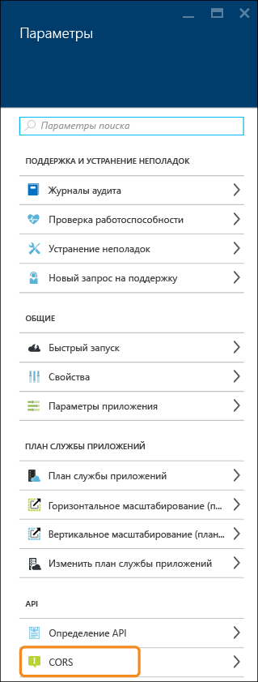
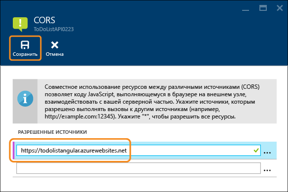
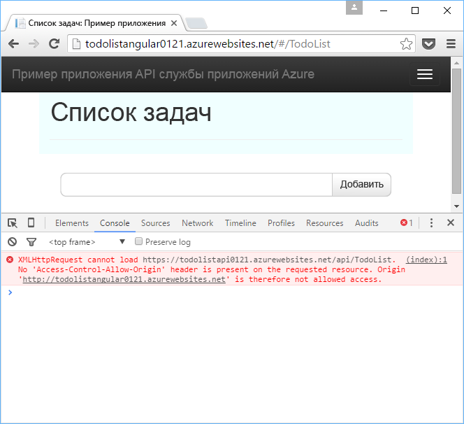
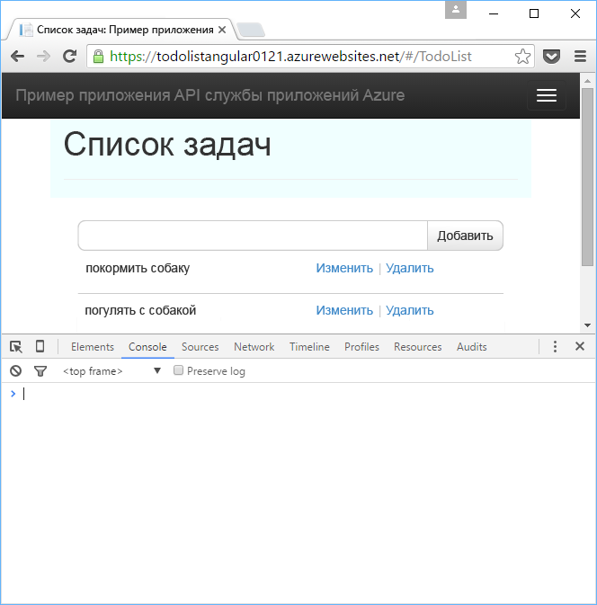

<properties
	pageTitle="Использование приложения API из JavaScript с помощью CORS | Microsoft Azure"
	description="Узнайте, как использовать приложение API в службе приложений Azure из клиента JavaScript с помощью CORS."
	services="app-service\api"
	documentationCenter=".net"
	authors="tdykstra"
	manager="wpickett"
	editor=""/>

<tags
	ms.service="app-service-api"
	ms.workload="na"
	ms.tgt_pltfrm="dotnet"
	ms.devlang="na"
	ms.topic="get-started-article"
	ms.date="02/05/2016"
	ms.author="tdykstra"/>

# Использование приложения API из JavaScript с помощью CORS

## Обзор

Эта статья содержит два раздела.

* В разделе о [настройке CORS](#corsconfig) содержатся общие инструкции по настройке CORS для любого приложения API. Эти инструкции одинаково применимы ко всем платформам, которые поддерживаются службой приложений, в том числе .NET, Node.js и Java. 

* [Остальная часть статьи](#tutorialstart) содержит руководство по развертыванию примера приложения .NET и настройке CORS таким образом, чтобы интерфейс JavaScript мог вызывать серверную часть веб-API.

##  Настройка CORS в службе приложений Azure

### Что такое CORS?

В целях безопасности браузеры не позволяют JavaScript выполнять вызовы API к доменам, кроме домена, из которого выполняется код JavaScript. Например, с веб-страницы contoso.com можно вызвать конечную точку API contoso.com, однако с той же веб-страницы нельзя вызвать конечную точку fabrikam.com. Cross Origin Resource Sharing (CORS) — это протокол IP, который позволяет осуществлять кросс-доменные вызовы API. В службе приложений Azure такие вызовы могут понадобиться, например, если клиент JavaScript выполняется в веб-приложении, а API — в приложении API.

### Поддержка CORS в службе приложений

Служба приложений предоставляет простой способ настроить домены, которые могут вызывать приложение API, а функция CORS работает одинаково для всех языков, поддерживаемых службой приложений API.

### Настройка CORS на портале Azure

8. В браузере откройте [портал Azure](https://portal.azure.com/).

9. Последовательно выберите элементы **Обзор > Приложения API**.

	

11. Выберите целевое приложение API.

	

10. В колонке **Приложение API** выберите элемент **Параметры**.

	

11. В разделе **API** щелкните **CORS**.

12. В текстовое поле введите URL-адреса, с которых следует разрешить вызовы JavaScript.

	Например, если вы развернули приложение JavaScript в веб-приложении с именем todolistangular, введите https://todolistangular.azurewebsites.net. Вместо URL-адресов можно ввести символ звездочки (*). В таком случае будут приниматься вызовы из всех исходных доменов.

13. Щелкните **Сохранить**.

	

	Когда вы нажмете кнопку **Сохранить**, приложение API начнет принимать вызовы JavaScript с указанных URL-адресов.

### Настройка CORS с помощью средств диспетчера ресурсов Azure

Вы также можете настроить CORS для приложения API с помощью средств командной строки, например Azure PowerShell, кроссплатформенного интерфейса командной строки Azure или [обозревателя ресурсов](https://resources.azure.com/).

В этих средствах укажите свойство `cors` для типа Microsoft.Web/sites/config ресурса <site name>/web. Например, в **обозревателе ресурсов** последовательно выберите пункты **Подписки > {ваша подписка} > Группы ресурсов > {Ваша группа ресурсов} > Поставщики > Microsoft.Web > Сайты > {Ваш сайт} > Конфигурации > Веб**. Отобразится свойство cors:

		"cors": {
		    "allowedOrigins": [
		        "todolistangular.azurewebsites.net"
		    ]
		}

Чтобы просмотреть пример шаблона диспетчера ресурсов Azure, содержащий JSON-файл для настройки CORS, откройте [файл azuredeploy.json в репозитории примера приложения](https://github.com/azure-samples/app-service-api-dotnet-todo-list/blob/master/azuredeploy.json).

##  Продолжение руководства по началу работы с .NET

Если вы изучаете серию руководств для приложений API по началу работы с Node.js или Java, перейдите к следующей статье, в которой описывается [проверка подлинности для приложений API службы приложений](app-service-api-authentication.md).

Оставшаяся часть статьи — это продолжение серии руководств по началу работы с .NET. В ней предполагается, что вы успешно выполнили инструкции, приведенные в [первом руководстве](app-service-api-dotnet-get-started.md).

## Развертывание проекта ToDoListAngular в новом веб-приложении

Выполняя инструкции из [первого руководства](app-service-api-dotnet-get-started.md), вы создали приложение API среднего уровня и приложение API уровня данных. Изучив это руководство, вы создадите одностраничное веб-приложение (SPA), которое вызывает приложение API среднего уровня. Для работы SPA вам понадобится включить поддержку CORS в приложении API среднего уровня.

В [примере приложения ToDoList](https://github.com/Azure-Samples/app-service-api-dotnet-todo-list) проект ToDoListAngular является простым клиентом AngularJS, который вызывает проект веб-API среднего уровня ToDoListAPI. Код JavaScript в файле *app/scripts/todoListSvc.js* вызывает API с помощью поставщика HTTP AngularJS.

		angular.module('todoApp')
		.factory('todoListSvc', ['$http', function ($http) {
		    var apiEndpoint = "http://localhost:46439";
		
		    $http.defaults.useXDomain = true;
		    delete $http.defaults.headers.common['X-Requested-With']; 
		
		    return {
		        getItems : function(){
		            return $http.get(apiEndpoint + '/api/TodoList');
		        },

		        /* Get by ID, Put, and Delete methods not shown */

		        postItem : function(item){
		            return $http.post(apiEndpoint + '/api/TodoList', item);
		        }
		    };
		}]);

### Создание нового веб-приложения для проекта ToDoListAngular

Процедура создания нового веб-приложения и развертывания в нем проекта описана в первом руководстве этой серии. Разница только в том, что вам не нужно менять тип **Веб-приложение** на **Приложение API**.

1. В **обозревателе решений** щелкните проект ToDoListAngular правой кнопкой мыши и выберите пункт **Опубликовать**.

3.  В мастере **веб-публикации** на вкладке **Профиль** щелкните **Служба приложений Microsoft Azure**.

5. В диалоговом окне **Служба приложений** нажмите кнопку **Создать**.

3. В диалоговом окне **Создание службы приложений** на вкладке **Размещение** должен быть указан тип **Веб-приложение**.

4. В поле **Имя веб-приложения** введите имя, которое является уникальным в домене *azurewebsites.net*.

5. В поле **Подписка** выберите подписку Azure, которую нужно использовать.

6. В раскрывающемся списке **Группа ресурсов** выберите созданную ранее группу ресурсов.

4. В раскрывающемся списке **План службы приложений** выберите созданный ранее план.

7. Щелкните **Создать**.

	В Visual Studio создается веб-приложение и профиль публикации для него, а также отображается шаг **Подключение** мастера **веб-публикации**.

	Прежде чем нажимать кнопку **Опубликовать** в мастере **веб-публикации**, вы должны настроить новое веб-приложение для вызова приложения API среднего уровня, которое работает в службе приложений.

### Указание URL-адреса среднего уровня в параметрах веб-приложения

1. Войдите на [портал Azure](https://portal.azure.com/), перейдите к колонке **Веб-приложение** веб-приложения, созданном для размещения проекта ToDoListAngular (внешнее приложение).

2. Щелкните элементы **Параметры > Параметры приложения**.

3. В разделе **Параметры приложения** добавьте следующий ключ и значение.

	|Ключ|Значение|Пример
	|---|---|---|
	|toDoListAPIURL|https://{your имя приложения API среднего уровня}.azurewebsites.net|https://todolistapi0121.azurewebsites.net|

4. Щелкните **Сохранить**.

	Если код выполняется в среде Azure, это значение теперь будет переопределять URL-адрес локального узла, который находится в файле Web.config.

	Код, который получает значение параметра, находится в файле *index.cshtml*:

		
		

	Код в файле *todoListSvc.js* использует этот параметр:

		return {
		    getItems : function(){
		        return $http.get(apiEndpoint + '/api/TodoList');
		    },
		    getItem : function(id){
		        return $http.get(apiEndpoint + '/api/TodoList/' + id);
		    },
		    postItem : function(item){
		        return $http.post(apiEndpoint + '/api/TodoList', item);
		    },
		    putItem : function(item){
		        return $http.put(apiEndpoint + '/api/TodoList/', item);
		    },
		    deleteItem : function(id){
		        return $http({
		            method: 'DELETE',
		            url: apiEndpoint + '/api/TodoList/' + id
		        });
		    }
		};

### Развертывание веб-проекта ToDoListAngular в новом веб-приложении

*  В Visual Studio на шаге **Подключение** мастера **веб-публикации** нажмите кнопку **Опубликовать**.

	Visual Studio развернет проект ToDoListAngular в новое веб-приложение и откроет в браузере URL-адрес веб-приложения.

### Тестирование приложения с выключенным механизмом CORS 

2. В средствах разработчика браузера откройте окно консоли.

3. В окне браузера с пользовательским интерфейсом AngularJS щелкните ссылку на приложение **To Do List**.

	Код JavaScript пытается вызвать приложение API среднего уровня. Вызов завершается сбоем, так как внешнее приложение выполняется в другом домене (URL-адрес веб-приложения), который отличается от домена внутреннего приложения (URL-адрес приложения API). В окне браузера "Консоль средств разработчика" сообщение об ошибке отображается независимо от источника.

	

## Настройка CORS в службе приложений Azure

В этом разделе вы настроите приложение API среднего уровня, чтобы разрешить вызовы JavaScript из веб-приложения, созданного для проекта ToDoListAngular.
 
8. В браузере откройте [портал Azure](https://portal.azure.com/).

9. Перейдите в приложение API (среднего уровня) ToDoListAPI.

10. В колонке **Приложение API** выберите элемент **Параметры**.

11. В разделе **API** щелкните **CORS**.

12. В текстовое поле введите URL-адрес веб-приложения ToDoListAngular (интерфейсная часть). Например, если вы развернули проект ToDoListAngular в веб-приложении с именем todolistangular0121, разрешите вызовы с URL-адреса `https://todolistangular0121.azurewebsites.net`.

	Вместо URL-адресов можно ввести символ звездочки (*). В таком случае будут приниматься вызовы из всех исходных доменов.

13. Щелкните **Сохранить**.

	

### Тестирование приложения с включенным механизмом CORS

* Откройте в браузере URL-адрес HTTPS своего веб-приложения. 

	На этот раз в приложении можно просматривать, добавлять, изменять и удалять элементы списка дел.

	

## CORS службы приложений и CORS веб-API

В проекте веб-API можно установить пакет NuGet [Microsoft.AspNet.WebApi.Cors](https://www.nuget.org/packages/Microsoft.AspNet.WebApi.Cors/). Так вы сможете указывать в коде домены, из которых API будет принимать вызовы JavaScript.
 
Не пытайтесь использовать CORS веб-API и CORS службы приложений в одном приложении API. В таком случае будет использоваться CORS службы приложений, а CORS веб-API — попросту игнорироваться. Например, если указать один исходный домен в службе приложений и все исходные домены в коде веб-API, приложение API Azure будет принимать вызовы только из домена, указанного в Azure.

Поддержка CORS веб-API более гибкая, чем поддержка CORS службы приложений. Например, в коде можно указать различные принимаемые источники для различных методов действий, тогда как для CORS службы приложений указывается один набор принимаемых источников для всех методов приложения API.

### Включение CORS в коде веб-API

Ниже кратко описано, как включить поддержку CORS веб-API. Дополнительные сведения см. в статье [Enabling Cross-Origin Requests in ASP.NET Web API 2](http://www.asp.net/web-api/overview/security/enabling-cross-origin-requests-in-web-api) (Включение запросов независимо от источника в веб-API 2 ASP.NET).

1. В проекте веб-API включите строку кода `config.EnableCors()` в метод **Register** класса **WebApiConfig**, как показано в следующем примере. 

		public static class WebApiConfig
	    {
	        public static void Register(HttpConfiguration config)
	        {
	            // Web API configuration and services
	            
		        // The following line enables you to control CORS by using Web API code
				config.EnableCors();
	
	            // Web API routes
	            config.MapHttpAttributeRoutes();
	
	            config.Routes.MapHttpRoute(
	                name: "DefaultApi",
	                routeTemplate: "api/{controller}/{id}",
	                defaults: new { id = RouteParameter.Optional }
	            );
	        }
	    }

1. В контроллере веб-API добавьте атрибут `EnableCors` в класс контроллера или отдельные методы действий. В следующем примере поддержка CORS действует для всего контроллера.

		namespace ToDoListAPI.Controllers
		{
		    [HttpOperationExceptionFilterAttribute]
		    [EnableCors(origins:"*", headers:"*", methods: "*")]
		    public class ToDoListController : ApiController
 
	> **Примечание.** Подстановочные знаки для всех параметров с атрибутом `EnableCors` используются только для демонстрации. Это откроет API для всех источников и всех HTTP-запросов. Этот атрибут следует использовать с осторожностью.

## Дальнейшие действия 

В этом руководстве показано, как включить поддержку CORS в службе приложений, чтобы вызывать приложение API, выполняющееся в другом домене, с помощью клиентского кода JavaScript. Из следующей статьи серии, посвященной началу работы с приложениями API, вы узнаете о [проверке подлинности для приложений API службы приложений](app-service-api-authentication.md).

<!---HONumber=AcomDC_0211_2016-->