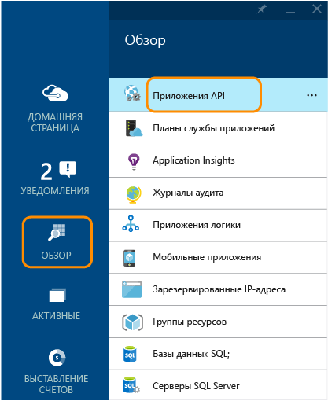
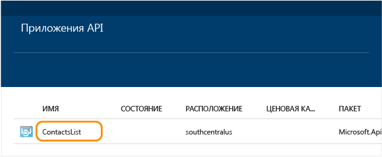
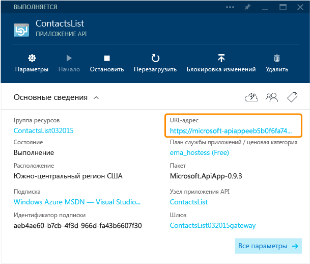
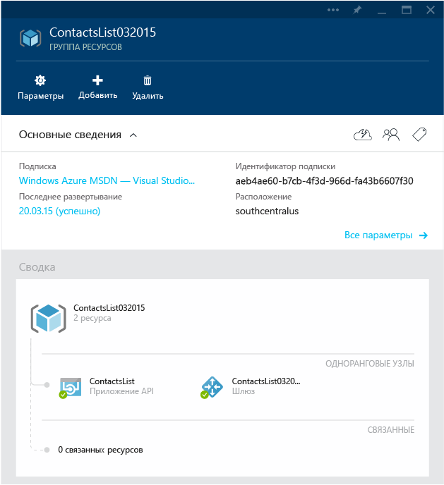
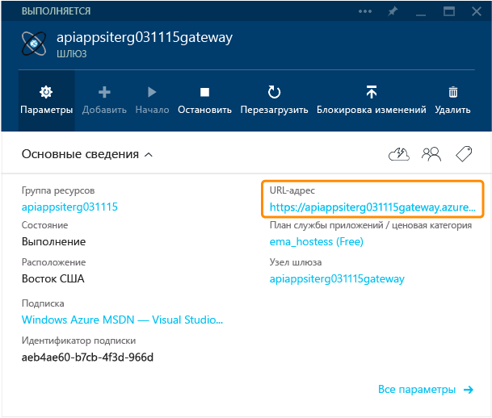
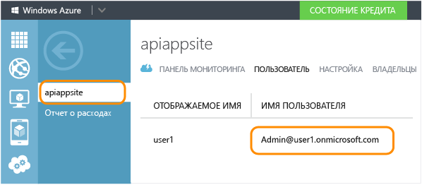
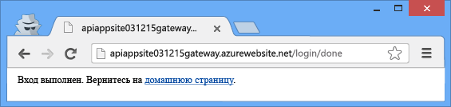

<properties 
	pageTitle="Защита приложения API Azure"
	description="Обеспечение защиты приложения API Azure с помощью Visual Studio."
	services="app-service\api"
	documentationCenter=".net"
	authors="tdykstra"
	manager="wpickett"
	editor="jimbe"/>

<tags 
	ms.service="app-service-api"
	ms.workload="web"
	ms.tgt_pltfrm="dotnet"
	ms.devlang="na"
	ms.topic="article"
	ms.date="08/05/2015"
	ms.author="tdykstra"/>

# Защита приложения API: добавление проверки подлинности Azure Active Directory или поставщика социальных сетей

## Обзор

В этом учебнике показано, как защитить приложение API, чтобы к нему могли получить доступ только пользователи, прошедшие проверку подлинности. В учебнике также показан код, который можно использовать в приложении API ASP.NET для получения информации о вошедшем в систему пользователе.

Вы выполните следующие действия.

- Вызов приложения API для проверки его работоспособности.
- Применение правил проверки подлинности к приложению API.
- Повторный вызов приложения API, чтобы убедиться, что оно отклоняет запросы, не прошедшие проверку подлинности.
- Вход в систему настроенного поставщика.
- Повторный вызов приложения API, чтобы убедиться, что доступ с проверкой подлинности работает.
- Написание и тестирование кода, который извлекает утверждения для вошедшего в систему пользователя.

Дополнительные сведения о проверке подлинности в службе приложений Azure см. в статье [Проверка подлинности для приложений API и мобильных приложений](../app-service/app-service-authentication-overview.md).

## Предварительные требования

В этом учебнике используется приложение API, созданное на шаге [Создание приложения API](app-service-dotnet-create-api-app.md) и развернутое на шаге [Развертывание приложения API](app-service-dotnet-deploy-api-app.md).

## Использование браузера для вызова приложения API 

Самый простой способ проверки наличия общего доступа к приложению API — вызов его из браузера.

1. В браузере перейдите на [портал предварительной версии Azure].

3. На домашней странице последовательно щелкните пункты **Обзор > Приложения API**, а затем выберите имя приложения API, которое требуется защитить.

	

	

3. В колонке **Приложение API** щелкните **URL-адрес**, чтобы открыть окно браузера, которое вызывает ваше приложение API.

	

2. Добавьте `/api/contacts/get/` к URL-адресу в адресной строке браузера.

	Например, если URL-адрес приложения API следующий:

    	https://microsoft-apiappeeb5bdsasd744e188be7fa26f239bd4b.azurewebsites.net/

	Полный URL-адрес будет:

    	https://microsoft-apiappeeb5bdsasd744e188be7fa26f239bd4b.azurewebsites.net/api/contacts/get/

	Разные браузеры обрабатывают вызовы API по-разному. На изображении показан успешно выполненный вызов из браузера Chrome.

	

2. Сохраните использованный URL-адрес; он потребуется далее в учебнике.

## Защита приложения API

Приложение API развертывается в группе ресурсов. Вы можете добавлять веб-приложения и другие приложения API в одну группу ресурсов, и каждое приложение API в этой группе ресурсов может иметь один из трех параметров доступности: <!--todo: diagram showing different accessibility settings-->

- **Общедоступный (анонимный)** — любой пользователь может вызвать приложение API за пределами группы ресурсов, не выполнив вход.
- **Общедоступный (с проверкой подлинности)** — только пользователи, прошедшие проверку подлинности, могут вызвать приложение API за пределами группы ресурсов.
- **Внутренний** — только другие приложения API или веб-приложения, находящиеся в той же группе ресурсов, могут вызывать это приложение API. (Вызовы из веб-приложений считаются внешними, даже если веб-приложения находятся в той же группе ресурсов.)

Когда Visual Studio создает группу ресурсов, также создается *шлюз*. Шлюз — это специальное веб-приложение, которое обрабатывает все запросы, предназначенные для приложений API в группе ресурсов.

Перейдя в колонку группы ресурсов на [портале предварительной версии Azure], вы можете увидеть ваше приложение API и шлюз на схеме.

### Настройка обязательной проверки подлинности в приложении API

Чтобы настроить в приложении API возможность принимать только запросы, прошедшие проверку подлинности, необходимо задать его уровень доступности **Общедоступный (с проверкой подлинности)** и настроить в шлюзе запрос проверки подлинности от поставщика, такого как Azure Active Directory, Google или Facebook.

[AZURE.INCLUDE [app-service-api-config-auth](../../includes/app-service-api-config-auth.md)]

Теперь вы защитили приложение API от несанкционированного доступа. Далее в шлюзе потребуется указать, какого поставщика проверки подлинности следует использовать.

### Настройка шлюза для использования поставщика проверки подлинности

[AZURE.INCLUDE [app-service-api-gateway-config-auth](../../includes/app-service-api-gateway-config-auth.md)]

## Контроль работоспособности проверки подлинности

**Примечание.** Если при выполнении следующих действий возникают проблемы со входом, попробуйте открыть окно в закрытом или анонимном режиме.
 
1. Откройте окно браузера и введите в адресной строке URL-адрес, вызывающий метод `Get` приложения API, как вы делали это ранее.

	На этот раз при попытке доступа к приложению API появится сообщение об ошибке.

	

2. В браузере перейдите на URL-адрес входа. URL-адрес соответствует следующему шаблону:

    	http://[gatewayurl]/login/[providername]

	URL-адрес шлюза можно взять из колонки **Шлюз** на [портале предварительной версии Azure]. (Чтобы перейти в колонку **Шлюз**, щелкните шлюз на схеме, которая отображается в колонке **Группа ресурсов**.)

	

	Для параметра [providername] должно быть задано одно из следующих значений:
	
	* microsoftaccount;
	* facebook;
	* twitter;
	* google;
	* aad.

	Ниже приведен пример URL-адреса входа для Azure Active Directory.

		https://dropboxrgaeb4ae60b7cb4f3d966dfa43.azurewebsites.net/login/aad/

	Обратите внимание, что в отличие от предыдущего URL-адреса этот URL-адрес не включает имя приложения API: проверку подлинности выполняет шлюз, а не приложение API. Шлюз обрабатывает проверку подлинности для всех приложений API в группе ресурсов.

3. Введите учетные данные, когда в браузере откроется страница для входа.
 
	Если вы настроили вход в Azure Active Directory, используйте одного из пользователей, перечисленных на вкладке **Пользователи**, для приложения, созданного на вкладке Azure Active Directory [портала Azure], например admin@contoso.onmicrosoft.com.

	

	

4. После того как появится сообщение «вход выполнен», снова введите URL-адрес в метод GET приложения API.

	На этот раз вызов будет выполнен, так как вы прошли проверку подлинности. Шлюз распознает, что вы являетесь прошедшим проверку подлинности пользователем, и передаст запрос в приложение API.

	

	

	Включив пользовательский интерфейс Swagger, вы также можете перейти на страницу пользовательского интерфейса Swagger. При этом в правом нижнем углу страницы появится красный значок **ОШИБКА**. Если его щелкнуть, откроется сообщение о том, что файл JSON Swagger недоступен. Причина в том, что Swagger осуществляет вызов AJAX, не включая маркер Zumo при попытке получить файл JSON. Это не мешает работе страницы пользовательского интерфейса Swagger.

## Использование Postman для отправки запроса POST

При входе в шлюз он возвращает токен проверки подлинности. Этот токен должен быть включен во все запросы из внешних источников, проходящих через шлюз. При получении доступа к API в браузере обычно браузер сохраняет токен в файл cookie и отправляет его вместе с последующими вызовами в API.

Таким образом, вы можете видеть, что происходит в фоновом режиме. В этом разделе учебника вы будете создавать и отправлять запрос POST с помощью браузера, а также получать токен проверки подлинности из файла cookie и включать его в заголовок HTTP. Этот раздел является необязательным: в предыдущем разделе вы уже проверяли, что приложение API принимает только доступ с проверкой подлинности.

В этих инструкциях показано, как использовать средство Postman в браузере Chrome, но то же самое можно сделать с помощью любого клиентского средства REST и средств разработчика браузера.

1. В окне браузера Chrome выполните действия для проверки подлинности, показанные в предыдущем разделе, а затем откройте средства разработчика (F12).

	

3. На вкладке **Ресурсы** средств разработчика Chrome найдите файлы cookie для шлюза и трижды щелкните поле «Значение» файла cookie **x-zumo-auth**, чтобы выбрать все значения.

	**Примечание.** Убедитесь, что вы получите все значения этого файла cookie. Если щелкнуть дважды, то вы получите только первую часть их.

5. Щелкните правой кнопкой мыши поле **Значение** файла cookie **x-zumo-auth**, а затем выберите команду **Копировать**.

	

4. Установите расширение Postman в браузере Chrome, если вы еще этого не сделали.

6. Откройте расширение Postman.

7. В поле «URL-адрес запроса» введите URL-адрес метода GET приложения API, использованный ранее, но удалите `get/` в конце.
 
		http://[apiappurl]/api/contacts
    
8. Щелкните элемент **Заголовки** и добавьте заголовок *x-zumo-auth*. Вставьте значение токена из буфера обмена в поле **Значение**.

9. Добавьте заголовок *Content-Type* со значением *application/json*.

10. Щелкните элемент **form-data**, а затем добавьте ключ *contact* со следующим значением:

		{   "Id": 0,   "Name": "Li Yan",   "EmailAddress": "yan@contoso.com" }

11. Нажмите кнопку «Отправить».

	Приложение API вернет ответ *201 Created*.

	

12. Чтобы убедиться, что этот запрос не будет работать без токена проверки подлинности, удалите заголовок проверки подлинности и снова щелкните «Отправить».

	Вы получите ответ *403 Forbidden*.

	

## Получение информации о вошедшем в систему пользователе

В этом разделе вы измените код в приложении API ContactsList таким образом, чтобы оно получало и возвращало имя и электронный адрес вошедшего в систему пользователя.

1. В Visual Studio откройте проект приложения API, развернутого в разделе [Развертывание приложения API](app-service-dotnet-deploy-api-app.md), которое вызывается в этом учебнике.

3. Откройте файл apiapp.json и добавьте строку, которая указывает, что приложение API использует аутентификацию Azure Active Directory.

		"authentication": [{"type": "aad"}]

	Конечный файл apiapp.json будет выглядеть как в следующем примере:

		{
		    "$schema": "http://json-schema.org/schemas/2014-11-01/apiapp.json#",
		    "id": "ContactsList",
		    "namespace": "microsoft.com",
		    "gateway": "2015-01-14",
		    "version": "1.0.0",
		    "title": "ContactsList",
		    "summary": "",
		    "author": "",
		    "endpoints": {
		        "apiDefinition": "/swagger/docs/v1",
		        "status": null
		    },
		    "authentication": [{"type": "aad"}]
		}

	В этом учебнике в качестве примера используется Azure Active Directory. Для других поставщиков используется соответствующий идентификатор. Ниже приведены допустимые значения поставщиков:

	* aad;
	* microsoftaccount;
	* google;
	* twitter;
	* facebook. 

3. Добавьте оператор `using` в верхней части файла *ContactsController.cs*.

		using Microsoft.Azure.AppService.ApiApps.Service;

2. Замените код в методе `Get` следующим кодом.

		var runtime = Runtime.FromAppSettings(Request);
		var user = runtime.CurrentUser;
		TokenResult token = await user.GetRawTokenAsync("aad");
		var name = (string)token.Claims["name"];
		var email = (string)token.Claims["http://schemas.xmlsoap.org/ws/2005/05/identity/claims/upn"];
		return new Contact[]
		{
		    new Contact { Id = 1, EmailAddress = email, Name = name }
		};

	Вместо трех примеров контактов код возвращает контактную информацию для вошедшего в систему пользователя.

	В примере кода используется Azure Active Directory. Для других поставщиков используются соответствующие имя токена и идентификатор утверждений, как показано на предыдущем шаге.

	Информацию о доступных утверждениях Azure Active Directory см. в разделе [Поддерживаемые типы токенов и утверждений](https://msdn.microsoft.com/library/dn195587.aspx).

3. Добавьте оператор using для `Microsoft.Azure.AppService.ApiApps.Service`.

		using Microsoft.Azure.AppService.ApiApps.Service;

3. Разверните проект повторно.

	Visual Studio запомнит параметры, использованные для развертывания проекта в учебнике [Развертывание](app-service-dotnet-deploy-api-app.md). Щелкните правой кнопкой мыши проект, щелкните **Опубликовать** и нажмите кнопку **Опубликовать** в диалоговом окне **Публикация веб-сайта**.

6. Выполните процедуру, осуществленную ранее, чтобы отправить запрос GET защищенному приложению API.

	В ответном сообщении показано имя и идентификатор удостоверения, использованного для входа.

	

## Дальнейшие действия

Вы узнали, как защитить приложение API Azure с помощью запроса проверки подлинности Azure Active Directory или поставщика социальных сетей. Дополнительные сведения см. в статье [Проверка подлинности для приложений API и мобильных приложений](../app-service/app-service-authentication-overview.md).

[портала Azure]: https://manage.windowsazure.com/
[портал предварительной версии Azure]: https://portal.azure.com/
[портале предварительной версии Azure]: https://portal.azure.com/

<!---HONumber=September15_HO1-->