<properties
	pageTitle="Приступая к работе с приложениями API и ASP.NET в службе приложений Azure | Microsoft Azure"
	description="Узнайте, как создать, развернуть и использовать приложение API ASP.NET в службе приложений Azure с помощью Visual Studio 2015."
	services="app-service\api"
	documentationCenter=".net"
	authors="tdykstra"
	manager="wpickett"
	editor=""/>

<tags
	ms.service="app-service-api"
	ms.workload="na"
	ms.tgt_pltfrm="dotnet"
	ms.devlang="na"
	ms.topic="hero-article"
	ms.date="11/25/2015"
	ms.author="tdykstra"/>

# Приступая к работе с приложениями API и ASP.NET в службе приложений Azure

[AZURE.INCLUDE [app-service-api-get-started-selector](../../includes/app-service-api-get-started-selector.md)]

## Обзор

Следуя инструкциям в этом руководстве, вы создадите [приложение API службы приложений](app-service-api-apps-why-best-platform.md), развернете веб-API ASP.NET в приложении API и будете использовать приложение API в клиенте MVC ASP.NET. Здесь предполагается, что вы знакомы с ASP.NET, но не имеете опыта работы с Microsoft Azure. По завершении изучения этого руководства у вас будет приложение веб-API и клиентское приложение, работающее в облаке.

Пример приложения представляет собой простой список контактов. На следующем рисунке показано, как в приложении MVC отображаются данные, полученные из API.

## Что вы узнаете

Три функции службы приложений Azure особенно полезны для разработки и размещения приложений API:

* встроенная поддержка метаданных API;
* поддержка CORS;
* поддержка аутентификации и авторизации.
 
Это первое из серии руководств, в которых рассматриваются указанные выше возможности. Данный учебный курс посвящен метаданным API. Во втором руководстве основное внимание уделяется CORS, а в третьем и четвертом рассматриваются аутентификация и авторизация.

Эти руководства содержат такие сведения.

* Как подготовить компьютер к разработке для Azure путем установки пакета SDK для Azure для .NET.
* Как работать с приложениями API и веб-приложениями в службе приложений Azure с помощью средств, встроенных в Visual Studio 2015.
* Как автоматизировать обнаружение API с помощью пакета NuGet Swashbuckle для динамического создания JSON-файла определения API Swagger.
* Как использовать автоматически создаваемый код клиента для использования приложений API в клиенте .NET.
* Как настроить конечную точку для метаданных приложения API с помощью портала Azure.
* Как использовать CORS для вызова приложения API в клиенте JavaScript, если клиент и API находятся в разных доменах.
* Как использовать Azure Active Directory для защиты API от несанкционированного доступа.
* Как пользователи, вошедшие в Azure Active Directory, могут использовать защищенный API.
* Как использовать защищенный API с помощью субъекта-службы.

## Предварительные требования

### Веб-API ASP.NET

В этом руководстве предполагается, что вы знакомы с веб-API ASP.NET. Если вам нужны общие сведения, см. раздел [Приступая к работе с веб-API ASP.NET 2](http://www.asp.net/web-api/overview/getting-started-with-aspnet-web-api/tutorial-your-first-web-api).

## Visual Studio 2015

В инструкциях и на снимках экрана предполагается, что используется Visual Studio 2015. Но эти же инструкции подходят и для Visual Studio 2013.

## Учетная запись Azure

Для работы с этим руководством требуется учетная запись Azure. Вы можете:

* [Открыть бесплатную учетную запись Azure](/pricing/free-trial/?WT.mc_id=A261C142F). Вы получаете кредиты, которые можно использовать, чтобы попробовать платные службы Azure. Даже после того как кредиты использованы, учетная запись остается за вами и вы можете использовать бесплатные службы и функции Azure, например компонент веб-приложений в службы приложений Azure.
* [Активировать преимущества подписчика Visual Studio](/pricing/member-offers/msdn-benefits-details/?WT.mc_id=A261C142F). ваша подписка MSDN каждый месяц приносит вам кредиты, которые можно использовать для оплаты за службы Azure.

Если вы хотите приступить к работе со службой приложений Azure до регистрации и получения учетной записи Azure, перейдите на страницу [Пробное использование службы приложений](http://go.microsoft.com/fwlink/?LinkId=523751). Там можно быстро создать кратковременное приложение начального уровня в службе приложений. Для этого не потребуется ни кредитная карта, ни какие-либо обязательства.

[AZURE.INCLUDE [install-sdk-2015-2013](../../includes/install-sdk-2015-2013.md)]

Для этого руководства требуется пакет SDK для Azure для .NET версии 2.8.1 или более поздней.

## Общие сведения о примере приложения

Код, который будет развернут в приложении API и веб-приложении для этого руководства, находится в репозитории GitHub [Azure-Samples/app-service-api-dotnet-contact-list](https://github.com/Azure-Samples/app-service-api-dotnet-contact-list). Решение ContactsList Visual Studio содержит следующие проекты:

* **ContactsList.API** — проект веб-API ASP.NET, который возвращает список имен и адресов электронной почты. При исходном вызове метода GET возвращается 3 жестко заданных контакта, а при последующих вызовах методов PUT, POST и DELETE сохраняются изменения в локальном JSON-файле.
* **ContactsList.MVC** — клиент MVC ASP.NET для API ContactsList.
* **ContactsList.Angular** — простой клиент пользовательского интерфейса AngularJS для API ContactsList. Позволяет продемонстрировать вызов незащищенного (без проверки подлинности) приложения API.
* **ContactsList.Angular.AAD** — клиент AngularJS, который позволяет показать, как использовать Azure Active Directory для проверки подлинности пользователей.
* **CompanyContacts.API** — проект веб-API ASP.NET, который возвращает жестко заданный список контактов в ответ на запрос GET. Вызывается методом GET **ContactsList.API**, чтобы показать, как вызывать API с помощью проверки подлинности с взаимодействием между службами (с использованием субъекта-службы).
 
## Загрузка примера приложения 

1. Скачайте репозиторий [Azure-Samples/app-service-api-dotnet-contact-list](https://github.com/Azure-Samples/app-service-api-dotnet-contact-list).

	Можно [скачать ZIP-файл](https://github.com/Azure-Samples/app-service-api-dotnet-contact-list/archive/master.zip) или клонировать репозиторий на локальном компьютере.

2. Откройте решение ContactsList в Visual Studio 2015 или 2013.

2. Создайте решение, чтобы восстановить пакеты NuGet.

## Использование метаданных и пользовательского интерфейса Swagger

Поддержка метаданных API [Swagger 2.0](http://swagger.io/) встроена в службу приложений Azure. Каждое приложение API может определить URL-адрес конечной точки, которая возвращает метаданные для API в формате JSON-файла Swagger. Метаданные, возвращенные из этой конечной точки, можно использовать для создания кода клиента, который упрощает использование API-интерфейса.

В этом разделе руководства вы научитесь автоматически создавать метаданные для проекта веб-API ASP.NET и работать со средством проверки API. Для этих целей пока не будет использоваться служба приложений Azure. Использование метаданных в приложениях API будет рассмотрено позднее.

Чтобы предоставить метаданные Swagger 2.0 для проекта веб-API ASP.NET, можно установить пакет NuGet [Swashbuckle](https://www.nuget.org/packages/Swashbuckle). Swashbuckle использует отражение для динамического создания метаданных. Пакет NuGet Swashbuckle уже установлен в скачанном проекте ContactsList.API. Кроме этого, он также уже установлен при создании проекта с помощью шаблона проекта **приложения API Azure**. (В Visual Studio: **Файл > Создать > Проект > Веб-приложение ASP.NET > Приложение API Azure**).

Следуя инструкциям в этом разделе руководства, вы рассмотрите созданные метаданные Swagger 2.0 и используете пробный пользовательский интерфейс, созданный на их основе.

2. Установите проект ContactsList.API в качестве запускаемого проекта. (Не устанавливайте проект CompanyContacts.API. Он используется в одном из следующих руководств).
 
4. Нажмите клавишу F5, чтобы запустить проект в режиме отладки.

	Откроется браузер, в котором отобразится страница с ошибкой «403 Запрещено».

	

12. В адресной строке браузера добавьте `swagger/docs/v1` в конец строки и нажмите кнопку «Назад». (URL-адрес будет выглядеть следующим образом: `http://localhost:51864/swagger/docs/v1`).

	Это URL-адрес по умолчанию, используемый Swashbuckle, чтобы вернуть метаданные JSON Swagger 2.0 для API. При использовании Internet Explorer появится запрос на скачивание файла v1.json.

	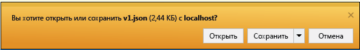

	При использовании Chrome или Edge в окне браузера отобразится JSON-файл.

	

	В следующем примере показана первая часть метаданных Swagger для API с определением для метода GET. Эти метаданные позволяют использовать пользовательский интерфейс Swagger, которым мы воспользуемся на следующих шагах. Он будет использоваться в следующем разделе этого руководства для автоматического создания кода клиента.

		{
		  "swagger": "2.0",
		  "info": {
		    "version": "v1",
		    "title": "ContactsList.API"
		  },
		  "host": "localhost:51864",
		  "schemes": [ "http" ],
		  "paths": {
		    "/api/Contacts": {
		      "get": {
		        "tags": [ "Contacts" ],
		        "operationId": "Contacts_Get",
		        "consumes": [ ],
		        "produces": [ "application/json", "text/json", "application/xml", "text/xml" ],
		        "responses": {
		          "200": {
		            "description": "OK",
		            "schema": {
		              "type": "array",
		              "items": { "$ref": "#/definitions/Contact" }
		            }
		          }
		        },
		        "deprecated": false
		      },

1. Закройте браузер.

3. В **обозревателе решений** в проекте ContactsList.API откройте файл *App\_Start\\SwaggerConfig.cs*, а затем найдите следующий код и раскомментируйте его.

		/*
		    })
		.EnableSwaggerUi(c =>
		    {
		*/

	Файл SwaggerConfig.cs создается при установке пакета Swashbuckle в проекте. С его помощью можно настроить Swashbuckle несколькими способами.

	Раскомментированный код позволяет применять пользовательский интерфейс Swagger, используемый на следующих шагах. При создании проекта веб-API с помощью шаблона проекта приложения API в целях безопасности этот код закомментирован по умолчанию.

5. Запустите проект снова.

3. В адресной строке браузера добавьте `swagger` в конец строки и нажмите кнопку «Назад». (URL-адрес будет выглядеть следующим образом: `http://localhost:51864/swagger`).

4. После того, как откроется страница Swagger, щелкните **Контакты**, чтобы увидеть доступные методы.

	

5. Щелкните **Получить > Попробовать**.

	Пользовательский интерфейс Swagger вызывает метод GET проекта ContactsList и отображает результаты JSON.

	

6. Щелкните **POST**, а затем — поле в разделе **Схема модели**.

	При этом предварительно заполняется поле ввода, в котором можно указать значение параметра для метода POST.

	

7. Измените JSON в поле ввода параметров `contact`, чтобы он выглядел, как в следующем примере, или замените его своим адресом электронной почты и именем:

		{
		  "CreatedBy": "",
		  "EmailAddress": "carson@contoso.com",
		  "Id": 4,
		  "Name": "Alexander Carson"
		} 

10. Щелкните **Попробовать**.

	API проекта ContactsList возвращает код ошибки HTTP 200 и текст ответа с подтверждением добавленных элементов.

11. Щелкните **Получить > Попробовать**.

	Теперь ответ метода GET содержит новый контакт.

12. Попробуйте также методы PUT, DELETE и GET с использованием идентификатора, а затем закройте браузер.

Swashbuckle можно использовать с любыми проектами веб-API ASP.NET. Если нужно добавить возможность создания метаданных Swagger в существующий проект, просто установите пакет Swashbuckle. Создать проект, который требуется развернуть как приложение API службы приложений, можно с помощью шаблона проекта **приложения API Azure** для ASP.NET, который представлен на изображении ниже.

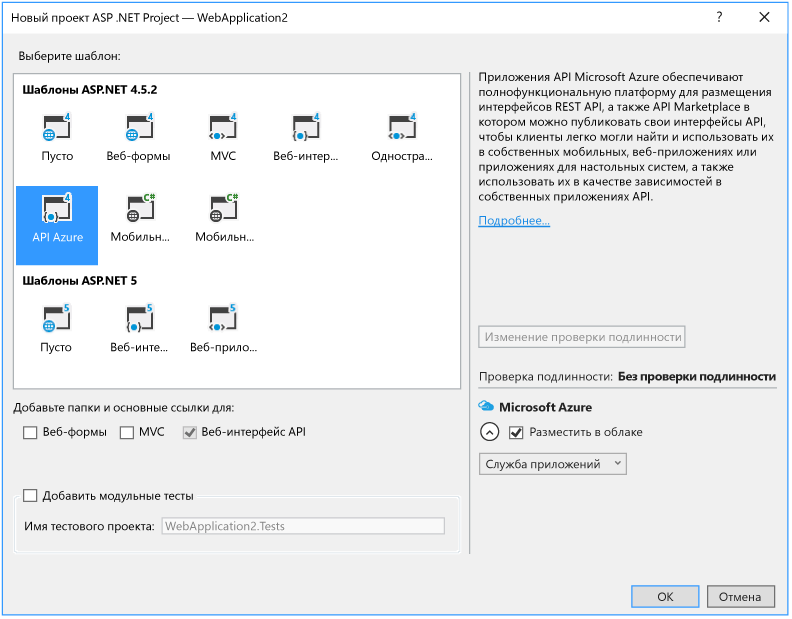

Этот шаблон позволяет создать проект веб-API с установленным пакетом Swashbuckle.

**Примечание.** По умолчанию Swashbuckle может создавать дублирующиеся идентификаторы операций Swagger для методов контроллера. Это происходит, если методы HTTP контроллера перегружены, например: `Get()` и `Get(id)`. Сведения о действиях при перегрузке см. в разделе [Настройка определений API, создаваемых Swashbuckle](app-service-api-dotnet-swashbuckle-customize.md). При создании проекта веб-API в Visual Studio с помощью шаблона приложения API Azure к файлу *SwaggerConfig.cs* автоматически добавляется код, который создает уникальные идентификаторы операций.

## Создание приложения API в Azure и развертывание в нем проекта ContactsList.API

В этом разделе вы создадите приложение API в Azure с помощью инструментов Azure, интегрированных в мастер **веб-публикации** Visual Studio. Затем вы развернете проект ContactsList.API в новом приложении API и выполните вызов API путем запуска пользовательского интерфейса Swagger в облаке.

1. В **обозревателе решений** щелкните правой кнопкой мыши проект ContactsList.API и нажмите кнопку **Опубликовать**.

3.  В мастере **веб-публикации** на вкладке **Профиль** щелкните **Служба приложений Microsoft Azure**.

	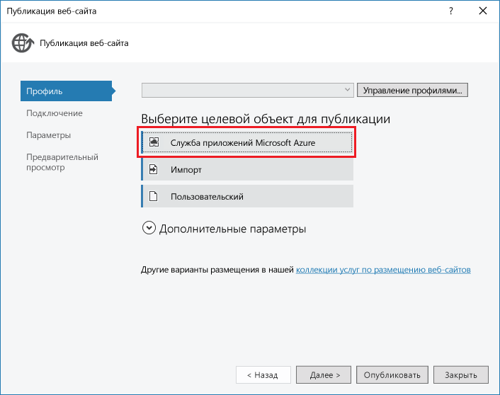

4. Войдите в учетную запись Azure, если вы этого еще не сделали, или обновите учетные данные, если срок их действия истек.

4. В диалоговом окне «Служба приложений» в поле **Подписка** выберите подписку Azure, которую хотите использовать, и нажмите кнопку **Создать**.

	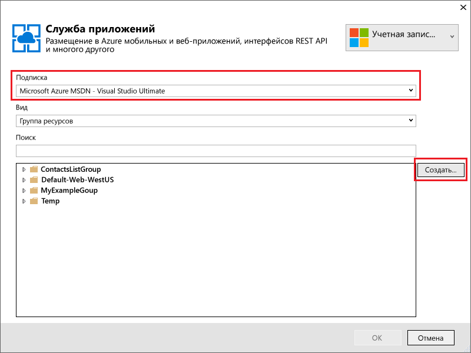

3. В диалоговом окне **Создание службы приложений** на вкладке **Размещение** щелкните **Изменить тип**, а затем — **Приложение API**.

	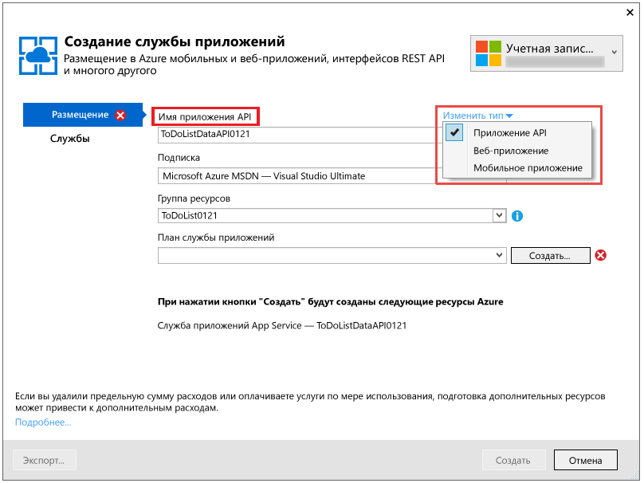

4. В поле **Имя приложения API** введите имя, которое является уникальным в домене *azurewebsites.net*.

	Visual Studio предлагает уникальное имя, добавляя строку даты и времени к имени проекта. При необходимости можно принять это имя.

	Если ввести имя, которое уже используется, вместо зеленой галочки справа появится красный восклицательный знак. Это значит, что нужно ввести другое имя.

	Azure будет использовать это имя в качестве префикса для URL-адреса приложения. Полный URL-адрес будет состоять из этого имени и строки *.azurewebsites.net*. Например, если имя — `ContactsListAPI`, URL-адрес будет `contactslistapi.azurewebsites.net`.

6. В раскрывающемся списке **Группа ресурсов** введите ContactsListGroup или другое имя.

	В этом поле можно выбрать существующую [группу ресурсов](../azure-preview-portal-using-resource-groups.md) или создать отдельную, введя имя, которое отличается от имени любой существующей группы ресурсов в подписке.

	В этом руководстве рекомендуется создать группу ресурсов, так как таким образом можно будет легко одновременно удалить все ресурсы Azure, созданные для работы с этим руководством.

4. Нажмите кнопку **Создать** возле раскрывающегося списка **План службы приложений**.

	

	Дополнительные сведения о планах службы приложений см. в статье [Обзор планов службы приложений Azure](../app-service/azure-web-sites-web-hosting-plans-in-depth-overview.md).

5. В диалоговом окне **Настройка плана службы приложений** в соответствующем поле введите ContactsListPlan или другое требуемое имя.

5. В раскрывающемся списке **Расположение** выберите ближайшее расположение.

	Этот параметр определяет, в каком центре обработки данных Azure будет выполняться приложение. При работе с учебником вы можете выбрать любой регион, и это не будет оказывать существенного влияния. Тем не менее для рабочего приложения необходимо, чтобы сервер располагался максимально близко к клиентам, которые осуществляют к нему доступ. Это позволит минимизировать [задержки](http://www.bing.com/search?q=web%20latency%20introduction&qs=n&form=QBRE&pq=web%20latency%20introduction&sc=1-24&sp=-1&sk=&cvid=eefff99dfc864d25a75a83740f1e0090).

5. В раскрывающемся списке **Размер** щелкните **Бесплатный**.

	Эта ценовая категория обеспечит достаточную производительность в рамках заданий этого руководства.

6. В диалоговом окне **Настройка плана службы приложений** нажмите кнопку **ОК**.

	

7. В диалоговом окне **Создание службы приложений** нажмите кнопку **Создать**.

	Visual Studio создает приложение API и профиль публикации со всеми настройками, необходимыми для нового приложения API. Новый профиль публикации используется для развертывания проекта на следующих шагах.
 
	**Примечание.** Создавать приложения API в службе приложений Azure можно и по-другому. При создании проекта в Visual Studio доступны те же диалоговые окна. Приложения API можно также создавать с помощью портала Azure, [командлетов Azure для Windows PowerShell](../powershell-install-configure.md) или [кроссплатформенного интерфейса командной строки](../xplat-cli.md).

8. На вкладке **Подключение** мастера **веб-публикации** нажмите кнопку **Опубликовать**.

	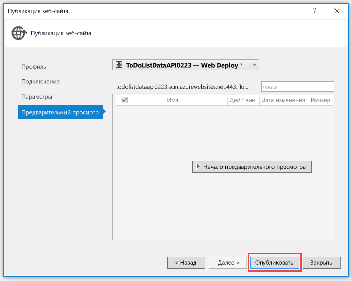

	Visual Studio развертывает проект ContactsList.API в новом приложении API и выполняет переход по URL-адресу приложения API в браузере. В браузере откроется страница с сообщением «Успешно создано».

	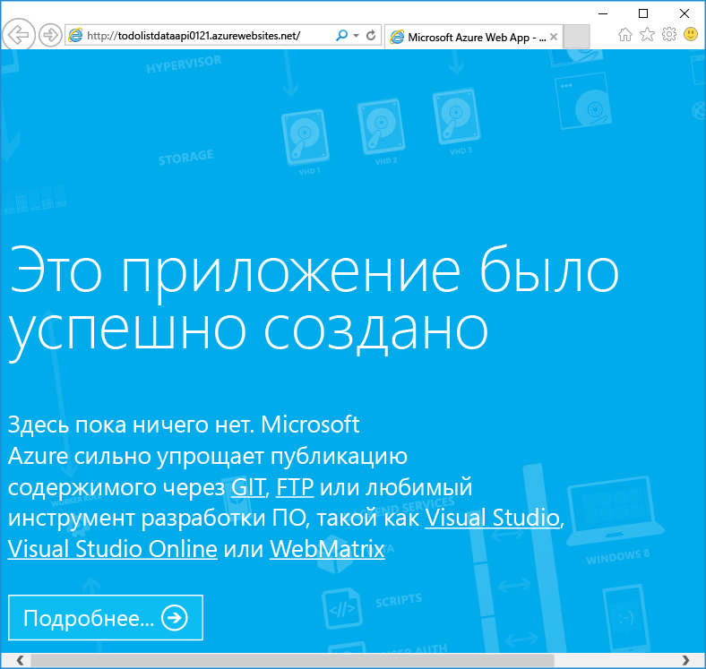

11. В адресной строке браузера добавьте swagger в URL-адрес и нажмите клавишу ВВОД. (URL-адрес будет выглядеть следующим образом: `http://{apiappname}.azurewebsites.net/swagger`).

	В браузере отобразится тот же пользовательский интерфейс Swagger, который ранее выполнялся локально, а теперь выполняется в облаке. Примените метод GET. Появятся 3 контакта по умолчанию, так как ранее внесенные изменения сохранились в локальном файле. Любые изменения, вносимые с настоящего момента, будут сохраняться в файловой системе приложения API Azure.

12. Откройте [портал Azure](https://portal.azure.com/).
 
14. Щелкните **Обзор > Приложения API > {имя нового приложения API}**.

	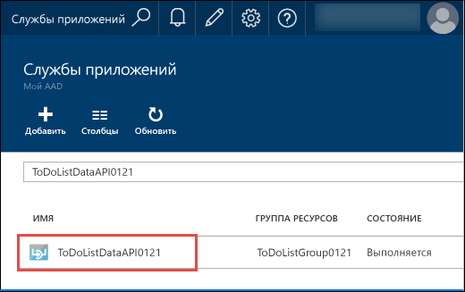

16. Щелкните **Параметры**, а затем в колонке **Параметры** перейдите к разделу API и щелкните **Определение API**.

	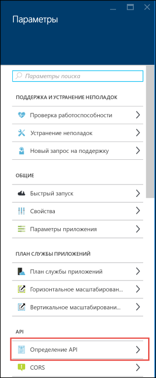

	В колонке «Определение API» можно указать URL-адрес, возвращающий метаданные Swagger 2.0 в формате JSON. При создании приложения API в Visual Studio для URL-адреса определения API задается значение по умолчанию, указанное ранее — базовый URL-адрес приложения API и строка `/swagger/docs/v1`.

	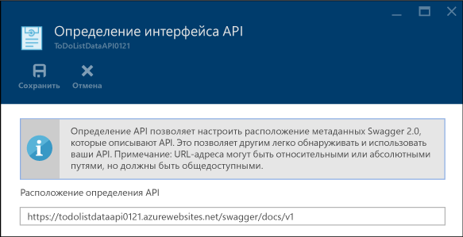

	При выборе приложения API, для которого нужно создать код клиента, Visual Studio извлекает метаданные из этого URL-адреса.

### Настройка URL-адреса определения API в инструментарии диспетчера ресурсов Azure

URL-адрес определения интерфейса API для приложения API также можно настроить с помощью инструментария диспетчера ресурсов Azure. Для этого используются Azure PowerShell, интерфейс командной строки или [обозреватель ресурсов](https://resources.azure.com/).

Задайте свойство `apiDefinition` для типа Microsoft.Web/sites/config ресурса <site name>/web. Например, в **обозревателе ресурсов** последовательно выберите пункты **Подписки > {ваша подписка} > Группы ресурсов > {Ваша группа ресурсов} > Поставщики > Microsoft.Web > Сайты > {Ваш сайт} > Конфигурации > Веб**. Отобразится свойство cors:

		"apiDefinition": {
		  "url": "https://contactslistapi.azurewebsites.net/swagger/docs/v1"
		}

##  Использование приложения в клиенте .NET с применением созданного кода клиента 

Одним из преимуществ интеграции платформы Swagger в приложения API Azure является автоматическое создание кода. Созданные классы клиента упрощают написание кода, который вызывает приложение API.

В этом разделе описано, как использовать приложение API из веб-приложения клиента MVC ASP.NET. Сначала клиент MVC и веб-интерфейс API будут запущены локально, а затем клиент будет развернут в новом веб-приложении в службе приложений Azure и запущен в облаке.

### Создание кода клиента

Код клиента для приложения API можно создать с помощью Visual Studio или из командной строки. В этом руководстве используется Visual Studio. Дополнительные сведения о том, как сделать это с помощью командной строки, см. в файле сведений репозитория [Azure/autorest](https://github.com/azure/autorest) на сайте GitHub.com.

Проект ContactsList.MVC уже содержит созданный код клиента, но его нужно удалить и создать снова, чтобы установить URL-адрес своего приложения API в качестве целевого URL-адреса по умолчанию.

1. В **обозревателе решений** Visual Studio в проекте ContactsList.MVC удалите папку *ContactsList.API*.

	Эта папка появилась в процессе создания кода, который мы будем изучать.

	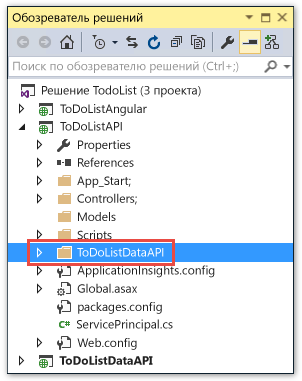

2. Щелкните правой кнопкой мыши проект ContactsList.MVC и щелкните **Добавить > Клиент REST API**.

	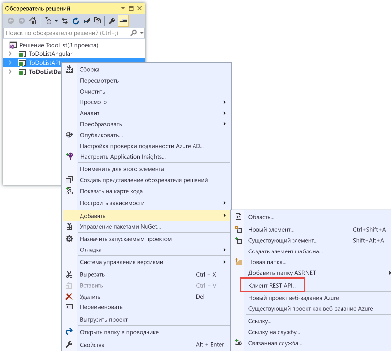

3. В диалоговом окне **Добавление клиента REST API** щелкните **Скачать из приложения API Microsoft Azure**, а затем нажмите кнопку **Обзор**.

	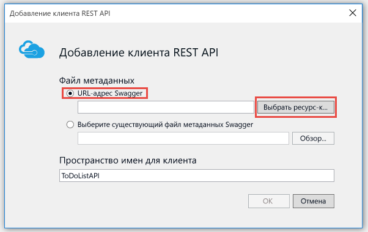

8. В диалоговом окне **Служба приложений** разверните группу ресурсов **ContactsListGroup**, выберите свое приложение API и нажмите кнопку **ОК**.

	Если в этом диалоговом окне приложений в списке слишком много, приложения API можно по разному упорядочить. Здесь также можно ввести строку поиска для фильтрации приложений API по имени.

	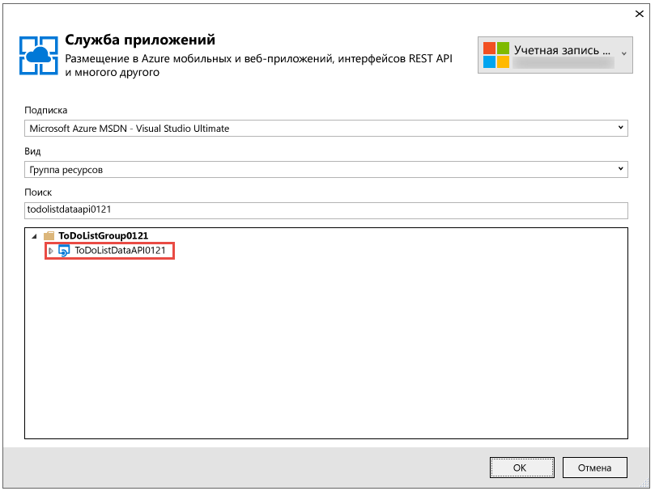

	Если в списке нет приложения API, скорее всего, при его создании вы случайно пропустили действие по замене веб-приложения приложением API. В этом случае можно создать новое приложение API, повторив шаги, выполненные ранее. Выберите для приложения API другое имя или перейдите на портал и удалите веб-приложение.

	Обратите внимание, что при возврате к диалоговому окну **Добавление клиента REST API** в текстовом поле введено значение URL-адреса определения API, которое вы видели на портале ранее.

	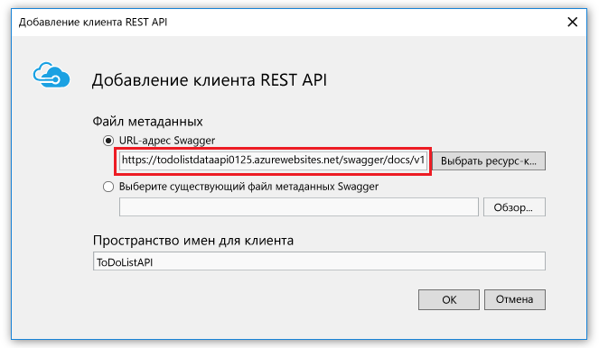

	Кроме того, URL-адрес можно ввести напрямую, а не в диалоговом окне обзора. Например, если после развертывания интерфейса API в веб-приложении он не отображается в диалоговом окне обзора, можно вручную ввести URL-адрес, который возвращает метаданные Swagger, здесь.

	Обратите также внимание на переключатель **Выбрать существующий файл метаданных Swagger**. Если нужно создать код до развертывания в Azure, можно выполнить локальный запуск, скачать JSON-файл Swagger и выбрать его здесь.

9. В диалоговом окне **Добавление клиента REST API** нажмите кнопку **ОК**.

	Visual Studio создает папку с именем приложения API и классы клиента.

	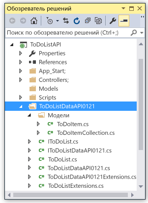

5. Откройте файл *Controllers\\ContactsController.cs*, чтобы просмотреть код, который вызывает API с помощью созданного клиента.

	В приведенном ниже фрагменте кода показано, как создать экземпляр объекта клиента и вызвать метод GET.

		private ContactsListAPI db = new ContactsListAPI(new Uri("http://localhost:51864"));
		
		public ActionResult Index()
		{
		    return View(db.Contacts.Get());
		}

	Этот код передает локальный URL-адрес IIS Express проекта API конструктору классов клиента для локального запуска веб-проекта MVC и проекта API. Если опустить параметр конструктора, в качестве конечной точки по умолчанию будет использоваться URL-адрес, на основе которого создан код.

6. Класс клиента будет создан с другим именем в зависимости от имени приложения API. Измените этот код так, чтобы имя типа совпадало с именем в проекте. Например, если приложение API названо ContactsListAPIContoso, код будет выглядеть следующим образом:

		private ContactsListAPIContoso db = new ContactsListAPIContoso(new Uri("http://localhost:51864"));
		
		public ActionResult Index()
		{
		    return View(db.Contacts.Get());
		}

7. Выполните сборку решения.

Контроллер и представления проекта MVC похожи на контроллер и представления, сформированные для Entity Framework на основе скаффолдинга, так как они создаются следующим образом: формируется модель данных Entity Framework на основе скаффолдинга, а затем в нее вносятся незначительные изменения, чтобы можно было использовать клиент REST API, а не контекст базы данных Entity Framework.

### Локальный запуск

1. Установите проекты ContactsList.API и ContactsList.MVC в качестве запускаемых проектов и задайте параметры, согласно которым сначала будет запускаться ContactsList.API, а затем — ContactsList.MVC. (Щелкните правой кнопкой мыши решение, последовательно щелкните **Свойства** и **Несколько запускаемых проектов**, а затем укажите для каждого из них значение **Запуск**. Просмотрите список, используя значки со стрелками вверх и вниз, чтобы убедиться, что проект ContactsList.API первый в списке.) 

2. Нажмите клавишу F5, чтобы запустить проект.

	В одном браузере отобразится страница с ошибкой 403 для API, а в другом — домашняя страница приложения MVC.

3. В строке меню браузера, в котором отображается домашняя страница приложения MVC, щелкните **Контакты**.

	В пользовательском интерфейсе MVC отображаются локальные контакты. Здесь их можно добавлять и удалять.

	

### Создание веб-приложения в Azure и развертывание в нем проекта ContactsList.MVC

В этом разделе вы используете тот же способ создания веб-приложения, что и для создания приложения API, и тот же способ развертывания веб-проекта в веб-приложении Azure.

#### Изменение проекта MVC для указания приложения API Azure 

Перед развертыванием в Azure измените конечную точку API в проекте MVC, чтобы при развертывании кода он вызвал созданное ранее приложение API Azure, а не localhost.

1. В проекте ContactsList.MVC откройте файл *Controllers\\ContactsController.cs*.

2. Закомментируйте строку, которая задает базовый URL-адрес API в качестве URL-адреса localhost, и раскомментируйте строку без параметра конструктора. Теперь код будет выглядеть, как показано ниже, кроме того, что имя класса в обоих строках отражает имя приложения API, на основе которого создан код.

		private ContactsListAPI db = new ContactsListAPI();
		//private ContactsListAPI db = new ContactsListAPI(new Uri("http://localhost:51864"));

	В качестве целевого URL-адреса по умолчанию используется URL-адрес приложения API Azure, так как код создан на его основе. Если код создан по-другому, может потребоваться указать URL-адрес приложения API Azure так же, как и локальный URL-адрес.

#### Создание веб-приложения для размещения сайта MVC

1. В **обозревателе решений** щелкните правой кнопкой мыши проект ContactsList.MVC и нажмите кнопку **Опубликовать**.

2. В мастере **веб-публикации** выберите вкладку **Профиль**.

3.  В мастере **веб-публикации** на вкладке **Профиль** щелкните **Служба приложений Microsoft Azure**.

5. В диалоговом окне **Служба приложений** нажмите кнопку **Создать**.

3. В диалоговом окне **Создание службы приложений** на вкладке **Размещение** щелкните **Изменить тип**, а затем убедитесь, что установлен тип **Веб-приложение**.

4. В поле **Имя веб-приложения** введите имя, которое является уникальным в домене *azurewebsites.net*.

5. В поле **Подписка** выберите подписку Azure, которую нужно использовать.

6. В раскрывающемся списке **Группа ресурсов** выберите созданную ранее группу ресурсов.

4. В раскрывающемся списке **План службы приложений** выберите созданный ранее план.

7. Щелкните **Создать**.

	В Visual Studio создается веб-приложение и профиль публикации для него, а также отображается шаг **Подключение** мастера **веб-публикации**.

### Развертывание проекта ContactsList.Web в новом веб-приложении

3.  На шаге **Подключение** мастера **веб-публикации** нажмите кнопку **Опубликовать**.

	Visual Studio развертывает проект ContactsList.MVC в новом веб-приложении и выполняет переход по URL-адресу веб-приложения в браузере. Появится тот же пользовательский интерфейс MVC, что и при локальном запуске, но теперь в нем отображаются контакты, которые хранятся в файловой системе приложения API Azure.

	

## Дальнейшие действия

В этом руководстве показано, как создать приложение API, развернуть в него код и использовать в клиенте .NET. В следующем руководстве из серии «Приступая к работе с приложениями API» показано, как [использовать приложения API в клиентах JavaScript с помощью CORS](app-service-api-cors-consume-javascript.md).

<!---HONumber=AcomDC_1210_2015-->