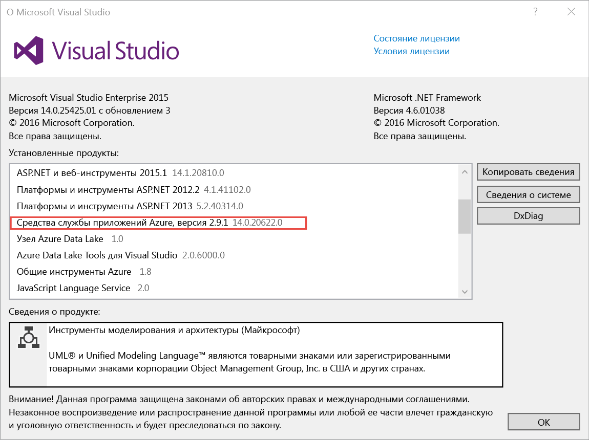
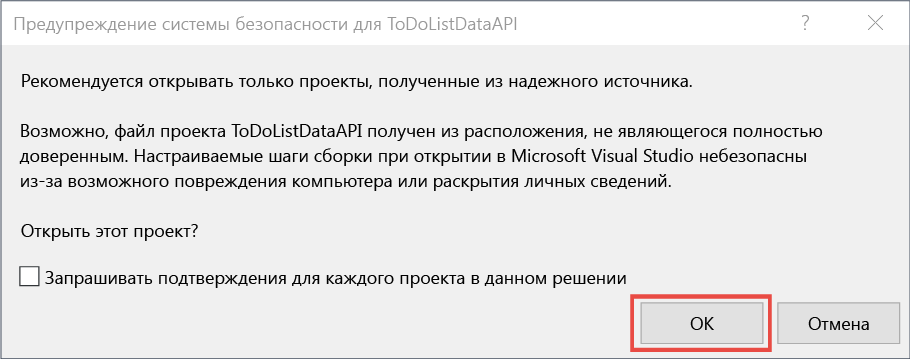
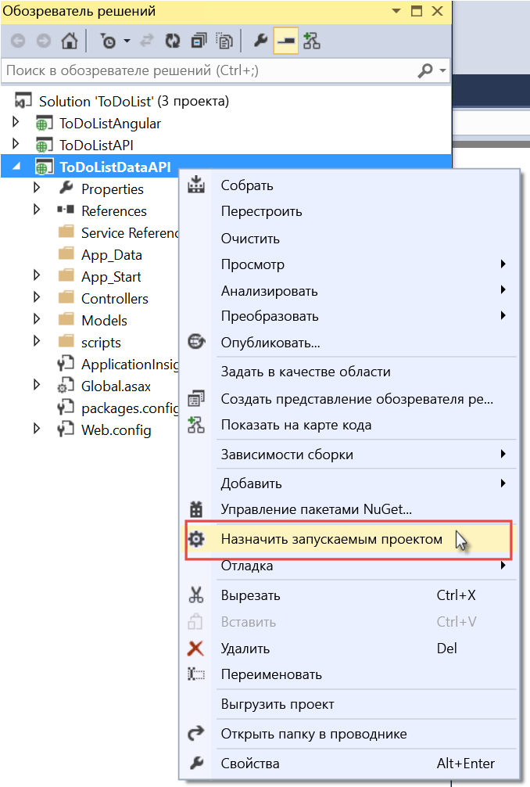
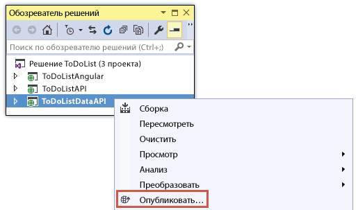
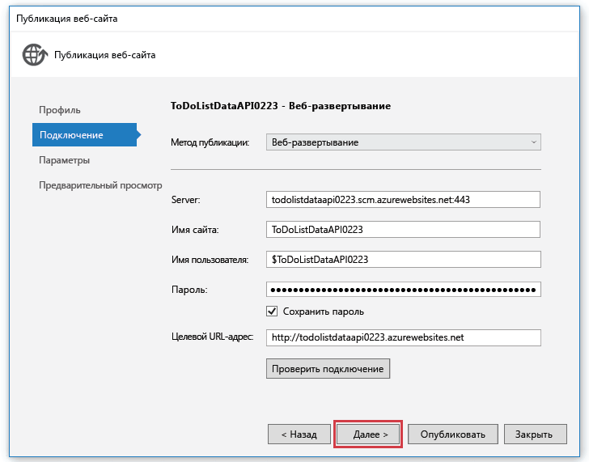
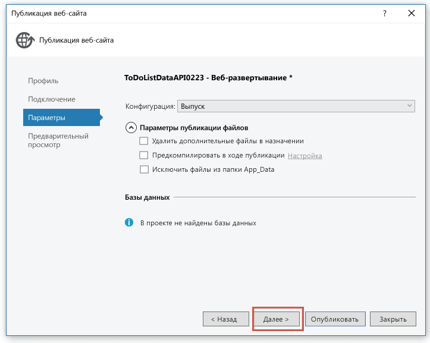
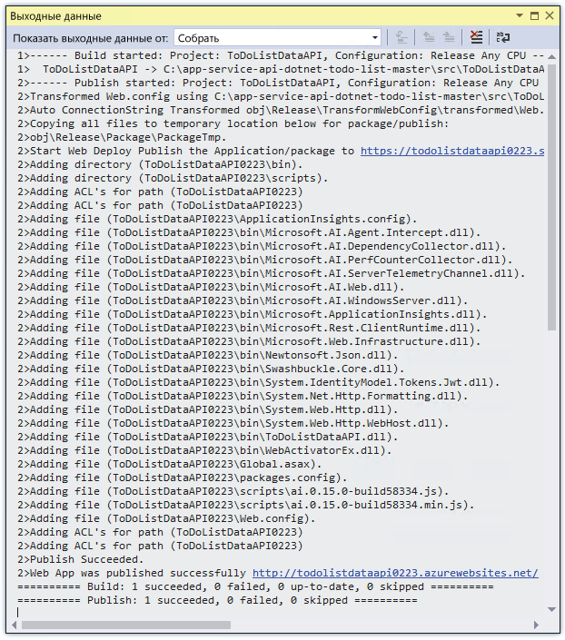
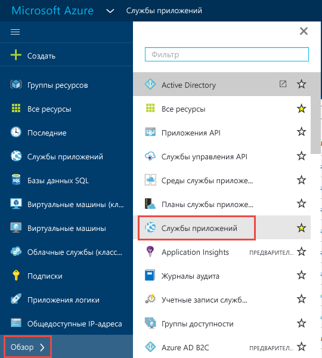
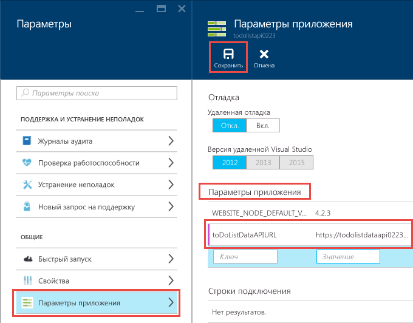

# Приступая к работе с приложениями API, ASP.NET и Swagger в службе приложений Azure
[!INCLUDE [selector](../../includes/app-service-api-get-started-selector.md)]

Это первое руководство из серии, посвященной использованию функций службы приложений Azure, которые могут быть полезны при разработке и размещении интерфейсов API RESTful.  В этом руководстве рассматривается обеспечение поддержки метаданных API в формате Swagger.

Вы узнаете следующее:

* как создавать и развертывать [приложения API](app-service-api-apps-why-best-platform.md) в службе приложений Azure с помощью средств, встроенных в Visual Studio 2015;
* как автоматизировать обнаружение API, используя пакет NuGet Swashbuckle, чтобы динамически создавать метаданные API Swagger;
* как использовать метаданные API Swagger для автоматического создания кода клиента для приложения API.

## Обзор примеров приложений
В этом руководстве вы будете работать с простым примером приложения списка дел. Приложение состоит из внешнего одностраничного интерфейса, веб-API ASP.NET среднего уровня и веб-API ASP.NET уровня данных.

Ниже приведен снимок экрана внешнего интерфейса [AngularJS](https://angularjs.org/) .

Это решение Visual Studio включает в себя три проекта:

* **ToDoListAngular** (внешний интерфейс). Одностраничное приложение AngularJS, вызывающее средний уровень.
* **ToDoListAPI** (средний уровень). Проект веб-API ASP.NET, вызывающий уровень данных, чтобы выполнять операции CRUD с элементами списка дел.
* **ToDoListDataAPI** (уровень данных). Проект веб-API ASP.NET, выполняющий операции CRUD с элементами списка дел.

Трехуровневая архитектура — одна из множества архитектур, которые можно реализовать с помощью приложений API. В этой статье она представлена исключительно в демонстрационных целях. На каждом уровне используется максимально упрощенный код для демонстрации возможностей приложений API. Например, на уровне данных в качестве механизма сохранения используется память сервера, а не база данных.

По завершении этого руководства вы создадите два проекта веб-API, которые будут работать в облаке в приложениях API службы приложений.

В следующем руководстве этой серии вы узнаете, как развернуть внешний интерфейс одностраничного приложения в облаке.

## Предварительные требования
* Веб-API ASP.NET. В инструкциях руководства предполагается, что у вас уже есть базовые знания о работе с [веб-API 2](http://www.asp.net/web-api/overview/getting-started-with-aspnet-web-api/tutorial-your-first-web-api) ASP.NET в Visual Studio.
* Учетная запись Azure. [Создайте бесплатную учетную запись Azure](https://azure.microsoft.com/free/?WT.mc_id=A261C142F) или [активируйте преимущества для подписчиков Visual Studio](https://azure.microsoft.com/pricing/member-offers/msdn-benefits-details/?WT.mc_id=A261C142F).
  
    Чтобы приступить к работе со службой приложений Azure до регистрации и получения учетной записи Azure, перейдите на страницу [пробного использования службы приложений](http://go.microsoft.com/fwlink/?LinkId=523751). Там можно быстро создать кратковременное приложение начального уровня в службе приложений. Это не потребует **ни кредитной карты**, ни каких-либо обязательств.
* Visual Studio 2015 с [Azure SDK для .NET](https://azure.microsoft.com/downloads/archive-net-downloads/). Пакет SDK автоматически устанавливает Visual Studio 2015, если вы еще этого не сделали.
  
  * В Visual Studio щелкните "Справка -> О Microsoft Visual Studio" и убедитесь, что у вас установлены средства службы приложений Azure версии 2.9.1 или более поздней.
    
    
    
    > [!NOTE]
    > В зависимости от того, сколько зависимостей пакета SDK уже имеется на компьютере, установка пакета SDK может занять определенное время, от нескольких минут до получаса или более.
    > 
    > 

## Загрузка примера приложения
1. Скачайте репозиторий [Azure-Samples/app-service-api-dotnet-to-do-list](https://github.com/Azure-Samples/app-service-api-dotnet-todo-list) .
   
    Для этого нажмите кнопку **Download ZIP** (Скачать ZIP-файл) или клонируйте репозиторий на локальном компьютере.
2. Откройте решение ToDoList в Visual Studio 2015 или 2013.
   
   1. Вам потребуется подтвердить, что нужно доверять всем решениям.
         
3. Создайте решение (CTRL+SHIFT+B), чтобы восстановить пакеты NuGet.
   
    Чтобы увидеть приложение в действии перед развертыванием, можно запустить его локально. Убедитесь, что ToDoListDataAPI настроен в качестве запускаемого проекта, и запустите решение. В браузере может отобразиться ошибка HTTP 403.

## Использование метаданных и пользовательского интерфейса API Swagger
Поддержка метаданных API [Swagger 2.0](http://swagger.io/) встроена в службу приложений Azure. В каждом приложении API можно указать URL-адрес конечной точки, которая возвращает метаданные для API в формате JSON-файла Swagger. Метаданные, возвращенные из этой конечной точки, можно использовать для создания клиентского кода.

Проект веб-API ASP.NET может динамически создавать метаданные Swagger, используя пакет NuGet [Swashbuckle](https://www.nuget.org/packages/Swashbuckle) . В скачанных проектах ToDoListDataAPI и ToDoListAPI этот пакет уже установлен.

В этом разделе мы рассмотрим созданные метаданные Swagger 2.0 и попробуем поработать с созданным на их основе пользовательским интерфейсом.

1. Установите проект ToDoListDataAPI (**не** проект ToDoListAPI) в качестве запускаемого проекта.
   
    
2. Нажмите клавишу F5 или выберите **Отладка > Начать отладку**, чтобы запустить проект в режиме отладки.
   
    Откроется браузер, в котором отобразится страница с ошибкой HTTP 403.
3. В адресной строке браузера добавьте `swagger/docs/v1` в конец строки и нажмите кнопку «Назад». (URL-адрес — `http://localhost:45914/swagger/docs/v1`.)
   
    Это URL-адрес по умолчанию, используемый Swashbuckle, чтобы вернуть метаданные JSON Swagger 2.0 для API.
   
    При использовании Internet Explorer появится запрос на скачивание файла *v1.json* .
   
    
   
    При использовании Chrome, Firefox или Microsoft Edge в окне браузера отобразится JSON-файл. В каждом браузере JSON обрабатывается по-своему. Вид окна вашего браузера может отличаться от вида окна в примере.
   
    
   
    В следующем примере показана первая часть метаданных Swagger для API с определением для метода GET. Эти метаданные позволяют использовать пользовательский интерфейс Swagger, которым мы воспользуемся на следующих шагах. Он будет использоваться в следующем разделе этого руководства для автоматического создания кода клиента.
   
        {
          "swagger": "2.0",
          "info": {
            "version": "v1",
            "title": "ToDoListDataAPI"
          },
          "host": "localhost:45914",
          "schemes": [ "http" ],
          "paths": {
            "/api/ToDoList": {
              "get": {
                "tags": [ "ToDoList" ],
                "operationId": "ToDoList_GetByOwner",
                "consumes": [ ],
                "produces": [ "application/json", "text/json", "application/xml", "text/xml" ],
                "parameters": [
                  {
                    "name": "owner",
                    "in": "query",
                    "required": true,
                    "type": "string"
                  }
                ],
                "responses": {
                  "200": {
                    "description": "OK",
                    "schema": {
                      "type": "array",
                      "items": { "$ref": "#/definitions/ToDoItem" }
                    }
                  }
                },
                "deprecated": false
              },
4. Закройте браузер и остановите процесс отладки Visual Studio.
5. В проекте ToDoListDataAPI в **обозревателе решений** откройте файл *App_Start\SwaggerConfig.cs*, а затем найдите строку 174 и раскомментируйте следующий код.
   
        /*
            })
        .EnableSwaggerUi(c =>
            {
        */
   
    При установке пакета Swashbuckle в проекте создается файл *SwaggerConfig.cs* . С его помощью можно настроить Swashbuckle несколькими способами.
   
    Раскомментированный код позволяет применять пользовательский интерфейс Swagger, используемый на следующих шагах. При создании проекта веб-API с помощью шаблона проекта приложения API в целях безопасности этот код закомментирован по умолчанию.
6. Запустите проект снова.
7. В адресной строке браузера добавьте `swagger` в конец строки и нажмите кнопку «Назад». (URL-адрес — `http://localhost:45914/swagger`.)
8. Когда откроется страница пользовательского интерфейса Swagger, щелкните **ToDoList** , чтобы увидеть доступные методы.
   
    
9. Нажмите первую кнопку **Get** в списке.
10. В разделе **Параметры** введите звездочку в качестве значения параметра `owner`, а затем нажмите кнопку **Попробуйте в деле**.
    
    В последующих руководствах при добавлении проверки подлинности средний уровень указывает фактический идентификатор пользователя для уровня данных. Теперь при выполнении приложения с выключенной аутентификацией для всех задач в качестве идентификатора владельца будет использоваться звездочка.
    
    
    
    Пользовательский интерфейс Swagger вызывает метод Get проекта ToDoList и отображает код ответа и результаты JSON.
    
    
11. Щелкните **Post**, а затем — поле в разделе **Model Schema** (Схема модели).
    
    При этом предварительно заполняется поле ввода, в котором можно указать значение параметра для метода POST. Если этот способ не сработает в Internet Explorer, используйте другой браузер или вручную введите значение параметра на следующем шаге.  
    
    
12. В поле ввода параметров `todo` измените код JSON, чтобы он выглядел, как показано ниже, или введите собственное описание:
    
        {
          "ID": 2,
          "Description": "buy the dog a toy",
          "Owner": "*"
        }
13. Щелкните **Попробовать**.
    
    Проект ToDoList API возвращает код ответа HTTP 204, который указывает на успешное завершение.
14. Нажмите первую кнопку **Get**, а затем в соответствующем разделе страницы нажмите кнопку **Попробуйте в деле**.
    
    Теперь ответ метода GET содержит новый элемент списка дел.
15. Необязательно: также попробуйте методы Put, Delete и Get по идентификатору (ID).
16. Закройте браузер и остановите процесс отладки Visual Studio.

Swashbuckle можно использовать с любыми проектами веб-API ASP.NET. Если нужно добавить возможность создания метаданных Swagger в существующий проект, просто установите пакет Swashbuckle.

> [!NOTE]
> В метаданных Swagger есть уникальный идентификатор для каждой операции API. По умолчанию пакет Swashbuckle может создавать дублирующиеся идентификаторы операций Swagger для методов контроллера веб-API. Это происходит, если перегружены методы HTTP контроллера, например `Get()` и `Get(id)`. Дополнительные сведения о действиях при перегрузке см. в статье [Настройка определений API, создаваемых в Swashbuckle](app-service-api-dotnet-swashbuckle-customize.md). Если проект веб-API в Visual Studio создается с помощью шаблона приложения API Azure, к файлу *SwaggerConfig.cs* автоматически добавляется код, который создает уникальные идентификаторы операций.  
> 
> 

##  Создание приложения API в Azure и развертывание кода в нем
В этом разделе вы создадите приложение API в Azure с помощью инструментов Azure, интегрированных в мастер **Публикация веб-сайта** в Visual Studio. Затем вы развернете проект ToDoListDataAPI в новом приложении API и вызовете API, запустив пользовательский интерфейс Swagger.

1. В **обозревателе решений** щелкните правой кнопкой мыши проект ToDoListDataAPI и выберите пункт **Опубликовать**.
   
    
2. В мастере **Публикация веб-сайта** на вкладке **Профиль** щелкните **Служба приложений Microsoft Azure**.
   
   
3. Войдите в учетную запись Azure, если вы этого еще не сделали, или обновите учетные данные, если срок их действия истек.
4. В диалоговом окне "Служба приложений" в поле **Подписка** выберите подписку Azure, которую хотите использовать, и нажмите кнопку **Создать**.
   
    
   
    Откроется диалоговое окно **Создать службу приложений** со вкладкой **Размещение**.
   
    Так как вы развертываете проект веб-API, в котором установлен пакет Swashbuckle, программа Visual Studio предлагает создать приложение API. Это можно определить по имени поля **API App Name** (Имя приложения API) и типу приложения (в раскрывающемся списке **Изменить тип** выбран тип **Приложение API**).
   
    
5. В поле **Имя приложения API** введите имя, которое является уникальным в домене *azurewebsites.net* . Можно использовать имя по умолчанию, предоставляемое Visual Studio.
   
    Если ввести имя, которое уже используется, справа появится красный восклицательный знак.
   
    У приложения API будет такой URL-адрес: `{API app name}.azurewebsites.net`.
6. Возле раскрывающегося списка **Группа ресурсов** нажмите кнопку **Создать** и введите имя ToDoListGroup или любое другое.
   
    Группы ресурсов — это совокупность ресурсов Azure, таких как приложения API, базы данных, виртуальные машины и т. д.    Мы рекомендуем создать новую группу ресурсов, так как это позволит быстро удалить все ресурсы Azure, созданные для работы с этим руководством.
   
    В этом поле можно выбрать существующую [группу ресурсов](../azure-resource-manager/resource-group-overview.md) или создать отдельную, введя имя, которое отличается от имени любой существующей группы ресурсов в подписке.
7. Нажмите кнопку **Создать** возле раскрывающегося списка **План службы приложений**.
   
    На снимке экрана показаны примеры значений в полях **API App Name** (Имя приложения API), **Подписка** и **Группа ресурсов**. Ваши значения будут другими.
   
    
   
    Далее мы создадим план службы приложений для новой группы ресурсов. План службы приложений определяет вычислительные ресурсы, на которых будет работать ваше приложение API. Например, если выбрать уровень "Бесплатный", ваше приложение будет работает на общих виртуальных машинах, тогда как при выборе некоторых платных уровней приложение будет работать на выделенных виртуальных машинах. Дополнительные сведения см. в статье [Подробный обзор планов службы приложений Azure](../app-service/azure-web-sites-web-hosting-plans-in-depth-overview.md).
8. В диалоговом окне **Настроить план служб приложений** в соответствующем поле введите ToDoListPlan или другое имя.
9. В раскрывающемся списке **Расположение** выберите ближайшее расположение.
   
    Этот параметр определяет, в каком центре обработки данных Azure будет выполняться приложение. Выберите ближайшее расположение, чтобы максимально сократить [задержку](http://www.bing.com/search?q=web%20latency%20introduction&qs=n&form=QBRE&pq=web%20latency%20introduction&sc=1-24&sp=-1&sk=&cvid=eefff99dfc864d25a75a83740f1e0090).
10. В раскрывающемся списке **Размер** щелкните **Бесплатный**.
    
    Эта ценовая категория обеспечит достаточную производительность в рамках заданий этого руководства.
11. В диалоговом окне **Настроить план служб приложений** нажмите кнопку **ОК**.
    
    
12. В диалоговом окне **Создать службу приложений** нажмите кнопку **Создать**.
    
    
    
    Visual Studio создает приложение API и профиль публикации со всеми настройками, необходимыми для приложения API. Затем откроется мастер **Публикация веб-сайта** , который будет использоваться для развертывания проекта.
    
    В мастере **Публикация веб-сайта** откроется вкладка **Подключение** (показана ниже).
    
    На вкладке **Подключение** в полях **Сервер** и **Имя сайта** укажите данные приложения API. В полях **Имя пользователя** и **Пароль** указываются учетные данные развертывания, созданные Azure. После развертывания с помощью Visual Studio в браузере откроется страница с **URL-адресом назначения** (**URL-адрес назначения** необходим только для этого).  
13. Нажмите кнопку **Далее**.
    
    
    
    Следующая вкладка — **Параметры** (показана ниже). Здесь можно изменить конфигурацию сборки, чтобы развернуть отладочную сборку для [удаленной отладки](../app-service-web/web-sites-dotnet-troubleshoot-visual-studio.md#remotedebug). На этой вкладке также представлен раздел **Параметры публикации файлов**с соответствующими параметрами:
    
    * "Удалить дополнительные файлы в месте назначения";
    * "Предварительно компилировать при публикации";
    * "Исключить файлы из папки App_Data".
    
    В данном руководстве эти параметры не используются. Подробное описание этих параметров см. в статье [How to: Deploy a Web Project Using One-Click Publish in Visual Studio](https://msdn.microsoft.com/library/dd465337.aspx) (Развертывание веб-проекта с помощью публикации одним щелчком в Visual Studio).
14. Нажмите кнопку **Далее**.
    
    
    
    Следующая вкладка — **Предварительный просмотр** (показана ниже). Здесь можно узнать, какие файлы скопируются из проекта в приложение API. Если вы развертываете проект в приложение API, в которое проект уже был развернут, копируются только измененные файлы. Чтобы просмотреть список файлов, которые будут скопированы, нажмите кнопку **Начать просмотр** .
15. Щелкните **Опубликовать**.
    
    
    
    Visual Studio развернет проект ToDoListDataAPI в новое приложение API. В окне **Выходные данные** появятся сведения об успешном развертывании, а в окне браузера откроется страница с URL-адресом созданного приложения API.
    
    
    
    
16. В адресной строке браузера добавьте swagger в URL-адрес и нажмите клавишу ВВОД. (URL-адрес — `http://{apiappname}.azurewebsites.net/swagger`.)
    
    В браузере отобразится тот же пользовательский интерфейс Swagger, который вы уже видели, но теперь он будет работать в облаке. Попробуйте метод Get, и вы увидите, что вы возвращаетесь к элементам используемого по умолчанию списка дел 2. Внесенные ранее изменения сохранены в памяти локального компьютера.
17. Откройте [портал Azure](https://portal.azure.com/).
    
    Портал Azure — это веб-интерфейс для управления ресурсами Azure, например приложениями API.
18. Щелкните **Больше служб > Службы приложений**.
    
    
19. В колонке **Службы приложений** найдите и выберите свое приложение API. (На портале Azure окна, которые открываются справа, называются *колонками*).
    
    
    
    Откроются две колонки: в одной будет общая информация о приложении API, а во второй — длинный список параметров, которые можно просматривать и изменять.
20. В колонке **Параметры** найдите раздел **API** и щелкните **Определение API**.
    
    
    
    В колонке **Определение API** можно указать URL-адрес, возвращающий метаданные Swagger 2.0 в формате JSON. Когда программа Visual Studio создает приложение API, она задает для URL-адреса определения API значение по умолчанию (для созданных пакетом Swashbuckle метаданных, которые вы уже видели ранее). Значением по умолчанию выступает базовый URL-адрес приложения API и строка `/swagger/docs/v1`.
    
    
    
    При выборе приложения API, для которого нужно создать код клиента, Visual Studio извлекает метаданные из этого URL-адреса.

##  Создание кода клиента для уровня данных
Одним из преимуществ интеграции платформы Swagger в приложения API Azure является автоматическое создание кода. Созданные классы клиента упрощают написание кода, который вызывает приложение API.

В проекте ToDoListAPI уже есть клиентский код, но на следующих шагах мы удалим его и создадим повторно, чтобы понять, как создается код.

1. В **обозревателе решений**Visual Studio в проекте ToDoListAPI удалите папку *ToDoListDataAPI* . **Предупреждение. Нужно удалить только папку, а не проект ToDoListDataAPI.**
   
    
   
    Эта папка появилась в процессе создания кода, который мы будем изучать.
2. Щелкните правой кнопкой мыши проект ToDoListAPI и выберите **Добавить > Клиент REST API**.
   
    
3. В диалоговом окне **Добавление клиента REST API** установите переключатель **Swagger URL** (URL-адрес Swagger), а затем нажмите кнопку **Выбрать ресурс Azure**.
   
    
4. В диалоговом окне **Служба приложений** разверните группу ресурсов, используемую в этом руководстве, выберите нужное приложение API и нажмите кнопку **ОК**.
   
    
   
    Обратите внимание, что при возврате к диалоговому окну **Добавление клиента REST API** в текстовом поле введено значение URL-адреса определения API, которое вы видели на портале ранее.
   
    
   
   > [!TIP]
   > Кроме того, чтобы получить метаданные для создания кода, URL-адрес можно ввести напрямую, а не в диалоговом окне обзора. Например, если нужно создать клиентский код до развертывания в Azure, запустите проект веб-API локально, перейдите по URL-адресу JSON-файла Swagger, сохраните файл и установите переключатель **Select an existing Swagger metadata file** (Выбрать существующий файл метаданных Swagger).
   > 
   > 
5. В диалоговом окне **Добавление клиента REST API** нажмите кнопку **ОК**.
   
    Visual Studio создает папку с именем приложения API и классы клиента.
   
    
6. В проекте ToDoListAPI откройте файл *Controllers\ToDoListController.cs*. В строке 40 вы увидите код, который вызывает API с помощью созданного клиента.
   
    В приведенном ниже фрагменте кода показано, как создать экземпляр объекта клиента и вызвать метод GET.
   
        private static ToDoListDataAPI NewDataAPIClient()
        {
            var client = new ToDoListDataAPI(new Uri(ConfigurationManager.AppSettings["toDoListDataAPIURL"]));
            return client;
        }
   
        public async Task<IEnumerable<ToDoItem>> Get()
        {
            using (var client = NewDataAPIClient())
            {
                var results = await client.ToDoList.GetByOwnerAsync(owner);
                return results.Select(m => new ToDoItem
                {
                    Description = m.Description,
                    ID = (int)m.ID,
                    Owner = m.Owner
                });
            }
        }
   
    Параметр конструктора получает URL-адрес конечной точки из параметра приложения `toDoListDataAPIURL`. В файле Web.config это значение содержит локальный URL-адрес IIS Express проекта API, что дает возможность запускать приложение локально. Если опустить параметр конструктора, в качестве конечной точки по умолчанию будет использоваться URL-адрес, на основе которого создан код.
7. Класс клиента будет создан с другим именем в зависимости от имени приложения API. Измените код в файле *Controllers\ToDoListController.cs* так, чтобы имя типа совпадало с именем в проекте. Например, если вы назвали приложение API ToDoListDataAPI071316, необходимо изменить код
   
        private static ToDoListDataAPI NewDataAPIClient()
        {
            var client = new ToDoListDataAPI(new Uri(ConfigurationManager.AppSettings["toDoListDataAPIURL"]));

на такой:

        private static ToDoListDataAPI071316 NewDataAPIClient()
        {
            var client = new ToDoListDataAPI071316(new Uri(ConfigurationManager.AppSettings["toDoListDataAPIURL"]));

## Создание приложения API для размещения на среднем уровне
Ранее вы [создали приложение API уровня данных и развернули в нем код](#createapiapp).  Теперь выполните ту же процедуру, чтобы создать приложение API среднего уровня.

1. В **обозревателе решений** щелкните правой кнопкой мыши проект ToDoListAPI среднего уровня (не ToDoListDataAPI уровня данных) и выберите пункт **Опубликовать**.
   
    
2. В мастере **Публикация веб-сайта** на вкладке **Профиль** щелкните **Служба приложений Microsoft Azure**.
3. В диалоговом окне **Служба приложений** нажмите кнопку **Создать**.
4. В диалоговом окне **Создание службы приложений** на вкладке **Размещение** примите значение по умолчанию в поле **API App Name** (Имя приложения API) или введите имя, которое будет уникальным в домене *azurewebsites.net*.
5. В поле **Подписка** выберите используемую подписку Azure.
6. В раскрывающемся списке **Группа ресурсов** выберите созданную ранее группу ресурсов.
7. В раскрывающемся списке **План службы приложений** выберите созданный ранее план. Это значение будет использоваться по умолчанию.
8. Щелкните **Создать**.
   
    Visual Studio создаст приложение API и профиль публикации для него. Кроме того, в мастере **Публикация веб-сайта** отобразится шаг **Подключение**.
9. На шаге **Подключение** мастера **Публикации веб-сайта** нажмите кнопку **Опубликовать**.
   
   Visual Studio развернет проект ToDoListAPI в новом приложении API и откроет в браузере URL-адрес приложения API. Откроется страница "Приложение успешно создано".

## Настройка вызова уровня данных на среднем уровне
Если вызвать приложение API среднего уровня сейчас, оно попытается вызвать уровень данных, используя URL-адрес локального узла, который указан в файле Web.config. В этом разделе мы укажем URL-адрес для приложения API уровня данных в параметре среды в приложении API среднего уровня. Когда код в приложении API среднего уровня получает URL-адрес уровня данных, параметр среды перезаписывает значение в файле Web.config.

1. Перейдите на [портал Azure](https://portal.azure.com/)и откройте колонку **Приложение API** для приложения API, созданного для размещения проекта TodoListAPI (приложение среднего уровня).
2. В колонке **Параметры** приложения API щелкните **Параметры приложения**.
3. Прокрутите колонку **Параметры приложения** вниз до раздела **Параметры приложения** и добавьте следующие ключ и значение. Необходимо указать URL-адрес первого приложения API, опубликованного при работе с этим руководством.
   
   | **Ключ** | toDoListDataAPIURL |
   | --- | --- |
   | **Значение** |https://{имя приложения API уровня данных}.azurewebsites.net |
   | **Пример** |https://todolistdataapi.azurewebsites.net |
4. Щелкните **Сохранить**.
   
    
   
    Если код выполняется в среде Azure, это значение теперь будет переопределять URL-адрес локального узла, который находится в файле Web.config.

## Тест
1. В окне браузера перейдите по URL-адресу нового приложения API среднего уровня, созданного для ToDoListAPI. Для этого на портале в главной колонке приложения API щелкните этот URL-адрес.
2. В адресной строке браузера добавьте swagger в URL-адрес и нажмите клавишу ВВОД. (URL-адрес — `http://{apiappname}.azurewebsites.net/swagger`.)
   
    В браузере появится тот же пользовательский интерфейс Swagger, который мы уже видели в проекте ToDoListDataAPI. В этот раз поле `owner` не является обязательным для операции Get, так как приложение API среднего уровня автоматически отправляет это значение в приложение API уровня данных. (В руководствах по проверке подлинности приложение среднего уровня будет отправлять для параметра `owner` фактические идентификаторы пользователей. Сейчас вместо значения этого параметра отображается звездочка.)
3. Попробуйте применить метод GET и другие методы, чтобы убедиться, что приложение API среднего уровня успешно вызывает приложение API уровня данных.
   
    

## Устранение неполадок
Если в ходе выполнения инструкций этого руководства возникнут проблемы, можно воспользоваться рекомендациями по устранению неполадок ниже:

* Убедитесь, что используется последняя версия пакета [Azure SDK для .NET](http://go.microsoft.com/fwlink/?linkid=518003).
* Имена двух проектов похожи (ToDoListAPI, ToDoListDataAPI). Если результаты вашей работы выглядят не так, как описано в инструкциях, убедитесь, что вы открыли правильный проект.
* Если вы работаете в корпоративной сети и пытаетесь развернуть службу приложений Azure через брандмауэр, убедитесь, что порты 443 и 8172 открыты для веб-развертывания. Если не удается открыть эти порты, можно использовать другие способы развертывания.  Дополнительные сведения см. в статье [Развертывание приложения в службе приложений Azure](../app-service-web/web-sites-deploy.md).
* Ошибки "Имена маршрутов должны быть уникальными" могут возникнуть, если вы случайно развернули в приложении API неправильный проект, а затем правильный. Чтобы устранить эту проблему, повторно разверните правильный проект в приложении API. В мастере **Публикация веб-сайта** на вкладке **Параметры** установите флажок **Удалять дополнительные файлы в месте назначения**.

Запустив приложение API ASP.NET в службе приложений Azure, можно узнать больше о функциях Visual Studio, которые упрощают устранение неполадок. Сведения о ведении журналов, удаленной отладке и другую информацию см. в статье [Устранение неполадок веб-приложения в службе приложений Azure с помощью Visual Studio](../app-service-web/web-sites-dotnet-troubleshoot-visual-studio.md).

## Дальнейшие действия
Вы узнали, как развертывать существующие проекты веб-API в приложениях API, создавать клиентский код для приложений API и использовать эти приложения из клиентов .NET. В следующем руководстве из этой серии показано, как [использовать приложения API в клиентах JavaScript с помощью CORS](app-service-api-cors-consume-javascript.md).

Дополнительные сведения о создании клиентского кода см. в репозитории [Azure/AutoRest](https://github.com/azure/autorest) на сайте GitHub.com. Чтобы получить сведения о проблемах, связанных с созданным клиентом, [опубликуйте вопрос о проблеме в репозитории AutoRest](https://github.com/azure/autorest/issues).

Если нужно создать проекты приложений API с нуля, используйте шаблон **приложения API Azure** .

После выбора шаблона ASP.NET 4.5.2 **Пустой**, установки флажка добавления поддержки веб-API и пакета NuGet Swashbuckle результат будет таким же, как и при выборе шаблона проекта **Приложение API Azure**. Но в этот шаблон добавлен еще код конфигурации Swashbuckle, который не позволяет создавать повторяющиеся идентификаторы операций Swagger. Создав проект приложения API, его можно развернуть в приложении API так же, как показано в этом руководстве.

<!--HONumber=Dec16_HO2-->

