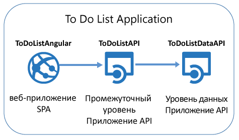
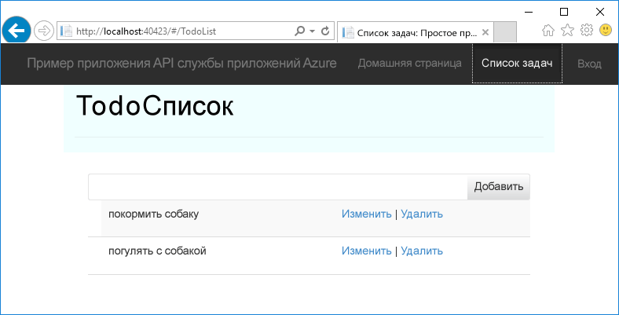
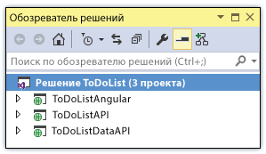

<properties
	pageTitle="Приступая к работе с приложениями API и ASP.NET в службе приложений Azure | Microsoft Azure"
	description="Узнайте, как создать, развернуть и использовать приложение API ASP.NET в службе приложений Azure с помощью Visual Studio 2015."
	services="app-service\api"
	documentationCenter=".net"
	authors="tdykstra"
	manager="wpickett"
	editor=""/>

<tags
	ms.service="app-service-api"
	ms.workload="na"
	ms.tgt_pltfrm="dotnet"
	ms.devlang="na"
	ms.topic="hero-article"
	ms.date="02/05/2016"
	ms.author="tdykstra"/>

# Приступая к работе с приложениями API и ASP.NET в службе приложений Azure

[AZURE.INCLUDE [app-service-api-get-started-selector](../../includes/app-service-api-get-started-selector.md)]

## Обзор

Это первое руководство из серии, посвященной использованию функций службы приложений Azure, которые могут быть полезны при разработке и размещении API-интерфейсов:

* встроенная поддержка метаданных API;
* поддержка CORS;
* поддержка аутентификации и авторизации.

Мы развернем пример приложения в двух [приложениях API](app-service-api-apps-why-best-platform.md) и веб-приложении в службе приложений Azure. Пример приложения представляет собой список дел с внешним одностраничным приложением (SPA) AngularJS, веб-приложением API среднего уровня ASP.NET и веб-приложением API ASP.NET уровня данных, как показано на схеме.

Ниже приведен снимок экрана внешнего приложения SPA.

По завершении этого руководства вы создадите два веб-интерфейса API, которые будут работать в приложениях API службы приложений. После завершения работы с этим руководством вы получите полное приложение, работающее в облаке, со SPA в веб-приложении службы приложений. В последующих руководствах вы научитесь добавлять проверку подлинности и авторизацию.

## Что вы узнаете

В этом учебнике вы узнаете следующее:

* Как подготовить компьютер к разработке для Azure путем установки пакета SDK для Azure для .NET.
* Как работать с приложениями API и веб-приложениями в службе приложений Azure с помощью средств, встроенных в Visual Studio 2015.
* Как автоматизировать обнаружение API с помощью пакета NuGet Swashbuckle для динамического создания JSON-файла определения API Swagger.
* Как использовать автоматически создаваемый код клиента для использования приложений API в клиенте .NET.
* Как настроить конечную точку для метаданных приложения API с помощью портала Azure.

## Предварительные требования

[AZURE.INCLUDE [prerequisites](../../includes/app-service-api-dotnet-get-started-prereqs.md)]

[AZURE.INCLUDE [set-up-dev-environment](../../includes/install-sdk-2015-2013.md)]

Для этого руководства требуется пакет SDK Azure для .NET версии 2.8.2 или более поздней.

## Загрузка примера приложения 

1. Скачайте репозиторий [Azure-Samples/app-service-api-dotnet-to-do-list](https://github.com/Azure-Samples/app-service-api-dotnet-todo-list).

	Вы можете нажать кнопку **Скачать ZIP-файл** или клонировать репозиторий на локальном компьютере.

2. Откройте решение ToDoList в Visual Studio 2015 или 2013.

	Решение Visual Studio представляет собой пример приложения, работающий с простыми элементами списка дел, которые состоят из описания и владельца.

		public class ToDoItem 
		{ 
		    public int ID { get; set; } 
		    public string Description { get; set; } 
		    public string Owner { get; set; } 
		} 
 
	Это решение содержит три проекта.

	

	* **ToDoListAngular** (внешнее приложение): одностраничное приложение AngularJS, которое вызывает приложение среднего уровня. 

	* **ToDoListAPI** (средний уровень): проект веб-API ASP.NET, который вызывает уровень данных для выполнения операций CRUD с элементами списка дел.

	* **ToDoListDataAPI** (уровень данных): проект веб-API ASP.NET, который выполняет операции CRUD с элементами списка дел. Элементы списка дел хранятся в памяти — это означает, что при каждом перезапуске приложения все изменения утрачиваются.

	При вызове уровня данных средний уровень указывает идентификатор пользователя в поле `Owner`. В коде, который вы загрузите, идентификатор пользователя всегда имеет значение "*". В последующих руководствах при добавлении проверки подлинности средний уровень указывает фактический идентификатор пользователя для уровня данных.

2. Создайте решение, чтобы восстановить пакеты NuGet.

### Запустите приложение локально (необязательно).

В этом разделе вы узнаете, как проверить, можно ли запустить клиент локально, и вызвать с его помощью API, который также работает локально.

**Примечание.** Эти инструкции применимы к браузерам Internet Explorer и Edge, так как в этих браузерах разрешены вызовы JavaScript из любых источников. При этом вызовы могут быть как направлены на URL-адреса `http://localhost`, так и исходить из них. Если вы используете браузер Chrome, запустите его, используя параметр `--disable-web-security`. Если вы используете Firefox, пропустите этот раздел.

1. Задайте все три проекта в качестве автозагружаемых проектов в такой последовательности: сначала ToDoListDataAPI, затем ToDoListAPI и наконец ToDoListAngular. (Щелкните решение правой кнопкой мыши, выберите пункт **Свойства**, выберите **Несколько автозагружаемых проектов**, расположите проекты в правильном порядке и для каждого из них выберите значение **Запуск** для параметра **Действие**).  

2. Нажмите клавишу F5, чтобы запустить проект.

	Откроются два окна браузера на странице ошибки HTTP 403 (это нормально для проектов веб-API), а в третьем окне браузера отобразится пользовательский интерфейс AngularJS.

3. В окне браузера с пользовательским интерфейсом AngularJS щелкните вкладку **Список дел**.

	Отобразятся два стандартных элемента списка дел.

	

4. Потренируйтесь добавлять, изменять и удалять элементы списка дел, чтобы увидеть, как работает приложение.

	Любые внесенные изменения хранятся в памяти и теряются при перезапуске приложения.

3. Закройте окна браузера.

## Использование метаданных и пользовательского интерфейса Swagger

Поддержка метаданных API [Swagger 2.0](http://swagger.io/) встроена в службу приложений Azure. Каждое приложение API указывает конечную точку URL-адреса, которая возвращает метаданные для API в формате JSON-файла Swagger. Метаданные, возвращенные из этой конечной точки, можно использовать для создания клиентского кода.

Пакет NuGet [Swashbuckle](https://www.nuget.org/packages/Swashbuckle) предоставляет метаданные Swagger 2.0 для проекта веб-API ASP.NET. Swashbuckle использует отражение для динамического создания метаданных.

Пакет NuGet Swashbuckle уже установлен в скачанных проектах ToDoListDataAPI и ToDoListAPI. Кроме этого, он уже установлен при создании проекта с помощью шаблона проекта **приложения API Azure**. (В Visual Studio: **Файл > Создать > Проект > Веб-приложение ASP.NET > Приложение API Azure**).

Следуя инструкциям в этом разделе руководства, вы рассмотрите созданные метаданные Swagger 2.0 и используете пробный пользовательский интерфейс, созданный на их основе.

2. Установите проект ToDoListDataAPI в качестве запускаемого проекта. 
 
4. Нажмите клавишу F5, чтобы запустить проект в режиме отладки.

	Откроется браузер, в котором отобразится страница с ошибкой HTTP 403.

12. В адресной строке браузера добавьте `swagger/docs/v1` в конец строки и нажмите кнопку "Назад". (URL-адрес будет выглядеть следующим образом: `http://localhost:45914/swagger/docs/v1`).

	Это URL-адрес по умолчанию, используемый Swashbuckle, чтобы вернуть метаданные JSON Swagger 2.0 для API. При использовании Internet Explorer появится запрос на скачивание файла *v1.json*.

	

	При использовании Chrome, Firefox или Edge в окне браузера отобразится JSON-файл.

	

	В следующем примере показана первая часть метаданных Swagger для API с определением для метода GET. Эти метаданные позволяют использовать пользовательский интерфейс Swagger, которым мы воспользуемся на следующих шагах. Он будет использоваться в следующем разделе этого руководства для автоматического создания кода клиента.

		{
		  "swagger": "2.0",
		  "info": {
		    "version": "v1",
		    "title": "ToDoListDataAPI"
		  },
		  "host": "localhost:45914",
		  "schemes": [ "http" ],
		  "paths": {
		    "/api/ToDoList": {
		      "get": {
		        "tags": [ "ToDoList" ],
		        "operationId": "ToDoList_GetByOwner",
		        "consumes": [ ],
		        "produces": [ "application/json", "text/json", "application/xml", "text/xml" ],
		        "parameters": [
		          {
		            "name": "owner",
		            "in": "query",
		            "required": true,
		            "type": "string"
		          }
		        ],
		        "responses": {
		          "200": {
		            "description": "OK",
		            "schema": {
		              "type": "array",
		              "items": { "$ref": "#/definitions/ToDoItem" }
		            }
		          }
		        },
		        "deprecated": false
		      },

1. Закройте браузер.

3. В **обозревателе решений** в проекте ToDoListDataAPI откройте файл *App\_Start\\SwaggerConfig.cs*, а затем найдите следующий код и раскомментируйте его.

		/*
		    })
		.EnableSwaggerUi(c =>
		    {
		*/

	Файл *SwaggerConfig.cs* создается при установке пакета Swashbuckle в проекте. С его помощью можно настроить Swashbuckle несколькими способами.

	Раскомментированный код позволяет применять пользовательский интерфейс Swagger, используемый на следующих шагах. При создании проекта веб-API с помощью шаблона проекта приложения API в целях безопасности этот код закомментирован по умолчанию.

5. Запустите проект снова.

3. В адресной строке браузера добавьте `swagger` в конец строки и нажмите кнопку "Назад". (URL-адрес будет выглядеть следующим образом: `http://localhost:45914/swagger`).

4. Когда откроется страница Swagger, щелкните **ToDoList**, чтобы увидеть доступные методы.

	

5. Щелкните **Получить**.

6. Введите звездочку как значение параметра `owner`, а затем щелкните **Попробуйте в деле**.

	

	Пользовательский интерфейс Swagger вызывает метод GET проекта ToDoList и отображает результаты JSON.

	

6. Щелкните **POST**, а затем — поле в разделе **Схема модели**.

	При этом предварительно заполняется поле ввода, в котором можно указать значение параметра для метода POST. Если этот способ не сработает в Internet Explorer, используйте другой браузер или вручную введите значение параметра на следующем шаге.

	

7. Измените JSON в поле ввода параметров `contact`, чтобы он выглядел, как в следующем примере, или замените его своим текстом описания:

		{
		  "ID": 2,
		  "Description": "buy the dog a toy",
		  "Owner": "*"
		}

10. Щелкните **Попробовать**.

	Проект ToDoList API возвращает код ответа HTTP 204, который указывает на успешное завершение.

11. Щелкните **Получить > Попробовать**.

	Теперь ответ метода GET содержит новый элемент списка дел.

12. Попробуйте также методы PUT, DELETE и GET с использованием идентификатора, а затем закройте браузер.

Swashbuckle можно использовать с любыми проектами веб-API ASP.NET. Если нужно добавить возможность создания метаданных Swagger в существующий проект, просто установите пакет Swashbuckle. Проект можно создать с помощью шаблона проекта **приложения API Azure** для ASP.NET, который представлен на изображении ниже. Этот шаблон позволяет создать проект веб-API с установленным пакетом Swashbuckle.

**Примечание.** По умолчанию Swashbuckle может создавать дублирующиеся идентификаторы операций Swagger для методов контроллера. Это происходит, если методы HTTP контроллера перегружены, например: `Get()` и `Get(id)`. Сведения о действиях при перегрузке см. в разделе [Настройка определений API, создаваемых Swashbuckle](app-service-api-dotnet-swashbuckle-customize.md). При создании проекта веб-API в Visual Studio с помощью шаблона приложения API Azure к файлу *SwaggerConfig.cs* автоматически добавляется код, который создает уникальные идентификаторы операций.

## Создание приложения API в Azure и развертывание в нем проекта ToDoListAPI

В этом разделе вы создадите приложение API в Azure с помощью инструментов Azure, интегрированных в мастер **веб-публикации** Visual Studio. Затем вы развернете проект ToDoListDataAPI в новом приложении API и выполните вызов API, запустив пользовательский интерфейс Swagger в облаке.

1. В **обозревателе решений** щелкните правой кнопкой мыши проект ToDoListDataAPI и выберите пункт **Опубликовать**.

3.  В мастере **веб-публикации** на вкладке **Профиль** щелкните **Служба приложений Microsoft Azure**.

	

4. Войдите в учетную запись Azure, если вы этого еще не сделали, или обновите учетные данные, если срок их действия истек.

4. В диалоговом окне "Служба приложений" в поле **Подписка** выберите подписку Azure, которую хотите использовать, и нажмите кнопку **Создать**.

	

3. В диалоговом окне **Создание службы приложений** на вкладке **Размещение** щелкните **Изменить тип**, а затем — **Приложение API**.

	

	Выбор типа **Приложение API** не определяет функции, которые будут доступны в новом приложении. URL-адрес определения API (см. далее в этом руководстве), поддержка CORS (см. в следующем руководстве) и функция проверки подлинности (см. в последних трех руководствах этой серии) доступны для веб-приложений и мобильных приложений, а также приложений API. Создание приложения как приложения API отличается следующим.

	а. На портале Azure текст или значок, обозначающие тип приложения, отображаются в заголовках колонок и списках приложений. В колонке **Параметры** раздел API появится в списке для приложения API раньше, чем для других типов приложений.

	b. В Visual Studio с помощью пакета Azure SDK для .NET 2.8.1 задается URL-адрес определения API во время создания приложения API ASP.NET, но не других типов приложений.

4. Введите **имя приложения API**, уникальное в домене *azurewebsites.net*, например ToDoListDataAPI, вместе с номером, который сделает его уникальным.

	Visual Studio предлагает уникальное имя, добавляя строку даты и времени к имени проекта. При необходимости можно принять это имя.

	Если ввести имя, которое уже используется, вместо зеленой галочки справа появится красный восклицательный знак. Это значит, что нужно ввести другое имя.

	Azure будет использовать это имя в качестве префикса для URL-адреса приложения. Полный URL-адрес будет состоять из этого имени и строки *.azurewebsites.net*. Например, если имя — `ToDoListDataAPI`, URL-адрес будет `todolistdataapi.azurewebsites.net`.

6. В раскрывающемся списке **Группа ресурсов** введите ToDoListGroup или другое имя.

	В этом поле можно выбрать существующую [группу ресурсов](../azure-preview-portal-using-resource-groups.md) или создать отдельную, введя имя, которое отличается от имени любой существующей группы ресурсов в подписке.

	В этом руководстве рекомендуется создать группу ресурсов, так как таким образом можно будет легко одновременно удалить все ресурсы Azure, созданные для работы с этим руководством.

4. Нажмите кнопку **Создать** возле раскрывающегося списка **План службы приложений**.

	

	Дополнительные сведения о планах службы приложений см. в статье [Обзор планов службы приложений Azure](../app-service/azure-web-sites-web-hosting-plans-in-depth-overview.md).

5. В диалоговом окне **Настройка плана службы приложений** в соответствующем поле введите ToDoListPlan или другое имя.

5. В раскрывающемся списке **Расположение** выберите ближайшее расположение.

	Этот параметр определяет, в каком центре обработки данных Azure будет выполняться приложение. При работе с учебником вы можете выбрать любой регион, и это не будет оказывать существенного влияния. Тем не менее для рабочего приложения необходимо, чтобы сервер располагался максимально близко к клиентам, которые осуществляют к нему доступ. Это позволит минимизировать [задержки](http://www.bing.com/search?q=web%20latency%20introduction&qs=n&form=QBRE&pq=web%20latency%20introduction&sc=1-24&sp=-1&sk=&cvid=eefff99dfc864d25a75a83740f1e0090).

5. В раскрывающемся списке **Размер** щелкните **Бесплатный**.

	Эта ценовая категория обеспечит достаточную производительность в рамках заданий этого руководства.

6. В диалоговом окне **Настройка плана службы приложений** нажмите кнопку **ОК**.

	

7. В диалоговом окне **Создание службы приложений** нажмите кнопку **Создать**.

	Visual Studio создает приложение API и профиль публикации со всеми настройками, необходимыми для нового приложения API. Новый профиль публикации используется для развертывания проекта на следующих шагах.
 
	**Примечание.** Создавать приложения API в службе приложений Azure можно и по-другому. При создании проекта в Visual Studio доступны те же диалоговые окна. Приложения API можно также создавать с помощью портала Azure, [командлетов Azure для Windows PowerShell](../powershell-install-configure.md) или [кроссплатформенного интерфейса командной строки](../xplat-cli.md).

8. На вкладке **Подключение** мастера **веб-публикации** нажмите кнопку **Опубликовать**.

	

	Visual Studio развернет проект ToDoListDataAPI в новом приложении API и откроет в браузере URL-адрес приложения API. В браузере откроется страница с сообщением "Успешно создано".

	

11. В адресной строке браузера добавьте swagger в URL-адрес и нажмите клавишу ВВОД. (URL-адрес будет выглядеть следующим образом: `http://{apiappname}.azurewebsites.net/swagger`.)

	В браузере отобразится тот же пользовательский интерфейс Swagger, который ранее выполнялся локально, а теперь выполняется в облаке. Применив метод GET, вы вернетесь к двум элементам списка дел по умолчанию, так как ранее внесенные изменения были сохранены в памяти на локальном компьютере.

12. Откройте [портал Azure](https://portal.azure.com/).
 
14. Щелкните **Обзор > Приложения API > {имя нового приложения API}**.

	

16. Щелкните **Параметры**, а затем в колонке **Параметры** перейдите к разделу API и щелкните **Определение API**.

	

	В колонке "Определение API" можно указать URL-адрес, возвращающий метаданные Swagger 2.0 в формате JSON. При создании приложения API в Visual Studio для URL-адреса определения API задается значение по умолчанию, указанное ранее — базовый URL-адрес приложения API и строка `/swagger/docs/v1`.

	

	При выборе приложения API, для которого нужно создать код клиента, Visual Studio извлекает метаданные из этого URL-адреса.

### Настройка URL-адреса определения API в инструментарии диспетчера ресурсов Azure

URL-адрес определения интерфейса API для приложения API также можно настроить с помощью инструментария диспетчера ресурсов Azure. Для этого используются Azure PowerShell, интерфейс командной строки или [обозреватель ресурсов](https://resources.azure.com/).

Для этого задайте свойство `apiDefinition` в типе ресурса `Microsoft.Web/sites/config` для ресурса `<site name>/web`. Например, в **обозревателе ресурсов** последовательно выберите пункты **Подписки > {ваша подписка} > Группы ресурсов > {ваша группа ресурсов} > Поставщики > Microsoft.Web > Сайты > {ваш сайт} > Конфигурации > Веб**. Отобразится свойство `apiDefinition`:

		"apiDefinition": {
		  "url": "https://todolistdataapi.azurewebsites.net/swagger/docs/v1"
		}

Чтобы просмотреть пример шаблона диспетчера ресурсов Azure, содержащего JSON-файл для настройки свойства определения API, откройте [файл azuredeploy.json в репозитории примера приложения](https://github.com/azure-samples/app-service-api-dotnet-todo-list/blob/master/azuredeploy.json).

##  Использование приложения в клиенте .NET с применением созданного кода клиента

Одним из преимуществ интеграции платформы Swagger в приложения API Azure является автоматическое создание кода. Созданные классы клиента упрощают написание кода, который вызывает приложение API.

В этом разделе описано, как использовать приложение API из кода веб-API ASP.NET.

### Создание кода клиента

Код клиента для приложения API можно создать с помощью Visual Studio или из командной строки. В этом руководстве используется Visual Studio. Дополнительные сведения о том, как сделать это с помощью командной строки, см. в файле сведений репозитория [Azure/autorest](https://github.com/azure/autorest) на сайте GitHub.com.

Проект ToDoListAPI уже содержит созданный клиентский код. Он будет удален и создан повторно, чтобы задать для приложения API целевой URL-адрес по умолчанию.

1. В **обозревателе решений** Visual Studio в проекте ToDoListAPI удалите папку *ToDoListDataAPI*.

	Эта папка появилась в процессе создания кода, который мы будем изучать.

	

2. Щелкните правой кнопкой мыши проект ToDoListAPI и выберите **Добавить > Клиент REST API**.

	

3. В диалоговом окне **Добавление клиента REST API** щелкните **URL-адрес Swagger**, а затем **Выбрать ресурс-контейнер Azure**.

	

8. В диалоговом окне **Служба приложений** разверните группу ресурсов, которую вы используете в этом руководстве, выберите приложение API и нажмите кнопку **ОК**.

	Если в этом диалоговом окне приложений в списке слишком много, приложения API можно по разному упорядочить. Здесь также можно ввести строку поиска для фильтрации приложений API по имени.

	

	Если в списке нет приложения API, скорее всего, при его создании вы случайно пропустили действие по замене веб-приложения приложением API. В этом случае можно создать новое приложение API, повторив шаги, выполненные ранее. Вам придется выбрать другое имя для приложения API.

	Обратите внимание, что при возврате к диалоговому окну **Добавление клиента REST API** в текстовом поле введено значение URL-адреса определения API, которое вы видели на портале ранее.

	

	Кроме того, чтобы получить метаданные для создания кода, URL-адрес можно ввести напрямую, а не в диалоговом окне обзора. Например, если после развертывания интерфейса API в веб-приложении он не отображается в диалоговом окне обзора, можно вручную ввести URL-адрес, который возвращает метаданные Swagger, здесь.

	Также метаданные можно получить с помощью параметра **Выбрать существующий файл метаданных Swagger**. Например, если нужно создать клиентский код до развертывания в Azure, можно выполнить локальный запуск, скачать JSON-файл Swagger и выбрать его здесь.

9. В диалоговом окне **Добавление клиента REST API** нажмите кнопку **ОК**.

	Visual Studio создает папку с именем приложения API и классы клиента.

	

5. В проекте ToDoListAPI откройте файл *Controllers\\ToDoListController.cs*, чтобы просмотреть код, который вызывает API с помощью созданного клиента.

	В приведенном ниже фрагменте кода показано, как создать экземпляр объекта клиента и вызвать метод GET.

		private ToDoListDataAPI db = new ToDoListDataAPI(new Uri(ConfigurationManager.AppSettings["toDoListDataAPIURL"]));
		
		public ActionResult Index()
		{
		    return View(db.Contacts.Get());
		}

	Параметр конструктора получает URL-адрес конечной точки из параметра приложения `toDoListDataAPIURL`. В файле Web.config это значение содержит локальный URL-адрес IIS Express проекта API в параметре `toDoListDataAPIURL` для локального запуска приложения. Если опустить параметр конструктора, в качестве конечной точки по умолчанию будет использоваться URL-адрес, на основе которого создан код.

6. Класс клиента будет создан с другим именем в зависимости от имени приложения API. Измените этот код так, чтобы имя типа совпадало с именем в проекте. Например, если приложение API названо ToDoListDataAPI0121, код будет выглядеть следующим образом:

		private ToDoListDataAPI0121 db = new ToDoListDataAPI0121(new Uri(ConfigurationManager.AppSettings["toDoListDataAPIURL"]));
		
		public ActionResult Index()
		{
		    return View(db.Contacts.Get());
		}

#### Создание приложения API для размещения на среднем уровне

1. В **обозревателе решений** щелкните правой кнопкой мыши проект ToDoListAPI и выберите пункт **Опубликовать**.

3.  В мастере **веб-публикации** на вкладке **Профиль** щелкните **Служба приложений Microsoft Azure**.

5. В диалоговом окне **Служба приложений** нажмите кнопку **Создать**.

3. В диалоговом окне **Создание службы приложений** на вкладке **Размещение** щелкните **Изменить тип** и выберите тип **Приложение API**.

4. В поле **Имя приложения API** введите имя, которое является уникальным в домене *azurewebsites.net*.

5. В поле **Подписка** выберите подписку Azure, которую нужно использовать.

6. В раскрывающемся списке **Группа ресурсов** выберите созданную ранее группу ресурсов.

4. В раскрывающемся списке **План службы приложений** выберите созданный ранее план.

7. Щелкните **Создать**.

	Visual Studio создаст приложение API и профиль публикации для него, а также отобразит шаг **Подключение** мастера **веб-публикации**.

### Настройка URL-адреса уровня данных в параметрах приложения среднего уровня

1. Войдите на [портал Azure](https://portal.azure.com/) и откройте колонку **Приложение API** приложения API, которое вы создали для размещения проекта TodoListAPI (приложение среднего уровня).

2. Щелкните элементы **Параметры > Параметры приложения**.

3. В разделе **Параметры приложения** добавьте следующий ключ и значение.

	|Ключ|Значение|Пример
	|---|---|---|
	|toDoListDataAPIURL|https://{your имя приложения API уровня данных}.azurewebsites.net|https://todolistdataapi0121.azurewebsites.net|

4. Щелкните **Сохранить**.

	Если код выполняется в среде Azure, это значение теперь будет переопределять URL-адрес локального узла, который находится в файле Web.config.

### Развертывание проекта ToDoListAPI в новом приложении API.

3.  На шаге **Подключение** мастера **веб-публикации** нажмите кнопку **Опубликовать**.

	Visual Studio развернет проект ToDoListAPI в новом приложении API и откроет в браузере URL-адрес приложения API. Откроется страница "Приложение успешно создано".

### Проверка: ToDoListAPI вызывает ToDoListDataAPI

11. В адресной строке браузера добавьте swagger в URL-адрес и нажмите клавишу ВВОД. (URL-адрес будет выглядеть следующим образом: `http://{apiappname}.azurewebsites.net/swagger`.)

	Браузер отобразит тот же пользовательский интерфейс Swagger, который уже был представлен для ToDoListDataAPI, но теперь поле `owner` не является обязательным, так как приложение API среднего уровня автоматически отправляет это значение в приложение API уровня данных.

12. Попробуйте применить метод GET и другие методы, чтобы убедиться, что приложение API среднего уровня успешно вызывает приложение API уровня данных.

	

## Дальнейшие действия

В этом руководстве показано, как создавать приложения API, развертывать в них код, создавать для них клиентский код и использовать их в клиентах .NET. В следующем руководстве из серии «Приступая к работе с приложениями API» показано, как [использовать приложения API в клиентах JavaScript с помощью CORS](app-service-api-cors-consume-javascript.md).

<!---HONumber=AcomDC_0211_2016-->