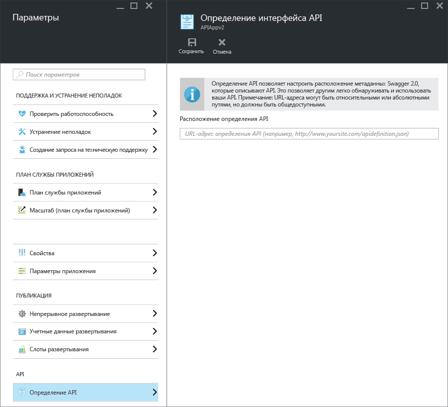

<properties
	pageTitle="Метаданные приложений API службы приложений для обнаружения API и создания кода | Microsoft Azure"
	description="Узнайте, как приложения API в службе приложений Azure используют метаданные Swagger для упрощения обнаружения API и создания кода."
	services="app-service\api"
	documentationCenter=".net"
	authors="tdykstra"
	manager="wpickett"
	editor=""/>

<tags
	ms.service="app-service-api"
	ms.workload="na"
	ms.tgt_pltfrm="na"
	ms.devlang="na"
	ms.topic="get-started-article"
	ms.date="11/25/2015"
	ms.author="tdykstra"/>

# Метаданные приложений API службы приложений для обнаружения API и создания кода 

Поддержка метаданных API [Swagger 2.0](http://swagger.io/) встроена в приложения API службы приложений. Применение платформы Swagger не является обязательным, но оно дает возможность воспользоваться функциями приложений API, облегчающими ознакомление и использование.

## Конечная точка Swagger

Можно указать конечную точку, которая передает метаданные JSON Swagger 2.0 для приложения API в свойствах приложения API. Конечная точка может соотноситься с базовым URL-адресом приложения API или с абсолютным URL-адресом. Абсолютные URL-адреса могут направлять на объекты за пределами приложения API.

У нисходящих клиентов (например, создание кода в Visual Studio и поток «Добавление API» PowerApps) URL-адрес должен быть общедоступным, т. е. не защищен проверкой подлинности пользователя или службы. Это означает, что если вы используете проверку подлинности службы приложений и хотите предоставить определение API из самого приложения, необходимо использовать параметр проверки подлинности, который разрешает анонимный трафик к API. Дополнительные сведения см. в статье [Проверка подлинности и авторизация для приложений API службы приложений](app-service-api-authentication.md).

### Колонка портала

На [портале Azure](https://portal.azure.com/) в колонке **Определение API** можно посмотреть и изменить URL-адрес конечной точки.

### Свойство диспетчера ресурсов Azure

URL-адрес определения интерфейса API для приложения API также можно настроить с помощью инструментария диспетчера ресурсов Azure. Для этого используются Azure PowerShell, интерфейс командной строки или [обозреватель ресурсов](https://resources.azure.com/).

Задайте свойство `apiDefinition` для типа Microsoft.Web/sites/config ресурса <site name>/web. Например, в **обозревателе ресурсов** последовательно выберите пункты **Подписки > {ваша подписка} > Группы ресурсов > {Ваша группа ресурсов} > Поставщики > Microsoft.Web > Сайты > {Ваш сайт} > Конфигурации > Веб**. Отобразится свойство cors:

		"apiDefinition": {
		  "url": "https://contactslistapi.azurewebsites.net/swagger/docs/v1"
		}

### Значение по умолчанию

Если вы используете Visual Studio для создания приложений API, для конечной точки определения API автоматически задается URL-адрес приложения API в сочетании с `/swagger/docs/v1`. Это URL-адрес по умолчанию, используемый в пакете NuGet [Swashbuckle](https://www.nuget.org/packages/Swashbuckle) для передачи динамически создаваемых метаданных Swagger в проект веб-API ASP.NET.

## Создание кода

Одним из преимуществ интеграции платформы Swagger в приложения API Azure является возможность автоматического создания кода. Созданные классы клиента упрощают написание кода, который вызывает приложение API.

Код клиента для приложения API можно создать с помощью Visual Studio или из командной строки. Дополнительные сведения о создании классов клиента для проекта веб-API ASP.NET в Visual Studio см. в статье [Приступая к работе с приложениями API и ASP.NET](app-service-api-dotnet-get-started.md#codegen). Дополнительные сведения о создании классов с помощью командной строки на всех поддерживаемых языках см. в файле сведений репозитория [Azure/autorest](https://github.com/azure/autorest) на сайте GitHub.com.
 
## Дальнейшие действия

Пошаговые инструкции по созданию, развертыванию и использованию приложений API см. в статье [Приступая к работе с приложениями API в службе приложений Azure](app-service-api-dotnet-get-started.md).

<!---HONumber=AcomDC_1210_2015-->