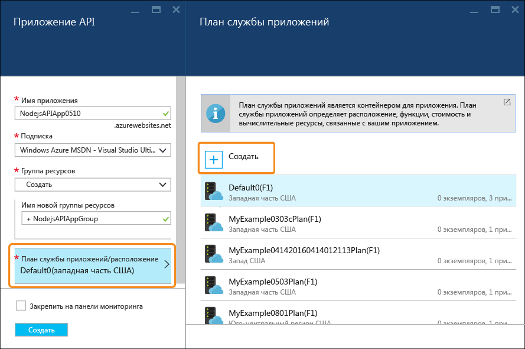
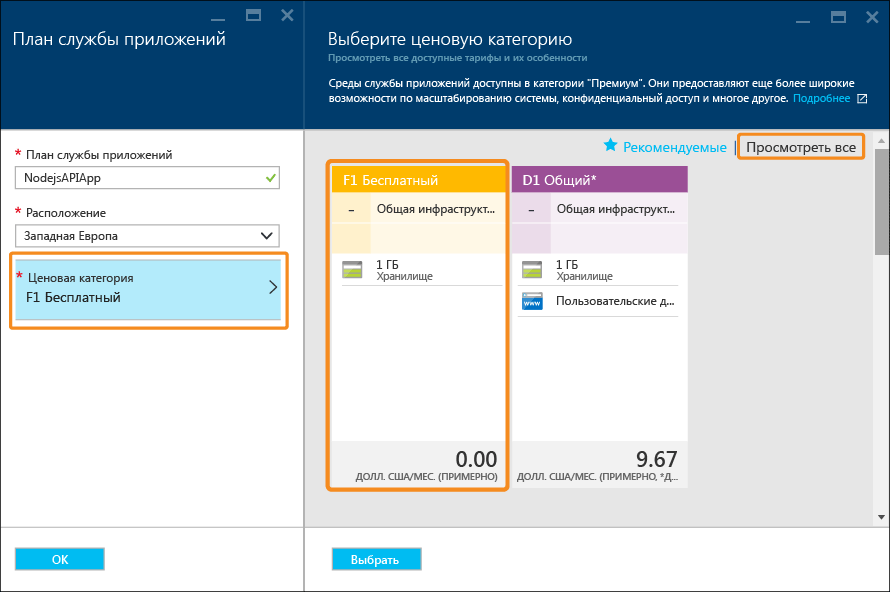

<properties
	pageTitle="Приложение API Node.js в службе приложений Azure | Microsoft Azure"
	description="Узнайте, как создать API RESTful Node.js и развернуть его в приложении API с помощью службы приложений Azure."
	services="app-service\api"
	documentationCenter="node"
	authors="bradygaster"
	manager="wpickett"
	editor=""/>

<tags
	ms.service="app-service-api"
	ms.workload="web"
	ms.tgt_pltfrm="na"
	ms.devlang="node"
	ms.topic="get-started-article"
	ms.date="05/06/2016"
	ms.author="bradygaster"/>

# Создание API RESTful Node.js и его развертывание в приложении API в Azure

[AZURE.INCLUDE [app-service-api-get-started-selector](../../includes/app-service-api-get-started-selector.md)]

В этом руководстве описано, как создать простой API-интерфейс [Node.js](http://nodejs.org) и развернуть его в [приложении API](app-service-api-apps-why-best-platform.md) с помощью [службы приложений Azure](../app-service/app-service-value-prop-what-is.md) и [GIT](http://git-scm.com). Для этой процедуры можно использовать любую операционную систему, поддерживающую Node.js, а также такие программы командной строки, как cmd.exe или Bash.

## Предварительные требования

1. Установленная платформа [Node.js](http://nodejs.org) (в этом примере используется версия Node.js 4.2.2).
2. Установленная система [GIT](https://git-scm.com/).
1. Учетная запись [GitHub](https://github.com/).
1. [Бесплатная пробная учетная запись](https://azure.microsoft.com/pricing/free-trial/) Microsoft Azure.

## Получение кода примера

1. Откройте интерфейс командной строки, где можно выполнять команды Node.js и Git.

1. Перейдите к папке, которую можно использовать в качестве локального репозитория GIT, и клонируйте [репозиторий GitHub, содержащий пример кода](https://github.com/Azure-Samples/app-service-api-node-contact-list).

		git clone https://github.com/Azure-Samples/app-service-api-node-contact-list.git

	Пример API включает две конечные точки: запрос Get к `/contacts` возвращает список имен и адресов электронной почты в формате JSON, а `/contacts/{id}` возвращает только выбранный контакт.

## Формирование шаблона кода Node.js на основе метаданных Swagger

[Swagger](http://swagger.io/) — это формат файла для метаданных, описывающих API RESTful. В службу приложений Azure [встроена поддержка метаданных Swagger](app-service-api-metadata.md). В этом руководстве в рамках процесса разработки API сначала создаются метаданные Swagger, которые затем используются при написании серверного кода для API. Из этой части руководства вы узнаете, как написать серверный код Node.js на основе файла метаданных Swagger.

>[AZURE.NOTE] Если вы не хотите выполнять метапрограммирование, можно просто развернуть код примера в новом приложении API, перейдя сразу к разделу [Создание приложения API на портале Azure](#createapiapp).

1. Выполните следующие команды, чтобы установить модули NPM **yo** и **generator-swaggerize** на глобальном уровне.

		npm install -g yo
		npm install -g generator-swaggerize

	Swaggerize — это средство, которое позволяет создать серверный код для API, описываемого с помощью файла метаданных Swagger. Файл Swagger, который будет использоваться, называется *api.json*. Он расположен в клонированном репозитории в папке *start*.

2. Перейдите к папке *start*, а затем выполните команду `yo swaggerize`. Swaggerize выдаст запрос на ряд параметров. Для параметра **what to call this project** введите contactlist, для **path to swagger document** — api.json, а для **Express, Hapi, or Restify** — express.

		yo swaggerize

	
    
	**Примечание**. На этом шаге у вас может возникнуть ошибка. Способ ее устранения описан на следующем шаге.

	Swaggerize создает папку приложения, обработчики, файлы конфигурации, а также файл **package.json**. Чтобы создать страницу справки по Swagger, необходимо использовать обработчик представлений express.

3. Если выполнение команды `swaggerize` завершится ошибкой "непредвиденный маркер" или "недопустимая escape-последовательность", устранить причину ошибки можно, изменив созданный файл *package.json*. В строке `regenerate` раздела `scripts` замените обратную косую черту перед *api.json* косой чертой, чтобы строка выглядела так:

 		"regenerate": "yo swaggerize --only=handlers,models,tests --framework express --apiPath config/api.json"

1. Перейдите к папке, в которой содержится созданный код (в нашем примере — в подпапку *ContactList*).

1. Запустите `npm install`.
	
		npm install
		
2. Затем установите модуль NPM **jsonpath**.

		npm install --save jsonpath
        
    

1. Установите модуль NPM **swaggerize-ui**.

		npm install --save swaggerize-ui
        
    

## Настройка сформированного шаблона кода

1. Скопируйте папку **lib** из папки **start** в папку **ContactList**, созданную с помощью компонента формирования на основе скаффолдинга. 

1. Замените код в файле **handlers/contacts.js** следующим кодом.

	Этот код использует данные JSON, хранящиеся в файле **lib/contacts.json**, который обрабатывается с помощью **lib/contactRepository.js**. Новый код contacts.js отвечает на HTTP-запросы, чтобы получить все контакты и вернуть их в виде полезных данных JSON.

        'use strict';
        
        var repository = require('../lib/contactRepository');
        
        module.exports = {
            get: function contacts_get(req, res) {
                res.json(repository.all())
            }
        };

1. Замените код в файле **handlers/contacts/{идентификатор}.js** следующим кодом.

        'use strict';

        var repository = require('../../lib/contactRepository');
        
        module.exports = {
            get: function contacts_get(req, res) {
                res.json(repository.get(req.params['id']));
            }    
        };

1. Замените код в файле **server.js** следующим кодом.

	Изменения, внесенные в файл server.js, выделены с помощью комментариев, чтобы их можно было увидеть.

        'use strict';

        var port = process.env.PORT || 8000; // first change

        var http = require('http');
        var express = require('express');
        var bodyParser = require('body-parser');
        var swaggerize = require('swaggerize-express');
        var swaggerUi = require('swaggerize-ui'); // second change
        var path = require('path');

        var app = express();

        var server = http.createServer(app);

        app.use(bodyParser.json());

        app.use(swaggerize({
            api: path.resolve('./config/api.json'), // third change
            handlers: path.resolve('./handlers'),
            docspath: '/swagger' // fourth change
        }));

        // change four
        app.use('/docs', swaggerUi({
          docs: '/swagger'  
        }));

        server.listen(port, function () { // fifth and final change
        });

## Тестирование API в локальном режиме работы

1. Активируйте сервер с помощью исполняемого файла командной строки Node.js. 

        node server.js

1. Если перейти по ссылке **http://localhost:8000/contacts**, можно увидеть выходные данные списка контактов в формате JSON (или появится запрос на скачивание в зависимости от браузера).

    

1. Если перейти по ссылке **http://localhost:8000/contacts/2**, можно увидеть контакт, представленный значением идентификатора.

    

1. Данные JSON Swagger обрабатываются с помощью конечной точки **/swagger**:

    

1. Пользовательский интерфейс Swagger обрабатывается с помощью конечной точки **/docs**. Для тестирования интерфейса API в пользовательском интерфейсе Swagger можно использовать расширенные возможности клиента HTML.

    

## Создание приложения API на портале Azure

В этом разделе рассматривается создание пустого приложения API в Azure. Затем здесь описывается подключение приложения к репозиторию Git. Таким образом можно обеспечить непрерывную доставку изменений кода.

1. Перейти на [портал Azure](https://portal.azure.com/). 

1. Щелкните **Создать > Интернет + мобильные устройства > Приложение API**.

    

4. В поле **Имя приложения** введите имя, которое будет уникальным в домене *azurewebsites.net*. Например, можно ввести имя NodejsAPIApp и номер, который сделает имя уникальным.

	Если ввести имя, которое уже используется, вместо зеленой галочки справа появится красный восклицательный знак. Это значит, что нужно ввести другое имя.

	Azure использует это имя в качестве префикса для URL-адреса API. Полный URL-адрес состоит из этого имени и домена *.azurewebsites.net*. Например, если имя — `NodejsAPIApp`, URL-адрес будет таким: `nodejsapiapp.azurewebsites.net`.

6. В раскрывающемся меню **Группа ресурсов** щелкните **Создать**, а затем в поле **Новое имя группы ресурсов** введите имя NodejsAPIAppGroup или любое другое.

	[Группа ресурсов](../azure-portal/resource-group-portal.md) — это совокупность ресурсов Azure, включая приложения API, базы данных и виртуальные машины. Мы рекомендуем создать новую группу ресурсов, так как это позволит быстро удалить все ресурсы Azure, созданные для работы с этим руководством.

4. Щелкните вкладку **Расположение или план службы приложений**, а затем нажмите кнопку **Создать**.

	

	Далее мы создадим план службы приложений для новой группы ресурсов. План службы приложений определяет вычислительные ресурсы, на которых будет работать ваше приложение API. Например, если выбрать уровень "Бесплатный", ваше приложение будет работает на общих виртуальных машинах, тогда как при выборе некоторых платных уровней приложение будет работать на выделенных виртуальных машинах. Дополнительные сведения о планах службы приложений см. в статье [Обзор планов службы приложений Azure](../app-service/azure-web-sites-web-hosting-plans-in-depth-overview.md).

5. В колонке **План службы приложений** введите NodejsAPIAppPlan или другое имя.

5. В раскрывающемся списке **Расположение** выберите ближайшее расположение.

	Этот параметр определяет, в каком центре обработки данных Azure будет выполняться приложение. При работе с учебником вы можете выбрать любой регион, и это не будет оказывать существенного влияния. Но для рабочего приложения необходимо, чтобы сервер располагался как можно ближе к клиентам, которые осуществляют к нему доступ. Это позволит минимизировать [задержки](http://www.bing.com/search?q=web%20latency%20introduction&qs=n&form=QBRE&pq=web%20latency%20introduction&sc=1-24&sp=-1&sk=&cvid=eefff99dfc864d25a75a83740f1e0090).

5. Последовательно выберите **Ценовая категория > Просмотреть все > F1 Free** (Бесплатный F1).

	Эта ценовая категория обеспечит достаточную производительность в рамках заданий этого руководства.

	

6. В колонке **План службы приложений** нажмите кнопку **ОК**.

7. В колонке **Приложение API** щелкните **Создать**.

## Настройка нового приложения API для развертывания Git

В этом разделе вы создадите учетные данные для развертывания, а также репозиторий GIT для приложения API в службе приложений Azure. Вы развернете код в приложении API, отправив фиксации в этот репозиторий в службе приложений Azure.

1. Создав приложение API, на домашней странице портала последовательно выберите **Службы приложений > {ваше приложение API}**. 

	На портале отобразятся колонки **Приложение API** и **Параметры**.

    

    

1. В колонке **Параметры** прокрутите список вниз до раздела **Публикация**, а затем щелкните **Учетные данные развертывания**.
 
3. В колонке **Установка учетных данных развертывания** введите имя пользователя и пароль, а затем нажмите кнопку **Сохранить**.

	Эти учетные данные будут использоваться для публикации кода Node.js в приложении API. На следующем шаге вы создадите репозиторий Azure GIT, связанный с приложением API.

    

1. В колонке **Параметры** последовательно выберите **Источник развертывания > Выбор источника > Локальный репозиторий GIT**, а затем нажмите кнопку **ОК**.

    

1. Когда вы создадите репозиторий GIT, вид колонки изменится для отображения активных развертываний. Так как репозиторий новый, в списке не будет активных развертываний.

    

1. Скопируйте URL-адрес репозитория Git. Чтобы сделать это, перейдите к колонке нового приложения API и просмотрите раздел **Основные компоненты**. В разделе **Основное** вы увидите **URL-адрес клона GIT**. Если навести указатель мыши на этот URL-адрес, справа отобразится значок, который позволяет скопировать URL-адрес в буфер обмена. Щелкните этот значок, чтобы скопировать URL-адрес.

    

    **Примечание**. Для выполнения следующего шага необходим URL-адрес клона Git, поэтому его нужно обязательно сохранить.

Теперь, когда у вас есть приложение API с репозиторием GIT для резервного копирования, вы можете передать код в репозиторий, чтобы развернуть код в приложении API.

## Развертывание кода API в Azure

В этом разделе вам нужно выполнить следующие шаги:

* создать локальный репозиторий Git, в котором будет содержаться код сервера для API;
* в этом репозитории нужно создать удаленный репозиторий, который будет указывать на репозиторий, созданный для приложения API в Azure;
* передать код из локального репозитория в удаленный. 

Встроенные возможности непрерывной доставки в службе приложений Azure упрощают развертывание кода. Для этого нужно всего лишь передать фиксации в репозиторий Git, связанный с приложением API.

1. Если вы выполнили первую часть руководства, скопируйте папку `start\ContactList`, созданную с помощью средства метапрограммирования swaggerize, в другую папку. Или же можно скопировать папку `end\ContactList` в другую папку.

1. В программе командной строки перейдите в новую папку, а затем выполните следующую команду, чтобы создать локальный репозиторий.

        git init

     

1. Выполните следующую команду, чтобы добавить удаленный репозиторий Git для своего репозитория приложения API.

        git remote add azure YOUR_GIT_CLONE_URL_HERE

    **Примечание**. Замените строку "YOUR\_GIT\_CLONE\_URL\_HERE" URL-адресом клона GIT, скопированным ранее.

1. Выполните следующие команды, чтобы создать фиксацию, которая будет содержать весь код.

        git add .
        git commit -m "initial revision"

    

1. Выполните команду для передачи кода в Azure. При появлении соответствующего запроса введите пароль, созданный ранее на портале Azure.

        git push azure master

	Это активирует развертывание в приложение API.

1. В браузере вернитесь к колонке **Развертывания** своего приложения API, и вы увидите, что выполняется развертывание.

    

    В это же время в интерфейсе командной строки будет отображаться состояние этого процесса.

    

	Когда развертывание будет завершено, в колонке **Развертывания** отобразится сообщение об успешном развертывании изменений кода в приложении API.

## Тестирование API, работающего в Azure
 
3. Скопируйте **URL-адрес** в раздел **Основные компоненты** колонки вашего приложения API. 

    

1. С помощью клиента REST API, например Postman или Fiddler (или веб-браузера), укажите URL-адрес вызова API контактов, который должен быть конечной точкой `/contacts` приложения API.

    **Примечание**. У URL-адреса будет такой формат: `https://{your API app name}.azurewebsites.net/contacts`.

    При отправке запроса GET в эту конечную точку вы получите выходные данные JSON приложения API.

    

2. В браузере перейдите к конечной точке `/docs`, чтобы протестировать, как пользовательский интерфейс Swagger работает в Azure.

Теперь, когда обеспечена непрерывная доставка, в код можно внести изменения и развернуть его в Azure, отправив фиксации в репозиторий Azure Git.

## Дальнейшие действия

Вы успешно создали и развернули свое первое приложение API с помощью Node.js. Из следующего руководства вы узнаете, как [использовать приложения API в клиентах JavaScript с помощью CORS](app-service-api-cors-consume-javascript.md). В последующих учебниках серии демонстрируется, как реализовать проверку подлинности и авторизацию.

<!---HONumber=AcomDC_0518_2016--->