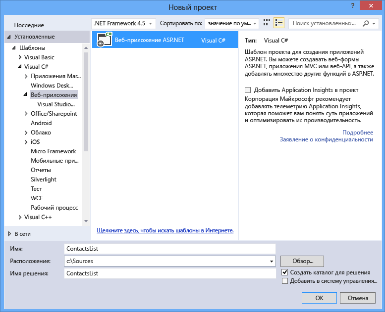
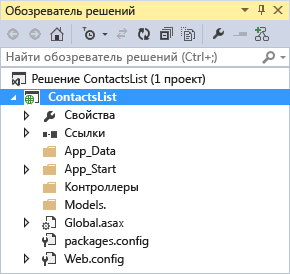
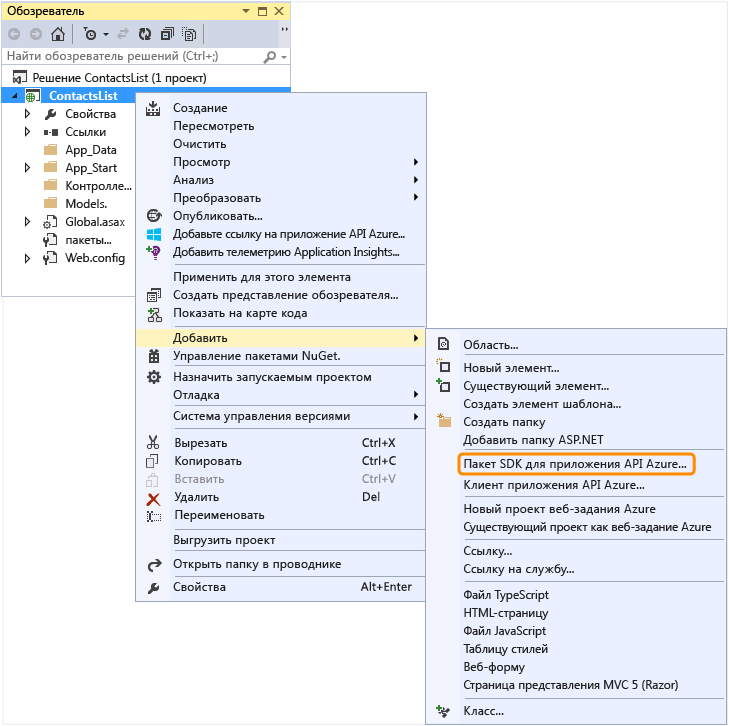
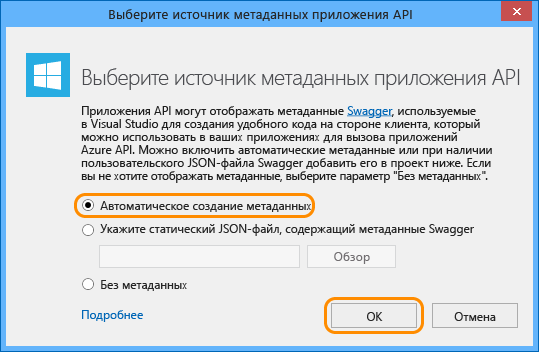

<properties 
	pageTitle="Настройка проекта веб-API как приложения API" 
	description="Узнайте, как настроить проект веб-API как приложение API с помощью Visual Studio 2013." 
	services="app-service\api" 
	documentationCenter=".net" 
	authors="bradygaster" 
	manager="wpickett" 
	editor="jimbe"/>

<tags 
	ms.service="app-service-api" 
	ms.workload="web" 
	ms.tgt_pltfrm="dotnet" 
	ms.devlang="na" 
	ms.topic="article" 
	ms.date="11/10/2015" 
	ms.author="tdykstra"/>

# Настройка проекта веб-API как приложения API

[AZURE.INCLUDE [app-service-api-v2-note](../../includes/app-service-api-v2-note.md)]

## Обзор

В этом учебнике показывается, как настроить существующий проект веб-API для развертывания в виде [приложения API](app-service-api-apps-why-best-platform.md) в [службе приложений Azure](../app-service/app-service-value-prop-what-is.md). В последующих учебниках из этой серии показывается, как [развертывать](app-service-dotnet-deploy-api-app.md) и [отлаживать](../app-service-dotnet-remotely-debug-api-app.md) проект приложения API, который будет создаваться в этом учебнике.

Сведения о приложениях API см. в разделе [Что такое приложения API?](app-service-api-apps-why-best-platform.md).

[AZURE.INCLUDE [install-sdk-2015-2013](../../includes/install-sdk-2015-2013.md)]

Для этого учебника требуется пакет SDK Azure для .NET версии 2.6 или более поздней.

## Настройка проекта веб-API 

В этом разделе показано, как настроить существующий проект веб-API как приложение API. Мы начнем с создания проекта веб-API с помощью шаблона проекта веб-API, а будем настраивать его как приложение API.

1. Откройте Visual Studio 2015 или Visual Studio 2013.

2. Щелкните **Файл > Создать проект**.

3. Выберите шаблон **Веб-приложение ASP.NET**.

4. Убедитесь, что флажок **Добавить Application Insights в проект** снят.

4. Дайте проекту имя *ContactsList*.

	

5. Нажмите кнопку **ОК**.

6. В диалоговом окне **Новый проект ASP.NET** выберите шаблон **MVC**.

7. Установите флажок **Веб-API**.

8. Снимите флажок **Разместить в облаке**.

	

9. Нажмите кнопку **ОК**, чтобы создать проект.

	

10. В **обозревателе решений** щелкните правой кнопкой мыши проект (не решение) и последовательно выберите пункты **Добавить > Пакет SDK для приложения API Azure**.

	

11. В диалоговом окне **Выбор источника метаданных приложения API** выберите **Автоматическое создание метаданных**.

	

	Этот параметр включает динамический пользовательский интерфейс Swagger, который будет представлен в учебнике позже. Если вы решили отправить файл метаданных Swagger, он будет сохранен с именем *apiDefinition.swagger.json*, как объясняется в следующем разделе.

12. Нажмите кнопку **ОК**.
 
	На этом этапе Visual Studio устанавливает пакеты NuGet приложения API и добавляет в проект веб-API метаданные приложения API.

[AZURE.INCLUDE [app-service-api-review-metadata](../../includes/app-service-api-review-metadata.md)]

[AZURE.INCLUDE [app-service-api-define-api-app](../../includes/app-service-api-define-api-app.md)]

[AZURE.INCLUDE [app-service-api-direct-deploy-metadata](../../includes/app-service-api-direct-deploy-metadata.md)]

## Дальнейшие действия

Теперь ваше приложение API готово к развертыванию, и вы можете перейти к учебнику [Развертывание приложения API](app-service-dotnet-deploy-api-app.md).
 

<!---HONumber=AcomDC_1203_2015-->