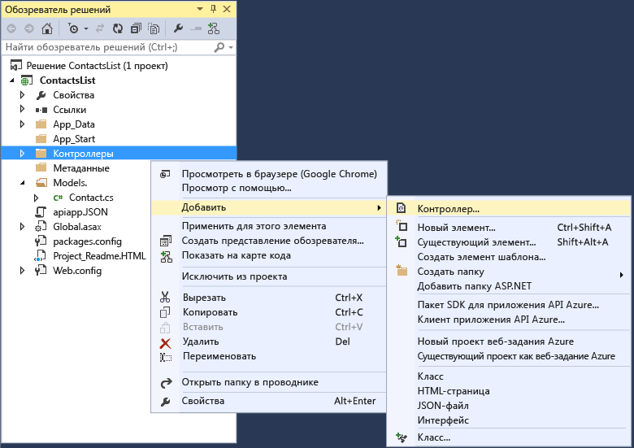
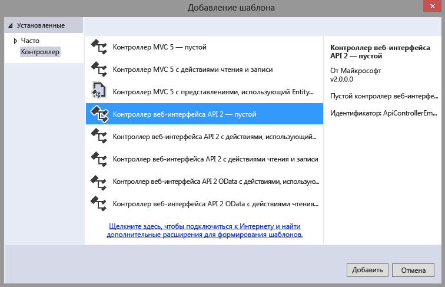
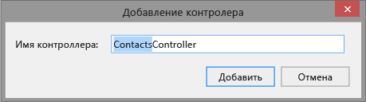
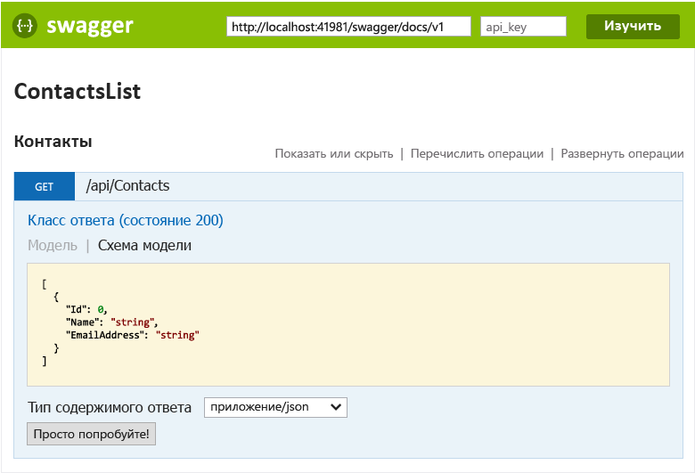
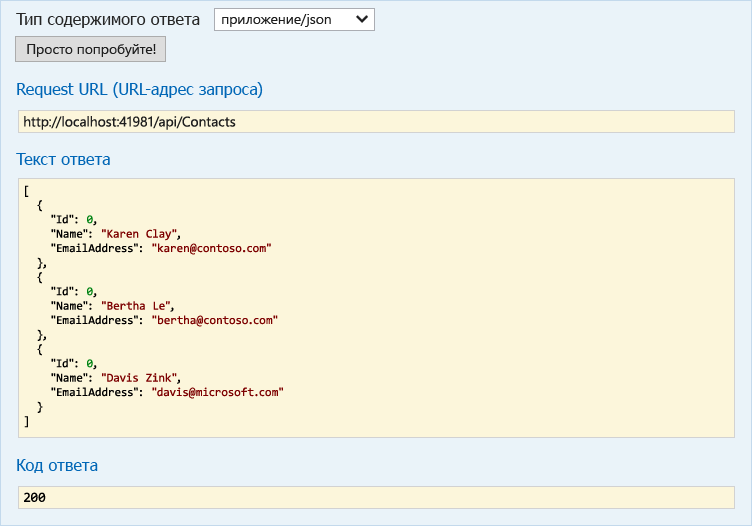

<properties 
	pageTitle="Создание приложения API ASP.NET в службе приложений Azure с помощью Visual Studio 2015" 
	description="Узнайте, как создать приложение API ASP.NET в службе приложений Azure с помощью Visual Studio 2015" 
	services="app-service\api" 
	documentationCenter=".net" 
	authors="tdykstra" 
	manager="wpickett" 
	editor="jimbe"/>

<tags 
	ms.service="app-service-api" 
	ms.workload="web" 
	ms.tgt_pltfrm="dotnet" 
	ms.devlang="na" 
	ms.topic="article" 
	ms.date="11/10/2015" 
	ms.author="tdykstra"/>

# Создание приложения API ASP.NET в службе приложений Azure с помощью Visual Studio 2015

> [AZURE.SELECTOR]
- [Visual Studio 2013](app-service-dotnet-create-api-app.md)
- [Visual Studio 2015 RC](app-service-dotnet-create-api-app-vs2015.md)
- [Visual Studio Code](app-service-create-aspnet-api-app-using-vscode.md)

## Обзор

Следуя инструкциям этого учебника, вы создадите проект ASP.NET Web API 2 с использованием [Visual Studio 2015 RC](https://www.visualstudio.com/ru-RU/downloads/visual-studio-2015-downloads-vs.aspx) и настроите его для развертывания в облачной среде в качестве [приложения API](app-service-api-apps-why-best-platform.md) в [службе приложений Azure](../app-service/app-service-value-prop-what-is.md). Вы также выполните развертывание этого проекта в Azure. В результате прохождения этого учебника у вас будет готовое приложение API, запущенное в облаке Azure.

В данном учебнике предполагается, что у вас есть опыт работы с файлами и папками в **обозревателе решений** Visual Studio.

В этом учебнике используется последняя версия приложения веб-API ASP.NET. Дополнительную информацию о создании приложения API ASP.NET MVC 6 см. в записи блога: [https://alexanderzeitler.com/articles/Deploying-a-ASP-NET-MVC-6-API-as-Azure-API-App-in-Azure-App-Services/](https://alexanderzeitler.com/articles/Deploying-a-ASP-NET-MVC-6-API-as-Azure-API-App-in-Azure-App-Services/ "Развертывание API ASP.NET MVC 6 в виде приложения API Azure в службах приложений Azure").

[AZURE.INCLUDE [install-sdk-2015-only](../../includes/install-sdk-2015-only.md)]

Для этого учебника требуется пакет SDK Azure для .NET версии 2.6 или более поздней.

## Создание проекта приложения API 

В версии-кандидате Visual Studio 2015 еще нет шаблона проекта приложения API, поэтому для создания проекта приложения API необходимо использовать шаблон проекта веб-API.

1. Откройте версию-кандидат Visual Studio 2015.

2. Щелкните **Файл > Создать проект**.

3. В разделе **Шаблоны** щелкните **Веб**, а затем выберите шаблон **Веб-приложение ASP.NET**.

4. Дайте проекту имя *ContactsList*.

5. Убедитесь, что флажок **Добавить Application Insights в проект** снят.

5. Нажмите кнопку **ОК**.

	

6. В диалогом окне **Новый проект ASP.NET** в разделе **Шаблоны ASP.NET 4.6** выберите шаблон проекта **Пустой**.

7. Установите флажок **Веб-API**.

8. Снимите флажок **Разместить в облаке**.

7. Нажмите кнопку **ОК**.

	

## Добавление пакетов NuGet

Среда выполнения службы приложений для приложений API предоставляется пакетом NuGet [Microsoft.Azure.AppService.ApiApps.Service](http://www.nuget.org/packages/Microsoft.Azure.AppService.ApiApps.Service/), а динамическое создание метаданных API [Swagger](http://swagger.io/ "Официальные сведения о Swagger") — пакетом NuGet [Swashbuckle](http://www.nuget.org/packages/Swashbuckle/).

> **Примечание.** При установке пакета Swashbuckle тестовая страница API по умолчанию включена. Если опубликовать приложение API и задать для него уровень доступа **Общедоступный (анонимный)**, то любой нашедший URL-адрес тестовой страницы сможет воспользоваться им для вызова вашего API. Тестовая страница будет использоваться далее в этом учебнике.

1. Щелкните **Сервис > Диспетчер пакетов NuGet > Консоль диспетчера пакетов**.

2. В окне **Консоль диспетчера пакетов** введите следующие команды.

		install-package Microsoft.Azure.AppService.ApiApps.Service
		install-package Swashbuckle

	Возможно, придется подождать несколько минут после того, как в консоли диспетчера пакетов отобразится сообщение о проверке зависимостей.

## Добавление файлов метаданных приложения API

Метаданные, которые позволяют развернуть проект веб-API в виде приложения API, содержатся в файле *apiapp.json* папки *Metadata* с вложенными папками и файлами. На следующих шагах вы добавите эти файлы со значениями по умолчанию.

В разделе [Метаданные приложения API](#api-app-metadata) ниже объясняется, как настроить эти метаданные.

1. В папке проекта создайте *JSON*-файл с именем apiapp.json и замените его содержимое следующим текстом JSON.

		{
		    "$schema": "http://json-schema.org/schemas/2014-11-01/apiapp.json#",
		    "id": "ContactsList",
		    "namespace": "microsoft.com",
		    "gateway": "2015-01-14",
		    "version": "1.0.0",
		    "title": "ContactsListTitle",
		    "summary": "Summary",
		    "author": "Author",
		    "endpoints": {
		        "apiDefinition": "/swagger/docs/v1",
		        "status": null
		    }
		}

3. В папке проекта создайте папку *Metadata* и в *этой* папке создайте папку *deploymentTemplates*.

5. В папке *deploymentTemplates* создайте *JSON*-файл с именем *apiappconfig.azureresource.json* и замените его содержимое следующим текстом JSON.

		{
		  "$schema": "http://schemas.management.azure.com/schemas/2014-04-01-preview/deploymentTemplate.json#",
		  "contentVersion": "1.0.0.0",
		  "parameters": {
		    "$system": {
		      "type": "Object"
		    }
		  },
		  "resources": []
		}

## Добавление кода веб-API

В следующих действиях вы будете добавлять код для простого метода HTTP Get, который возвращает жестко закодированный список контактов.

1. Создайте папку *Models* в папке проекта, если она еще не существует.

2. В папке *Models* добавьте файл класса с именем *Contact.cs* и замените содержимое файла следующим кодом: namespace ContactsList.Models { public class Contact { public int Id { get; set; } public string Name { get; set; } public string EmailAddress { get; set; } } }

5. Щелкните правой кнопкой мыши папку **Контроллеры**, а затем последовательно выберите пункты **Добавить > Контроллер.**

	

6. В диалоговом окне **Добавление Scaffold** выберите параметр **Контроллер веб-API 2 — пустой** и нажмите кнопку **Добавить**.

	

7. Назовите контроллер **ContactsController** и нажмите кнопку **Добавить**.

	

8. После создания файла *ContactsController.cs* замените его содержимое следующим кодом.

		using ContactsList.Models;
		using System;
		using System.Collections.Generic;
		using System.Linq;
		using System.Net;
		using System.Net.Http;
		using System.Threading.Tasks;
		using System.Web.Http;
		
		namespace ContactsList.Controllers
		{
		    public class ContactsController : ApiController
		    {
		        [HttpGet]
		        public IEnumerable<Contact> Get()
		        {
		            return new Contact[]{
						new Contact { Id = 1, EmailAddress = "barney@contoso.com", Name = "Barney Poland"},
						new Contact { Id = 2, EmailAddress = "lacy@contoso.com", Name = "Lacy Barrera"},
	                	new Contact { Id = 3, EmailAddress = "lora@microsoft.com", Name = "Lora Riggs"}
		            };
		        }
		    }
		}

## Тестирование веб-API

Для просмотра тестовой страницы API выполните следующие действия.

1. Запустите приложение локально (CTRL + F5) и добавьте `/swagger` в конец URL-адреса в адресной строке браузера. 

	

2. Щелкните **Контакты > Получить > Испытать**, и вы увидите, что API работает и возвращает ожидаемый результат.

	

## Создание приложения API в Azure

1. Создайте приложение API на [портале предварительной версии Azure](https://portal.azure.com). 

	* Щелкните **Создать > Интернет + мобильные устройства > Приложение API**.

		

	* В поле **Имя** введите ContactsList.

	* В поле **План обслуживания приложения** щелкните **Создать** и введите имя, например **ContactsList**.

		Дополнительные сведения о планах службы приложений см. в разделе [Подробный обзор планов службы приложений Azure](azure-web-sites-web-hosting-plans-in-depth-overview.md).

	* Щелкните **Ценовая категория > Просмотреть все > Бесплатные > Выбрать** для выбора бесплатной ценовой категории.

		Вы можете использовать платную ценовую категорию, но для данного учебника это не требуется.

	* В поле **Группа ресурсов** щелкните **Создать** и введите имя, например ContactsList.

		Дополнительные сведения о группах ресурсов см. в разделе [Использование групп ресурсов для управления ресурсами Azure](resource-group-overview.md).

	* При наличии нескольких подписок выберите подписку, которую вы хотите использовать.

	* Выберите расположение рядом с вами.

	* Щелкните **Создать**.

		

2. Когда Azure завершит создание приложения API, установите для этого приложения API уровень доступа **Общедоступный (анонимный)**.

	* Щелкните **Обзор > Группы ресурсов > [созданная вами группа ресурсов] > [созданное вами приложение API]**.

	* Щелкните элементы **Параметры > Параметры приложения**.

	* Установите для параметра **Уровень доступа** значение **Общедоступный (анонимный)**.
	 
	* Щелкните **Сохранить**.

		
	
2. Запишите имя базового веб-приложения, в котором размещено приложение API. Вам понадобится это имя при развертывании проекта Visual Studio.

	* В поле **Узел приложения API** щелкните **ContactsList**.

		

	* Имя указано в заголовке колонки **Узел приложения API**.

		

## Развертывание проекта веб-API в новое приложение API в Azure
 
Приложения API по сути являются веб-приложениями, для которых Azure предоставляет дополнительные функциональные возможности веб-службы. В версии-кандидате Visual Studio 2015 необходимо выполнять публикацию в базовом веб-приложении приложения API, так как в мастере веб-публикации нет варианта выбора специально для приложений API.

2. В **обозревателе решений** Visual Studio щелкните правой кнопкой мыши проект и выберите **Опубликовать** в контекстном меню.

3. На шаге **Профиль** мастера **веб-публикации** щелкните **Веб-приложения Microsoft Azure**.

	

4. В раскрывающемся списке **Существующие веб-приложения** выберите запись с именем приложения API, которое вы записали ранее.

	

5. Щелкните **Опубликовать**.

	В браузере откроется URL-адрес веб-приложения и отобразится страница «Приложение API создано».

6. В адресной строке браузера добавьте swagger/ в конец URL-адреса, например:

		https://microsoft-apiappb001b62a9033493a33748332233fca2.azurewebsites.net/swagger/

	Отобразится тот же пользовательский интерфейс Swagger, который ранее выполнялся локально, а теперь выполняется в облаке.

2. Щелкните **Контакты > Получить > Испытать**, и вы увидите, что API работает и возвращает ожидаемый результат.

	

## Просмотр определения API на портале предварительной версии Azure

В этом разделе перейдите на портал для просмотра определения API для только что созданного вами приложения API.

1. На [портале предварительной версии Azure](https://portal.azure.com) перейдите к колонке **Приложение API** для вашего приложения API: щелкните **Обзор > Группы ресурсов > [созданная вами группа ресурсов] > [созданное вами приложение API]**.

4. Щелкните **Определение API**.

	В колонке **Определение API** приложения отобразится список операций API, определенных при создании приложения. (Если вы выполнили инструкции этого учебника, будет отображена только операция Get.)

	

## Добавление операции в код веб-API

5. Вернитесь к проекту в Visual Studio и добавьте следующий код в файл **ContactsController.cs**. Этот код добавляет метод **Post**, который можно использовать для отправки новых экземпляров `Contact` в API.  

		[HttpPost]
		public HttpResponseMessage Post([FromBody] Contact contact)
		{
			// todo: save the contact somewhere
			return Request.CreateResponse(HttpStatusCode.Created);
		}

	

6. Опубликуйте проект, как и раньше. (В **обозревателе решений** щелкните правой кнопкой мыши проект и выберите **Опубликовать**, после чего нажмите **Опубликовать** в мастере **публикации веб-сайта**.)

12. После завершения процесса публикации вернитесь на портал и перезапустите шлюз, как и раньше.

14. На портале вернитесь к колонке **Определение API**.

	Вы увидите новую конечную точку API, которую только что создали и развернули в подписке Azure.

	

[AZURE.INCLUDE [app-service-api-direct-deploy-metadata](../../includes/app-service-api-direct-deploy-metadata.md)]

## Дальнейшие действия

Вы создали и развернули приложение API с помощью версии-кандидата Visual Studio 2015. Дополнительную документацию о приложениях API см. в записях в области навигации в левой части страницы (в браузере с широкими окнами) или в верхней части страницы (в браузере с узкими окнами). Большая часть документации по приложению API в настоящий момент предполагает использование Visual Studio 2013, но эту документацию по большей части можно использовать и для Visual Studio 2015, так как пользовательский интерфейс, код создаваемого приложения и пользовательский интерфейс портала аналогичны.
 

<!---HONumber=Nov15_HO3-->