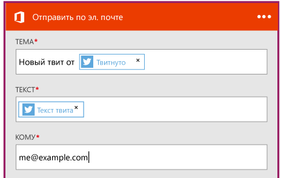

<properties
	pageTitle="Создание приложения логики | Microsoft Azure"
	description="Узнайте, как создать приложение логики, подключающее службы SaaS"
	authors="stepsic-microsoft-com"
	manager="dwrede"
	editor=""
	services="app-service\logic"
	documentationCenter=""/>

<tags
	ms.service="app-service-logic"
	ms.workload="na"
	ms.tgt_pltfrm="na"
	ms.devlang="na"
	ms.topic="get-started-article"
	ms.date="03/16/2016"
	ms.author="stepsic"/>

# Создание нового приложения логики, подключающего службы SaaS

| Краткий справочник |
| --------------- |
| [Язык описания приложений логики](https://msdn.microsoft.com/library/azure/mt643789.aspx) |
| [Документация по соединителям приложений логики](../connectors/apis-list.md) |
| [Форум о приложениях логики](https://social.msdn.microsoft.com/Forums/ru-RU/home?forum=azurelogicapps) |

В этом разделе будет показано, как всего за несколько минут создать [приложение логики службы приложений](app-service-logic-what-are-logic-apps.md). Мы рассмотрим рабочий процесс, который позволяет получать интересующие вас твиты в почтовый ящик.

Для использования этого сценария вам понадобится:

- Подписка Azure
- учетная запись Twitter;
- учетная запись Office 365.

## Создание приложения логики для отправки твитов по электронной почте

1. На портале Azure на панели мониторинга выберите **Marketplace**. 
2. В разделе "Все" выполните поиск по запросу "приложения логики", а затем выберите **Приложение логики (предварительная версия)**. Вы можете щелкнуть также **Создать**, **Интернет + мобильные устройства**, а затем выбрать **Приложение логики (предварительная версия)**. 
3. Введите имя приложения логики, выберите план службы приложений и щелкните **Создать**. На этом этапе предполагается, что у вас есть план службы приложений и что вы знакомы с требуемыми свойствами. Если нет, не волнуйтесь, все это описывается в статье [Подробный обзор планов службы приложений Azure](azure-web-sites-web-hosting-plans-in-depth-overview.md). 

4. При первом открытии приложения логики необходим триггер. В окне поиска триггера найдите и выберите **twitter**.

7. Сейчас вам нужно ввести ключевое слово, по которому будет осуществляться поиск в Тwitter. 

5. Щелкните знак "плюс" (+), а затем выберите **Добавить действие** или **Добавить условие**. 
6. Выбрав вариант **Добавить действие**, вы увидите все соединители с доступными действиями. Теперь вы можете выбрать соединитель и действие для добавления в приложение логики. Например, можно выбрать **Office 365 — отправить электронное письмо** и другие дополнительные действия для Office 365. 

7. Теперь нужно заполнить требуемые параметры электронной почты. .

8. Наконец, нажмите кнопку **Сохранить**, чтобы запустить свое приложение логики.

## Управление приложением логики после его создания

Теперь ваше приложение логики запущено и работает. Каждый раз, когда запускается запланированный рабочий процесс, он ищет твиты с конкретным хэш-тегом. Когда соответствующий твит обнаруживается, он отправляет его в вашу папку Dropbox. Теперь мы покажем, как отключать приложение, и вы увидите, как это работает.

1. Нажмите кнопку **Обзор** на левой стороне экрана и выберите пункт **Приложения логики**.

2. Щелкните новое приложение логики, которое вы только что создали, чтобы просмотреть его текущее состояние и общие сведения.

3. Чтобы изменить это новое приложение логики, нажмите **Триггеры и действия**.

5. Чтобы отключить приложение, нажмите кнопку **Отключить** в командной строке.

Менее чем за 5 минут вы смогли создать простое приложение логики, работающее в облаке. Дополнительные сведения об использовании функций приложений логики см. в статье [Использование функций приложения логики]. Дополнительные сведения об определениях логических приложений см. в статье [Создание определений приложений логики](app-service-logic-author-definitions.md).

<!-- Shared links -->
[Azure portal]: https://portal.azure.com
[Использование функций приложения логики]: app-service-logic-create-a-logic-app.md

<!---HONumber=AcomDC_0601_2016-->