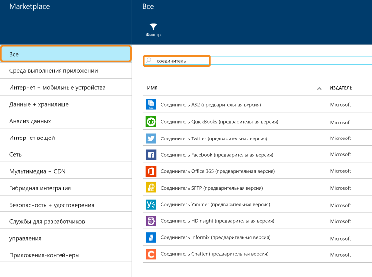

# Что такое соединители и приложения API BizTalk
[!INCLUDE [app-service-logic-version-message](../../includes/app-service-logic-version-message.md)]

*Соединитель* — это тип приложения API, предназначенного для подключения. Соединители, как и любые другие приложения API, используются из веб-приложений, мобильных приложений и приложений логики. Соединители облегчают подключение к существующим службам и помогают управлять проверкой подлинности, предоставляя мониторинг, аналитику и многое другое.

Любой разработчик может создавать свои собственные приложения API и разворачивать их в частном порядке. В будущем разработчики могут совместно использовать свои приложения API и получать от них прибыль в Marketplace. 

Чтобы ускорить построение разработчиками решений, команда Azure добавила в Marketplace ряд соединителей для реализации многих распространенных сценариев. Кроме того, для охвата сложных и расширенных сценариев также доступен ряд возможностей уровня "Премиум" и BizTalk.

Доступны различные "уровни" использования службы. Все уровни содержат все соединители и приложения API, включая их полную функциональность.  

[цен на службу приложений](https://azure.microsoft.com/pricing/details/app-service/) описываются эти уровни служб, а также перечисляется, что в них включено. В следующих разделах рассматриваются различные категории приложений API BizTalk и соединителей.

## Гибридные соединители
Гибридные соединители позволяют выйти на корпоративный уровень благодаря возможности подключения к системам [DB2](app-service-logic-connector-db2.md), [Informix](app-service-logic-connector-informix.md) и WebSphere MQ. 

Дополнительные ресурсы: [соединители "бизнес — бизнес" и приложения API](app-service-logic-b2b-connectors.md)  
[Создание процесса B2B](app-service-logic-create-a-b2b-process.md)  
[Создание соглашения с торговыми партнерами](app-service-logic-create-a-trading-partner-agreement.md)  
[отслеживание сообщений B2B](app-service-logic-track-b2b-messages.md)  

## Правила
Бизнес-правила инкапсулируют политики и решения, которые управляют бизнес-процессами. Как правило, правила являются динамическими и изменяются со временем по разным причинам, например в результате изменения бизнес-планов, нормативов, и по многим другим причинам. [Правила BizTalk](app-service-logic-use-biztalk-rules.md) позволяют выделить эти политики из кода приложения, а также упростить и ускорить процесс изменения.

## Список соединителей и приложений API
В разделе [Список соединителей и приложений API](app-service-logic-connectors-list.md) можно найти полный список соединителей и приложений API, содержащихся в каждой категории, включая стандартные соединители, BizTalk EAI, соединители Premium и так далее.

<!--HONumber=Nov16_HO2-->

